# GLMM's in R {#GLMMsR}

When completing an analysis, I may skip around in my script quite a bit. Therefore, I like all packages loaded, and all data uploaded and manipulated at the start of my script.


## Data Exploration

### Moth counts

Here is what the data look like. Columns: Location, Treatment, TrapID, Longitude, Latitude, AssessmentNumber, and SamplingDate should be self-explanatory... TransplantDate is the date that the rice seedlings were transplanted into the field; DispInstallDate is the treatment installation date; TrapInstallDate is the trap installation date; "nYSB" are the moth counts (number of YSB moths); DaysOfCatch is the number of days since the trap was previously sampled  or the number of days since trap installation if it is assessment number 1; DATI is days after trap installation; DADI is days after dispenser installation; and DAT is days after transplant. Some of these columns will be discussed more later.


```
##    Location          Treatment             TrapID        Longitude    
##  Length:672         Length:672         Min.   :101.0   Min.   :106.5  
##  Class :character   Class :character   1st Qu.:102.8   1st Qu.:106.7  
##  Mode  :character   Mode  :character   Median :152.5   Median :107.8  
##                                        Mean   :152.5   Mean   :108.7  
##                                        3rd Qu.:202.2   3rd Qu.:111.0  
##                                        Max.   :204.0   Max.   :111.6  
##                                                                       
##     Latitude      TransplantDate     TrapInstallDate    DispInstallDate   
##  Min.   :-7.422   Length:672         Length:672         Length:672        
##  1st Qu.:-7.242   Class :character   Class :character   Class :character  
##  Median :-6.876   Mode  :character   Mode  :character   Mode  :character  
##  Mean   :-6.896                                                           
##  3rd Qu.:-6.740                                                           
##  Max.   :-6.179                                                           
##                                                                           
##  AssessmentNumber SamplingDate            nYSB         DaysOfCatch   
##  Min.   : 1.00    Length:672         Min.   :  0.00   Min.   : 7.00  
##  1st Qu.: 3.00    Class :character   1st Qu.:  2.00   1st Qu.:10.00  
##  Median : 5.00    Mode  :character   Median :  5.00   Median :10.00  
##  Mean   : 4.75                       Mean   : 22.56   Mean   :10.01  
##  3rd Qu.: 7.00                       3rd Qu.: 17.00   3rd Qu.:10.00  
##  Max.   :10.00                       Max.   :429.00   Max.   :12.00  
##                                                                      
##       DATI             DADI             DAT       
##  Min.   :  8.00   Min.   : 10.00   Min.   : 11.0  
##  1st Qu.: 29.75   1st Qu.: 30.00   1st Qu.: 31.0  
##  Median : 50.00   Median : 50.00   Median : 52.0  
##  Mean   : 47.60   Mean   : 48.04   Mean   : 51.9  
##  3rd Qu.: 70.00   3rd Qu.: 70.00   3rd Qu.: 73.0  
##  Max.   :101.00   Max.   :101.00   Max.   :114.0  
##                   NA's   :232
```

```
## $Location
##  [1] "Loc9"  "Loc10" "Loc7"  "Loc2"  "Loc1"  "Loc4"  "Loc5"  "Loc3"  "Loc6" 
## [10] "Loc8" 
## 
## $Treatment
## [1] "trt A" "CGP"  
## 
## $TrapID
## NULL
## 
## $Longitude
## NULL
## 
## $Latitude
## NULL
## 
## $TransplantDate
##  [1] "2023-08-06" "2023-08-09" "2023-09-09" "2023-09-04" "2023-08-12"
##  [6] "2023-08-10" "2023-09-03" "2023-09-02" "2023-07-24" "2023-07-27"
## [11] "2023-08-01" "2023-08-02" "2023-08-22" "2023-08-24" "2023-08-26"
## [16] "2023-08-27"
## 
## $TrapInstallDate
##  [1] "2023-08-13" "2023-08-15" "2023-09-10" "2023-09-08" "2023-08-17"
##  [6] "2023-08-11" "2023-09-05" "2023-08-06" "2023-08-04" "2023-08-26"
## [11] "2023-08-31" "2023-08-27" "2023-08-28"
## 
## $DispInstallDate
##  [1] "2023-08-13" NA           "2023-09-10" "2023-08-16" "2023-08-15"
##  [6] "2023-08-11" "2023-09-05" "2023-08-06" "2023-08-04" "2023-08-26"
## [11] "2023-08-31" "2023-08-27"
## 
## $AssessmentNumber
## NULL
## 
## $SamplingDate
##  [1] "2023-08-23" "2023-09-03" "2023-09-12" "2023-09-23" "2023-10-02"
##  [6] "2023-10-12" "2023-10-22" "2023-10-31" "2023-08-25" "2023-09-05"
## [11] "2023-09-14" "2023-09-25" "2023-10-04" "2023-10-15" "2023-10-24"
## [16] "2023-11-03" "2023-09-20" "2023-09-30" "2023-10-10" "2023-10-20"
## [21] "2023-10-30" "2023-11-10" "2023-11-19" "2023-09-18" "2023-09-28"
## [26] "2023-10-08" "2023-10-18" "2023-10-28" "2023-11-08" "2023-11-17"
## [31] "2023-08-26" "2023-09-15" "2023-10-06" "2023-10-25" "2023-11-04"
## [36] "2023-11-14" "2023-11-24" "2023-09-04" "2023-09-24" "2023-10-05"
## [41] "2023-10-14" "2023-08-21" "2023-08-31" "2023-09-10" "2023-08-16"
## [46] "2023-09-06" "2023-09-16" "2023-09-26" "2023-10-16" "2023-11-06"
## [51] "2023-11-15" "2023-08-14" "2023-08-24" "2023-10-13" "2023-11-09"
## [56] "2023-10-27" "2023-11-07" "2023-09-07" "2023-09-17" "2023-09-27"
## [61] "2023-10-17" "2023-11-16"
## 
## $nYSB
## NULL
## 
## $DaysOfCatch
## NULL
## 
## $DATI
## NULL
## 
## $DADI
## NULL
## 
## $DAT
## NULL
```

The data are the moth counts collected at each trap (average per day), within each location and throughout the season. Note how the y-axis changes for each plot in the figure.

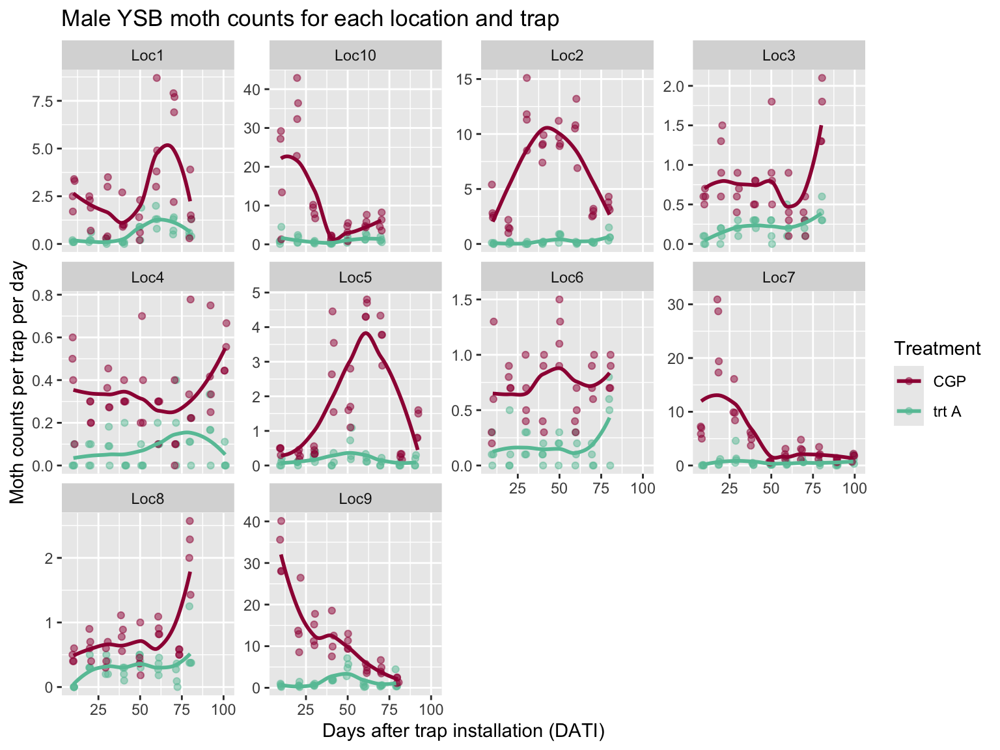

### Trap locations

Trial locations in relation to each other. Some trial locations are closer to each other than others.

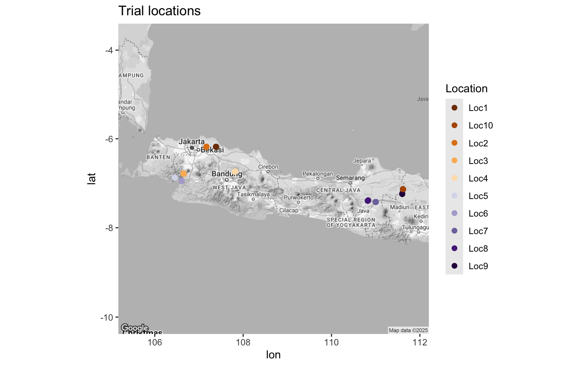

Within each location, the treatment traps have a slightly different alignment:

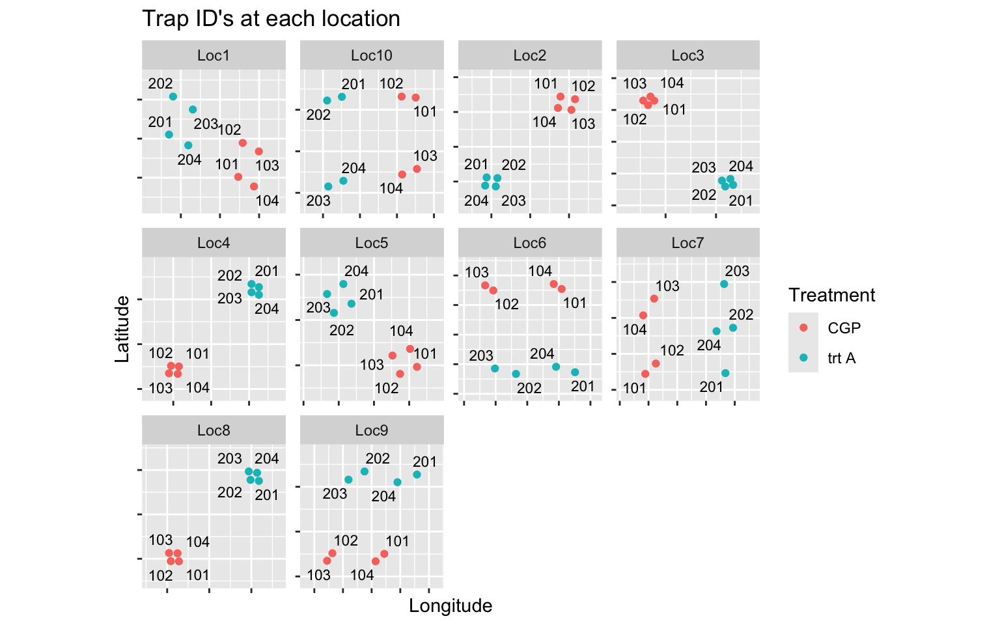


### Timeline

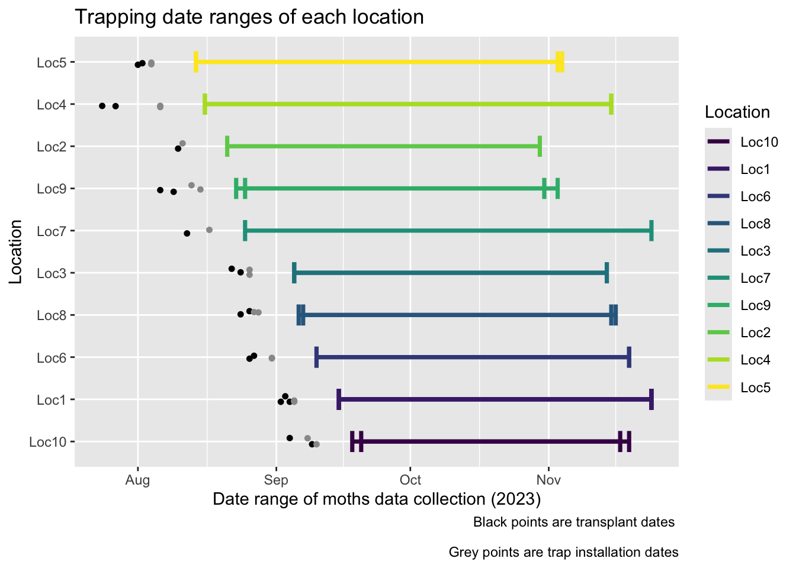

Note that not all traps are installed on exactly the same day; not all locations have rice transplanted on exactly the same day; and not all traps are sampled on exactly the same day.

## Basic GLM models

To start, we ignore all the spatial and temporal relationships in the data and assume each data point is independent and identically distributed (iid). **This is not a good model for the data!** It is just our starting off point.

When building hierarchical Bayesian models, it is always a good idea to start simple, make sure everything works as expected, and then build up.

### Mathematical model

Our response variable is a count, therefore we use either a Poisson or negative binomial distribution as the basis for our model. These models are known as generalized linear models (GLMs).
 
The model must also include an offset to account for the varying time intervals between sample. (If the traps are left unchecked for more days, we naturally expect the trap to have more moths. This varying effort is accounted for by the offset.)

#### Poisson regression model

We start with a poisson version of our regression model:

$$
y_i \sim Pois(\lambda_i) \\
log(\lambda_i ) = \beta_0 + \beta_1 x_{A,i} + \mbox{ln} \left(DaysOfCatch_i\right)
$$

where, for data samples $i = 1, ..., N$, 

$y_i$ is moth count $i$,

$\lambda_i$ is the expected moth count for sample $i$,

$\beta_0$ is the intercept of the model. Here, it is the basis for the expected moth count for our control treatment.

$\beta_1$ is the expected difference in moth counts between the control group and the treatment A group, 

$x_{i}$ is an indicator variable that equals 1 if sample $i$ is from a treatment A field and equals 0 otherwise, and

$\left(DaysOfCatch_i\right)$ is the offset to account for the varying time interval between samples. This is necessary because with a longer time interval, more moths will fly into the trap.

#### Negative binomial regression model

In ecology, there is always additional variability in our data than what the Poisson distribution allows. To account for the additional variability in our model, we switch to a negative binomial distribution:

$$
y_i \sim NegBinom(\lambda_i, \phi) \\
log(\lambda_i ) = \beta_0 + \beta_1 x_{i} + \mbox{ln} \left(DaysOfCatch_i\right)
$$

"Negative binomial regression is used to model count data for which the variance is higher than the mean." (https://www.pymc.io/projects/examples/en/latest/generalized_linear_models/GLM-negative-binomial-regression.html)

For the negative binomial regression, all variables and parameters are defined as before, but the model has an additional parameter, $\phi$, that allows for the additional variation. The negative binomial distribution and regression model can be written in many ways. In our models, $\phi$ is defined through the following formula where the variance associated with an expected moth count, $\lambda$, is:

$$
Var(\lambda) = \lambda + \phi \cdot\lambda^2
$$

(For a Poisson distribution, $Var(\lambda) = \lambda$.)

#### Bayesian mathematical model

I also fit these models using a Bayesian framework, again to build our foundation for the more complex models that come later.

For the Bayesian models, I only show the more complex negative binomial version.

To make our models Bayesian, we add priors to our parameters:

$$
y_i \sim NegBinom(\lambda_i, \phi) \\
log(\lambda_i ) = \beta_0 + \beta_1 x_{A,i} + \mbox{ln} \left(DaysOfCatch_i\right) \\
\beta_0 \sim Normal(0, 2) \\
\beta_1 \sim Normal(0, 2) \\
\phi \sim HalfCauchy(0,1)
$$

The models use slightly informative priors. When working on a log-scale (e.g., with Poisson or negative binomial distributions), this often becomes essential to avoid parameter estimates on the boundaries. (See Hooten and Hobbs for a good discussion on this issue.)

#### Trapping reduction defined

The primary metric of interest from these models is a derived parameter that we call trapping reduction (TR):

$$
TR = 100 - 100 e ^{(-\beta_1)}
$$

To obtain a 95% confidence interval for TR (for the frequentist version of our model), we use the following approximation:

$$
TR = 100 - 100 e ^{(-\beta_1 \pm 2 \cdot SE(\beta_1))}
$$

For the Bayesian version, the derived parameter is sampled as part of the MCMC iterations, and the 95% credible interval is the 2.5%, 97.5% quantiles of its resulting distribution.

### Fitting the frequentist models

Note: when I predict for new data, I set DaysOfCatch = 1, and then I compare to the moths per day variable (mothsperday = nYSB / DaysOfCatch). I want to exclude any patterns related to the varying time intervals.

These models show a very tight confidence intervals for our predictions. But also, the residual deviance is MUCH greater than the degree of freedom, indicating a lack of fit. The plot of the predictions overlaid on the data also demonstrate the lack of fit.


```
## 
## Call:
## glm(formula = nYSB ~ TreatmentF, family = poisson, data = datR, 
##     offset = log(DaysOfCatch))
## 
## Coefficients:
##                  Estimate Std. Error z value Pr(>|z|)    
## (Intercept)      1.396045   0.008574  162.83   <2e-16 ***
## TreatmentFtrt A -2.166510   0.026769  -80.93   <2e-16 ***
## ---
## Signif. codes:  0 '***' 0.001 '**' 0.01 '*' 0.05 '.' 0.1 ' ' 1
## 
## (Dispersion parameter for poisson family taken to be 1)
## 
##     Null deviance: 36638  on 671  degrees of freedom
## Residual deviance: 25678  on 670  degrees of freedom
## AIC: 28072
## 
## Number of Fisher Scoring iterations: 6
```

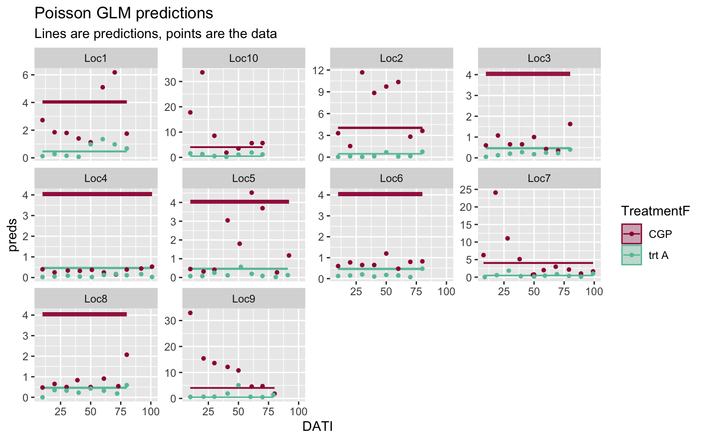

The model is such a bad fit to the data, it is hard to even tell what is going on in the plot above.

For the negative binomial model, our confidence intervals are a little wider, but we are still ignoring all the correlations in our data. And the plot of the predictions again indicates the lack of fit.


```
## 
## Call:
## glm.nb(formula = nYSB ~ TreatmentF + offset(log(DaysOfCatch)), 
##     data = datR, init.theta = 0.6559820251, link = log)
## 
## Coefficients:
##                 Estimate Std. Error z value Pr(>|z|)    
## (Intercept)      1.40225    0.06790   20.65   <2e-16 ***
## TreatmentFtrt A -2.16364    0.09893  -21.87   <2e-16 ***
## ---
## Signif. codes:  0 '***' 0.001 '**' 0.01 '*' 0.05 '.' 0.1 ' ' 1
## 
## (Dispersion parameter for Negative Binomial(0.656) family taken to be 1)
## 
##     Null deviance: 1184.50  on 671  degrees of freedom
## Residual deviance:  766.68  on 670  degrees of freedom
## AIC: 4883.5
## 
## Number of Fisher Scoring iterations: 1
## 
## 
##               Theta:  0.6560 
##           Std. Err.:  0.0352 
## 
##  2 x log-likelihood:  -4877.5410
```


### Bayesian (brms) model fit

In R, I fit the Bayesian models using the "brms" package. I find this package very intuitive and it has fast, efficient algorithms based on Stan. 

Because the models take a few minutes to fit, I usually fit them when I am initially running through my code, save them, and then only load the model fit when rendering the Rmarkdown file and creating the resulting figures.

The prior_summary command is helpful if you do not know what a parameter is called in 'brms'. Here, I used the command to find out what they called their $\phi$ parameter. (They call it the shape parameter.)


```
##        prior     class          coef group resp dpar nlpar lb ub       source
##  normal(0,2)         b                                                   user
##  normal(0,2)         b TreatmenttrtA                             (vectorized)
##  normal(0,2) Intercept                                                   user
##  cauchy(0,1)     shape                                      0            user
```

The Bayesian parameter estimates match very closely to the frequentist estimates. This is expected, but reassuring that we have built the correct foundation for the more complicated models to come. The first summary output is from the Bayesian model; the second is from the frequentist fit. 

Comparisons of TR predictions and predicted moth count values can be found at the end of the page.


```
##  Family: negbinomial 
##   Links: mu = log; shape = identity 
## Formula: nYSB3 ~ Treatment + offset(log(DaysOfCatch)) 
##    Data: tmp (Number of observations: 672) 
##   Draws: 6 chains, each with iter = 2000; warmup = 500; thin = 1;
##          total post-warmup draws = 9000
## 
## Regression Coefficients:
##               Estimate Est.Error l-95% CI u-95% CI Rhat Bulk_ESS Tail_ESS
## Intercept         1.40      0.07     1.27     1.54 1.00     9469     6659
## TreatmenttrtA    -2.16      0.10    -2.35    -1.96 1.00     8822     6162
## 
## Further Distributional Parameters:
##       Estimate Est.Error l-95% CI u-95% CI Rhat Bulk_ESS Tail_ESS
## shape     0.66      0.04     0.59     0.73 1.00     9046     6668
## 
## Draws were sampled using sampling(NUTS). For each parameter, Bulk_ESS
## and Tail_ESS are effective sample size measures, and Rhat is the potential
## scale reduction factor on split chains (at convergence, Rhat = 1).
```

```
## 
## Call:
## glm.nb(formula = nYSB ~ TreatmentF + offset(log(DaysOfCatch)), 
##     data = datR, init.theta = 0.6559820251, link = log)
## 
## Coefficients:
##                 Estimate Std. Error z value Pr(>|z|)    
## (Intercept)      1.40225    0.06790   20.65   <2e-16 ***
## TreatmentFtrt A -2.16364    0.09893  -21.87   <2e-16 ***
## ---
## Signif. codes:  0 '***' 0.001 '**' 0.01 '*' 0.05 '.' 0.1 ' ' 1
## 
## (Dispersion parameter for Negative Binomial(0.656) family taken to be 1)
## 
##     Null deviance: 1184.50  on 671  degrees of freedom
## Residual deviance:  766.68  on 670  degrees of freedom
## AIC: 4883.5
## 
## Number of Fisher Scoring iterations: 1
## 
## 
##               Theta:  0.6560 
##           Std. Err.:  0.0352 
## 
##  2 x log-likelihood:  -4877.5410
```

```
##        TR lowerCI upperCI
## 2.5% 88.5      86    90.5
```

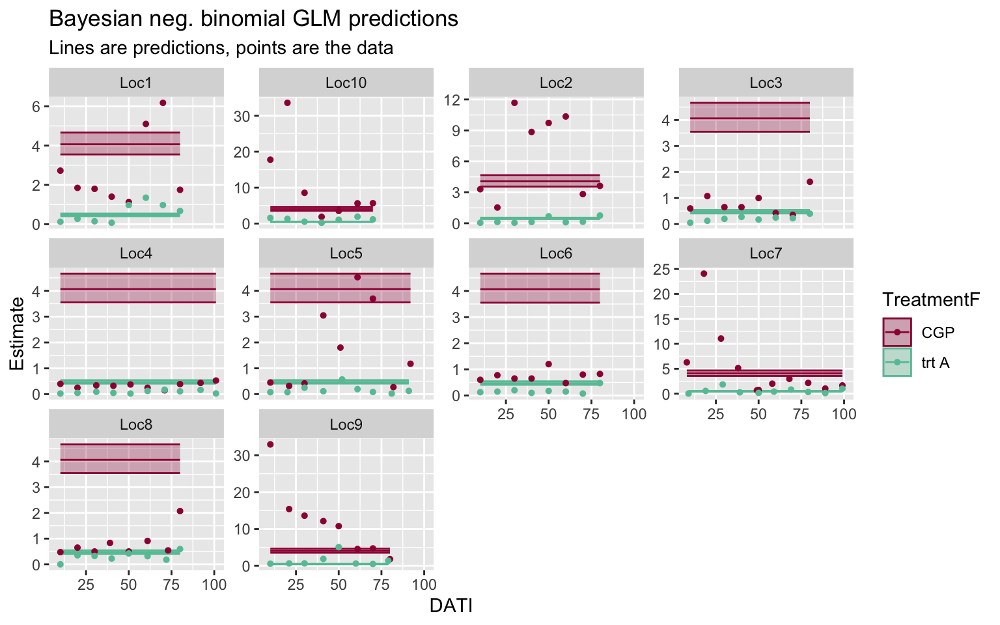

### Bayesian (rjags) model fit

I also fit the Bayesian models using the "rjags" package. Eventually, I fit complex non-linear, hierarchical Bayesian models and for those models, I need mroe flexibility than "brms" provides. Because it is good practice to build up to the complex models, I am also fitting these simpler models with the rjags package. 

#### Poisson model in jags


```
## Compiling model graph
##    Resolving undeclared variables
##    Allocating nodes
## Graph information:
##    Observed stochastic nodes: 672
##    Unobserved stochastic nodes: 2
##    Total graph size: 2051
## 
## Initializing model
```


```
## 
## Iterations = 2005:12000
## Thinning interval = 5 
## Number of chains = 1 
## Sample size per chain = 2000 
## 
## 1. Empirical mean and standard deviation for each variable,
##    plus standard error of the mean:
## 
##      Mean       SD  Naive SE Time-series SE
## TR 88.532 0.305172 0.0068239      0.0068239
## b0  1.396 0.008441 0.0001888      0.0001888
## b1 -2.166 0.026598 0.0005948      0.0005948
## 
## 2. Quantiles for each variable:
## 
##      2.5%    25%    50%    75%  97.5%
## TR 87.939 88.319 88.531 88.751 89.112
## b0  1.379  1.390  1.396  1.402  1.412
## b1 -2.218 -2.185 -2.166 -2.147 -2.115
```

```
## 
## Call:
## glm(formula = nYSB ~ TreatmentF, family = poisson, data = datR, 
##     offset = log(DaysOfCatch))
## 
## Coefficients:
##                  Estimate Std. Error z value Pr(>|z|)    
## (Intercept)      1.396045   0.008574  162.83   <2e-16 ***
## TreatmentFtrt A -2.166510   0.026769  -80.93   <2e-16 ***
## ---
## Signif. codes:  0 '***' 0.001 '**' 0.01 '*' 0.05 '.' 0.1 ' ' 1
## 
## (Dispersion parameter for poisson family taken to be 1)
## 
##     Null deviance: 36638  on 671  degrees of freedom
## Residual deviance: 25678  on 670  degrees of freedom
## AIC: 28072
## 
## Number of Fisher Scoring iterations: 6
```

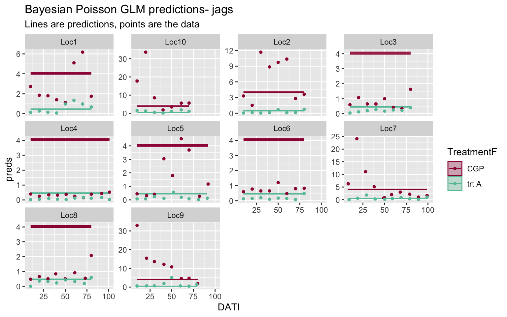

#### NB model in jags

Here I also use the matrix form of $X\beta$.

Note that jags uses a different parameterization than R., so there is an extra line of code to make them match. Also, I coded my model in matrix form here-- this paramaterization of the priors is equivalent to the Poisson model above. I include both for comparison.


```
## Compiling model graph
##    Resolving undeclared variables
##    Allocating nodes
## Graph information:
##    Observed stochastic nodes: 672
##    Unobserved stochastic nodes: 2
##    Total graph size: 3426
## 
## Initializing model
```


```
## 
## Iterations = 2005:12000
## Thinning interval = 5 
## Number of chains = 1 
## Sample size per chain = 2000 
## 
## 1. Empirical mean and standard deviation for each variable,
##    plus standard error of the mean:
## 
##           Mean      SD  Naive SE Time-series SE
## TR      88.271 1.16575 0.0260670       0.042915
## beta[1]  1.395 0.06647 0.0014864       0.002431
## beta[2] -2.148 0.09859 0.0022046       0.003613
## r        0.657 0.03469 0.0007758       0.000801
## 
## 2. Quantiles for each variable:
## 
##           2.5%     25%     50%     75%   97.5%
## TR      85.668 87.5581 88.3269 89.0800 90.3305
## beta[1]  1.265  1.3509  1.3943  1.4402  1.5256
## beta[2] -2.336 -2.2146 -2.1479 -2.0841 -1.9427
## r        0.590  0.6335  0.6565  0.6801  0.7274
```

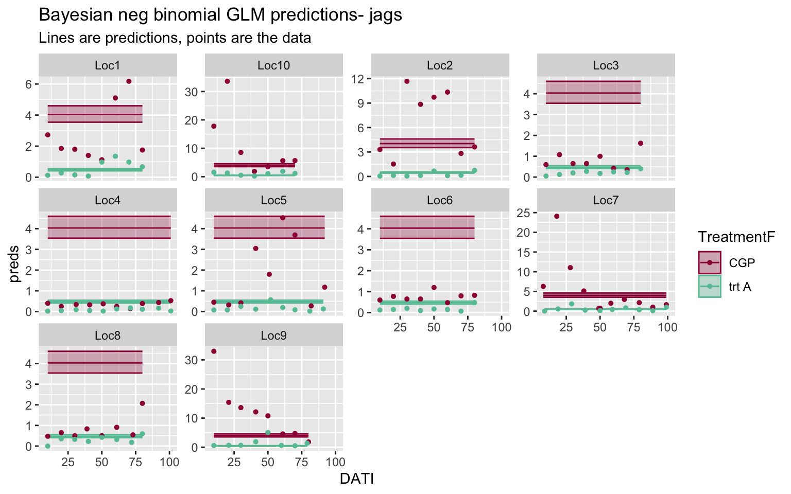

This model is not yet fully converged, so some differences from R output are expected.


## GLMM: Random effect (RE) for locations

The first fix we make to the model is acknowledging that overall average  moth pressure varies from location to location (see Fig 1 of moth counts). To make this fix, we add a location random effect (RE) and our model becomes a generalized linear mixed-effects model (GLMM or GLMER).

We also want to acknowledge that the treatment effect may vary from location to location-- sometimes we see a big difference in moth counts between control and treatment fields, and sometimes the difference is smaller. For inference though, we are only interested in the larger picture, which is the overall trapping reduction. (We are not interested in what happens at these exact locations per se, we are more interested in the average treatment effect.) Therefore, we also add a treatment random effect.

### GLMM mathematical model

I only show the Poisson version of the model, the NB version is a straightforward extension.

$$
y_{ik} \sim Pois(\lambda_{ik}) \\
log(\lambda_{ik} ) = \beta_0 + \beta_1 x_{A,i} + \gamma_{0k} x_{ik}  + \gamma_{1k} x_{A,i} x_{ik} + \mbox{ln} \left(DaysOfCatch_i\right) \\
\gamma_{0k} \sim Normal(0, \sigma^2_{0}) \\
\gamma_{1k} \sim Normal(0, \sigma^2_{1}) \\
$$

where, in addition to the variables and parameters defined for the GLM, we have

$k = 1,..., K=10$ represents the locations, 

$y_{ik}$ is moth count $i$ from location $k$,

$\lambda_{ik}$ is the expected moth count for sample $i$  from location $k$,

$\beta_0$ is the expected moth count for our control treatment for a new location,

$\beta_1$ is the expected difference in moth counts between the control group and the treatment A group for a new location, 

$\gamma_{0k}$ is the random intercept associated with location $k$, which leads to different background moth pressures at each location. All $\gamma_{0k}$ come from an iid Normal distribution.

$\gamma_{1k}$ is the random slope associated with location $k$, which leads to different treatment effects at each location. All $\gamma_{1k}$ come from an iid Normal distribution, and

$x_{ik}$ is an indicator variable that equals 1 if moth count $i$ is associated with location $k$ and 0 otherwise.

OK, technically I should be introducing matrices here because $k = 1,..., K=10$ locations, so we need a new indicator variable for each location, but I'm going to be lazy and write it like this for now.


#### Bayesian GLMM mathematical model

Here is the same model with a Bayesian framework and using a negative binomial regression:

To make our models Bayesian, we add priors to our parameters:

$$
y_{ik}\sim NegBinom(\lambda_{ik}, \phi) \\
log(\lambda_{ik} ) = \beta_0 + \beta_1 x_{A,i} + \gamma_{0k} x_{ik}  + \gamma_{1k} x_{A,i} x_{ik} + \mbox{ln} \left(DaysOfCatch_i\right) \\ 
\gamma_{0k} \sim Normal(0, \sigma^2_{0}) \\
\gamma_{1k} \sim Normal(0, \sigma^2_{1}) \\
\beta_0 \sim Normal(0, 2) \\
\beta_1 \sim Normal(0, 2) \\
\sigma^2_{0} \sim HalfCauchy(0,1) \\
\sigma^2_{1} \sim HalfCauchy(0,1) \\
\phi \sim HalfCauchy(0,1) \\
$$


#### Bayesian GLMM -- Matrix version

I DO write the Bayesian version in matrix form because it matches the coding (and is more correct given the need for a $KxK$ $Z$ design matrix):

$$
\mathbf{Y} \sim NegBinom(\boldsymbol\lambda, \phi) \\
log(\boldsymbol\lambda) = \mathbf{X}\boldsymbol\beta + \mathbf{Z}\boldsymbol\gamma  + \mbox{ln} \left(\bf{DaysOfCatch}\right) \\
\boldsymbol\beta \sim Normal(\mathbf{0}, 2\mathbf{I}) \\
\boldsymbol\gamma \sim Normal(\mathbf{0}, \boldsymbol\sigma^2 \mathbf{I}) \\
\boldsymbol\sigma^2 \sim HalfCauchy(\mathbf{0}, 1\mathbf{I})) \\
\phi \sim HalfCauchy(0,1)
$$


### GLMM frequentist fit

A couple of notes here. R always gets mad when you ask for SE's for predictions from a GLMM. Technically, you need to run simulations to get them and then they still come with an asterisk related to their reliability. (This is a reason to use the Bayesian model-- credible intervals are never based on approximations!)

When we plot our predictions, we see that we now have better estimates for the overall mean at each location, and we see how much they vary from location to location, but there is a strong temporal pattern at each location that we are missing.


```
## Generalized linear mixed model fit by maximum likelihood (Laplace
##   Approximation) [glmerMod]
##  Family: poisson  ( log )
## Formula: nYSB ~ TreatmentF + (1 + TreatmentF | Location)
##    Data: datR
##  Offset: log(DaysOfCatch)
## 
##       AIC       BIC    logLik -2*log(L)  df.resid 
##   14070.5   14093.1   -7030.3   14060.5       667 
## 
## Scaled residuals: 
##    Min     1Q Median     3Q    Max 
## -9.969 -1.689 -0.584  0.768 33.638 
## 
## Random effects:
##  Groups   Name            Variance Std.Dev. Corr 
##  Location (Intercept)     1.4407   1.2003        
##           TreatmentFtrt A 0.4075   0.6384   -0.75
## Number of obs: 672, groups:  Location, 10
## 
## Fixed effects:
##                 Estimate Std. Error z value Pr(>|z|)    
## (Intercept)       0.8159     0.3798   2.148   0.0317 *  
## TreatmentFtrt A  -1.8900     0.2052  -9.209   <2e-16 ***
## ---
## Signif. codes:  0 '***' 0.001 '**' 0.01 '*' 0.05 '.' 0.1 ' ' 1
## 
## Correlation of Fixed Effects:
##             (Intr)
## TrtmntFtrtA -0.743
```


|   TR| lowerCI| upperCI|
|----:|-------:|-------:|
| 84.9|    77.4|    89.9|

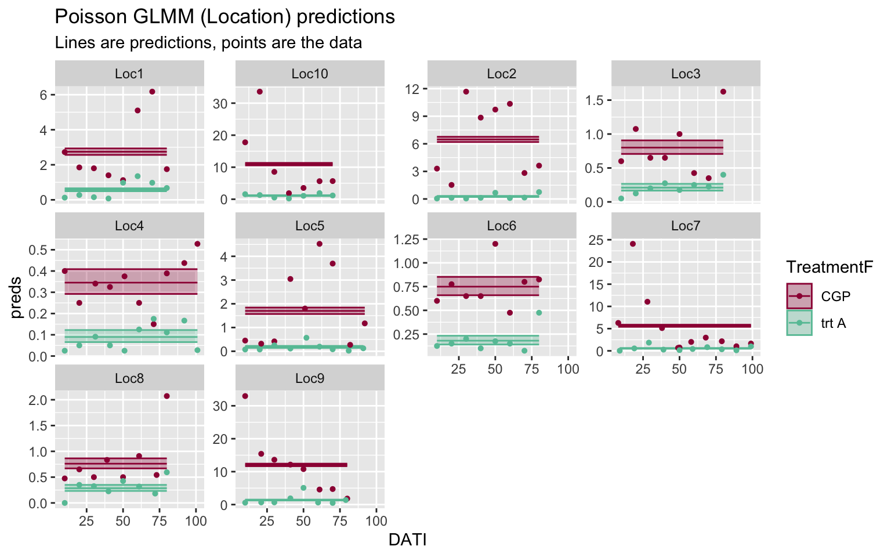

```
## Generalized linear mixed model fit by maximum likelihood (Laplace
##   Approximation) [glmerMod]
##  Family: Negative Binomial(1.5338)  ( log )
## Formula: nYSB ~ TreatmentF + (1 + TreatmentF | Location)
##    Data: datR
##  Offset: log(DaysOfCatch)
## 
##       AIC       BIC    logLik -2*log(L)  df.resid 
##    4399.3    4426.3   -2193.6    4387.3       666 
## 
## Scaled residuals: 
##     Min      1Q  Median      3Q     Max 
## -1.1392 -0.7363 -0.2834  0.3435  7.8739 
## 
## Random effects:
##  Groups   Name            Variance Std.Dev. Corr 
##  Location (Intercept)     1.4075   1.1864        
##           TreatmentFtrt A 0.3602   0.6001   -0.76
## Number of obs: 672, groups:  Location, 10
## 
## Fixed effects:
##                 Estimate Std. Error z value Pr(>|z|)    
## (Intercept)       0.8258     0.3781   2.184    0.029 *  
## TreatmentFtrt A  -1.8986     0.2033  -9.340   <2e-16 ***
## ---
## Signif. codes:  0 '***' 0.001 '**' 0.01 '*' 0.05 '.' 0.1 ' ' 1
## 
## Correlation of Fixed Effects:
##             (Intr)
## TrtmntFtrtA -0.735
```


| TR| lowerCI| upperCI|
|--:|-------:|-------:|
| 85|    77.7|    89.9|

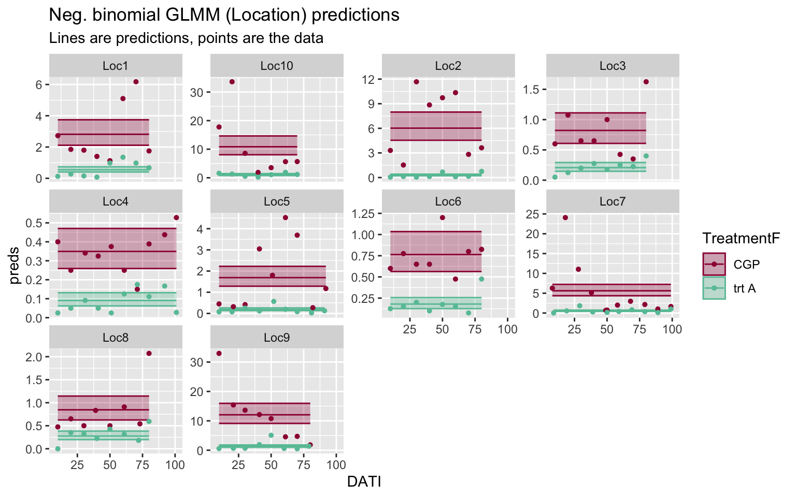


### GLMM Bayes (brms) version

By default, the prior distributions of random slopes and intercepts are correlated in "brm", which matches the "GLMM" frequentist fit. If the correlation is non-significant, you may want to remove that correlation to simplify your model. To remove the correlation, change the random effects term from "(1 + TreatmentF|Location)" to " (1 + TreatmentF||Location)" (has an extra vertical line), which makes them independent. 

You'll notice that the parameter estimates are slightly different from the frequentist NB model fit here-- the more complicated your model is, the more likely you will find this is true with slightly different versions of your model (here, adding priors and fitting with a different algorithm). 


```
##  Family: negbinomial 
##   Links: mu = log; shape = identity 
## Formula: nYSB ~ TreatmentF + offset(logDaysOfCatch) + (1 + TreatmentF | Location) 
##    Data: datR (Number of observations: 672) 
##   Draws: 6 chains, each with iter = 2000; warmup = 500; thin = 1;
##          total post-warmup draws = 9000
## 
## Multilevel Hyperparameters:
## ~Location (Number of levels: 10) 
##                               Estimate Est.Error l-95% CI u-95% CI Rhat
## sd(Intercept)                     1.32      0.32     0.84     2.10 1.00
## sd(TreatmentFtrtA)                0.69      0.19     0.40     1.13 1.00
## cor(Intercept,TreatmentFtrtA)    -0.61      0.22    -0.90    -0.07 1.00
##                               Bulk_ESS Tail_ESS
## sd(Intercept)                     2355     3331
## sd(TreatmentFtrtA)                2984     4589
## cor(Intercept,TreatmentFtrtA)     4009     5301
## 
## Regression Coefficients:
##                Estimate Est.Error l-95% CI u-95% CI Rhat Bulk_ESS Tail_ESS
## Intercept          0.82      0.42    -0.03     1.67 1.00     2407     3221
## TreatmentFtrtA    -1.88      0.23    -2.34    -1.41 1.00     3513     4646
## 
## Further Distributional Parameters:
##       Estimate Est.Error l-95% CI u-95% CI Rhat Bulk_ESS Tail_ESS
## shape     1.53      0.10     1.35     1.73 1.00     9290     6869
## 
## Draws were sampled using sampling(NUTS). For each parameter, Bulk_ESS
## and Tail_ESS are effective sample size measures, and Rhat is the potential
## scale reduction factor on split chains (at convergence, Rhat = 1).
```


|     |   TR| lowerCI| upperCI|
|:----|----:|-------:|-------:|
|2.5% | 84.8|    75.7|    90.4|

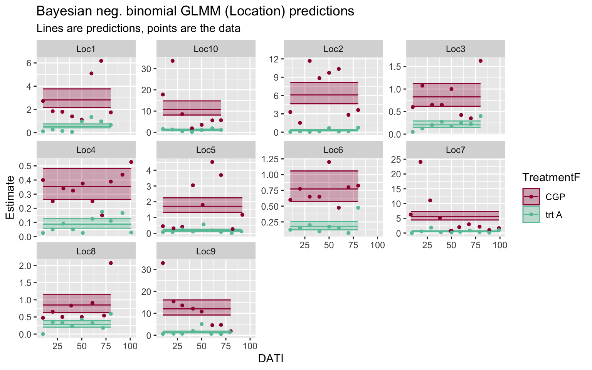

### GLMM Bayes (rjags) model fit

#### Poisson model in jags

Does not converge well without correlated RE's.

Also, need correlated RE's to match glmer and "brms"...
adapted from:
https://people.ucsc.edu/~abrsvn/general_correlated_ranefs_bayes_jags.r


```
## Compiling model graph
##    Resolving undeclared variables
##    Allocating nodes
## Graph information:
##    Observed stochastic nodes: 672
##    Unobserved stochastic nodes: 20
##    Total graph size: 3616
```

```
## Initializing model
```


**Need to add RE's for predictions!!

#### NB model in jags

Not done.


## GLMM: RE for Location, SamplingDate

In this version of the model, we acknowledge that sampling on different days of the season adds to the variability of the moth counts, and that counts from the same sampling date are more similar than for a different date. In this model, however,  the correlation between sampling dates is ignored.

This model is included here because it is important to think about whether you have nested or crossed random effects (if applicable). Here, we are assuming crossed random effects because Java island is fairly homogeneous in terms of weather and ecosystem so it may make sense for all samples from one date to be grouped together. However, one could also argue for nested RE's for this case study. 

This model allows us to include sampling date in our model as a random effect and still fit the model quickly in a frequentist framework. 

Include dates because samples within a date will be more similar than samples across all dates at a location. But only include random intercepts.

The predictions now mimic the spatial patterns we see over time.

Nested vs crossed good reference:
https://stats.stackexchange.com/questions/228800/crossed-vs-nested-random-effects-how-do-they-differ-and-how-are-they-specified

### Crossed GLMM mathematical model

I only show the Poisson version of the model, the NB version is a straightforward extension.

$$
y_{ik} \sim Pois(\lambda_{ik}) \\
log(\lambda_{ij} ) = \beta_0 + \beta_1 x_{A,i} + \gamma_{0k} x_{ik}  + \gamma_{1k} x_{A,i} x_{ik}  + \gamma_{00j} x_{ij}  + \mbox{ln} \left(DaysOfCatch_i\right) \\
\gamma_{0k} \sim Normal(0, \sigma^2_{0}) \\
\gamma_{1k} \sim Normal(0, \sigma^2_{1}) \\
\gamma_{00j} \sim Normal(0, \sigma^2_{00}) \\
$$

where, in addition to the variables and parameters defined for the GLM, we have

$k = 1,..., K=10$ represents the locations, 

$j = 1, ..., J = 117$ represents the 117 unique date-location combinations,

$y_{ikj}$ is moth count $i$ from location $k$ on date $j$,

$\lambda_{ikj}$ is the expected moth count for sample $i$  from location $k$ on date $j$,

$\beta_0$ is the expected moth count for our control treatment for a new location,

$\beta_1$ is the expected difference in moth counts between the control group and the treatment A group for a new location, 

$\gamma_{0k}$ is the random intercept associated with location $k$, which leads to different background moth pressures at each location. All $\gamma_{0k}$ come from an iid Normal distribution,

$\gamma_{1k}$ is the random slope associated with location $k$, which leads to different treatment effects at each location. All $\gamma_{1k}$ come from an iid Normal distribution, 

$x_{ik}$ is an indicator variable that equals 1 if moth count $i$ is associated with location $k$ and 0 otherwise,

$\gamma_{00j}$ is the random intercept associated with date-location $j$, which leads to different background moth pressures for each date, and 

$x_{ij}$ is an indicator variable that equals 1 if moth count $i$ is associated with date-location $j$ and 0 otherwise.


#### Bayesian GLMM -- Matrix version

$$
\mathbf{Y} \sim NegBinom(\boldsymbol\lambda, \phi) \\
log(\boldsymbol\lambda) = \mathbf{X}\boldsymbol\beta + \mathbf{Z}\boldsymbol\gamma  + \mathbf{z_{00}}\gamma_{00}  + \mbox{ln} \left(\bf{DaysOfCatch}\right) \\
\boldsymbol\beta \sim Normal(\mathbf{0}, 2\mathbf{I}) \\
\boldsymbol\gamma \sim Normal(\mathbf{0}, \boldsymbol\sigma^2 \mathbf{I}) \\
\gamma_{00} \sim Normal(0, \sigma^2) \\
\boldsymbol\sigma^2 \sim HalfCauchy(\mathbf{0}, 1\mathbf{I})) \\
\sigma^2_{00} \sim HalfCauchy(0,1) \\
\phi \sim HalfCauchy(0,1)
$$


### Crossed GLMM frequentist fit

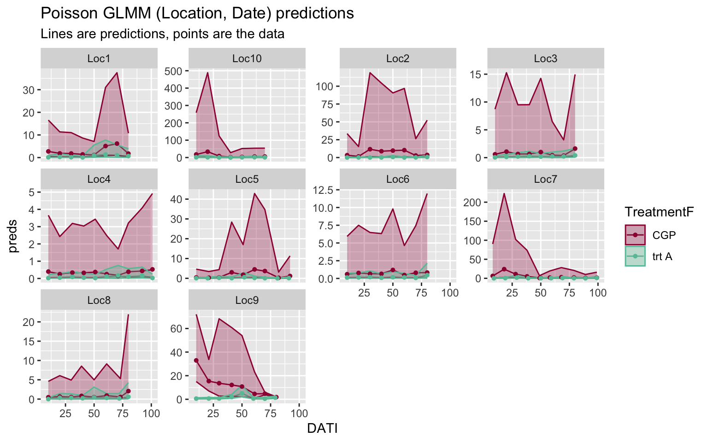
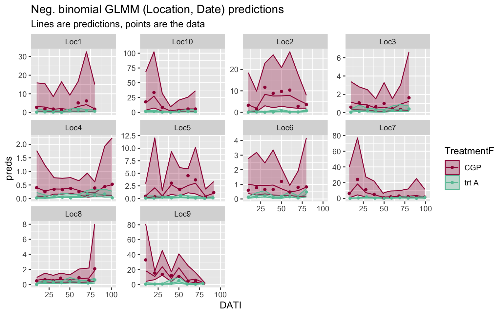


### Crossed GLMM Bayes (brms) version


```
##  Family: negbinomial 
##   Links: mu = log; shape = identity 
## Formula: nYSB ~ TreatmentF + offset(log(DaysOfCatch)) + (1 + TreatmentF | Location) + (1 | SamplingDateC) 
##    Data: datR (Number of observations: 672) 
##   Draws: 6 chains, each with iter = 2000; warmup = 500; thin = 1;
##          total post-warmup draws = 9000
## 
## Multilevel Hyperparameters:
## ~Location (Number of levels: 10) 
##                               Estimate Est.Error l-95% CI u-95% CI Rhat
## sd(Intercept)                     1.16      0.30     0.74     1.90 1.00
## sd(TreatmentFtrtA)                0.65      0.18     0.38     1.10 1.00
## cor(Intercept,TreatmentFtrtA)    -0.58      0.23    -0.90    -0.02 1.00
##                               Bulk_ESS Tail_ESS
## sd(Intercept)                     2611     4087
## sd(TreatmentFtrtA)                3469     5126
## cor(Intercept,TreatmentFtrtA)     3688     4813
## 
## ~SamplingDateC (Number of levels: 62) 
##               Estimate Est.Error l-95% CI u-95% CI Rhat Bulk_ESS Tail_ESS
## sd(Intercept)     0.67      0.08     0.53     0.85 1.00     2345     4284
## 
## Regression Coefficients:
##                Estimate Est.Error l-95% CI u-95% CI Rhat Bulk_ESS Tail_ESS
## Intercept          0.64      0.38    -0.10     1.38 1.00     1745     2463
## TreatmentFtrtA    -1.75      0.23    -2.20    -1.28 1.00     2374     3383
## 
## Further Distributional Parameters:
##       Estimate Est.Error l-95% CI u-95% CI Rhat Bulk_ESS Tail_ESS
## shape     2.58      0.22     2.17     3.03 1.00     8941     6216
## 
## Draws were sampled using sampling(NUTS). For each parameter, Bulk_ESS
## and Tail_ESS are effective sample size measures, and Rhat is the potential
## scale reduction factor on split chains (at convergence, Rhat = 1).
```

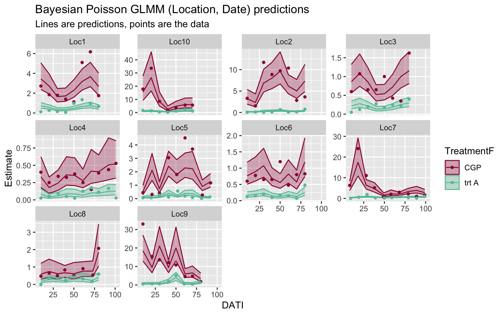


## GLMM with Gaussian Processes: RE for Trial, GP for Date

Now we are in the territory where we have to fit the models in a Bayesian framework. If our response variable was continuous (i.e., the regression model was based on a Normal distribution), then we could still use maximum likelihood estimation.

### Bayesian mathematical model

$$
y_{ijk} \sim NegBinom(\lambda_{ijk}, r) \\
log(\lambda_{ijk} ) = \beta_0 + \beta_1 x_{A,i} + \gamma_{0k} x_{ik}  + \gamma_{1k} x_{A,i} x_{ik}  + GP_{ijk}  + \mbox{ln} \left(DaysOfCatch_i\right) \\
 \boldsymbol\gamma \sim Normal(\mathbf{0}, \boldsymbol\Sigma_{\gamma}) \\ 
 \mathbf{GP_k} \sim MVN(0, \boldsymbol\Sigma_k) \\
 \boldsymbol\beta \sim Normal(\mathbf{0}, 2\mathbf{I}) \\
 \boldsymbol\sigma^2 \sim HalfCauchy(\mathbf{0}, 1\mathbf{I})) \\
 r \sim HalfCauchy(0,1) \\
 \Sigma_{lm, k} = \tau \cdot e^{-\frac{|d_l - d_m|^2}{l^2}\right} \\
\tau_k \sim HalfCauchy(0, 1) \\
\l_k \sim HalfCauchy(0, 1) \\
$$

where, in addition to the variables and parameters defined for the GLM, we have

$k = 1,..., K=10$ represents the locations, 

$j = 1, ..., J = 117$ represents the 117 unique date-location combinations,

$y_{ikj}$ is moth count $i$ from location $k$ on date $j$,

$\lambda_{ikj}$ is the expected moth count for sample $i$  from location $k$ on date $j$,

$\beta_0$ is the expected moth count for our control treatment for a new location,

$\beta_1$ is the expected difference in moth counts between the control group and the treatment A group for a new location, 

$\gamma_{0k}$ is the random intercept associated with location $k$, which leads to different background moth pressures at each location. All $\gamma_{0k}$ come from an iid Normal distribution,

$\gamma_{1k}$ is the random slope associated with location $k$, which leads to different treatment effects at each location. All $\gamma_{1k}$ come from an iid Normal distribution, 

$x_{ik}$ is an indicator variable that equals 1 if moth count $i$ is associated with location $k$ and 0 otherwise,

$\gamma_{00j}$ is the random intercept associated with date-location $j$, which leads to different background moth pressures for each date, and 

$x_{ij}$ is an indicator variable that equals 1 if moth count $i$ is associated with date-location $j$ and 0 otherwise.

$l$ = lscale (differnt for each location)

$\phi$ = sdgp


### Gaussian Process Bayes (brms) version

* Use numeric version of sampling date for better algorithm stability. Still, we have a warning about a divergent transition. Ideally, we would tweak the model and look at the data carefully so fix this warning, but because we are working with made up data, we will not worry about the warning for now.

* Using squared-exponential covariance function (quite typical choice).

* Here, we have a different GP for each location (each location has its own parameters for the function). This is done to further account for expected differences between locations. Ideally, we would do some model selection to decide between this model and one that shares the GP parameters across all locations.


```
##  Family: negbinomial 
##   Links: mu = log; shape = identity 
## Formula: nYSB ~ TreatmentF + offset(log(DaysOfCatch)) + (1 + TreatmentF | Location) + gp(numericDate, by = Location) 
##    Data: datR (Number of observations: 672) 
##   Draws: 6 chains, each with iter = 5000; warmup = 1000; thin = 1;
##          total post-warmup draws = 24000
## 
## Gaussian Process Hyperparameters:
##                                    Estimate Est.Error l-95% CI u-95% CI Rhat
## sdgp(gpnumericDateLocationLoc1)        1.07      0.59     0.40     2.64 1.00
## sdgp(gpnumericDateLocationLoc10)       1.09      0.44     0.57     2.29 1.00
## sdgp(gpnumericDateLocationLoc2)        0.89      0.41     0.41     1.94 1.00
## sdgp(gpnumericDateLocationLoc3)        1.09      0.86     0.10     3.31 1.00
## sdgp(gpnumericDateLocationLoc4)        1.37      0.96     0.07     3.69 1.00
## sdgp(gpnumericDateLocationLoc5)        1.31      0.53     0.64     2.66 1.00
## sdgp(gpnumericDateLocationLoc6)        1.00      0.85     0.04     3.19 1.00
## sdgp(gpnumericDateLocationLoc7)        1.23      0.29     0.79     1.91 1.00
## sdgp(gpnumericDateLocationLoc8)        1.30      0.89     0.30     3.59 1.00
## sdgp(gpnumericDateLocationLoc9)        0.95      0.25     0.60     1.56 1.00
## lscale(gpnumericDateLocationLoc1)      0.23      0.08     0.09     0.41 1.00
## lscale(gpnumericDateLocationLoc10)     0.09      0.08     0.01     0.28 1.01
## lscale(gpnumericDateLocationLoc2)      0.09      0.07     0.00     0.23 1.00
## lscale(gpnumericDateLocationLoc3)      3.59     46.58     0.03    13.48 1.00
## lscale(gpnumericDateLocationLoc4)      8.98    126.41     0.31    37.68 1.00
## lscale(gpnumericDateLocationLoc5)      0.11      0.06     0.01     0.22 1.00
## lscale(gpnumericDateLocationLoc6)     10.75    251.72     0.11    36.93 1.00
## lscale(gpnumericDateLocationLoc7)      0.01      0.00     0.00     0.02 1.00
## lscale(gpnumericDateLocationLoc8)      1.10      1.39     0.02     4.64 1.00
## lscale(gpnumericDateLocationLoc9)      0.02      0.01     0.00     0.04 1.00
##                                    Bulk_ESS Tail_ESS
## sdgp(gpnumericDateLocationLoc1)        8241    15743
## sdgp(gpnumericDateLocationLoc10)       2994     3878
## sdgp(gpnumericDateLocationLoc2)        7219    10548
## sdgp(gpnumericDateLocationLoc3)        6818    10583
## sdgp(gpnumericDateLocationLoc4)        9968     9185
## sdgp(gpnumericDateLocationLoc5)        7228    11268
## sdgp(gpnumericDateLocationLoc6)        9493    10402
## sdgp(gpnumericDateLocationLoc7)        6370    12175
## sdgp(gpnumericDateLocationLoc8)        3026    10388
## sdgp(gpnumericDateLocationLoc9)        6140    11853
## lscale(gpnumericDateLocationLoc1)      5309     5459
## lscale(gpnumericDateLocationLoc10)      553     2224
## lscale(gpnumericDateLocationLoc2)      3863     3491
## lscale(gpnumericDateLocationLoc3)      2162     4110
## lscale(gpnumericDateLocationLoc4)     11285    11702
## lscale(gpnumericDateLocationLoc5)      3063     4133
## lscale(gpnumericDateLocationLoc6)      9708     5666
## lscale(gpnumericDateLocationLoc7)      5522     9093
## lscale(gpnumericDateLocationLoc8)      1349     5048
## lscale(gpnumericDateLocationLoc9)      6472     9864
## 
## Multilevel Hyperparameters:
## ~Location (Number of levels: 10) 
##                               Estimate Est.Error l-95% CI u-95% CI Rhat
## sd(Intercept)                     1.02      0.35     0.45     1.82 1.00
## sd(TreatmentFtrtA)                0.71      0.20     0.43     1.19 1.00
## cor(Intercept,TreatmentFtrtA)    -0.52      0.29    -0.93     0.19 1.00
##                               Bulk_ESS Tail_ESS
## sd(Intercept)                     6312     5448
## sd(TreatmentFtrtA)               10512    13592
## cor(Intercept,TreatmentFtrtA)     5283     8427
## 
## Regression Coefficients:
##                Estimate Est.Error l-95% CI u-95% CI Rhat Bulk_ESS Tail_ESS
## Intercept          0.79      0.41    -0.05     1.56 1.00     6373     8678
## TreatmentFtrtA    -1.78      0.24    -2.24    -1.30 1.00    10452    11989
## 
## Further Distributional Parameters:
##       Estimate Est.Error l-95% CI u-95% CI Rhat Bulk_ESS Tail_ESS
## shape     4.15      0.44     3.35     5.09 1.00     2842    10046
## 
## Draws were sampled using sampling(NUTS). For each parameter, Bulk_ESS
## and Tail_ESS are effective sample size measures, and Rhat is the potential
## scale reduction factor on split chains (at convergence, Rhat = 1).
```

```
##                 prior     class                       coef    group resp dpar
##           normal(0,2)         b                                              
##           normal(0,2)         b             TreatmentFtrtA                   
##           normal(0,2) Intercept                                              
##  lkj_corr_cholesky(1)         L                                              
##  lkj_corr_cholesky(1)         L                            Location          
##                (flat)    lscale                                              
##           cauchy(0,1)    lscale  gpnumericDateLocationLoc1                   
##           cauchy(0,1)    lscale gpnumericDateLocationLoc10                   
##           cauchy(0,1)    lscale  gpnumericDateLocationLoc2                   
##           cauchy(0,1)    lscale  gpnumericDateLocationLoc3                   
##           cauchy(0,1)    lscale  gpnumericDateLocationLoc4                   
##           cauchy(0,1)    lscale  gpnumericDateLocationLoc5                   
##           cauchy(0,1)    lscale  gpnumericDateLocationLoc6                   
##           cauchy(0,1)    lscale  gpnumericDateLocationLoc7                   
##           cauchy(0,1)    lscale  gpnumericDateLocationLoc8                   
##           cauchy(0,1)    lscale  gpnumericDateLocationLoc9                   
##           cauchy(0,1)        sd                                              
##           cauchy(0,1)        sd                            Location          
##           cauchy(0,1)        sd                  Intercept Location          
##           cauchy(0,1)        sd             TreatmentFtrtA Location          
##           normal(0,2)      sdgp                                              
##           normal(0,2)      sdgp  gpnumericDateLocationLoc1                   
##           normal(0,2)      sdgp gpnumericDateLocationLoc10                   
##           normal(0,2)      sdgp  gpnumericDateLocationLoc2                   
##           normal(0,2)      sdgp  gpnumericDateLocationLoc3                   
##           normal(0,2)      sdgp  gpnumericDateLocationLoc4                   
##           normal(0,2)      sdgp  gpnumericDateLocationLoc5                   
##           normal(0,2)      sdgp  gpnumericDateLocationLoc6                   
##           normal(0,2)      sdgp  gpnumericDateLocationLoc7                   
##           normal(0,2)      sdgp  gpnumericDateLocationLoc8                   
##           normal(0,2)      sdgp  gpnumericDateLocationLoc9                   
##           cauchy(0,1)     shape                                              
##  nlpar lb ub       source
##                      user
##              (vectorized)
##                      user
##                   default
##              (vectorized)
##         0         default
##         0            user
##         0            user
##         0            user
##         0            user
##         0            user
##         0            user
##         0            user
##         0            user
##         0            user
##         0            user
##         0            user
##         0    (vectorized)
##         0    (vectorized)
##         0    (vectorized)
##         0            user
##         0    (vectorized)
##         0    (vectorized)
##         0    (vectorized)
##         0    (vectorized)
##         0    (vectorized)
##         0    (vectorized)
##         0    (vectorized)
##         0    (vectorized)
##         0    (vectorized)
##         0    (vectorized)
##         0            user
```

```
##                 prior     class                       coef group resp dpar
##           normal(0,2)         b                                           
##           normal(0,2) Intercept                                           
##  lkj_corr_cholesky(1)         L                                           
##           cauchy(0,1)    lscale  gpnumericDateLocationLoc1                
##           cauchy(0,1)    lscale gpnumericDateLocationLoc10                
##           cauchy(0,1)    lscale  gpnumericDateLocationLoc2                
##           cauchy(0,1)    lscale  gpnumericDateLocationLoc3                
##           cauchy(0,1)    lscale  gpnumericDateLocationLoc4                
##           cauchy(0,1)    lscale  gpnumericDateLocationLoc5                
##           cauchy(0,1)    lscale  gpnumericDateLocationLoc6                
##           cauchy(0,1)    lscale  gpnumericDateLocationLoc7                
##           cauchy(0,1)    lscale  gpnumericDateLocationLoc8                
##           cauchy(0,1)    lscale  gpnumericDateLocationLoc9                
##           cauchy(0,1)        sd                                           
##           normal(0,2)      sdgp                                           
##           cauchy(0,1)     shape                                           
##  nlpar lb ub  source
##                 user
##                 user
##              default
##                 user
##                 user
##                 user
##                 user
##                 user
##                 user
##                 user
##                 user
##                 user
##                 user
##         0       user
##         0       user
##         0       user
```


|     |   TR| lowerCI| upperCI|
|:----|----:|-------:|-------:|
|2.5% | 83.2|    72.8|    89.4|

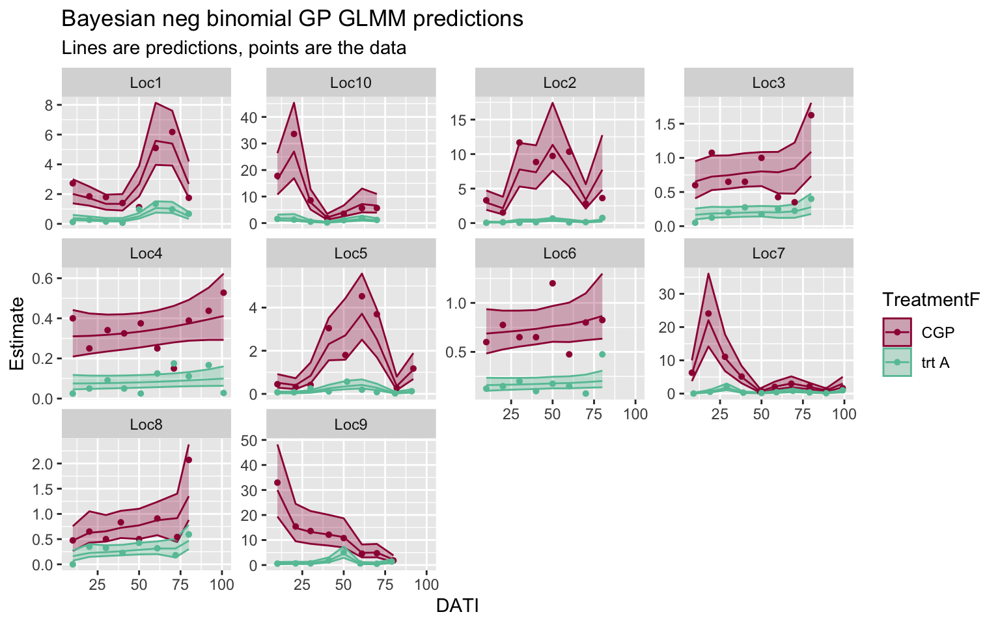

## Summary of estimates

### Compare TR estimates

Here, the trapping reduction estimates from all of the models are compared. As expected, the median TR estimates are very close from model to model, but the uncertainty in that estimate increase (i.e., the confidence/credible intervals get wider) when we properly account for the correlations in our data.

<table class="table table-striped table-hover table-condensed" style="margin-left: auto; margin-right: auto;">
<caption>(\#tab:compareTR)(\#tab:compareTR)Comparison of derived TR estimates from each model fit.</caption>
 <thead>
  <tr>
   <th style="text-align:left;"> Framework </th>
   <th style="text-align:left;"> Distribution </th>
   <th style="text-align:left;"> Model_name </th>
   <th style="text-align:right;"> TR </th>
   <th style="text-align:right;"> lowerCI </th>
   <th style="text-align:right;"> upperCI </th>
  </tr>
 </thead>
<tbody>
  <tr grouplength="3"><td colspan="6" style="border-bottom: 1px solid;"><strong>GLM</strong></td></tr>
<tr>
   <td style="text-align:left;padding-left: 2em;" indentlevel="1"> Frequentist </td>
   <td style="text-align:left;"> Poisson </td>
   <td style="text-align:left;"> GLM </td>
   <td style="text-align:right;"> 88 </td>
   <td style="text-align:right;"> 88 </td>
   <td style="text-align:right;"> 89 </td>
  </tr>
  <tr>
   <td style="text-align:left;padding-left: 2em;" indentlevel="1"> Frequentist </td>
   <td style="text-align:left;"> Neg Binomial </td>
   <td style="text-align:left;"> GLM </td>
   <td style="text-align:right;"> 88 </td>
   <td style="text-align:right;"> 86 </td>
   <td style="text-align:right;"> 90 </td>
  </tr>
  <tr>
   <td style="text-align:left;padding-left: 2em;" indentlevel="1"> Bayesian </td>
   <td style="text-align:left;"> Neg Binomial </td>
   <td style="text-align:left;"> GLM </td>
   <td style="text-align:right;"> 88 </td>
   <td style="text-align:right;"> 86 </td>
   <td style="text-align:right;"> 90 </td>
  </tr>
  <tr grouplength="3"><td colspan="6" style="border-bottom: 1px solid;"><strong>GLMM (Location)</strong></td></tr>
<tr>
   <td style="text-align:left;padding-left: 2em;" indentlevel="1"> Frequentist </td>
   <td style="text-align:left;"> Poisson </td>
   <td style="text-align:left;"> GLMM (Location) </td>
   <td style="text-align:right;"> 85 </td>
   <td style="text-align:right;"> 77 </td>
   <td style="text-align:right;"> 90 </td>
  </tr>
  <tr>
   <td style="text-align:left;padding-left: 2em;" indentlevel="1"> Frequentist </td>
   <td style="text-align:left;"> Neg Binomial </td>
   <td style="text-align:left;"> GLMM (Location) </td>
   <td style="text-align:right;"> 85 </td>
   <td style="text-align:right;"> 78 </td>
   <td style="text-align:right;"> 90 </td>
  </tr>
  <tr>
   <td style="text-align:left;padding-left: 2em;" indentlevel="1"> Bayesian </td>
   <td style="text-align:left;"> Neg Binomial </td>
   <td style="text-align:left;"> GLMM (Location) </td>
   <td style="text-align:right;"> 85 </td>
   <td style="text-align:right;"> 76 </td>
   <td style="text-align:right;"> 90 </td>
  </tr>
  <tr grouplength="3"><td colspan="6" style="border-bottom: 1px solid;"><strong>GLMM (Location, Date)</strong></td></tr>
<tr>
   <td style="text-align:left;padding-left: 2em;" indentlevel="1"> Frequentist </td>
   <td style="text-align:left;"> Poisson </td>
   <td style="text-align:left;"> GLMM (Location, nested Date) </td>
   <td style="text-align:right;"> 85 </td>
   <td style="text-align:right;"> 78 </td>
   <td style="text-align:right;"> 90 </td>
  </tr>
  <tr>
   <td style="text-align:left;padding-left: 2em;" indentlevel="1"> Frequentist </td>
   <td style="text-align:left;"> Neg Binomial </td>
   <td style="text-align:left;"> GLMM (Location, nested Date) </td>
   <td style="text-align:right;"> 86 </td>
   <td style="text-align:right;"> 77 </td>
   <td style="text-align:right;"> 91 </td>
  </tr>
  <tr>
   <td style="text-align:left;padding-left: 2em;" indentlevel="1"> Bayesian </td>
   <td style="text-align:left;"> Neg Binomial </td>
   <td style="text-align:left;"> GLMM (Location, nested Date) </td>
   <td style="text-align:right;"> 83 </td>
   <td style="text-align:right;"> 72 </td>
   <td style="text-align:right;"> 89 </td>
  </tr>
  <tr grouplength="1"><td colspan="6" style="border-bottom: 1px solid;"><strong>GLMM (Location, GP)</strong></td></tr>
<tr>
   <td style="text-align:left;padding-left: 2em;" indentlevel="1"> Bayesian </td>
   <td style="text-align:left;"> Neg Binomial </td>
   <td style="text-align:left;"> GLMM (Location, Gaussian Process Date) </td>
   <td style="text-align:right;"> 83 </td>
   <td style="text-align:right;"> 73 </td>
   <td style="text-align:right;"> 89 </td>
  </tr>
</tbody>
</table>

### Compare coefficients

Because TR is a non-linear function of $\beta_1$, the differences int he model output get slightly distorted from the transformation. Thereofre, the $\beta_1$ coefficients are displayed as well:

<table class="table table-striped table-hover table-condensed" style="margin-left: auto; margin-right: auto;">
<caption>(\#tab:compareBetas)(\#tab:compareBetas)Comparison of regression coefficient estimates from each model fit.</caption>
 <thead>
  <tr>
   <th style="text-align:left;"> Framework </th>
   <th style="text-align:left;"> Distribution </th>
   <th style="text-align:left;"> Model_name </th>
   <th style="text-align:right;"> Estimate </th>
   <th style="text-align:right;"> SE </th>
  </tr>
 </thead>
<tbody>
  <tr grouplength="3"><td colspan="5" style="border-bottom: 1px solid;"><strong>GLM</strong></td></tr>
<tr>
   <td style="text-align:left;padding-left: 2em;" indentlevel="1"> Frequentist </td>
   <td style="text-align:left;"> Poisson </td>
   <td style="text-align:left;"> GLM </td>
   <td style="text-align:right;"> -2.17 </td>
   <td style="text-align:right;"> 0.027 </td>
  </tr>
  <tr>
   <td style="text-align:left;padding-left: 2em;" indentlevel="1"> Frequentist </td>
   <td style="text-align:left;"> Neg Binomial </td>
   <td style="text-align:left;"> GLM </td>
   <td style="text-align:right;"> -2.16 </td>
   <td style="text-align:right;"> 0.099 </td>
  </tr>
  <tr>
   <td style="text-align:left;padding-left: 2em;" indentlevel="1"> Bayesian </td>
   <td style="text-align:left;"> Neg Binomial </td>
   <td style="text-align:left;"> GLM </td>
   <td style="text-align:right;"> -2.16 </td>
   <td style="text-align:right;"> 0.100 </td>
  </tr>
  <tr grouplength="3"><td colspan="5" style="border-bottom: 1px solid;"><strong>GLMM (Location)</strong></td></tr>
<tr>
   <td style="text-align:left;padding-left: 2em;" indentlevel="1"> Frequentist </td>
   <td style="text-align:left;"> Poisson </td>
   <td style="text-align:left;"> GLMM (Location) </td>
   <td style="text-align:right;"> -1.89 </td>
   <td style="text-align:right;"> 0.205 </td>
  </tr>
  <tr>
   <td style="text-align:left;padding-left: 2em;" indentlevel="1"> Frequentist </td>
   <td style="text-align:left;"> Neg Binomial </td>
   <td style="text-align:left;"> GLMM (Location) </td>
   <td style="text-align:right;"> -1.90 </td>
   <td style="text-align:right;"> 0.203 </td>
  </tr>
  <tr>
   <td style="text-align:left;padding-left: 2em;" indentlevel="1"> Bayesian </td>
   <td style="text-align:left;"> Neg Binomial </td>
   <td style="text-align:left;"> GLMM (Location) </td>
   <td style="text-align:right;"> -1.88 </td>
   <td style="text-align:right;"> 0.229 </td>
  </tr>
  <tr grouplength="3"><td colspan="5" style="border-bottom: 1px solid;"><strong>GLMM (Location, Date)</strong></td></tr>
<tr>
   <td style="text-align:left;padding-left: 2em;" indentlevel="1"> Frequentist </td>
   <td style="text-align:left;"> Poisson </td>
   <td style="text-align:left;"> GLMM (Location, nested Date) </td>
   <td style="text-align:right;"> -1.91 </td>
   <td style="text-align:right;"> 0.197 </td>
  </tr>
  <tr>
   <td style="text-align:left;padding-left: 2em;" indentlevel="1"> Frequentist </td>
   <td style="text-align:left;"> Neg Binomial </td>
   <td style="text-align:left;"> GLMM (Location, nested Date) </td>
   <td style="text-align:right;"> -1.93 </td>
   <td style="text-align:right;"> 0.228 </td>
  </tr>
  <tr>
   <td style="text-align:left;padding-left: 2em;" indentlevel="1"> Bayesian </td>
   <td style="text-align:left;"> Neg Binomial </td>
   <td style="text-align:left;"> GLMM (Location, nested Date) </td>
   <td style="text-align:right;"> -1.75 </td>
   <td style="text-align:right;"> 0.229 </td>
  </tr>
  <tr grouplength="1"><td colspan="5" style="border-bottom: 1px solid;"><strong>GLMM (Location, GP)</strong></td></tr>
<tr>
   <td style="text-align:left;padding-left: 2em;" indentlevel="1"> Bayesian </td>
   <td style="text-align:left;"> Neg Binomial </td>
   <td style="text-align:left;"> GLMM (Location, Gaussian Process Date) </td>
   <td style="text-align:right;"> -1.78 </td>
   <td style="text-align:right;"> 0.239 </td>
  </tr>
</tbody>
</table>


### Plot comparisons

#### GLM's

In the side-by-side comparison, you can see the wider confidence intervals for the negative binomial distribution, compared to the Poisson.

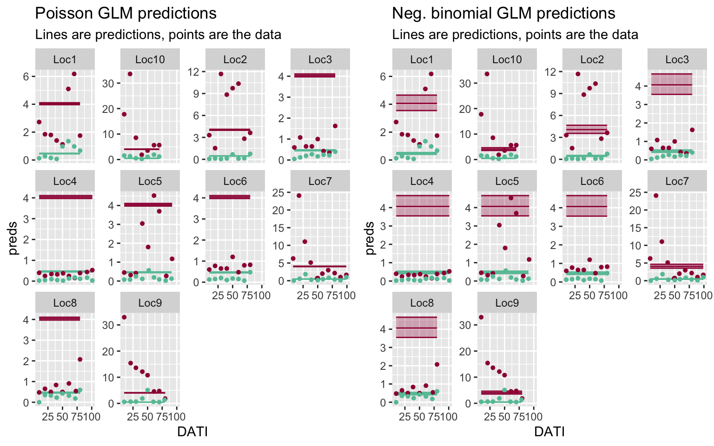

Side-by-side comparison of the frequentist vs Bayes negative binomial GLM predictions.

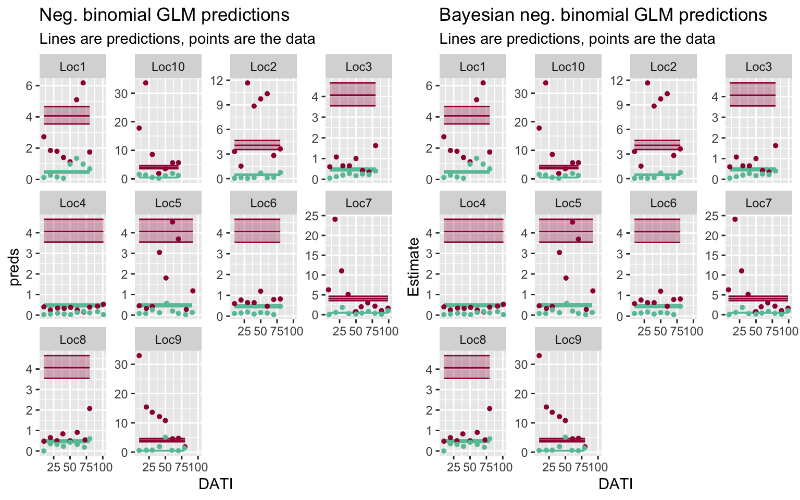

#### GLMM's (Location RE)

Side-by-side comparison of the frequentist Poisson vs negative  binomial GLMM (Location RE) predictions.

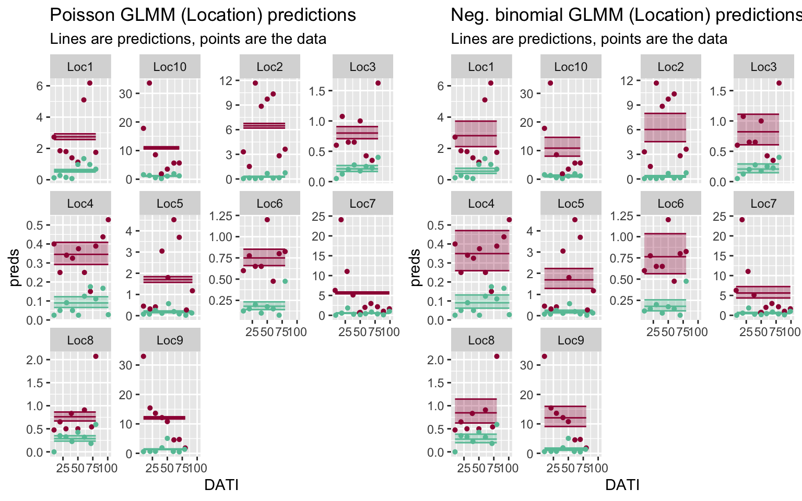

Side-by-side comparison of the frequentist vs Bayes negative binomial GLMM (Location RE) predictions.

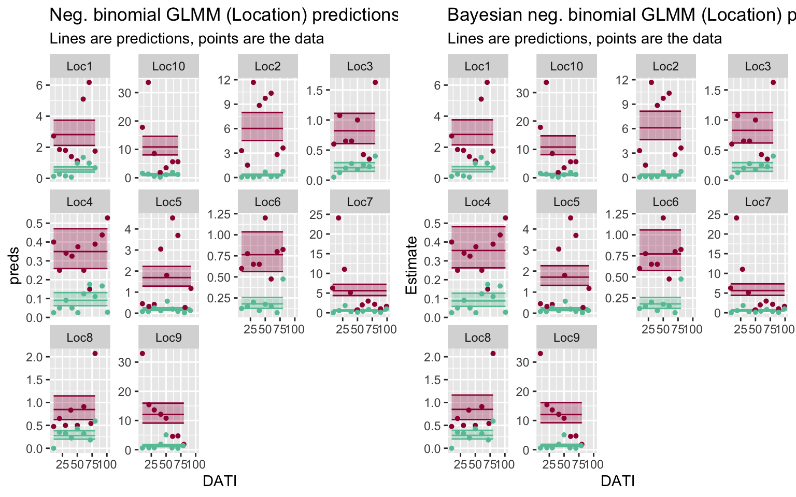


#### GLMM's (Location RE, nested Date)

Note: These models are a great fit to the data that we have! But, they are overly confident and will not be good at predicting at new locations and new sampling dates.

Side-by-side comparison of the frequentist Poisson vs negative  binomial GLMM (Location RE) predictions.

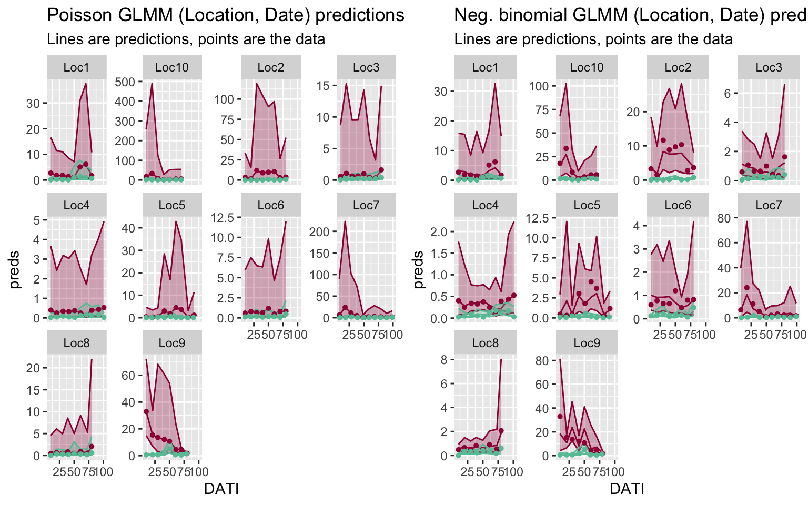

Side-by-side comparison of the frequentist vs Bayes negative binomial GLMM (Location RE) predictions.

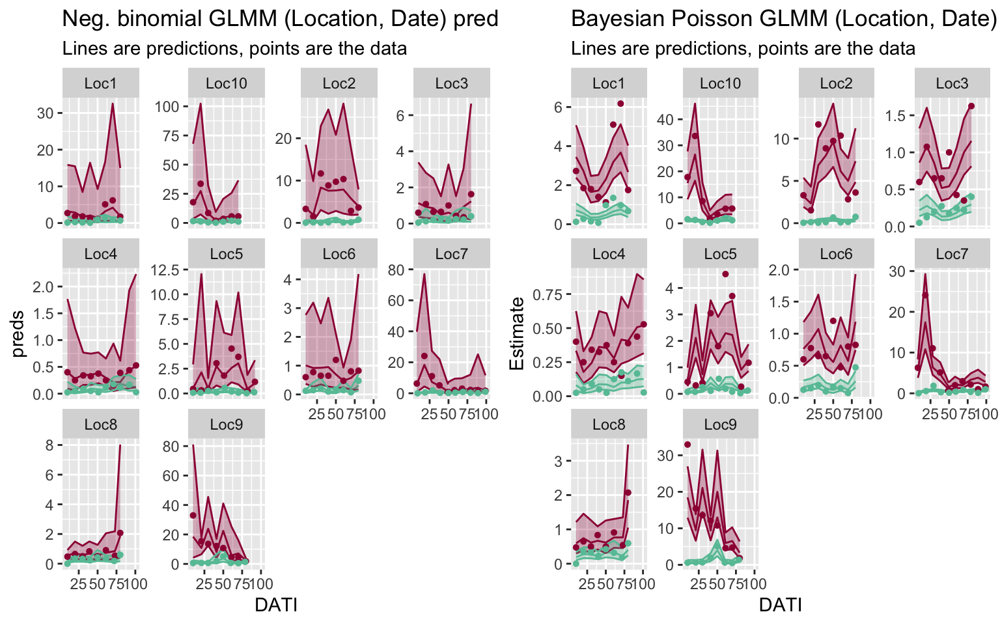


#### GLMM's: nested Date vs Gaussian Process Date

Once we properly account for the correlations in our sampling dates, we have much more uncertainty in our overall TR predictions (see table above) , and the predicted counts are "smoothed" over time for some of the locations.

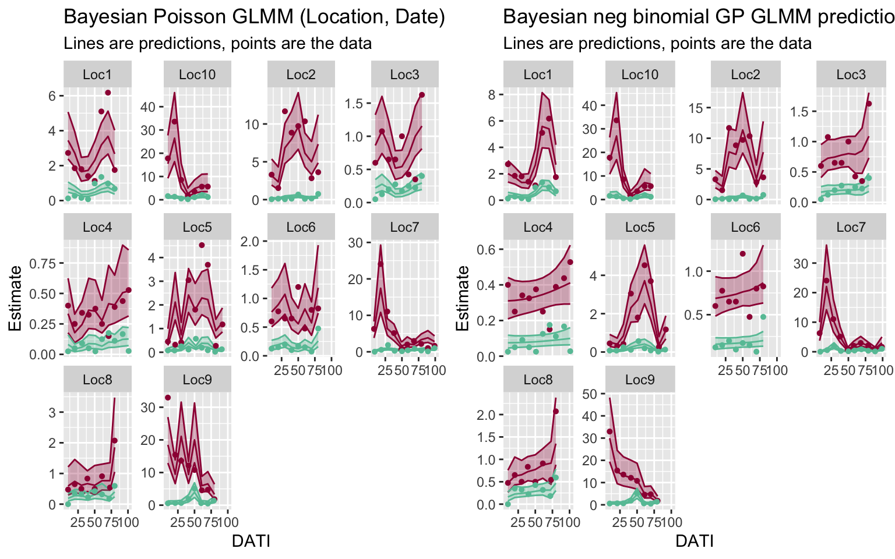

