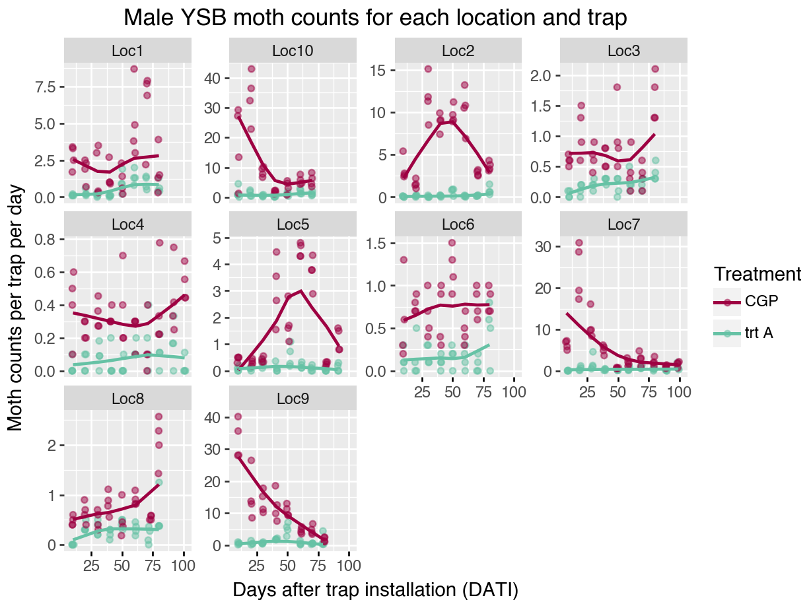
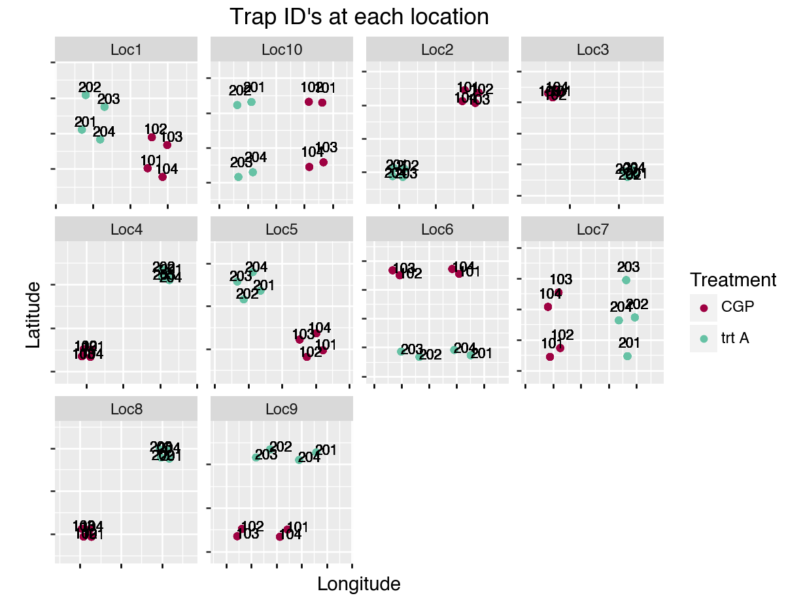
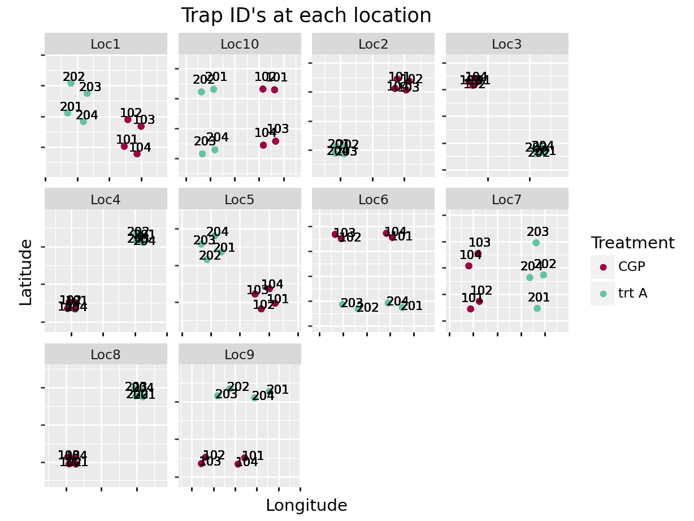
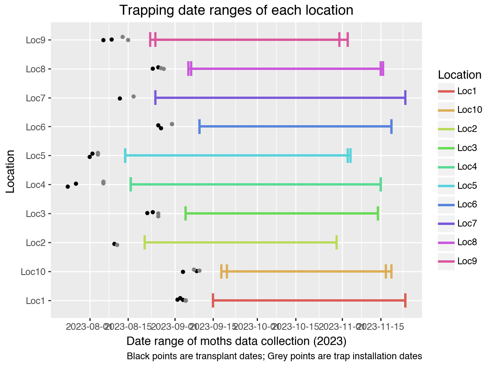
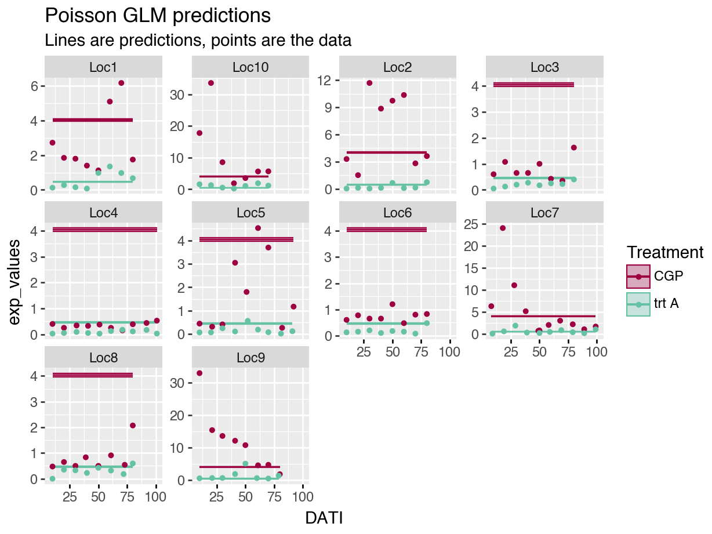
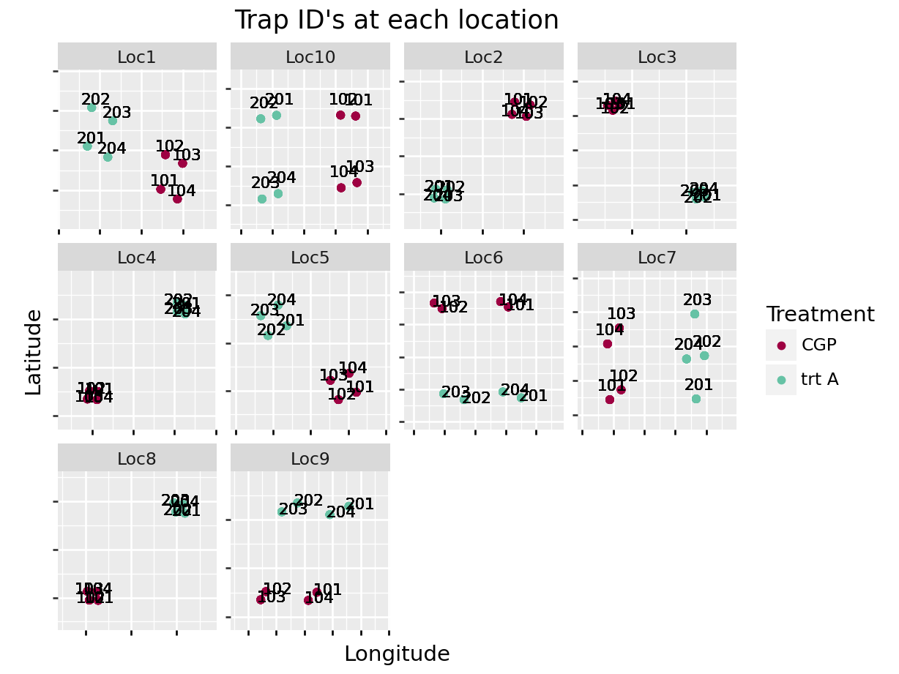
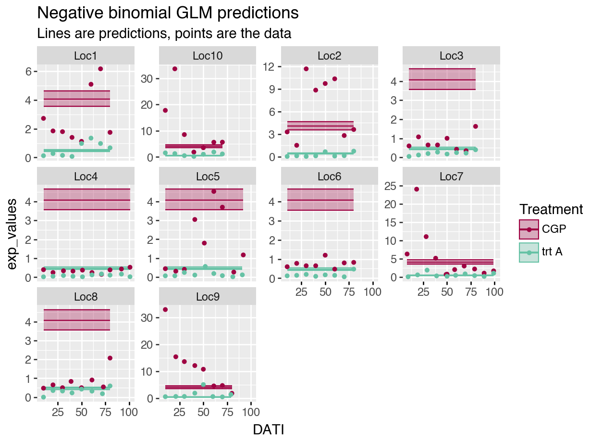
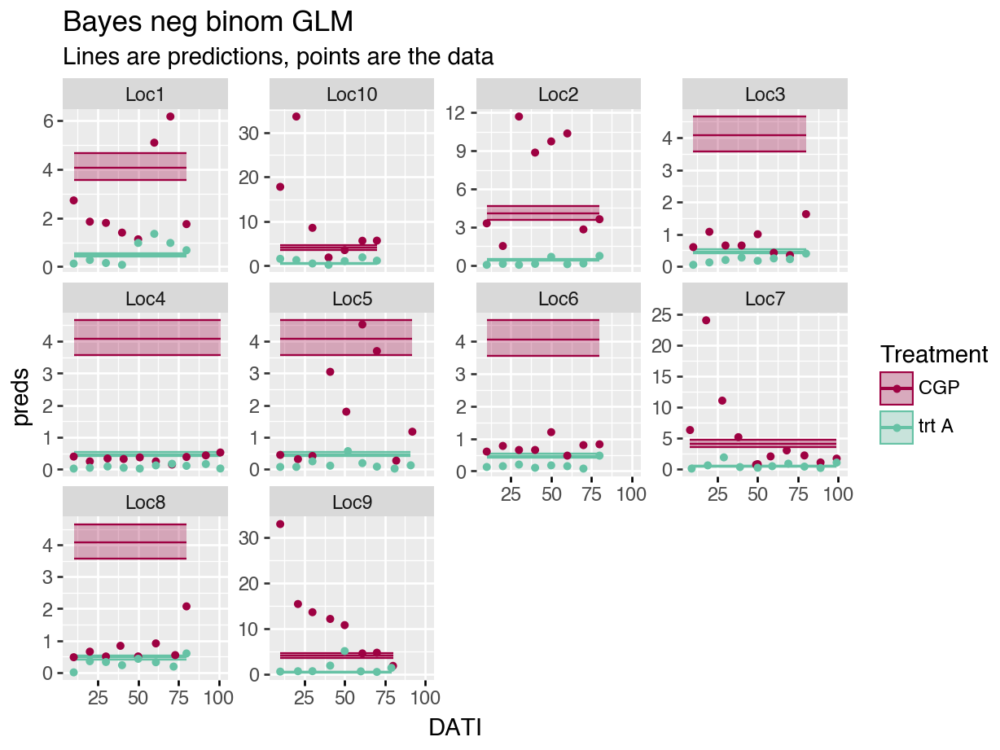
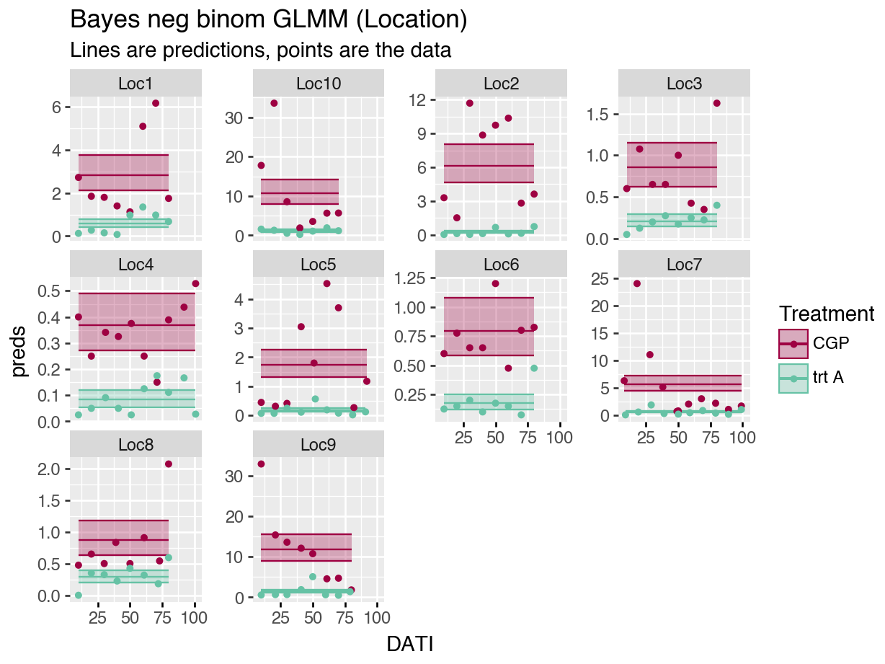
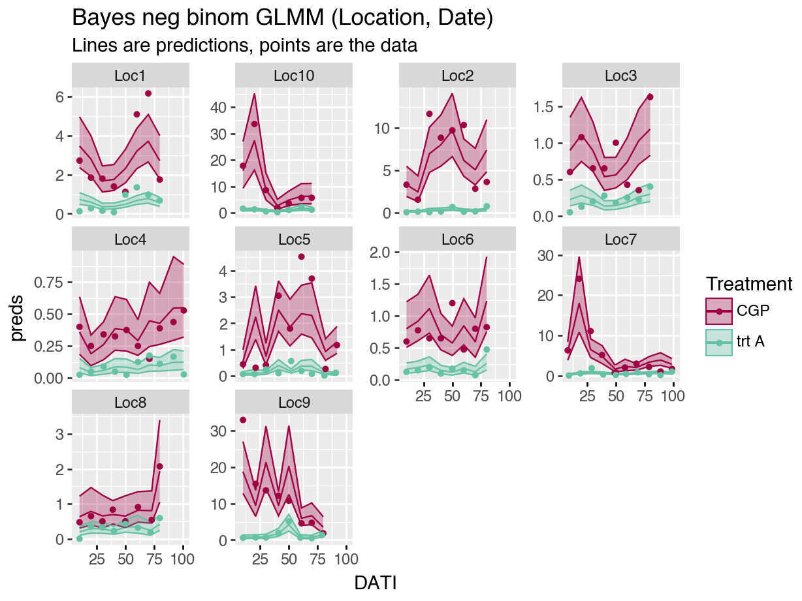

# GLMM's in Python {#GLMMsPython}


## Getting started with Python

Python is a lot more complicated than R!

1. Download Python.

2. Decide how you want to interact with Python. Yes, you can technically use the terminal and use Python directly, but a GUI is preferable so that it is easier to run the code, add comments, view the output, etc. This is even more true for Python than it is for R. 

Originally, I downloaded Jupyter Notebook directly, but I didn't like the way things loaded. So, I downloaded "Anaconda" and then accessed Jupyter from there. However, I still don't love Jupyter-- the notebooks don't optimize the screen's size like RStudio does. In RStudio, I love having my code on one side of the screen, and my outputs on the other. Screens are wide, not long. 

Soon, I came across the "reticulate" package, which allows for Python coding in an Rmarkdown script! So far, awesome and it is how I run the all the analyses. Here, I switch between R and Python code chunks, but the package also allows objects to be used within both languages. Pretty cool.

To interact with Python via RMarkdowns in RStudio, check out the "reticulate" package website to get started: 

R Markdown Python Engine (aka the "reticulate" package):
https://rstudio.github.io/reticulate/articles/r_markdown.html


3. Set up a Python environment for your work.  Here is why that is important:

Python environments:
"When installing Python packages it’s best practice to isolate them within a Python environment (a named Python installation that exists for a specific project or purpose). This provides a measure of isolation, so that updating a Python package for one project doesn’t impact other projects. The risk for package incompatibilities is significantly higher with Python packages than it is with R packages, because unlike CRAN, PyPI does not enforce, or even check, if the current versions of packages currently available are compatible."
https://rstudio.github.io/reticulate/articles/python_packages.html

(Anaconda and reticulate both help the user keep specific environments for each Python "project" that one may be working on.)

Here is another helpful link:

Primer on Python for R users:
https://rstudio.github.io/reticulate/articles/python_primer.html


```
## virtualenv: r-reticulate-BayesInPython
```


### Python modules

Python libraries or packages are called _modules_. To use them with reticulate, you first have to import them. The lines in the code chunk below must be called exactly once each for each new python module used; it does not need to re-run.


## Set up

When completing an analysis, I may skip around in my script quite a bit. Therefore, I like all packages loaded, and all data uploaded and manipulated at the start of my script.

## Outline

* Introduce the data to be used throughout the tutorial.

* Fit generalized linear models (GLMs, here Poisson and negative binomial regressions). Models are fit in both frequentist and Bayesian frameworks to lay the groundwork for the more complicated models.

* Fit generalized linear models with random effects (GLMMs) to allow for correlations in space and time. Models are fit in both frequentist and Bayesian frameworks.

## Data Exploration

### Moth counts

Here is what the data look like. Columns: Location, Treatment, TrapID, Longitude, Latitude, AssessmentNumber, and SamplingDate should be self-explanatory... TransplantDate is the date that the rice seedlings were transplanted into the field; DispInstallDate is the treatment installation date; TrapInstallDate is the trap installation date; "nYSB" are the moth counts (number of YSB moths); DaysOfCatch is the number of days since the trap was previously sampled  or the number of days since trap installation if it is assessment number 1; DATI is days after trap installation; DADI is days after dispenser installation; and DAT is days after transplant. Some of these columns will be discussed more later.


The data are the moth counts collected at each trap (average per day), within each location and throughout the season. Note how the y-axis changes for each plot in the figure.



### Trap locations

Trial locations in relation to each other. Some trial locations are closer to each other than others.


Within each location, the treatment traps have a slightly different alignment:




### Timeline



Note that not all traps are installed on exactly the same day; not all locations have rice transplanted on exactly the same day; and not all traps are sampled on exactly the same day.

## Basic GLM models

To start, we ignore all the spatial and temporal relationships in the data and assume each data point is independent and identically distributed (iid). **This is not a good model for the data!** It is just our starting off point.

When building hierarchical Bayesian models, it is always a good idea to start simple, make sure everything works as expected, and then build up.

### Mathematical model

Our response variable is a count, therefore we use either a Poisson or negative binomial distribution as the basis for our model. These models are known as generalized linear models (GLMs).
 
The model must also include an offset to account for the varying time intervals between sample. (If the traps are left unchecked for more days, we naturally expect the trap to have more moths. This varying effort is accounted for by the offset.)

#### Poisson regression model

We start with a poisson version of our regression model:

$$
y_i \sim Pois(\lambda_i) \\
log(\lambda_i ) = \beta_0 + \beta_1 x_{A,i} + \mbox{ln} \left(DaysOfCatch_i\right)
$$

where, for data samples $i = 1, ..., N$, 

$y_i$ is moth count $i$,

$\lambda_i$ is the expected moth count for sample $i$,

$\beta_0$ is the intercept of the model. Here, it is the basis for the expected moth count for our control treatment.

$\beta_1$ is the expected difference in moth counts between the control group and the treatment A group, 

$x_{i}$ is an indicator variable that equals 1 if sample $i$ is from a treatment A field and equals 0 otherwise, and

$\left(DaysOfCatch_i\right)$ is the offset to account for the varying time interval between samples. This is necessary because with a longer time interval, more moths will fly into the trap.

#### Negative binomial regression model

In ecology, there is always additional variability in our data than what the Poisson distribution allows. To account for the additional variability in our model, we switch to a negative binomial distribution:

$$
y_i \sim NegBinom(\lambda_i, \phi) \\
log(\lambda_i ) = \beta_0 + \beta_1 x_{i} + \mbox{ln} \left(DaysOfCatch_i\right)
$$

"Negative binomial regression is used to model count data for which the variance is higher than the mean." (https://www.pymc.io/projects/examples/en/latest/generalized_linear_models/GLM-negative-binomial-regression.html)

For the negative binomial regression, all variables and parameters are defined as before, but the model has an additional parameter, $\phi$, that allows for the additional variation. The negative binomial distribution and regression model can be written in many ways. In our models, $\phi$ is defined through the following formula where the variance associated with an expected moth count, $\lambda$, is:

$$
Var(\lambda) = \lambda + \phi \cdot\lambda^2
$$

(For a Poisson distribution, $Var(\lambda) = \lambda$.)

#### Bayesian mathematical model

I also fit these models using a Bayesian framework, again to build our foundation for the more complex models that come later.

For the Bayesian models, I only show the more complex negative binomial version.

To make our models Bayesian, we add priors to our parameters:

$$
y_i \sim NegBinom(\lambda_i, \phi) \\
log(\lambda_i ) = \beta_0 + \beta_1 x_{A,i} + \mbox{ln} \left(DaysOfCatch_i\right) \\
\beta_0 \sim Normal(0, 2) \\
\beta_1 \sim Normal(0, 2) \\
\phi \sim HalfCauchy(0,1)
$$

The models use slightly informative priors. When working on a log-scale (e.g., with Poisson or negative binomial distributions), this often becomes essential to avoid parameter estimates on the boundaries. (See Hooten and Hobbs for a good discussion on this issue.)

#### Trapping reduction defined

The primary metric of interest from these models is a derived parameter that we call trapping reduction (TR):

$$
TR = 100 - 100 e ^{(-\beta_1)}
$$

To obtain a 95% confidence interval for TR (for the frequentist version of our model), we use the following approximation:

$$
TR = 100 - 100 e ^{(-\beta_1 \pm 2 \cdot SE(\beta_1))}
$$

For the Bayesian version, the derived parameter is sampled as part of the MCMC iterations, and the 95% credible interval is the 2.5%, 97.5% quantiles of its resulting distribution.

### Fitting the frequentist models

Note: when I predict for new data, I set DaysOfCatch = 1, and then I compare to the moths per day variable (mothsperday = nYSB / DaysOfCatch). I want to exclude any patterns related to the varying time intervals.

These models show a very tight confidence intervals for our predictions. But also, the residual deviance is MUCH greater than the degree of freedom, indicating a lack of fit. The plot of the predictions overlaid on the data also demonstrate the lack of fit.

These models are fit using the 'statsmodels' module because of its parallel syntax to R.


```
##                  Generalized Linear Model Regression Results                  
## ==============================================================================
## Dep. Variable:                   nYSB   No. Observations:                  672
## Model:                            GLM   Df Residuals:                      670
## Model Family:                 Poisson   Df Model:                            1
## Link Function:                    Log   Scale:                          1.0000
## Method:                          IRLS   Log-Likelihood:                -14034.
## Date:                Thu, 22 May 2025   Deviance:                       25678.
## Time:                        14:49:16   Pearson chi2:                 4.24e+04
## No. Iterations:                     6   Pseudo R-squ. (CS):              1.000
## Covariance Type:            nonrobust                                         
## ======================================================================================
##                          coef    std err          z      P>|z|      [0.025      0.975]
## --------------------------------------------------------------------------------------
## Intercept              1.3960      0.009    162.829      0.000       1.379       1.413
## Treatment[T.trt A]    -2.1665      0.027    -80.933      0.000      -2.219      -2.114
## ======================================================================================
```

```
##     TR  lowerCI  upperCI
## 0  100      100      100
```

```
##         predicted          se    ci_lower    ci_upper
## count  672.000000  672.000000  672.000000  672.000000
## mean     0.312790    0.016966    0.279536    0.346043
## std      1.084062    0.008399    1.100524    1.067600
## min     -0.770465    0.008574   -0.820168   -0.720762
## 25%     -0.770465    0.008574   -0.820168   -0.720762
## 50%      0.312790    0.016966    0.279536    0.346043
## 75%      1.396045    0.025359    1.379241    1.412849
## max      1.396045    0.025359    1.379241    1.412849
```




The model is such a bad fit to the data, it is hard to even tell what is going on in the plot above.

For the negative binomial model, our confidence intervals are a little wider, but we are still ignoring all the correlations in our data. And the plot of the predictions again indicates the lack of fit.


```
## Optimization terminated successfully.
##          Current function value: 3.629123
##          Iterations: 10
##          Function evaluations: 11
##          Gradient evaluations: 11
```

```
##                      NegativeBinomial Regression Results                      
## ==============================================================================
## Dep. Variable:                   nYSB   No. Observations:                  672
## Model:               NegativeBinomial   Df Residuals:                      670
## Method:                           MLE   Df Model:                            1
## Date:                Thu, 22 May 2025   Pseudo R-squ.:                 0.06445
## Time:                        14:49:24   Log-Likelihood:                -2438.8
## converged:                       True   LL-Null:                       -2606.8
## Covariance Type:            nonrobust   LLR p-value:                 4.739e-75
## ======================================================================================
##                          coef    std err          z      P>|z|      [0.025      0.975]
## --------------------------------------------------------------------------------------
## Intercept              1.4023      0.068     20.651      0.000       1.269       1.535
## Treatment[T.trt A]    -2.1636      0.099    -21.863      0.000      -2.358      -1.970
## alpha                  1.5244      0.082     18.628      0.000       1.364       1.685
## ======================================================================================
```

```
##     TR  lowerCI  upperCI
## 0  100      100      100
```

```
##         predicted          se    ci_lower    ci_upper
## count  672.000000  672.000000  672.000000  672.000000
## mean     0.320438    0.069947    0.183344    0.457531
## std      1.082628    0.002045    1.086637    1.078620
## min     -0.761384    0.067903   -0.902484   -0.620285
## 25%     -0.761384    0.067903   -0.902484   -0.620285
## 50%      0.320438    0.069947    0.183344    0.457531
## 75%      1.402260    0.071991    1.269172    1.535348
## max      1.402260    0.071991    1.269172    1.535348
```



### Bayesian (bambi) models-- Python

"Bambi" is the Python module that is *very* similar to "brms" package in R. I'm pretty sure the defaults use different algorithms though (which may affect your results), so be sure to read up on the details of both!

Because the models take a few minutes to fit, I usually fit them when I am initially running through my code, save them, and then only load the model fit when rendering the Rmarkdown file and creating the resulting figures.

The prior_summary command is helpful if you do not know what a parameter is called in 'brms'. Here, I used the command to find out what they called their $\phi$ parameter. (They call it the shape parameter.)

"Bambi" created InferenceData objects. Read the reference guide-- it is very helpful!
https://python.arviz.org/en/latest/getting_started/WorkingWithInferenceData.html#


```
##                    mean     sd  hdi_3%  hdi_97%  mcse_mean  mcse_sd  ess_bulk  \
## alpha             0.656  0.035   0.588    0.721      0.000    0.000   17917.0   
## Intercept         1.402  0.067   1.276    1.530      0.000    0.001   18638.0   
## Treatment[trt A] -2.159  0.099  -2.343   -1.974      0.001    0.001   17245.0   
## 
##                   ess_tail  r_hat  
## alpha               8766.0    1.0  
## Intercept           9286.0    1.0  
## Treatment[trt A]   10039.0    1.0
```

```
## 0.025    86.0
## 0.500    88.0
## 0.975    90.0
## Name: trtA, dtype: float64
```

```{=html}
<div><svg style="position: absolute; width: 0; height: 0; overflow: hidden">
<defs>
<symbol id="icon-database" viewBox="0 0 32 32">
<path d="M16 0c-8.837 0-16 2.239-16 5v4c0 2.761 7.163 5 16 5s16-2.239 16-5v-4c0-2.761-7.163-5-16-5z"></path>
<path d="M16 17c-8.837 0-16-2.239-16-5v6c0 2.761 7.163 5 16 5s16-2.239 16-5v-6c0 2.761-7.163 5-16 5z"></path>
<path d="M16 26c-8.837 0-16-2.239-16-5v6c0 2.761 7.163 5 16 5s16-2.239 16-5v-6c0 2.761-7.163 5-16 5z"></path>
</symbol>
<symbol id="icon-file-text2" viewBox="0 0 32 32">
<path d="M28.681 7.159c-0.694-0.947-1.662-2.053-2.724-3.116s-2.169-2.030-3.116-2.724c-1.612-1.182-2.393-1.319-2.841-1.319h-15.5c-1.378 0-2.5 1.121-2.5 2.5v27c0 1.378 1.122 2.5 2.5 2.5h23c1.378 0 2.5-1.122 2.5-2.5v-19.5c0-0.448-0.137-1.23-1.319-2.841zM24.543 5.457c0.959 0.959 1.712 1.825 2.268 2.543h-4.811v-4.811c0.718 0.556 1.584 1.309 2.543 2.268zM28 29.5c0 0.271-0.229 0.5-0.5 0.5h-23c-0.271 0-0.5-0.229-0.5-0.5v-27c0-0.271 0.229-0.5 0.5-0.5 0 0 15.499-0 15.5 0v7c0 0.552 0.448 1 1 1h7v19.5z"></path>
<path d="M23 26h-14c-0.552 0-1-0.448-1-1s0.448-1 1-1h14c0.552 0 1 0.448 1 1s-0.448 1-1 1z"></path>
<path d="M23 22h-14c-0.552 0-1-0.448-1-1s0.448-1 1-1h14c0.552 0 1 0.448 1 1s-0.448 1-1 1z"></path>
<path d="M23 18h-14c-0.552 0-1-0.448-1-1s0.448-1 1-1h14c0.552 0 1 0.448 1 1s-0.448 1-1 1z"></path>
</symbol>
</defs>
</svg>
<style>/* CSS stylesheet for displaying xarray objects in jupyterlab.
 *
 */

:root {
  --xr-font-color0: var(--jp-content-font-color0, rgba(0, 0, 0, 1));
  --xr-font-color2: var(--jp-content-font-color2, rgba(0, 0, 0, 0.54));
  --xr-font-color3: var(--jp-content-font-color3, rgba(0, 0, 0, 0.38));
  --xr-border-color: var(--jp-border-color2, #e0e0e0);
  --xr-disabled-color: var(--jp-layout-color3, #bdbdbd);
  --xr-background-color: var(--jp-layout-color0, white);
  --xr-background-color-row-even: var(--jp-layout-color1, white);
  --xr-background-color-row-odd: var(--jp-layout-color2, #eeeeee);
}

html[theme="dark"],
html[data-theme="dark"],
body[data-theme="dark"],
body.vscode-dark {
  --xr-font-color0: rgba(255, 255, 255, 1);
  --xr-font-color2: rgba(255, 255, 255, 0.54);
  --xr-font-color3: rgba(255, 255, 255, 0.38);
  --xr-border-color: #1f1f1f;
  --xr-disabled-color: #515151;
  --xr-background-color: #111111;
  --xr-background-color-row-even: #111111;
  --xr-background-color-row-odd: #313131;
}

.xr-wrap {
  display: block !important;
  min-width: 300px;
  max-width: 700px;
}

.xr-text-repr-fallback {
  /* fallback to plain text repr when CSS is not injected (untrusted notebook) */
  display: none;
}

.xr-header {
  padding-top: 6px;
  padding-bottom: 6px;
  margin-bottom: 4px;
  border-bottom: solid 1px var(--xr-border-color);
}

.xr-header > div,
.xr-header > ul {
  display: inline;
  margin-top: 0;
  margin-bottom: 0;
}

.xr-obj-type,
.xr-array-name {
  margin-left: 2px;
  margin-right: 10px;
}

.xr-obj-type {
  color: var(--xr-font-color2);
}

.xr-sections {
  padding-left: 0 !important;
  display: grid;
  grid-template-columns: 150px auto auto 1fr 0 20px 0 20px;
}

.xr-section-item {
  display: contents;
}

.xr-section-item input {
  display: inline-block;
  opacity: 0;
  height: 0;
}

.xr-section-item input + label {
  color: var(--xr-disabled-color);
}

.xr-section-item input:enabled + label {
  cursor: pointer;
  color: var(--xr-font-color2);
}

.xr-section-item input:focus + label {
  border: 2px solid var(--xr-font-color0);
}

.xr-section-item input:enabled + label:hover {
  color: var(--xr-font-color0);
}

.xr-section-summary {
  grid-column: 1;
  color: var(--xr-font-color2);
  font-weight: 500;
}

.xr-section-summary > span {
  display: inline-block;
  padding-left: 0.5em;
}

.xr-section-summary-in:disabled + label {
  color: var(--xr-font-color2);
}

.xr-section-summary-in + label:before {
  display: inline-block;
  content: "►";
  font-size: 11px;
  width: 15px;
  text-align: center;
}

.xr-section-summary-in:disabled + label:before {
  color: var(--xr-disabled-color);
}

.xr-section-summary-in:checked + label:before {
  content: "▼";
}

.xr-section-summary-in:checked + label > span {
  display: none;
}

.xr-section-summary,
.xr-section-inline-details {
  padding-top: 4px;
  padding-bottom: 4px;
}

.xr-section-inline-details {
  grid-column: 2 / -1;
}

.xr-section-details {
  display: none;
  grid-column: 1 / -1;
  margin-bottom: 5px;
}

.xr-section-summary-in:checked ~ .xr-section-details {
  display: contents;
}

.xr-array-wrap {
  grid-column: 1 / -1;
  display: grid;
  grid-template-columns: 20px auto;
}

.xr-array-wrap > label {
  grid-column: 1;
  vertical-align: top;
}

.xr-preview {
  color: var(--xr-font-color3);
}

.xr-array-preview,
.xr-array-data {
  padding: 0 5px !important;
  grid-column: 2;
}

.xr-array-data,
.xr-array-in:checked ~ .xr-array-preview {
  display: none;
}

.xr-array-in:checked ~ .xr-array-data,
.xr-array-preview {
  display: inline-block;
}

.xr-dim-list {
  display: inline-block !important;
  list-style: none;
  padding: 0 !important;
  margin: 0;
}

.xr-dim-list li {
  display: inline-block;
  padding: 0;
  margin: 0;
}

.xr-dim-list:before {
  content: "(";
}

.xr-dim-list:after {
  content: ")";
}

.xr-dim-list li:not(:last-child):after {
  content: ",";
  padding-right: 5px;
}

.xr-has-index {
  font-weight: bold;
}

.xr-var-list,
.xr-var-item {
  display: contents;
}

.xr-var-item > div,
.xr-var-item label,
.xr-var-item > .xr-var-name span {
  background-color: var(--xr-background-color-row-even);
  margin-bottom: 0;
}

.xr-var-item > .xr-var-name:hover span {
  padding-right: 5px;
}

.xr-var-list > li:nth-child(odd) > div,
.xr-var-list > li:nth-child(odd) > label,
.xr-var-list > li:nth-child(odd) > .xr-var-name span {
  background-color: var(--xr-background-color-row-odd);
}

.xr-var-name {
  grid-column: 1;
}

.xr-var-dims {
  grid-column: 2;
}

.xr-var-dtype {
  grid-column: 3;
  text-align: right;
  color: var(--xr-font-color2);
}

.xr-var-preview {
  grid-column: 4;
}

.xr-index-preview {
  grid-column: 2 / 5;
  color: var(--xr-font-color2);
}

.xr-var-name,
.xr-var-dims,
.xr-var-dtype,
.xr-preview,
.xr-attrs dt {
  white-space: nowrap;
  overflow: hidden;
  text-overflow: ellipsis;
  padding-right: 10px;
}

.xr-var-name:hover,
.xr-var-dims:hover,
.xr-var-dtype:hover,
.xr-attrs dt:hover {
  overflow: visible;
  width: auto;
  z-index: 1;
}

.xr-var-attrs,
.xr-var-data,
.xr-index-data {
  display: none;
  background-color: var(--xr-background-color) !important;
  padding-bottom: 5px !important;
}

.xr-var-attrs-in:checked ~ .xr-var-attrs,
.xr-var-data-in:checked ~ .xr-var-data,
.xr-index-data-in:checked ~ .xr-index-data {
  display: block;
}

.xr-var-data > table {
  float: right;
}

.xr-var-name span,
.xr-var-data,
.xr-index-name div,
.xr-index-data,
.xr-attrs {
  padding-left: 25px !important;
}

.xr-attrs,
.xr-var-attrs,
.xr-var-data,
.xr-index-data {
  grid-column: 1 / -1;
}

dl.xr-attrs {
  padding: 0;
  margin: 0;
  display: grid;
  grid-template-columns: 125px auto;
}

.xr-attrs dt,
.xr-attrs dd {
  padding: 0;
  margin: 0;
  float: left;
  padding-right: 10px;
  width: auto;
}

.xr-attrs dt {
  font-weight: normal;
  grid-column: 1;
}

.xr-attrs dt:hover span {
  display: inline-block;
  background: var(--xr-background-color);
  padding-right: 10px;
}

.xr-attrs dd {
  grid-column: 2;
  white-space: pre-wrap;
  word-break: break-all;
}

.xr-icon-database,
.xr-icon-file-text2,
.xr-no-icon {
  display: inline-block;
  vertical-align: middle;
  width: 1em;
  height: 1.5em !important;
  stroke-width: 0;
  stroke: currentColor;
  fill: currentColor;
}
</style><pre class='xr-text-repr-fallback'>&lt;xarray.Dataset&gt; Size: 65MB
Dimensions:        (chain: 6, draw: 2000, Treatment_dim: 1, __obs__: 672)
Coordinates:
  * chain          (chain) int64 48B 0 1 2 3 4 5
  * draw           (draw) int64 16kB 0 1 2 3 4 5 ... 1995 1996 1997 1998 1999
  * Treatment_dim  (Treatment_dim) &lt;U5 20B &#x27;trt A&#x27;
  * __obs__        (__obs__) int64 5kB 0 1 2 3 4 5 6 ... 666 667 668 669 670 671
Data variables:
    alpha          (chain, draw) float64 96kB 0.6959 0.6361 ... 0.6491 0.691
    Intercept      (chain, draw) float64 96kB 1.245 1.477 1.368 ... 1.411 1.401
    Treatment      (chain, draw, Treatment_dim) float64 96kB -2.08 ... -2.131
    mu             (chain, draw, __obs__) float64 65MB 0.4342 0.4342 ... 4.058
Attributes:
    created_at:                  2025-05-21T19:44:29.234456+00:00
    arviz_version:               0.21.0
    inference_library:           pymc
    inference_library_version:   5.22.0
    sampling_time:               17.945131063461304
    tuning_steps:                500
    modeling_interface:          bambi
    modeling_interface_version:  0.15.0</pre><div class='xr-wrap' style='display:none'><div class='xr-header'><div class='xr-obj-type'>xarray.Dataset</div></div><ul class='xr-sections'><li class='xr-section-item'><input id='section-c07c2004-623d-4f22-8faa-900e0b670513' class='xr-section-summary-in' type='checkbox' disabled ><label for='section-c07c2004-623d-4f22-8faa-900e0b670513' class='xr-section-summary'  title='Expand/collapse section'>Dimensions:</label><div class='xr-section-inline-details'><ul class='xr-dim-list'><li><span class='xr-has-index'>chain</span>: 6</li><li><span class='xr-has-index'>draw</span>: 2000</li><li><span class='xr-has-index'>Treatment_dim</span>: 1</li><li><span class='xr-has-index'>__obs__</span>: 672</li></ul></div><div class='xr-section-details'></div></li><li class='xr-section-item'><input id='section-329926d6-f168-440d-8410-74368d1a1ebd' class='xr-section-summary-in' type='checkbox'  checked><label for='section-329926d6-f168-440d-8410-74368d1a1ebd' class='xr-section-summary' >Coordinates: <span>(4)</span></label><div class='xr-section-inline-details'></div><div class='xr-section-details'><ul class='xr-var-list'><li class='xr-var-item'><div class='xr-var-name'><span class='xr-has-index'>chain</span></div><div class='xr-var-dims'>(chain)</div><div class='xr-var-dtype'>int64</div><div class='xr-var-preview xr-preview'>0 1 2 3 4 5</div><input id='attrs-a1ae9ef8-b1f4-469c-9534-96e56489425b' class='xr-var-attrs-in' type='checkbox' disabled><label for='attrs-a1ae9ef8-b1f4-469c-9534-96e56489425b' title='Show/Hide attributes'><svg class='icon xr-icon-file-text2'><use xlink:href='#icon-file-text2'></use></svg></label><input id='data-9feaa83b-2787-4a79-89ba-3cc521d2f570' class='xr-var-data-in' type='checkbox'><label for='data-9feaa83b-2787-4a79-89ba-3cc521d2f570' title='Show/Hide data repr'><svg class='icon xr-icon-database'><use xlink:href='#icon-database'></use></svg></label><div class='xr-var-attrs'><dl class='xr-attrs'></dl></div><div class='xr-var-data'><pre>array([0, 1, 2, 3, 4, 5])</pre></div></li><li class='xr-var-item'><div class='xr-var-name'><span class='xr-has-index'>draw</span></div><div class='xr-var-dims'>(draw)</div><div class='xr-var-dtype'>int64</div><div class='xr-var-preview xr-preview'>0 1 2 3 4 ... 1996 1997 1998 1999</div><input id='attrs-c61f1877-7f0d-415b-ac90-3f7c2f93a09f' class='xr-var-attrs-in' type='checkbox' disabled><label for='attrs-c61f1877-7f0d-415b-ac90-3f7c2f93a09f' title='Show/Hide attributes'><svg class='icon xr-icon-file-text2'><use xlink:href='#icon-file-text2'></use></svg></label><input id='data-9ab82f88-58e0-4add-9713-22d582494bd7' class='xr-var-data-in' type='checkbox'><label for='data-9ab82f88-58e0-4add-9713-22d582494bd7' title='Show/Hide data repr'><svg class='icon xr-icon-database'><use xlink:href='#icon-database'></use></svg></label><div class='xr-var-attrs'><dl class='xr-attrs'></dl></div><div class='xr-var-data'><pre>array([   0,    1,    2, ..., 1997, 1998, 1999])</pre></div></li><li class='xr-var-item'><div class='xr-var-name'><span class='xr-has-index'>Treatment_dim</span></div><div class='xr-var-dims'>(Treatment_dim)</div><div class='xr-var-dtype'>&lt;U5</div><div class='xr-var-preview xr-preview'>&#x27;trt A&#x27;</div><input id='attrs-e6db0b83-b90e-4cdc-b604-24c71b0dc784' class='xr-var-attrs-in' type='checkbox' disabled><label for='attrs-e6db0b83-b90e-4cdc-b604-24c71b0dc784' title='Show/Hide attributes'><svg class='icon xr-icon-file-text2'><use xlink:href='#icon-file-text2'></use></svg></label><input id='data-c6e0ea38-e5f8-4f75-9154-4b96b22555da' class='xr-var-data-in' type='checkbox'><label for='data-c6e0ea38-e5f8-4f75-9154-4b96b22555da' title='Show/Hide data repr'><svg class='icon xr-icon-database'><use xlink:href='#icon-database'></use></svg></label><div class='xr-var-attrs'><dl class='xr-attrs'></dl></div><div class='xr-var-data'><pre>array([&#x27;trt A&#x27;], dtype=&#x27;&lt;U5&#x27;)</pre></div></li><li class='xr-var-item'><div class='xr-var-name'><span class='xr-has-index'>__obs__</span></div><div class='xr-var-dims'>(__obs__)</div><div class='xr-var-dtype'>int64</div><div class='xr-var-preview xr-preview'>0 1 2 3 4 5 ... 667 668 669 670 671</div><input id='attrs-a0647bc0-fb9b-4710-831c-4f38e21c8128' class='xr-var-attrs-in' type='checkbox' disabled><label for='attrs-a0647bc0-fb9b-4710-831c-4f38e21c8128' title='Show/Hide attributes'><svg class='icon xr-icon-file-text2'><use xlink:href='#icon-file-text2'></use></svg></label><input id='data-134c189e-9d40-489a-b310-bbd1d468a359' class='xr-var-data-in' type='checkbox'><label for='data-134c189e-9d40-489a-b310-bbd1d468a359' title='Show/Hide data repr'><svg class='icon xr-icon-database'><use xlink:href='#icon-database'></use></svg></label><div class='xr-var-attrs'><dl class='xr-attrs'></dl></div><div class='xr-var-data'><pre>array([  0,   1,   2, ..., 669, 670, 671])</pre></div></li></ul></div></li><li class='xr-section-item'><input id='section-d7e7ba2f-3ba3-483f-8545-321672f190c1' class='xr-section-summary-in' type='checkbox'  checked><label for='section-d7e7ba2f-3ba3-483f-8545-321672f190c1' class='xr-section-summary' >Data variables: <span>(4)</span></label><div class='xr-section-inline-details'></div><div class='xr-section-details'><ul class='xr-var-list'><li class='xr-var-item'><div class='xr-var-name'><span>alpha</span></div><div class='xr-var-dims'>(chain, draw)</div><div class='xr-var-dtype'>float64</div><div class='xr-var-preview xr-preview'>0.6959 0.6361 ... 0.6491 0.691</div><input id='attrs-20123336-7bbc-4d27-bab7-b93e4bf85759' class='xr-var-attrs-in' type='checkbox' disabled><label for='attrs-20123336-7bbc-4d27-bab7-b93e4bf85759' title='Show/Hide attributes'><svg class='icon xr-icon-file-text2'><use xlink:href='#icon-file-text2'></use></svg></label><input id='data-488bc3ff-5e4a-43d4-af38-ddee28e86fe3' class='xr-var-data-in' type='checkbox'><label for='data-488bc3ff-5e4a-43d4-af38-ddee28e86fe3' title='Show/Hide data repr'><svg class='icon xr-icon-database'><use xlink:href='#icon-database'></use></svg></label><div class='xr-var-attrs'><dl class='xr-attrs'></dl></div><div class='xr-var-data'><pre>array([[0.69592703, 0.63605533, 0.68620635, ..., 0.67095042, 0.62715063,
        0.63786114],
       [0.65986889, 0.61794149, 0.65993102, ..., 0.62901943, 0.62618106,
        0.65830356],
       [0.62161161, 0.70600395, 0.63201368, ..., 0.6519154 , 0.66680872,
        0.66680872],
       [0.62065139, 0.71446181, 0.65351111, ..., 0.62456883, 0.61325715,
        0.67524612],
       [0.607845  , 0.60197837, 0.62735625, ..., 0.62053682, 0.69257234,
        0.70191768],
       [0.56194368, 0.73219812, 0.63673422, ..., 0.64910599, 0.64910599,
        0.69098746]])</pre></div></li><li class='xr-var-item'><div class='xr-var-name'><span>Intercept</span></div><div class='xr-var-dims'>(chain, draw)</div><div class='xr-var-dtype'>float64</div><div class='xr-var-preview xr-preview'>1.245 1.477 1.368 ... 1.411 1.401</div><input id='attrs-9dda937f-d327-4a7c-add4-2a6538b4a661' class='xr-var-attrs-in' type='checkbox' disabled><label for='attrs-9dda937f-d327-4a7c-add4-2a6538b4a661' title='Show/Hide attributes'><svg class='icon xr-icon-file-text2'><use xlink:href='#icon-file-text2'></use></svg></label><input id='data-726bc770-e441-464c-bd93-b04f8800585b' class='xr-var-data-in' type='checkbox'><label for='data-726bc770-e441-464c-bd93-b04f8800585b' title='Show/Hide data repr'><svg class='icon xr-icon-database'><use xlink:href='#icon-database'></use></svg></label><div class='xr-var-attrs'><dl class='xr-attrs'></dl></div><div class='xr-var-data'><pre>array([[1.24536263, 1.47708429, 1.36814688, ..., 1.50729605, 1.29322517,
        1.47270335],
       [1.39617005, 1.37951911, 1.38522232, ..., 1.32313883, 1.41031622,
        1.37780825],
       [1.40453443, 1.37190486, 1.29319003, ..., 1.49329711, 1.39906769,
        1.39906769],
       [1.38311203, 1.35626315, 1.50519536, ..., 1.45597232, 1.47502733,
        1.34754421],
       [1.36842139, 1.3211883 , 1.53664426, ..., 1.43642213, 1.3891655 ,
        1.34097588],
       [1.41683807, 1.46274752, 1.34210863, ..., 1.41098516, 1.41098516,
        1.40057405]])</pre></div></li><li class='xr-var-item'><div class='xr-var-name'><span>Treatment</span></div><div class='xr-var-dims'>(chain, draw, Treatment_dim)</div><div class='xr-var-dtype'>float64</div><div class='xr-var-preview xr-preview'>-2.08 -2.272 ... -2.194 -2.131</div><input id='attrs-88ebb8a7-8d46-4873-9355-077d97603440' class='xr-var-attrs-in' type='checkbox' disabled><label for='attrs-88ebb8a7-8d46-4873-9355-077d97603440' title='Show/Hide attributes'><svg class='icon xr-icon-file-text2'><use xlink:href='#icon-file-text2'></use></svg></label><input id='data-a6877319-bdfe-45e3-8305-2d5fd3d87558' class='xr-var-data-in' type='checkbox'><label for='data-a6877319-bdfe-45e3-8305-2d5fd3d87558' title='Show/Hide data repr'><svg class='icon xr-icon-database'><use xlink:href='#icon-database'></use></svg></label><div class='xr-var-attrs'><dl class='xr-attrs'></dl></div><div class='xr-var-data'><pre>array([[[-2.07969894],
        [-2.27219906],
        [-2.1526889 ],
        ...,
        [-2.32295151],
        [-1.99334357],
        [-2.16817928]],

       [[-2.1346668 ],
        [-2.18258336],
        [-2.13445219],
        ...,
        [-2.12441016],
        [-2.14952773],
        [-2.18457415]],

       [[-2.17202482],
        [-2.15490867],
        [-2.02312125],
        ...,
...
        ...,
        [-2.14453903],
        [-2.17399693],
        [-2.0719257 ]],

       [[-2.00791929],
        [-2.16919599],
        [-2.36357041],
        ...,
        [-2.16563422],
        [-2.14923385],
        [-2.13845282]],

       [[-2.0974468 ],
        [-2.19203851],
        [-2.25314854],
        ...,
        [-2.1944862 ],
        [-2.1944862 ],
        [-2.13071552]]])</pre></div></li><li class='xr-var-item'><div class='xr-var-name'><span>mu</span></div><div class='xr-var-dims'>(chain, draw, __obs__)</div><div class='xr-var-dtype'>float64</div><div class='xr-var-preview xr-preview'>0.4342 0.4342 ... 4.058 4.058</div><input id='attrs-564be8b5-104e-4d61-a563-d04ba4f2ad5c' class='xr-var-attrs-in' type='checkbox' disabled><label for='attrs-564be8b5-104e-4d61-a563-d04ba4f2ad5c' title='Show/Hide attributes'><svg class='icon xr-icon-file-text2'><use xlink:href='#icon-file-text2'></use></svg></label><input id='data-76974f57-42ef-453c-a58f-ece8ad810f04' class='xr-var-data-in' type='checkbox'><label for='data-76974f57-42ef-453c-a58f-ece8ad810f04' title='Show/Hide data repr'><svg class='icon xr-icon-database'><use xlink:href='#icon-database'></use></svg></label><div class='xr-var-attrs'><dl class='xr-attrs'></dl></div><div class='xr-var-data'><pre>array([[[0.43416253, 0.43416253, 0.43416253, ..., 3.47419441,
         3.47419441, 3.47419441],
        [0.45152941, 0.45152941, 0.45152941, ..., 4.38015576,
         4.38015576, 4.38015576],
        [0.45632865, 0.45632865, 0.45632865, ..., 3.92806479,
         3.92806479, 3.92806479],
        ...,
        [0.44234929, 0.44234929, 0.44234929, ..., 4.51450727,
         4.51450727, 4.51450727],
        [0.49652651, 0.49652651, 0.49652651, ..., 3.64452181,
         3.64452181, 3.64452181],
        [0.49883698, 0.49883698, 0.49883698, ..., 4.36100857,
         4.36100857, 4.36100857]],

       [[0.47783168, 0.47783168, 0.47783168, ..., 4.03969846,
         4.03969846, 4.03969846],
        [0.44795421, 0.44795421, 0.44795421, ..., 3.97299058,
         3.97299058, 3.97299058],
        [0.47273048, 0.47273048, 0.47273048, ..., 3.99571412,
         3.99571412, 3.99571412],
...
        [0.48228885, 0.48228885, 0.48228885, ..., 4.20562172,
         4.20562172, 4.20562172],
        [0.46763447, 0.46763447, 0.46763447, ..., 4.01150106,
         4.01150106, 4.01150106],
        [0.45046408, 0.45046408, 0.45046408, ..., 3.82277224,
         3.82277224, 3.82277224]],

       [[0.50630869, 0.50630869, 0.50630869, ..., 4.12405982,
         4.12405982, 4.12405982],
        [0.48225079, 0.48225079, 0.48225079, ..., 4.3178065 ,
         4.3178065 , 4.3178065 ],
        [0.40210585, 0.40210585, 0.40210585, ..., 3.82710494,
         3.82710494, 3.82710494],
        ...,
        [0.45680392, 0.45680392, 0.45680392, ..., 4.09999256,
         4.09999256, 4.09999256],
        [0.45680392, 0.45680392, 0.45680392, ..., 4.09999256,
         4.09999256, 4.09999256],
        [0.48184082, 0.48184082, 0.48184082, ..., 4.0575285 ,
         4.0575285 , 4.0575285 ]]])</pre></div></li></ul></div></li><li class='xr-section-item'><input id='section-f7718221-9335-472d-8411-c7a60ac7bb9b' class='xr-section-summary-in' type='checkbox'  ><label for='section-f7718221-9335-472d-8411-c7a60ac7bb9b' class='xr-section-summary' >Indexes: <span>(4)</span></label><div class='xr-section-inline-details'></div><div class='xr-section-details'><ul class='xr-var-list'><li class='xr-var-item'><div class='xr-index-name'><div>chain</div></div><div class='xr-index-preview'>PandasIndex</div><input type='checkbox' disabled/><label></label><input id='index-fec32774-f893-431a-9289-b8b3da33893a' class='xr-index-data-in' type='checkbox'/><label for='index-fec32774-f893-431a-9289-b8b3da33893a' title='Show/Hide index repr'><svg class='icon xr-icon-database'><use xlink:href='#icon-database'></use></svg></label><div class='xr-index-data'><pre>PandasIndex(Index([0, 1, 2, 3, 4, 5], dtype=&#x27;int64&#x27;, name=&#x27;chain&#x27;))</pre></div></li><li class='xr-var-item'><div class='xr-index-name'><div>draw</div></div><div class='xr-index-preview'>PandasIndex</div><input type='checkbox' disabled/><label></label><input id='index-14070494-4e8e-4b1c-9456-8d9cc185a35c' class='xr-index-data-in' type='checkbox'/><label for='index-14070494-4e8e-4b1c-9456-8d9cc185a35c' title='Show/Hide index repr'><svg class='icon xr-icon-database'><use xlink:href='#icon-database'></use></svg></label><div class='xr-index-data'><pre>PandasIndex(Index([   0,    1,    2,    3,    4,    5,    6,    7,    8,    9,
       ...
       1990, 1991, 1992, 1993, 1994, 1995, 1996, 1997, 1998, 1999],
      dtype=&#x27;int64&#x27;, name=&#x27;draw&#x27;, length=2000))</pre></div></li><li class='xr-var-item'><div class='xr-index-name'><div>Treatment_dim</div></div><div class='xr-index-preview'>PandasIndex</div><input type='checkbox' disabled/><label></label><input id='index-aa193c27-19c8-4600-ae39-3d22dd62a063' class='xr-index-data-in' type='checkbox'/><label for='index-aa193c27-19c8-4600-ae39-3d22dd62a063' title='Show/Hide index repr'><svg class='icon xr-icon-database'><use xlink:href='#icon-database'></use></svg></label><div class='xr-index-data'><pre>PandasIndex(Index([&#x27;trt A&#x27;], dtype=&#x27;object&#x27;, name=&#x27;Treatment_dim&#x27;))</pre></div></li><li class='xr-var-item'><div class='xr-index-name'><div>__obs__</div></div><div class='xr-index-preview'>PandasIndex</div><input type='checkbox' disabled/><label></label><input id='index-9767cd9c-8e86-49ff-8aab-1db913440143' class='xr-index-data-in' type='checkbox'/><label for='index-9767cd9c-8e86-49ff-8aab-1db913440143' title='Show/Hide index repr'><svg class='icon xr-icon-database'><use xlink:href='#icon-database'></use></svg></label><div class='xr-index-data'><pre>PandasIndex(Index([  0,   1,   2,   3,   4,   5,   6,   7,   8,   9,
       ...
       662, 663, 664, 665, 666, 667, 668, 669, 670, 671],
      dtype=&#x27;int64&#x27;, name=&#x27;__obs__&#x27;, length=672))</pre></div></li></ul></div></li><li class='xr-section-item'><input id='section-ee3976c3-6b35-4372-acad-60c6d28309c9' class='xr-section-summary-in' type='checkbox'  checked><label for='section-ee3976c3-6b35-4372-acad-60c6d28309c9' class='xr-section-summary' >Attributes: <span>(8)</span></label><div class='xr-section-inline-details'></div><div class='xr-section-details'><dl class='xr-attrs'><dt><span>created_at :</span></dt><dd>2025-05-21T19:44:29.234456+00:00</dd><dt><span>arviz_version :</span></dt><dd>0.21.0</dd><dt><span>inference_library :</span></dt><dd>pymc</dd><dt><span>inference_library_version :</span></dt><dd>5.22.0</dd><dt><span>sampling_time :</span></dt><dd>17.945131063461304</dd><dt><span>tuning_steps :</span></dt><dd>500</dd><dt><span>modeling_interface :</span></dt><dd>bambi</dd><dt><span>modeling_interface_version :</span></dt><dd>0.15.0</dd></dl></div></li></ul></div></div>
```

```
##            TrapID   Longitude    Latitude                 TransplantDate  \
## count  672.000000  672.000000  672.000000                            672   
## mean   152.500000  108.684570   -6.895572  2023-08-16 01:25:42.857142784   
## min    101.000000  106.451339   -7.421778            2023-07-24 00:00:00   
## 25%    102.750000  106.653911   -7.242430            2023-08-06 00:00:00   
## 50%    152.500000  107.809442   -6.876379            2023-08-12 00:00:00   
## 75%    202.250000  110.998138   -6.740433            2023-08-26 00:00:00   
## max    204.000000  111.621353   -6.178671            2023-09-09 00:00:00   
## std     50.049752    2.101653    0.417043                            NaN   
## 
##                      TrapInstallDate                DispInstallDate  \
## count                            672                            440   
## mean   2023-08-20 08:34:17.142857216  2023-08-20 04:34:54.545454592   
## min              2023-08-04 00:00:00            2023-08-04 00:00:00   
## 25%              2023-08-11 00:00:00            2023-08-11 00:00:00   
## 50%              2023-08-17 00:00:00            2023-08-16 00:00:00   
## 75%              2023-08-31 00:00:00            2023-08-31 00:00:00   
## max              2023-09-10 00:00:00            2023-09-10 00:00:00   
## std                              NaN                            NaN   
## 
##        AssessmentNumber                   SamplingDate        nYSB  \
## count        672.000000                            672  672.000000   
## mean           4.750000  2023-10-06 23:02:08.571428608   22.558036   
## min            1.000000            2023-08-14 00:00:00    0.000000   
## 25%            3.000000            2023-09-15 18:00:00    2.000000   
## 50%            5.000000            2023-10-06 00:00:00    5.000000   
## 75%            7.000000            2023-10-28 00:00:00   17.000000   
## max           10.000000            2023-11-24 00:00:00  429.000000   
## std            2.498882                            NaN   51.304964   
## 
##        DaysOfCatch        DATI        DADI         DAT  mothsperday  \
## count        672.0  672.000000  440.000000  672.000000   672.000000   
## mean           1.0   47.602679   48.038636   51.900298     2.266169   
## min            1.0    8.000000   10.000000   11.000000     0.000000   
## 25%            1.0   29.750000   30.000000   31.000000     0.200000   
## 50%            1.0   50.000000   50.000000   52.000000     0.500000   
## 75%            1.0   70.000000   70.000000   73.000000     1.706818   
## max            1.0  101.000000  101.000000  114.000000    42.900000   
## std            0.0   25.120304   25.332340   25.695521     5.118438   
## 
##        numericDate  exp_values     lowerCI     upperCI       preds  
## count   672.000000  672.000000  672.000000  672.000000  672.000000  
## mean     54.959821    2.265697    1.984167    2.597330    2.270442  
## min       1.000000    0.467019    0.407712    0.540182    0.470203  
## 25%      33.750000    0.467019    0.407712    0.540182    0.470203  
## 50%      54.000000    2.265697    1.984167    2.597330    2.270442  
## 75%      76.000000    4.064375    3.560621    4.654479    4.070682  
## max     103.000000    4.064375    3.560621    4.654479    4.070682  
## std      26.312575    1.800018    1.577629    2.058681    1.801580
```



The Bayesian parameter estimates match very closely to the frequentist estimates. This is expected, but reassuring that we have built the correct foundation for the more complicated models to come. The first summary output is from the Bayesian model; the second is from the frequentist fit. (Note that in the fequentitst fit, they summarize the inverse shape parameter compared to the bambi fit.)

Comparisons of TR predictions and predicted moth count values can be found at the end of the page.


### Bayesian (PyMC) models-- Python

For most needs, the "bambi" module should suffice. However, when I want to build my complicated non-linear function with multi-dimensional Gaussian Processes, I am going to need a more foundational module-- PyMC. Therefore, I will also build all models using this module. Learning PyMC will also help with extracting derived parameters and predictions, etc. from bambi


```
##                              mean     sd  hdi_3%  hdi_97%  mcse_mean  mcse_sd  \
## beta[Intercept]             1.402  0.067   1.279    1.532      0.001    0.001   
## beta[C(Treatment)[trt A]]  -2.160  0.099  -2.348   -1.981      0.002    0.001   
## alpha                       0.655  0.035   0.591    0.720      0.001    0.001   
## TR                         88.406  1.141  86.308   90.527      0.024    0.017   
## 
##                            ess_bulk  ess_tail  r_hat  
## beta[Intercept]              2275.0    2726.0    1.0  
## beta[C(Treatment)[trt A]]    2184.0    2559.0    1.0  
## alpha                        3165.0    2350.0    1.0  
## TR                           2184.0    2559.0    1.0
```

```
##       mean     sd  hdi_3%  hdi_97%  mcse_mean  mcse_sd  ess_bulk  ess_tail  \
## TR  88.406  1.141  86.308   90.527      0.024    0.017    2184.0    2559.0   
## 
##     r_hat  
## TR    1.0
```


## GLMM: Random effect (RE) for locations

The first fix we make to the model is acknowledging that overall average  moth pressure varies from location to location (see Fig 1 of moth counts). To make this fix, we add a location random effect (RE) and our model becomes a generalized linear mixed-effects model (GLMM or GLMER).

We also want to acknowledge that the treatment effect may vary from location to location-- sometimes we see a big difference in moth counts between control and treatment fields, and sometimes the difference is smaller. For inference though, we are only interested in the larger picture, which is the overall trapping reduction. (We are not interested in what happens at these exact locations per se, we are more interested in the average treatment effect.) Therefore, we also add a treatment random effect.

Because dates will have different affect at different location (partially due to different planting dates), they are nested and not crossed.

(Should date be planting date and not sampling date? )

### GLMM mathematical model

I only show the Poisson version of the model, the NB version is a straightforward extension.

$$
y_{ik} \sim Pois(\lambda_{ik}) \\
log(\lambda_{ik} ) = \beta_0 + \beta_1 x_{A,i} + \gamma_{0k} x_{ik}  + \gamma_{1k} x_{i} x_{ik} + \mbox{ln} \left(DaysOfCatch_i\right) \\
\gamma_{0k} \sim Normal(0, \sigma^2_{0}) \\
\gamma_{1k} \sim Normal(0, \sigma^2_{1}) \\
$$

where, in addition to the variables and parameters defined for the GLM, we have

$k = 1,..., K=10$ represents the locations, 

$y_{ik}$ is moth count $i$ from location $k$,

$\lambda_{ik}$ is the expected moth count for sample $i$  from location $k$,

$\beta_0$ is the expected moth count for our control treatment for a new location,

$\beta_1$ is the expected difference in moth counts between the control group and the treatment A group for a new location, 

$\gamma_{0k}$ is the random intercept associated with location $k$, which leads to different background moth pressures at each location. All $\gamma_{0k}$ come from an iid Normal distribution.

$\gamma_{1k}$ is the random slope associated with location $k$, which leads to different treatment effects at each location. All $\gamma_{1k}$ come from an iid Normal distribution, and

$x_{ik}$ is an indicator variable that equals 1 if moth count $i$ is associated with location $k$ and 0 otherwise.

OK, technically I should be introducing matrices here because $k = 1,..., K=10$ locations, so we need a new indicator variable for each location, but I'm going to be lazy and write it like this for now.


#### Bayesian GLMM

Here is the same model with a Bayesian framework and using a negative binomial regression:

To make our models Bayesian, we add priors to our parameters:

$$
y_{ik}\sim NegBinom(\lambda_{ik}, \phi) \\
log(\lambda_{ik} ) = \beta_0 + \beta_1 x_{A,i} + \gamma_{0k} x_{ik}  + \gamma_{1k} x_{A,i} x_{ik} + \mbox{ln} \left(DaysOfCatch_i\right) \\ 
\gamma_{0k} \sim Normal(0, \sigma^2_{0}) \\
\gamma_{1k} \sim Normal(0, \sigma^2_{1}) \\
\beta_0 \sim Normal(0, 2) \\
\beta_1 \sim Normal(0, 2) \\
\sigma^2_{0} \sim HalfCauchy(0,1) \\
\sigma^2_{1} \sim HalfCauchy(0,1) \\
\phi \sim HalfCauchy(0,1) \\
$$


#### Bayesian GLMM -- Matrix version

I DO write the Bayesian version in matrix form because it matches the coding (and is more correct given the need for a $KxK$ $Z$ design matrix):

$$
\mathbf{Y} \sim NegBinom(\boldsymbol\lambda, \phi) \\
log(\boldsymbol\lambda) = \mathbf{X}\boldsymbol\beta + \mathbf{Z}\boldsymbol\gamma  + \mbox{ln} \left(\bf{DaysOfCatch}\right) \\
\boldsymbol\beta \sim Normal(\mathbf{0}, 2\mathbf{I}) \\
\boldsymbol\gamma \sim Normal(\mathbf{0}, \boldsymbol\sigma^2 \mathbf{I}) \\
\boldsymbol\sigma^2 \sim HalfCauchy(\mathbf{0}, 1\mathbf{I})) \\
\phi \sim HalfCauchy(0,1)
$$


### GLMM frequentist fit

Python is a little disappointing for GLMMs. We use "pymer4" module which is just a wrapper to the R library "lme4". This is awkward here-- we are wrapping Python code inside R, and the Python code is a wrapper back to R. So, I get a warning. I am including the code here anyways for anyone working outside of reticulate and RStudio.

(If we only have random intercepts, you can use the "statsmodels" module, but it cannot accommodate random intercepts and slopes, which is what we have.)

You can also use the "GPBoost" module, but it is overly complicated for our small data set.

The "pymer4" module installation is giving me some trouble, so I will fill in this section later.

<!-- When we plot our predictions, we see that we now have better estimates for the overall mean at each location, and we see how much they vary from location to location, but there is a strong temporal pattern at each location that we are missing. -->


Try ChatGPT?

Google's Gemini AI is convinced that a negative binomial regression with random slopes and intercepts is possible in Python, but:

* the Lmer function does not allow for neg binomial regression models. 

* "statsmodels" similarly only supports binomial and Poisson models using Bayesian methods. 

Therefore, we only fit the negative binomial regression model within the Bayesian framework. This is a category where R takes the win over Python!


### GLMM Bayesian (bambi) models

By default, the prior distributions of random slopes and intercepts are correlated in "brm". If the correlation is non-significant, you may want to remove that correlation to simplify your model. To remove the correlation, change the random effects term from "(1 + TreatmentF|Location)" to " (1 + TreatmentF||Location)" (has an extra vertical line), which makes them independent. (TRUE FOR BAMBI??)

You'll notice that the parameter estimates are slightly different from the frequentist NB model fit here-- the more complicated your model is, the more likely you will find this is true with slightly different versions of your model (here, adding priors and fitting with a different algorithm). 

Again, notice the subtle differences between "brms" and "bambi".

"At the time random effects (apologies to those who hate the term :smile:) were implemented in Bambi, it was not that straightforward to put a non-diagonal correlation matrix in PyMC. Or at least it was not that simple to me. **So the default is to not use correlated intercept and slopes**, and that explains why you can’t see them in the posterior."
From: 
https://discourse.pymc.io/t/bambi-model-correlated-intercept-slopes/16054/2

NOTE: Google Gemini says that the default IS correlated intercept, slopes. (May 21, 2025). Be careful using A.I.!


```
## Data variables:
##     alpha                     (chain, draw) float64 96kB 1.587 1.468 ... 1.625
##     Intercept                 (chain, draw) float64 96kB 1.308 1.862 ... 1.087
##     Treatment                 (chain, draw, Treatment_dim) float64 96kB -2.00...
##     1|Location_sigma          (chain, draw) float64 96kB 2.241 1.428 ... 1.695
##     Treatment|Location_sigma  (chain, draw, Treatment__expr_dim) float64 96kB ...
##     1|Location                (chain, draw, Location__factor_dim) float64 960kB ...
##     Treatment|Location        (chain, draw, Treatment__expr_dim, Location__factor_dim) float64 960kB ...
```

```
##                                   mean     sd  hdi_3%  hdi_97%  mcse_mean  \
## Intercept                        0.828  0.413   0.006    1.584      0.008   
## Treatment[trt A]                -1.880  0.238  -2.344   -1.425      0.004   
## alpha                            1.533  0.098   1.361    1.731      0.001   
## 1|Location_sigma                 1.308  0.330   0.783    1.918      0.006   
## Treatment|Location_sigma[trt A]  0.689  0.206   0.366    1.076      0.003   
## 
##                                  mcse_sd  ess_bulk  ess_tail  r_hat  
## Intercept                          0.006    2812.0    4288.0    1.0  
## Treatment[trt A]                   0.003    3876.0    5182.0    1.0  
## alpha                              0.001   11019.0    8419.0    1.0  
## 1|Location_sigma                   0.005    3438.0    5119.0    1.0  
## Treatment|Location_sigma[trt A]    0.003    3678.0    6340.0    1.0
```

```
## 0.025    75.191971
## 0.500    84.741479
## 0.975    90.533637
## Name: trtA, dtype: float64
```




### GLMM Bayesian (PyMC) models-- Python

Notice that my model framework is different from the tutorial within PyMC. In PyM tutorial, our beta's are the means of the random intercept and slope. Here, I explicitly keep them as separate parameters. Is their way faster than mine? Perhaps that is why they do it that way? I'm sticking with this way because this is how I have always built the more complicated models that are forthcoming. Also, it is helpful to see similar models coded in different ways-- helps you become more familiar with the programming and betters your understanding of the model itself.


Starting with these models, I specify which variables for which I want to see the posteriors and summary statistics. In general, we don't usually want the output for any latent variables as that would overwhelm our screens and are not the parameters of most interest right now.


```
##                 mean     sd  hdi_3%  hdi_97%  mcse_mean  mcse_sd  ess_bulk  \
## beta_coefs[0]  0.823  1.041  -1.171    2.761      0.024    0.019    1916.0   
## beta_coefs[1] -1.946  0.075  -2.093   -1.811      0.001    0.001    3830.0   
## alpha          1.385  0.089   1.219    1.548      0.001    0.002    3926.0   
## sigma0         0.804  0.446   0.042    1.519      0.030    0.010     182.0   
## sigma1         0.778  0.445   0.014    1.470      0.032    0.010     179.0   
## 
##                ess_tail  r_hat  
## beta_coefs[0]    2156.0   1.00  
## beta_coefs[1]    2607.0   1.00  
## alpha            2374.0   1.00  
## sigma0            187.0   1.02  
## sigma1            259.0   1.02
```

```
##      mean     sd  hdi_3%  hdi_97%  mcse_mean  mcse_sd  ess_bulk  ess_tail  \
## TR  85.68  1.075  83.688   87.695      0.017    0.019    3830.0    2607.0   
## 
##     r_hat  
## TR    1.0
```


## GLMM: RE for location, crossed SamplingDate

### Crossed GLMM frequentist fit

Not done because relies on the "lmer" wrapper.

### Crossed GLMM Bayes (bambi) version

Output is slightly different from "brms" output, especially the predictions for Loc9. Differences might be due to correlated versus not correlated RE's for location.


```
##        Formula: nYSB ~ Treatment + (Treatment|Location) +  (1|SamplingDateC) + offset(log(DaysOfCatch))
##         Family: negativebinomial
##           Link: mu = log
##   Observations: 672
##         Priors: 
##     target = mu
##         Common-level effects
##             Intercept ~ Normal(mu: 0.0, sigma: 2.0)
##             Treatment ~ Normal(mu: 0.0, sigma: 2.0)
##         
##         Group-level effects
##             1|Location ~ Normal(mu: 0.0, sigma: HalfCauchy(beta: 1.0))
##             Treatment|Location ~ Normal(mu: 0.0, sigma: HalfCauchy(beta: 1.0))
##             1|SamplingDateC ~ Normal(mu: 0.0, sigma: HalfCauchy(beta: 1.0))
##         
##         Offset effects
##             offset(log(DaysOfCatch)) ~ 1
##         
##         Auxiliary parameters
##             alpha ~ HalfCauchy(beta: 1.0)
```

```
## Data variables:
##     alpha                     (chain, draw) float64 96kB 2.219 2.856 ... 2.755
##     Intercept                 (chain, draw) float64 96kB 1.312 1.222 ... 0.6862
##     Treatment                 (chain, draw, Treatment_dim) float64 96kB -1.75...
##     1|Location_sigma          (chain, draw) float64 96kB 1.372 1.166 ... 1.378
##     Treatment|Location_sigma  (chain, draw, Treatment__expr_dim) float64 96kB ...
##     1|SamplingDateC_sigma     (chain, draw) float64 96kB 0.6889 ... 0.6428
##     1|Location                (chain, draw, Location__factor_dim) float64 960kB ...
##     Treatment|Location        (chain, draw, Treatment__expr_dim, Location__factor_dim) float64 960kB ...
##     1|SamplingDateC           (chain, draw, SamplingDateC__factor_dim) float64 6MB ...
```

```
##                                   mean     sd  hdi_3%  hdi_97%  mcse_mean  \
## Intercept                        0.665  0.383  -0.083    1.354      0.007   
## Treatment[trt A]                -1.744  0.229  -2.163   -1.305      0.004   
## alpha                            2.575  0.216   2.177    2.986      0.002   
## 1|Location_sigma                 1.140  0.293   0.669    1.670      0.004   
## Treatment|Location_sigma[trt A]  0.649  0.196   0.341    1.011      0.003   
## 1|SamplingDateC_sigma            0.677  0.081   0.525    0.826      0.001   
## 
##                                  mcse_sd  ess_bulk  ess_tail  r_hat  
## Intercept                          0.005    2709.0    4640.0    1.0  
## Treatment[trt A]                   0.003    3858.0    5287.0    1.0  
## alpha                              0.002   14286.0    8620.0    1.0  
## 1|Location_sigma                   0.005    4666.0    6886.0    1.0  
## Treatment|Location_sigma[trt A]    0.003    5124.0    6701.0    1.0  
## 1|SamplingDateC_sigma              0.001    3394.0    6034.0    1.0
```

```
## 0.025    72.321235
## 0.500    82.592386
## 0.975    88.791648
## Name: trtA, dtype: float64
```

```
##            TrapID   Longitude    Latitude                 TransplantDate  \
## count  672.000000  672.000000  672.000000                            672   
## mean   152.500000  108.684570   -6.895572  2023-08-16 01:25:42.857142784   
## min    101.000000  106.451339   -7.421778            2023-07-24 00:00:00   
## 25%    102.750000  106.653911   -7.242430            2023-08-06 00:00:00   
## 50%    152.500000  107.809442   -6.876379            2023-08-12 00:00:00   
## 75%    202.250000  110.998138   -6.740433            2023-08-26 00:00:00   
## max    204.000000  111.621353   -6.178671            2023-09-09 00:00:00   
## std     50.049752    2.101653    0.417043                            NaN   
## 
##                      TrapInstallDate                DispInstallDate  \
## count                            672                            440   
## mean   2023-08-20 08:34:17.142857216  2023-08-20 04:34:54.545454592   
## min              2023-08-04 00:00:00            2023-08-04 00:00:00   
## 25%              2023-08-11 00:00:00            2023-08-11 00:00:00   
## 50%              2023-08-17 00:00:00            2023-08-16 00:00:00   
## 75%              2023-08-31 00:00:00            2023-08-31 00:00:00   
## max              2023-09-10 00:00:00            2023-09-10 00:00:00   
## std                              NaN                            NaN   
## 
##        AssessmentNumber                   SamplingDate        nYSB  \
## count        672.000000                            672  672.000000   
## mean           4.750000  2023-10-06 23:02:08.571428608   22.558036   
## min            1.000000            2023-08-14 00:00:00    0.000000   
## 25%            3.000000            2023-09-15 18:00:00    2.000000   
## 50%            5.000000            2023-10-06 00:00:00    5.000000   
## 75%            7.000000            2023-10-28 00:00:00   17.000000   
## max           10.000000            2023-11-24 00:00:00  429.000000   
## std            2.498882                            NaN   51.304964   
## 
##        DaysOfCatch        DATI        DADI         DAT  mothsperday  \
## count        672.0  672.000000  440.000000  672.000000   672.000000   
## mean           1.0   47.602679   48.038636   51.900298     2.266169   
## min            1.0    8.000000   10.000000   11.000000     0.000000   
## 25%            1.0   29.750000   30.000000   31.000000     0.200000   
## 50%            1.0   50.000000   50.000000   52.000000     0.500000   
## 75%            1.0   70.000000   70.000000   73.000000     1.706818   
## max            1.0  101.000000  101.000000  114.000000    42.900000   
## std            0.0   25.120304   25.332340   25.695521     5.118438   
## 
##        numericDate  exp_values     lowerCI     upperCI       preds  
## count   672.000000  672.000000  672.000000  672.000000  672.000000  
## mean     54.959821    2.265697    1.378515    3.406094    2.190364  
## min       1.000000    0.467019    0.019608    0.081111    0.043083  
## 25%      33.750000    0.467019    0.171155    0.467459    0.289862  
## 50%      54.000000    2.265697    0.396414    1.073091    0.683043  
## 75%      76.000000    4.064375    1.240226    3.321541    2.079838  
## max     103.000000    4.064375   16.136019   45.167927   27.262243  
## std      26.312575    1.800018    2.589362    6.435736    4.104133
```



### Crossed GLMM Bayes (PyMC) version

To be filled in later.


## GLMM with Gaussian Processes: RE for Trial, GP for Date

Now we are in the territory where we have to fit the models in a Bayesian framework. If our response variable was continuous (i.e., the regression model was based on a Normal distribution), then we could still use maximum likelihood estimation.

### Gaussian Process Bayes (bambi) version

* Use numeric version of sampling date for better algorithm stability. Still, we have a warning about a divergent transition. Ideally, we would tweak the model and look at the data carefully so fix this warning, but because we are working with made up data, we will not worry abotu the warning for now.

* Different from "brms"-- I do not estimate separeate parameters for each Location-- that option was causing many divergent warnings.

* Can only do "hsgp" version that is dimension reduction version. Here, we have only 10 assessments per date-location, so we are already working with limited dimensions.

From the hsgp documentation (https://www.pymc.io/projects/examples/en/latest/gaussian_processes/HSGP-Basic.html): "For smaller data sets, the full unapproximated GP may still be more efficient."


```
## Data variables:
##     alpha                     (chain, draw) float64 32kB 2.461 2.766 ... 2.483
##     Intercept                 (chain, draw) float64 32kB 0.4429 ... 0.4649
##     Treatment                 (chain, draw, Treatment_dim) float64 32kB -2.13...
##     hsgp_sigma                (chain, draw) float64 32kB 0.6263 0.544 ... 0.636
##     hsgp_ell                  (chain, draw) float64 32kB 9.935 7.088 ... 11.63
##     hsgp_weights_raw          (chain, draw, hsgp_weights_dim, hsgp_by) float64 2MB ...
##     1|Location_sigma          (chain, draw) float64 32kB 1.114 1.016 ... 1.064
##     Treatment|Location_sigma  (chain, draw, Treatment__expr_dim) float64 32kB ...
##     hsgp_weights              (chain, draw, hsgp_weights_dim, hsgp_by) float64 2MB ...
##     hsgp                      (chain, draw, __obs__) float64 22MB 0.04379 ......
##     1|Location                (chain, draw, Location__factor_dim) float64 320kB ...
##     Treatment|Location        (chain, draw, Treatment__expr_dim, Location__factor_dim) float64 320kB ...
```

```
##                                   mean     sd  hdi_3%  hdi_97%  mcse_mean  \
## Intercept                        0.752  0.407  -0.002    1.517      0.015   
## Treatment[trt A]                -1.826  0.224  -2.231   -1.390      0.007   
## alpha                            2.686  0.224   2.277    3.109      0.003   
## 1|Location_sigma                 1.257  0.326   0.769    1.882      0.009   
## Treatment|Location_sigma[trt A]  0.676  0.199   0.365    1.044      0.006   
## hsgp_sigma                       0.702  0.147   0.514    0.891      0.006   
## hsgp_ell                         8.589  2.305   3.852   12.498      0.120   
## 
##                                  mcse_sd  ess_bulk  ess_tail  r_hat  
## Intercept                          0.009     764.0    1466.0   1.01  
## Treatment[trt A]                   0.005     962.0    1661.0   1.01  
## alpha                              0.004    6101.0    3061.0   1.00  
## 1|Location_sigma                   0.008    1340.0    1956.0   1.00  
## Treatment|Location_sigma[trt A]    0.006    1306.0    1941.0   1.00  
## hsgp_sigma                         0.019     958.0     517.0   1.00  
## hsgp_ell                           0.129     540.0     305.0   1.01
```

```
## 0.025    75.0
## 0.500    84.0
## 0.975    90.0
## Name: trtA, dtype: float64
```


## Summary of estimates

### Compare TR estimates

Here, the trapping reduction estimates from all of the models are compared. As expected, the median TR estimates are very close from model to model, but the uncertainty in that estimate increase (i.e., the confidence/credible intervals get wider) when we properly account for the correlations in our data.


```
##   Framework  Distribution               Model_name    TR  lowerCI  upperCI
## 0  Bayesian  Neg Binomial                      GLM  86.0     88.0     90.0
## 1  Bayesian  Neg Binomial          GLMM (location)  75.0     85.0     91.0
## 2  Bayesian  Neg Binomial    GLMM (location, date)  72.0     83.0     89.0
## 3  Bayesian  Neg Binomial  GLMM (location) with GP  75.0     84.0     90.0
```


### Compare coefficients

Because TR is a non-linear function of $\beta_1$, the differences int he model output get slightly distorted from the transformation. Thereofre, the $\beta_1$ coefficients are displayed as well:


```
##     mean     sd
## 0 -2.159  0.099
## 1 -1.880  0.238
## 2 -1.744  0.229
## 3 -1.826  0.224
```

```
##   Framework  Distribution               Model_name   mean     sd
## 0  Bayesian  Neg Binomial                      GLM -2.159  0.099
## 1  Bayesian  Neg Binomial          GLMM (location) -1.880  0.238
## 2  Bayesian  Neg Binomial    GLMM (location, date) -1.744  0.229
## 3  Bayesian  Neg Binomial  GLMM (location) with GP -1.826  0.224
```


### Plot comparisons

Unfortunately, a drawback of using plotnine module is that you cannot readily draw figures sid-by-side.
