# GLMM's in R {#GLMMsR}

When completing an analysis, I may skip around in my script quite a bit. Therefore, I like all packages loaded, and all data uploaded and manipulated at the start of my script.

## Setup code


``` r
knitr::opts_chunk$set(cache = T, message =F, warning = F,  #echo=F,
                      # dpi = 36, out.width="600px", out.height="600px")
  # fig.width = 8,
  # fig.height = 5,
  out.width = '100%')

## R libraries:
# uncomment and change package name to download any required packages
# install.packages("kableExtra") 
library(MASS)
library(lme4)
library(magrittr)
library(tidyverse)
library(kableExtra)
library(ggmap)
# usethis::edit_r_environ()
register_google(Sys.getenv("ggmapKey")) # (key saved on hidden file for security)

# to run Bayesian models. Set appropriate nCores for your machine
library(brms)
nCores = 6 # nCores -2 so your machine doesn't overheat
library(ggmcmc) # ggs()

## to use jags, you first need to download. For a Mac, go to terminal:
# brew install jags
# instructions from: https://gist.github.com/casallas/8411082
library(rjags) # no longer included

## Package and example code to find colors
# library(RColorBrewer)
# display.brewer.pal(11, "Spectral")
# brewer.pal(11, "Spectral")
mycolors = c("#9E0142", "#66C2A5")
```

``` r
# define some functions to use in this script.

## calculate trapping reduction for frequentist model fits.
getTR <- function (mod, coefs = -1) {
  b1 = summary(mod)$coef[coefs,1]
  seb1 = summary(mod)$coef[coefs,2]
  (TR = round(100 * (1- exp(b1)),1))
  (higher = round(100 * (1 - exp(b1 - 1.96*seb1)),1))
  (lower = round(100 * (1 - exp(b1 + 1.96*seb1)),1)) 
  data.frame(#Treatment = names(TR),
             TR = as.numeric(TR), 
             lowerCI = as.numeric(lower),
             upperCI = as.numeric(higher))   
}

## NA = 0 in sum
`%+%` <- function(x, y)  mapply(sum, x, y, MoreArgs = list(na.rm = TRUE))
#

## plot of predictions for frequentist models:
predplot <- function(preddata, plottitle = "") {
  p = ggplot(preddata,
       aes(DATI, preds, color = Treatment)) +
  geom_line() +
  geom_ribbon(aes(ymin = lowerCI, ymax = upperCI, fill = Treatment),
              alpha = 0.3) + 
  geom_point(data = mean_cts,
             aes(DATI, mean_mothsperday, color = Treatment), size = 1.1) +
  facet_wrap(~Location, scales = "free_y") + 
  scale_color_manual(values = mycolors) +
  scale_fill_manual(values = mycolors) +
  labs(title = plottitle, 
       subtitle = "Lines are predictions, points are the data")

  return(p)
}

## plot of predictions for Bayesian models:
brmspredplot = function(preddata, plottitle = "") {
  p <- ggplot(preddata, 
       aes(x = DATI, y = Estimate, color = Treatment)) +  
  geom_line() + 
  geom_ribbon(aes(ymin = `Q2.5`, ymax = `Q97.5`, 
                  fill = Treatment),  # regression line and CI
                    alpha = 0.3) +
  geom_point(data = mean_cts, 
             aes(DATI, mean_mothsperday, color = Treatment), 
             size = 1.1) +
  facet_wrap(~Location, scales = "free_y") + 
  scale_color_manual(values = mycolors) +
  scale_fill_manual(values = mycolors) +
  labs(title = plottitle,
       subtitle = "Lines are predictions, points are the data")

  return(p)
}
```

``` r
# read in the data:
datRinit = read.csv("data/moths.csv")
# check data values: 
str(datRinit)
summary(datRinit)
lapply(datRinit, function(x) {
  if (is.character(x))
    unique(x)
})
```

``` r
# manipulate data as needed:
datR <- datRinit %>%
  # convert dates to dates (instead of character string):
  mutate(TransplantDate = ymd(TransplantDate),
         DispInstallDate = ymd(DispInstallDate),
         TrapInstallDate = ymd(TrapInstallDate),
         SamplingDate = ymd(SamplingDate)
         )  %>%
  mutate(mothsperday = nYSB / DaysOfCatch, # standardize the counts
         # TreatmentF = factor(Treatment), # if we need to fix levels in non-alpha order. Excluded/commented out here for simplicity
         # LocationF = as.factor(Location),
         # DATscaled = as.numeric(scale(DAT)),
         SamplingDateC = as.character(SamplingDate))
         # numericDate = as.numeric(SamplingDate),
         # numericDate = numericDate - min(numericDate) + 1)

## average counts for each location, date
mean_cts <- datR %>%
  group_by(Location, Treatment,
           AssessmentNumber,
           SamplingDate, DATI) %>%
  summarize(mean_cts = mean(nYSB, na.rm = T),
            mean_mothsperday = mean(mothsperday)) %>%
  ungroup()
```


## Data Exploration

### The data

Here is what the data look like after the above manipulation. 


``` r
knitr::kable(head(datR, 5))
```


|Location |Treatment | TrapID| Longitude|  Latitude|TransplantDate |TrapInstallDate |DispInstallDate | AssessmentNumber|SamplingDate | nYSB| DaysOfCatch| DATI| DADI| DAT| mothsperday|SamplingDateC |
|:--------|:---------|------:|---------:|---------:|:--------------|:---------------|:---------------|----------------:|:------------|----:|-----------:|----:|----:|---:|-----------:|:-------------|
|Loc9     |Trt       |    201|  111.6028| -7.233634|2023-08-06     |2023-08-13      |2023-08-13      |                1|2023-08-23   |    4|          10|   10|   10|  17|   0.4000000|2023-08-23    |
|Loc9     |Trt       |    201|  111.6028| -7.233634|2023-08-06     |2023-08-13      |2023-08-13      |                2|2023-09-03   |    6|          11|   21|   21|  28|   0.5454545|2023-09-03    |
|Loc9     |Trt       |    201|  111.6028| -7.233634|2023-08-06     |2023-08-13      |2023-08-13      |                3|2023-09-12   |    6|           9|   30|   30|  37|   0.6666667|2023-09-12    |
|Loc9     |Trt       |    201|  111.6028| -7.233634|2023-08-06     |2023-08-13      |2023-08-13      |                4|2023-09-23   |   24|          11|   41|   41|  48|   2.1818182|2023-09-23    |
|Loc9     |Trt       |    201|  111.6028| -7.233634|2023-08-06     |2023-08-13      |2023-08-13      |                5|2023-10-02   |   43|           9|   50|   50|  57|   4.7777778|2023-10-02    |

Column descriptions: 

* **Location**-- data were collected from 10 trial locations, 

* **Treatment**-- Control or Treatment (Trt), 

* **TrapID**-- each trap within a trial location has a unique ID, 

* **Longitude**, **Latitude**-- the coordinates of each unique trap,

* **TransplantDate**-- the date that the rice seedlings were transplanted into the field,

* **TrapInstallDate**-- the trap installation date, which is usually the same as the dispenser installation date, 

* **DispInstallDate**-- the treatment (pheromone dispenser) installation date; 

* **AssessmentNumber**-- traps are sampled 10 times each. Using assessment number is a way to standardize the sampling dates across locations, 

* **SamplingDate**-- the date on which the trap was checked and moths were counted,

* **nYSB**-- the moth counts (number of YSB moths) associated with each trap, location, and date, 

* **DaysOfCatch**-- the number of days since the trap was previously sampled or the number of days since trap installation if it is assessment number 1,

* **DATI** is days after trap installation; 

* **DADI**-- days after dispenser installation; and 

* **DAT**-- days after transplant. 

* **mothsperday**-- moths caught per day, nYSB / DaysOfCatch, and

* **SamplingDateC**-- Sampling Date as a character/string (for model in Section \\@ref(glmm_datesC)),

### Moth counts plotted

The data are the moth counts collected at each trap (average per day), within each location and throughout the season. Note how the y-axis changes for each plot in the figure.


``` r
ggplot(datR,
       aes(DATI, mothsperday, color = Treatment)) +
  geom_jitter(height = 0, width = 0.75, alpha = 0.5) +
  geom_smooth(se=F) +
  facet_wrap(~Location, scales = "free_y") + 
  scale_color_manual(values = mycolors) +
  labs(title = "Male YSB moth counts for each location and trap",
       subtitle = "with smoothing lines",
       y = "Moth counts per trap per day",
       x = "Days after trap installation (DATI)",
       color = "Treatment")
```


### Trap locations

Trial locations in relation to each other. Some trial locations are closer to each other than others.


``` r
basemap <- get_googlemap(c(lon = mean(datR$Longitude, na.rm = T),
                           lat = mean(datR$Latitude, na.rm = T)),
                         color = "bw",
                         zoom = 7)
ggmap(basemap) +
  geom_point(data = datR,
             aes(Longitude, Latitude, color = Location), size = 2) +
  labs(title = "Trial locations") +
  scale_color_brewer(palette = "PuOr") 
```


``` r
#
```

Within each location, the treatment traps have a slightly different alignment:


``` r
coords <- datR %>%
  dplyr::select(Location, Treatment, TrapID, Latitude, Longitude) %>%
  unique()
ggplot(coords,
       aes(Longitude, Latitude, color = Treatment)) +
  geom_point() +
  facet_wrap(~Location, scales = "free") +
  theme(aspect.ratio=1, 
        axis.text.x=element_blank(),
        axis.text.y=element_blank()) +
  ggrepel::geom_text_repel(aes(label = TrapID), color = "black", size = 3) +
  scale_x_continuous(expand = c(0.3, 0)) + 
  scale_y_continuous(expand = c(0.3, 0)) + 
  scale_color_manual(values = mycolors) +
  labs(title = "Trap coordinates for each location")
```

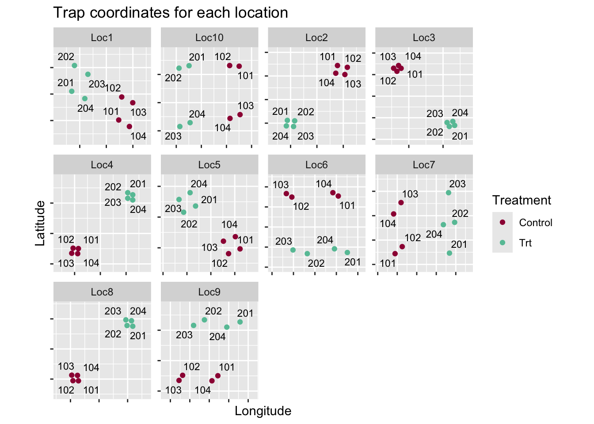


## Basic GLM models {#fit_glm}

To start, we ignore all the spatial and temporal relationships in the data and assume each data point is independent and identically distributed (iid). **This is not a good model for the data!** It is just our starting off point.

When building hierarchical Bayesian models, it is always a good idea to start simple, make sure everything works as expected, and then build up.

See Section [Basic GLM models] for the associated mathematical models.

### Fitting the frequentist Poisson model

Note: when I predict for new data, I set DaysOfCatch = 1, and then I compare to the moths per day variable (mothsperday = nYSB / DaysOfCatch). I want to exclude any patterns related to the varying time intervals.

These models show a very tight confidence intervals for our predictions. But also, the residual deviance is MUCH greater than the degree of freedom, indicating a lack of fit. The plot of the predictions overlaid on the data also demonstrate the lack of fit.


``` r
mod1p <- glm(nYSB ~ Treatment, 
             offset = log(DaysOfCatch),
             family = poisson,
             data = datR)
summary(mod1p)
```

```
## 
## Call:
## glm(formula = nYSB ~ Treatment, family = poisson, data = datR, 
##     offset = log(DaysOfCatch))
## 
## Coefficients:
##               Estimate Std. Error z value Pr(>|z|)    
## (Intercept)   1.396045   0.008574  162.83   <2e-16 ***
## TreatmentTrt -2.166510   0.026769  -80.93   <2e-16 ***
## ---
## Signif. codes:  0 '***' 0.001 '**' 0.01 '*' 0.05 '.' 0.1 ' ' 1
## 
## (Dispersion parameter for poisson family taken to be 1)
## 
##     Null deviance: 36638  on 671  degrees of freedom
## Residual deviance: 25678  on 670  degrees of freedom
## AIC: 28072
## 
## Number of Fisher Scoring iterations: 6
```

``` r
TR_1p <- getTR(mod1p)
tmp = predict(mod1p, se = T, type = "link",
              newdata = datR  %>% mutate(DaysOfCatch = 1))
# str(tmp)
preds1p <- data.frame(datR, 
                      preds = tmp$fit,
                      lowerCI = tmp$fit + 2*tmp$se.fit,
                      upperCI = tmp$fit - 2*tmp$se.fit)
preds1p %<>%
  mutate(preds = exp(preds),
         lowerCI = exp(lowerCI),
         upperCI = exp(upperCI))

p1p_glm = predplot(preds1p, "Poisson GLM predictions")
print(p1p_glm)
```

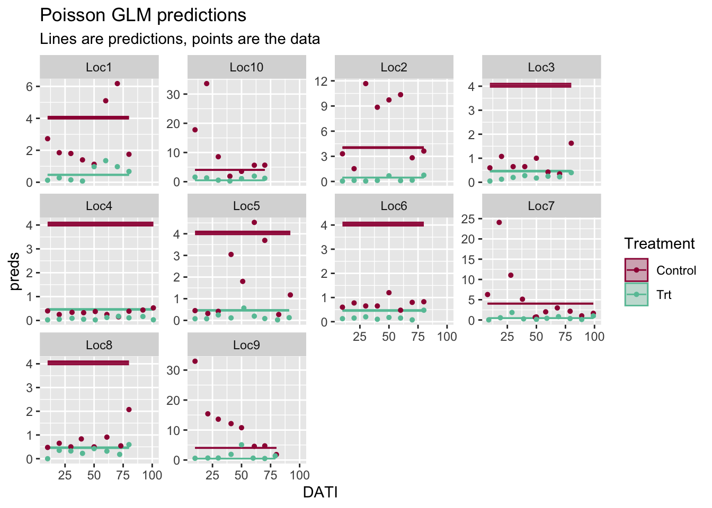

The model is such a bad fit to the data, it is hard to even tell what is going on in the plot above.

### Fitting the frequentist neg. binomial model

For the negative binomial model, our confidence intervals are a little wider, but we are still ignoring all the correlations in our data. And the plot of the predictions again indicates the lack of fit.


``` r
mod1nb <- glm.nb(nYSB ~ Treatment + 
             offset(log(DaysOfCatch)),
             data = datR)
summary(mod1nb)
```

```
## 
## Call:
## glm.nb(formula = nYSB ~ Treatment + offset(log(DaysOfCatch)), 
##     data = datR, init.theta = 0.6559820251, link = log)
## 
## Coefficients:
##              Estimate Std. Error z value Pr(>|z|)    
## (Intercept)   1.40225    0.06790   20.65   <2e-16 ***
## TreatmentTrt -2.16364    0.09893  -21.87   <2e-16 ***
## ---
## Signif. codes:  0 '***' 0.001 '**' 0.01 '*' 0.05 '.' 0.1 ' ' 1
## 
## (Dispersion parameter for Negative Binomial(0.656) family taken to be 1)
## 
##     Null deviance: 1184.50  on 671  degrees of freedom
## Residual deviance:  766.68  on 670  degrees of freedom
## AIC: 4883.5
## 
## Number of Fisher Scoring iterations: 1
## 
## 
##               Theta:  0.6560 
##           Std. Err.:  0.0352 
## 
##  2 x log-likelihood:  -4877.5410
```

``` r
#ref: https://library.virginia.edu/data/articles/simulating-data-for-count-models
# install.packages("topmodels", repos = "https://R-Forge.R-project.org")
# topmodels::rootogram(mod1nb, confint = F, xlim = c(0, 50), style = "standing")
TR_1nb <- getTR(mod1nb)
tmp = predict(mod1nb, se = T, type = "link",
              newdata= datR  %>% mutate(DaysOfCatch = 1))
# str(tmp)
preds1nb <- data.frame(datR, 
                      preds = tmp$fit,
                      lowerCI = tmp$fit - 2*tmp$se.fit,
                      upperCI = tmp$fit + 2*tmp$se.fit)
preds1nb %<>%
  mutate(preds = exp(preds),
         lowerCI = exp(lowerCI),
         upperCI = exp(upperCI))
# str(preds1nb)

p1nb_glm = predplot(preds1nb, "Neg. binomial GLM predictions")
print(p1nb_glm)
```

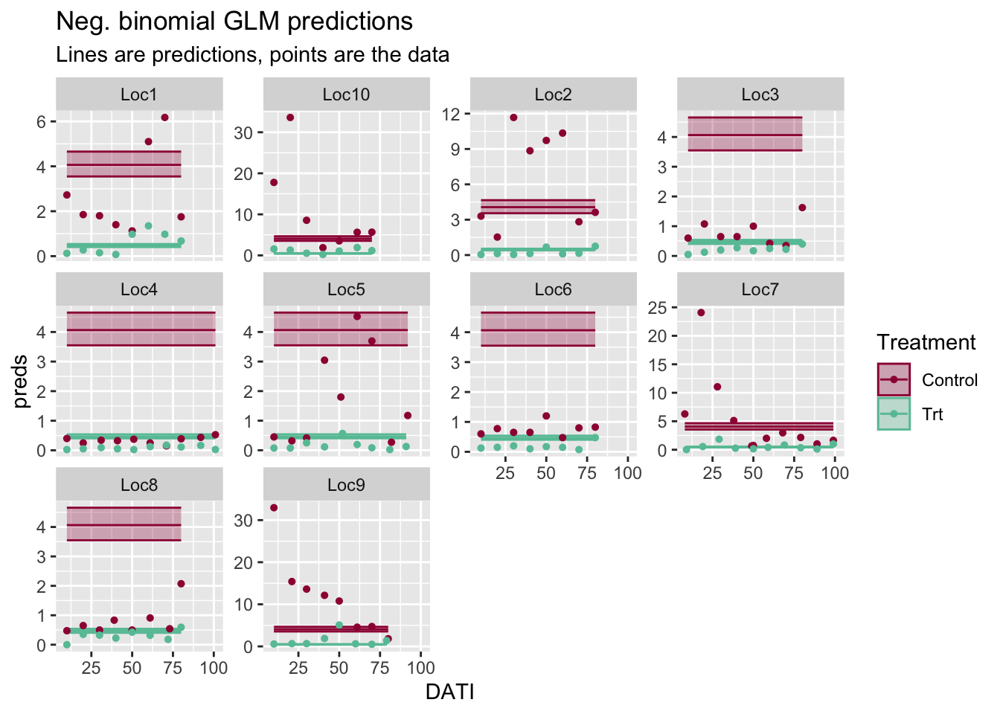

### Fitting the Bayesian (brms) model

In R, I fit the Bayesian models using the `brms` package. I find this package very intuitive and it has fast, efficient algorithms using Stan on the back-end. 

Because the models take a few minutes to fit, I usually fit them when I am initially running through my code, save them, and then only load the model fit when rendering the Rmarkdown file and creating the resulting figures.

The prior_summary command is helpful if you do not know what a parameter is called in `brms` and it is helpful to learn if you have set all the prior distributions as desired. Here, I used the command to find out what they called their $\theta$ parameter. (They call it the shape parameter.)


``` r
brm1nb <- brm(formula = nYSB ~ Treatment + offset(log(DaysOfCatch)),
              data = datR, 
              family = negbinomial, #log-link is default
              prior = c(set_prior("normal(0,2)", class = "b"),
                        set_prior("normal(0,2)", class = "Intercept"),
                        set_prior("cauchy(0,1)", class = "shape")), # is half-cauchy
              warmup = 500, iter = 2000,  # use more iter for final model
              seed = 5000, # so that you get the same results
              chains = nCores, cores = nCores) 
saveRDS(brm1nb, "output/brm1nb.RDS")
```

``` r
brm1nb <- readRDS("output/brm1nb.RDS")
prior_summary(brm1nb)
```

```
##        prior     class         coef group resp dpar nlpar lb ub       source
##  normal(0,2)         b                                                  user
##  normal(0,2)         b TreatmentTrt                             (vectorized)
##  normal(0,2) Intercept                                                  user
##  cauchy(0,1)     shape                                     0            user
```

``` r
# 
```

The Bayesian parameter estimates match very closely to the frequentist estimates:


``` r
knitr::kable(round(summary(brm1nb)$fixed[, 1:4], 3), caption = "Coefficient estimates from the Bayesian framework, fit using the brms package.")
```


Table: (\#tab:compareCoef1nb)Coefficient estimates from the Bayesian framework, fit using the brms package.

|             | Estimate| Est.Error| l-95% CI| u-95% CI|
|:------------|--------:|---------:|--------:|--------:|
|Intercept    |    1.402|     0.069|    1.267|    1.540|
|TreatmentTrt |   -2.159|     0.100|   -2.354|   -1.964|

``` r
knitr::kable(round(summary(mod1nb)$coef, 3), caption = "Coefficient estimates from the frequentist framework, fit using the stats package.")
```


Table: (\#tab:compareCoef1nb)Coefficient estimates from the frequentist framework, fit using the stats package.

|             | Estimate| Std. Error| z value| Pr(>&#124;z&#124;)|
|:------------|--------:|----------:|-------:|------------------:|
|(Intercept)  |    1.402|      0.068|  20.652|                  0|
|TreatmentTrt |   -2.164|      0.099| -21.871|                  0|

``` r
knitr::kable(round(summary(brm1nb)$spec_pars[,1:4], 3), caption = "Shape parameter estimate from the Bayesian framework.")
```


Table: (\#tab:compareShape1nb)Shape parameter estimate from the Bayesian framework.

|      | Estimate| Est.Error| l-95% CI| u-95% CI|
|:-----|--------:|---------:|--------:|--------:|
|shape |    0.655|     0.035|    0.588|    0.726|

``` r
knitr::kable(round(summary(mod1nb)$theta, 3), caption = "Shape parameter estimate from the frequentist framework.")
```


Table: (\#tab:compareShape1nb)Shape parameter estimate from the frequentist framework.

|     x|
|-----:|
| 0.656|

One difference however is that the frequentist model gives only a point estimate for the shape parameter while the Bayesian model gives us a distribution and therefore 95% credible intervals for the parameter.

The matching parameter estimates are expected, but reassuring that we have built the correct foundation for the more complicated models to come. 

Comparisons of TR predictions and predicted moth count values can be found at the end of the page (Section \@ref(compareTR)).


``` r
# CALC TR:
mod1t <- ggs(brm1nb) # transform MCMC output into a table
unique(mod1t$Parameter)
beta1 <- mod1t %>% 
  filter(Parameter == "b_TreatmentTrt", # our beta1
         Iteration > 500) # remove burn-in
TR = 100 * (1 - exp(beta1$value))
bayesTR_1nb <- data.frame(TR = round(median(TR), 1), 
           lowerCI = round(quantile(TR, 0.025), 1),
          upperCI = round(quantile(TR, 0.975), 1))   
print(bayesTR_1nb)

# plot predictions:
predsbrm1nb <- fitted(brm1nb,
                       scale = "linear",
                        newdata = datR  %>% mutate(DaysOfCatch = 1))   

bayes_p1nb = brmspredplot(cbind(datR, exp(predsbrm1nb)), 
                          plottitle = "Bayesian neg. binomial GLM predictions")
print(bayes_p1nb)
```

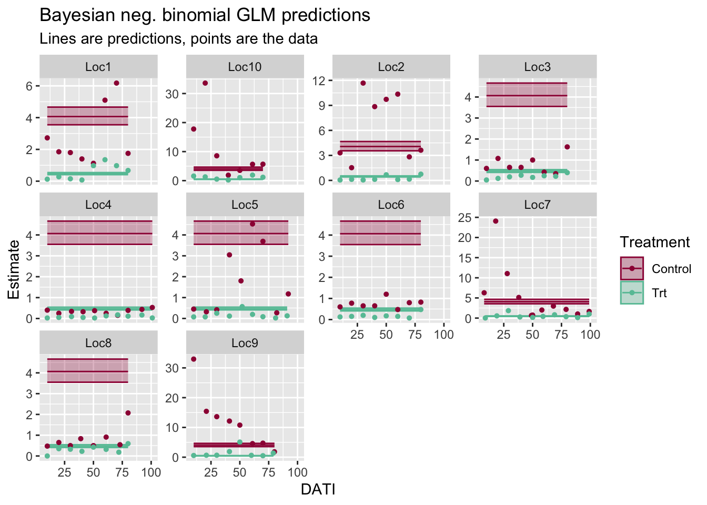

## GLMM: Random effect (RE) for locations

The first fix we make to the model is acknowledging that overall average  moth pressure varies from location to location (see Fig 1 of moth counts). To make this fix, we add a location random effect (RE) and our model becomes a generalized linear mixed-effects model (GLMM or GLMER).

We also want to acknowledge that the treatment effect may vary from location to location-- sometimes we see a big difference in moth counts between control and treatment fields, and sometimes the difference is smaller. For inference though, we are only interested in the larger picture, which is the overall trapping reduction. (We are not interested in what happens at these exact locations per se, we are more interested in the average treatment effect.) Therefore, we also add a treatment random effect.


### GLMM frequentist fit

A couple of notes here. R always gets mad when you ask for SE's for predictions from a GLMM. Technically, you need to run simulations to get them and then they still come with an asterisk related to their reliability. (This is a reason to use the Bayesian model-- credible intervals are never based on approximations!)

When we plot our predictions, we see that we now have better estimates for the overall mean at each location, and we see how much they vary from location to location, but there is a strong temporal pattern at each location that we are missing.


``` r
mod2p <- glmer(nYSB ~ Treatment + (1 + Treatment|Location), 
             offset = log(DaysOfCatch),
             family = poisson,
             data = datR)
summary(mod2p)
```

```
## Generalized linear mixed model fit by maximum likelihood (Laplace
##   Approximation) [glmerMod]
##  Family: poisson  ( log )
## Formula: nYSB ~ Treatment + (1 + Treatment | Location)
##    Data: datR
##  Offset: log(DaysOfCatch)
## 
##       AIC       BIC    logLik -2*log(L)  df.resid 
##   14070.5   14093.1   -7030.3   14060.5       667 
## 
## Scaled residuals: 
##    Min     1Q Median     3Q    Max 
## -9.969 -1.689 -0.584  0.768 33.638 
## 
## Random effects:
##  Groups   Name         Variance Std.Dev. Corr 
##  Location (Intercept)  1.4407   1.2003        
##           TreatmentTrt 0.4075   0.6384   -0.75
## Number of obs: 672, groups:  Location, 10
## 
## Fixed effects:
##              Estimate Std. Error z value Pr(>|z|)    
## (Intercept)    0.8159     0.3798   2.148   0.0317 *  
## TreatmentTrt  -1.8900     0.2052  -9.209   <2e-16 ***
## ---
## Signif. codes:  0 '***' 0.001 '**' 0.01 '*' 0.05 '.' 0.1 ' ' 1
## 
## Correlation of Fixed Effects:
##             (Intr)
## TreatmntTrt -0.743
```

``` r
TR_2p <- getTR(mod2p)
knitr::kable(TR_2p)
```


|   TR| lowerCI| upperCI|
|----:|-------:|-------:|
| 84.9|    77.4|    89.9|

``` r
tmp = predict(mod2p, se = T, type = "link",
              newdata=datR %>% mutate(DaysOfCatch = 1))
# str(tmp)
preds2p <- data.frame(datR %>% mutate(DaysOfCatch = 1), 
                      preds = tmp$fit,
                      lowerCI = tmp$fit + 2*tmp$se.fit,
                      upperCI = tmp$fit - 2*tmp$se.fit)
preds2p %<>%
  mutate(preds = exp(preds),
         lowerCI = exp(lowerCI),
         upperCI = exp(upperCI))
# str(predsp2)

p2p_glmm = predplot(preds2p, "Poisson GLMM (Location) predictions")
print(p2p_glmm)
```


``` r
# print(p2p_glmm)
```

``` r
mod2nb <- glmer.nb(nYSB ~ Treatment + (1 + Treatment|Location), 
             offset = log(DaysOfCatch),
             data = datR)
summary(mod2nb)
```

```
## Generalized linear mixed model fit by maximum likelihood (Laplace
##   Approximation) [glmerMod]
##  Family: Negative Binomial(1.5338)  ( log )
## Formula: nYSB ~ Treatment + (1 + Treatment | Location)
##    Data: datR
##  Offset: log(DaysOfCatch)
## 
##       AIC       BIC    logLik -2*log(L)  df.resid 
##    4399.3    4426.3   -2193.6    4387.3       666 
## 
## Scaled residuals: 
##     Min      1Q  Median      3Q     Max 
## -1.1392 -0.7363 -0.2834  0.3435  7.8739 
## 
## Random effects:
##  Groups   Name         Variance Std.Dev. Corr 
##  Location (Intercept)  1.4075   1.1864        
##           TreatmentTrt 0.3602   0.6001   -0.76
## Number of obs: 672, groups:  Location, 10
## 
## Fixed effects:
##              Estimate Std. Error z value Pr(>|z|)    
## (Intercept)    0.8258     0.3781   2.184    0.029 *  
## TreatmentTrt  -1.8986     0.2033  -9.340   <2e-16 ***
## ---
## Signif. codes:  0 '***' 0.001 '**' 0.01 '*' 0.05 '.' 0.1 ' ' 1
## 
## Correlation of Fixed Effects:
##             (Intr)
## TreatmntTrt -0.735
```

``` r
TR_2nb <- getTR(mod2nb)
knitr::kable(TR_2nb)
```


| TR| lowerCI| upperCI|
|--:|-------:|-------:|
| 85|    77.7|    89.9|

``` r
tmp = predict(mod2nb, se = T, type = "link",
              newdata=datR %>% mutate(DaysOfCatch = 1))
# str(tmp)
preds2nb <- data.frame(datR, 
                      preds = tmp$fit,
                      lowerCI = tmp$fit + 2*tmp$se.fit,
                      upperCI = tmp$fit - 2*tmp$se.fit)
preds2nb %<>%
  mutate(preds = exp(preds),
         lowerCI = exp(lowerCI),
         upperCI = exp(upperCI))
# str(predsnb2)

p2nb_glmm = predplot(preds2nb, "Neg. binomial GLMM (Location) predictions")
print(p2nb_glmm)
```

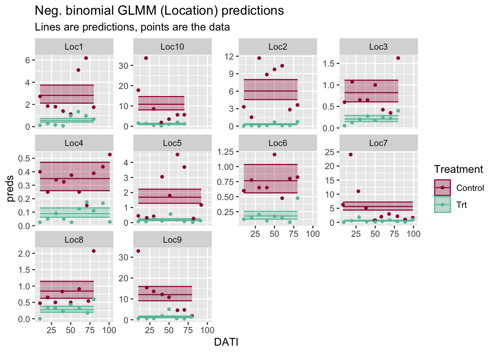


### GLMM Bayesian fit

By default, the prior distributions of random slopes and intercepts are correlated in `brm`, which matches the "GLMM" frequentist fit. If the correlation is non-significant, you may want to remove that correlation to simplify your model. To remove the correlation, change the random effects term from "(1 + TreatmentF|Location)" to " (1 + TreatmentF||Location)" (has an extra vertical line), which makes them independent. 

You'll notice that the parameter estimates are slightly different from the frequentist NB model fit here-- the more complicated your model is, the more likely you will find this is true with slightly different versions of your model (here, adding priors and fitting with a different algorithm). 


``` r
brm2nb <- brm(formula = nYSB ~ Treatment + offset(log(DaysOfCatch)) + 
                    (1 + Treatment|Location),
              data = datR, 
              family = negbinomial,
              prior = c(set_prior("normal(0,2)", class = "b"),
                        set_prior("cauchy(0,1)", class = "shape"), 
                        set_prior("normal(0,2)", class = "Intercept"),
                        set_prior("cauchy(0,1)", class = "sd")),
              control = list(adapt_delta = 0.9), # b/c of divergent warning
              warmup = 500, iter = 2000, 
              seed = 5000,
              chains = nCores, cores = nCores) 
saveRDS(brm2nb, "output/brm2nb.RDS")
```

``` r
brm2nb <- readRDS("output/brm2nb.RDS")
# prior_summary(brm2nb) # we did not change the default prior for the RE correlation
# 
summary(brm2nb)
```

```
##  Family: negbinomial 
##   Links: mu = log; shape = identity 
## Formula: nYSB ~ Treatment + offset(log(DaysOfCatch)) + (1 + Treatment | Location) 
##    Data: datR (Number of observations: 672) 
##   Draws: 6 chains, each with iter = 2000; warmup = 500; thin = 1;
##          total post-warmup draws = 9000
## 
## Multilevel Hyperparameters:
## ~Location (Number of levels: 10) 
##                             Estimate Est.Error l-95% CI u-95% CI Rhat Bulk_ESS
## sd(Intercept)                   1.32      0.32     0.84     2.10 1.00     2355
## sd(TreatmentTrt)                0.69      0.19     0.40     1.13 1.00     2984
## cor(Intercept,TreatmentTrt)    -0.61      0.22    -0.90    -0.07 1.00     4009
##                             Tail_ESS
## sd(Intercept)                   3331
## sd(TreatmentTrt)                4589
## cor(Intercept,TreatmentTrt)     5301
## 
## Regression Coefficients:
##              Estimate Est.Error l-95% CI u-95% CI Rhat Bulk_ESS Tail_ESS
## Intercept        0.82      0.42    -0.03     1.67 1.00     2407     3221
## TreatmentTrt    -1.88      0.23    -2.34    -1.41 1.00     3513     4646
## 
## Further Distributional Parameters:
##       Estimate Est.Error l-95% CI u-95% CI Rhat Bulk_ESS Tail_ESS
## shape     1.53      0.10     1.35     1.73 1.00     9290     6869
## 
## Draws were sampled using sampling(NUTS). For each parameter, Bulk_ESS
## and Tail_ESS are effective sample size measures, and Rhat is the potential
## scale reduction factor on split chains (at convergence, Rhat = 1).
```

``` r
# summary(mod2nb)
```


``` r
# CALC TR:
modtransformed <- ggs(brm2nb) # transform MCMC output into a table
# head(modtransformed)
# summary(modtransformed)
# unique(modtransformed$Parameter)
beta1 <- modtransformed %>% 
  filter(Parameter == "b_TreatmentTrt", # our beta1
         Iteration > 500) # remove burn-in
TR = 100 * (1 - exp(beta1$value))
bayesTR_2nb <- data.frame(TR = round(median(TR), 1), 
           lowerCI = round(quantile(TR, 0.025), 1),
          upperCI = round(quantile(TR, 0.975), 1))   
knitr::kable(bayesTR_2nb)
```


|     |   TR| lowerCI| upperCI|
|:----|----:|-------:|-------:|
|2.5% | 84.8|    75.7|    90.4|

``` r
# plot predictions:
predsbrm <- fitted(brm2nb,
                   scale = "linear",
                   newdata = datR  %>% mutate(logDaysOfCatch = 0))  

bayes_p2nb = brmspredplot(cbind(datR, exp(predsbrm)), 
                          "Bayesian neg. binomial GLMM (Location) predictions")
print(bayes_p2nb)
```

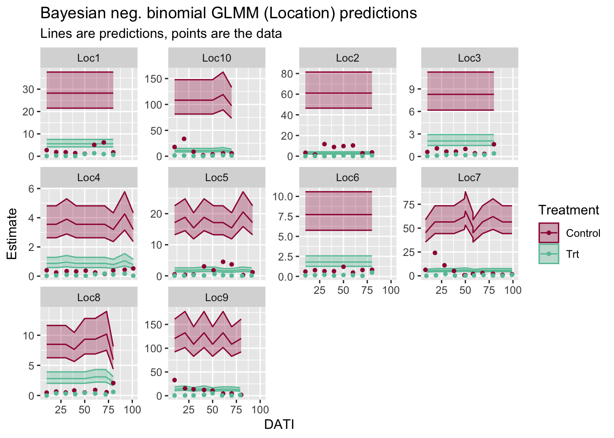


## GLMM: RE for Location, SamplingDate

In this version of the model, we acknowledge that sampling on different days of the season adds to the variability of the moth counts, and that counts from the same sampling date are more similar than for a different date. In this model, however,  the correlation between sampling dates is ignored.

This model is included here because it is important to think about whether you have nested or crossed random effects (if applicable). Here, we are assuming crossed random effects because Java island is fairly homogeneous in terms of weather and ecosystem so it may make sense for all samples from one date to be grouped together. However, one could also argue for nested RE's for this case study. 

This model allows us to include sampling date in our model as a random effect and still fit the model quickly in a frequentist framework. 

Include dates because samples within a date will be more similar than samples across all dates at a location. But only include random intercepts.

The predictions now mimic the spatial patterns we see over time.

### Crossed GLMM frequentist fit


``` r
mod3p <- glmer(nYSB ~ Treatment  +
                 (1 + Treatment|Location) + 
                 (1|SamplingDateC), 
             offset = log(DaysOfCatch),
             family = poisson,
             data = datR)
summary(mod3p)
TR_3p <- getTR(mod3p)
knitr::kable(TR_3p)

tmp = predict(mod3p, se = T, type = "link",
              newdata = datR %>% mutate(DaysOfCatch = 1))
# str(tmp)
preds3p <- data.frame(datR %>% mutate(DaysOfCatch = 1), 
                      preds = tmp$fit,
                      lowerCI = tmp$fit + 2*tmp$se.fit,
                      upperCI = tmp$fit - 2*tmp$se.fit)
preds3p %<>%
  mutate(preds = exp(preds),
         lowerCI = exp(lowerCI),
         upperCI = exp(upperCI))
# str(predsp3)


p3p_glmm = predplot(preds3p, "Poisson GLMM (Location, Date) predictions")
print(p3p_glmm)
```

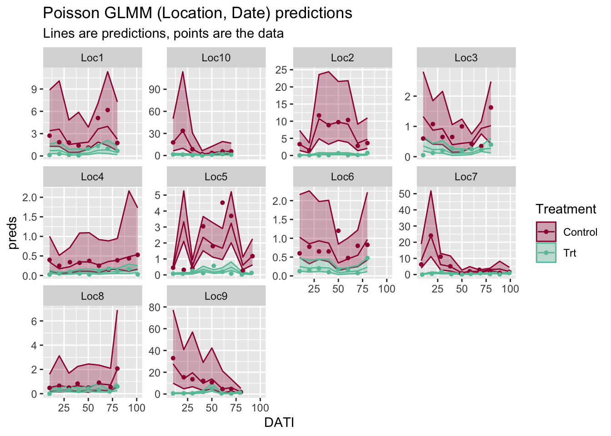

``` r
# too slow!
mod3nb <- glmer.nb(nYSB ~ Treatment  +
                      (1 + Treatment|Location) + 
                 (1|SamplingDateC), 
             offset = log(DaysOfCatch),
             data = datR)
summary(mod3nb)
TR_3nb <- getTR(mod3nb)
knitr::kable(TR_3nb)

tmp = predict(mod3nb, se = T, type = "link",
              newdata=datR %>% mutate(DaysOfCatch = 1))
# str(tmp)
preds3nb <- data.frame(datR %>% mutate(DaysOfCatch = 1), 
                       preds = tmp$fit,
                       lowerCI = tmp$fit + 2*tmp$se.fit,
                       upperCI = tmp$fit - 2*tmp$se.fit)
preds3nb %<>%
  mutate(preds = exp(preds),
         lowerCI = exp(lowerCI),
         upperCI = exp(upperCI))
# str(predsnb2)

p3nb_glmm = predplot(preds3nb, "Neg. binomial GLMM (Location, Date) predictions")
print(p3nb_glmm)
```


### Crossed GLMM Bayes (brms) version


``` r
brm3nb <- brm(formula = nYSB ~ Treatment + offset(log(DaysOfCatch)) + 
                    (1 + Treatment|Location) + 
                    (1|SamplingDateC),
                    # (1|Location:SamplingDateC),
              data = datR, 
              family = negbinomial,
              prior = c(set_prior("normal(0,2)", class = "b"),
                        set_prior("cauchy(0,1)", class = "shape"), # == half-cauchy
                        set_prior("normal(0,2)", class = "Intercept"),
                        set_prior("cauchy(0,1)", class = "sd")),
              warmup = 500, iter = 2000, 
              seed = 5000,
              chains = nCores, cores = nCores) 
saveRDS(brm3nb, "output/brm3nb.RDS")
```

``` r
brm3nb <- readRDS("output/brm3nb.RDS")
# prior_summary(brm3nb, all = FALSE)
# print(prior_summary(brm3nb, all = FALSE), show_df = FALSE)

summary(brm3nb)
```

```
##  Family: negbinomial 
##   Links: mu = log; shape = identity 
## Formula: nYSB ~ Treatment + offset(log(DaysOfCatch)) + (1 + Treatment | Location) + (1 | SamplingDateC) 
##    Data: datR (Number of observations: 672) 
##   Draws: 6 chains, each with iter = 2000; warmup = 500; thin = 1;
##          total post-warmup draws = 9000
## 
## Multilevel Hyperparameters:
## ~Location (Number of levels: 10) 
##                             Estimate Est.Error l-95% CI u-95% CI Rhat Bulk_ESS
## sd(Intercept)                   1.16      0.30     0.74     1.90 1.00     2611
## sd(TreatmentTrt)                0.65      0.18     0.38     1.10 1.00     3469
## cor(Intercept,TreatmentTrt)    -0.58      0.23    -0.90    -0.02 1.00     3688
##                             Tail_ESS
## sd(Intercept)                   4087
## sd(TreatmentTrt)                5126
## cor(Intercept,TreatmentTrt)     4813
## 
## ~SamplingDateC (Number of levels: 62) 
##               Estimate Est.Error l-95% CI u-95% CI Rhat Bulk_ESS Tail_ESS
## sd(Intercept)     0.67      0.08     0.53     0.85 1.00     2345     4284
## 
## Regression Coefficients:
##              Estimate Est.Error l-95% CI u-95% CI Rhat Bulk_ESS Tail_ESS
## Intercept        0.64      0.38    -0.10     1.38 1.00     1745     2463
## TreatmentTrt    -1.75      0.23    -2.20    -1.28 1.00     2374     3383
## 
## Further Distributional Parameters:
##       Estimate Est.Error l-95% CI u-95% CI Rhat Bulk_ESS Tail_ESS
## shape     2.58      0.22     2.17     3.03 1.00     8941     6216
## 
## Draws were sampled using sampling(NUTS). For each parameter, Bulk_ESS
## and Tail_ESS are effective sample size measures, and Rhat is the potential
## scale reduction factor on split chains (at convergence, Rhat = 1).
```

``` r
# summary(mod3nb)
# 
```


``` r
# CALC TR:
modtranformed <- ggs(brm3nb) # transform MCMC output into a table
beta1 <- modtranformed %>% 
  filter(Parameter == "b_TreatmentTrt", # our beta1
         Iteration > 500) # remove burn-in
TR = 100 * (1 - exp(beta1$value))
bayesTR_3nb <- data.frame(TR = round(median(TR), 1), 
           lowerCI = round(quantile(TR, 0.025), 1),
          upperCI = round(quantile(TR, 0.975), 1))   
# knitr::kable(bayesTR_3nb)

# plot predictions:
predsbrm <- fitted(brm3nb,
                   scale = "linear",
                   newdata = datR  %>% mutate(DaysOfCatch = 1))

bayes_p3nb = brmspredplot(cbind(datR, exp(predsbrm)), 
                          "Bayesian Poisson GLMM (Location, Date) predictions")
print(bayes_p3nb)
```

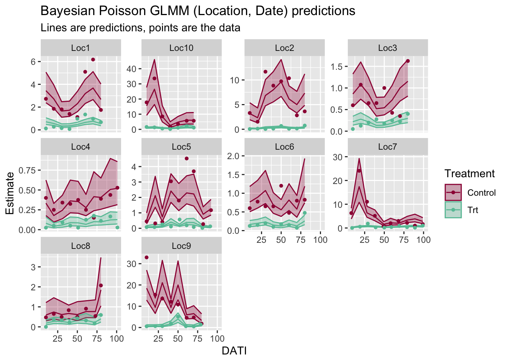


## GLMM with Gaussian Processes: RE for Trial, GP for Date

Now we are in the territory where we have to fit the models in a Bayesian framework. If our response variable was continuous (i.e., the regression model was based on a Normal distribution), then we could still use maximum likelihood estimation.


### Gaussian Process Bayes (brms) version

* Use numeric version of sampling date for better algorithm stability. Still, we have a warning about a divergent transition. Ideally, we would tweak the model and look at the data carefully so fix this warning, but because we are working with made up data, we will not worry about the warning for now.

* Using squared-exponential covariance function (quite typical choice).

* Here, we have a different GP for each location (each location has its own parameters for the function). This is done to further account for expected differences between locations. Ideally, we would do some model selection to decide between this model and one that shares the GP parameters across all locations.


``` r
# summary(datR$numericDate) # check max before fitting, in case seasons don't line up
brm4nb <- brm(formula = nYSB ~ Treatment + offset(log(DaysOfCatch)) + 
                    (1 + Treatment|Location) + 
              gp(DATI, by =Location), 
                  control = list(adapt_delta = 0.9),
              data = datR, 
              family = negbinomial,
              prior = c(set_prior("normal(0,2)", class = "b"),
                        set_prior("cauchy(0,1)", class = "shape"), # == half-cauchy
                        set_prior("normal(0,2)", class = "Intercept"),
                        set_prior("cauchy(0,1)", class = "sd"),
                        set_prior("cauchy(0,1)", class = "lscale", 
                                  coef = "gpDATILocationLoc1"),
                        set_prior("cauchy(0,1)", class = "lscale", 
                                  coef = "gpDATILocationLoc2"),
                        set_prior("cauchy(0,1)", class = "lscale", coef = "gpDATILocationLoc3"),
                        set_prior("cauchy(0,1)", class = "lscale", coef = "gpDATILocationLoc4"),
                        set_prior("cauchy(0,1)", class = "lscale", coef = "gpDATILocationLoc5"),
                        set_prior("cauchy(0,1)", class = "lscale", coef = "gpDATILocationLoc6"),
                        set_prior("cauchy(0,1)", class = "lscale", coef = "gpDATILocationLoc7"),
                        set_prior("cauchy(0,1)", class = "lscale", coef = "gpDATILocationLoc8"),
                        set_prior("cauchy(0,1)", class = "lscale", coef = "gpDATILocationLoc9"),
                        set_prior("cauchy(0,1)", class = "lscale", coef = "gpDATILocationLoc10"),
                        set_prior("normal(0,2)", class = "sdgp")),
                        # set_prior("lkj(2)", class = "cor")),
              warmup = 1000, iter = 5000, 
              seed = 5000,
              chains = nCores, cores = nCores) 
saveRDS(brm4nb, "output/brm4nb.RDS")
```

``` r
summary(datR$numericDate) # check max before fitting, in case seasons don't line up
brm4nb1gp <- brm(formula = nYSB ~ Treatment + offset(log(DaysOfCatch)) + 
                    (1 + Treatment|Location) + 
              gp(DATI), 
                  control = list(adapt_delta = 0.9),
              data = datR, 
              family = negbinomial,
              prior = c(set_prior("normal(0,2)", class = "b"),
                        set_prior("cauchy(0,1)", class = "shape"), # == half-cauchy
                        set_prior("normal(0,2)", class = "Intercept"),
                        set_prior("cauchy(0,1)", class = "sd"),
                        set_prior("cauchy(0,1)", class = "lscale", coef = "gpDATI"),
                        set_prior("normal(0,2)", class = "sdgp")),
                        # set_prior("lkj(2)", class = "cor")),
              warmup = 1000, iter = 5000, 
              seed = 5000,
              chains = nCores, cores = nCores) 
saveRDS(brm4nb1gp, "output/brm4nb1GP.RDS")
# brm4nb = brm4nb1gp
```


``` r
brm4nb <- readRDS("output/brm4nb.RDS")
summary(brm4nb)
```

```
##  Family: negbinomial 
##   Links: mu = log; shape = identity 
## Formula: nYSB ~ Treatment + offset(log(DaysOfCatch)) + (1 + Treatment | Location) + gp(DATI, by = Location) 
##    Data: datR (Number of observations: 672) 
##   Draws: 6 chains, each with iter = 5000; warmup = 1000; thin = 1;
##          total post-warmup draws = 24000
## 
## Gaussian Process Hyperparameters:
##                             Estimate Est.Error l-95% CI u-95% CI Rhat Bulk_ESS
## sdgp(gpDATILocationLoc1)        1.08      0.61     0.40     2.71 1.00     9206
## sdgp(gpDATILocationLoc10)       1.32      0.62     0.55     2.93 1.00     7887
## sdgp(gpDATILocationLoc2)        0.90      0.44     0.39     2.03 1.00     6682
## sdgp(gpDATILocationLoc3)        1.06      0.84     0.07     3.26 1.00     8235
## sdgp(gpDATILocationLoc4)        1.35      0.96     0.07     3.69 1.00    10138
## sdgp(gpDATILocationLoc5)        1.30      0.54     0.62     2.70 1.00     7744
## sdgp(gpDATILocationLoc6)        0.98      0.85     0.04     3.23 1.00    10711
## sdgp(gpDATILocationLoc7)        1.22      0.30     0.78     1.93 1.00     6871
## sdgp(gpDATILocationLoc8)        1.33      0.90     0.28     3.67 1.00     4363
## sdgp(gpDATILocationLoc9)        1.04      0.38     0.54     1.98 1.00     6521
## lscale(gpDATILocationLoc1)      0.24      0.09     0.08     0.42 1.00     5619
## lscale(gpDATILocationLoc10)     0.19      0.07     0.02     0.32 1.00     5266
## lscale(gpDATILocationLoc2)      0.10      0.09     0.01     0.32 1.00     3425
## lscale(gpDATILocationLoc3)      3.45     31.07     0.04    14.84 1.00     3694
## lscale(gpDATILocationLoc4)     12.27    271.18     0.31    39.77 1.00    10892
## lscale(gpDATILocationLoc5)      0.12      0.06     0.02     0.28 1.00     2889
## lscale(gpDATILocationLoc6)      7.85     72.69     0.13    37.99 1.00    11351
## lscale(gpDATILocationLoc7)      0.01      0.00     0.00     0.02 1.00     6367
## lscale(gpDATILocationLoc8)      1.30      1.71     0.02     4.82 1.00     1835
## lscale(gpDATILocationLoc9)      0.02      0.03     0.00     0.12 1.00     5034
##                             Tail_ESS
## sdgp(gpDATILocationLoc1)       15405
## sdgp(gpDATILocationLoc10)      13181
## sdgp(gpDATILocationLoc2)       10580
## sdgp(gpDATILocationLoc3)        8560
## sdgp(gpDATILocationLoc4)        8240
## sdgp(gpDATILocationLoc5)       12368
## sdgp(gpDATILocationLoc6)       11349
## sdgp(gpDATILocationLoc7)       11682
## sdgp(gpDATILocationLoc8)       10785
## sdgp(gpDATILocationLoc9)       10631
## lscale(gpDATILocationLoc1)      5595
## lscale(gpDATILocationLoc10)     4535
## lscale(gpDATILocationLoc2)      2379
## lscale(gpDATILocationLoc3)      4533
## lscale(gpDATILocationLoc4)     11046
## lscale(gpDATILocationLoc5)      2612
## lscale(gpDATILocationLoc6)      6231
## lscale(gpDATILocationLoc7)      9780
## lscale(gpDATILocationLoc8)      4201
## lscale(gpDATILocationLoc9)      1833
## 
## Multilevel Hyperparameters:
## ~Location (Number of levels: 10) 
##                             Estimate Est.Error l-95% CI u-95% CI Rhat Bulk_ESS
## sd(Intercept)                   1.01      0.36     0.43     1.86 1.00     6783
## sd(TreatmentTrt)                0.70      0.20     0.42     1.18 1.00    10106
## cor(Intercept,TreatmentTrt)    -0.59      0.27    -0.95     0.07 1.00     6570
##                             Tail_ESS
## sd(Intercept)                   7144
## sd(TreatmentTrt)               14365
## cor(Intercept,TreatmentTrt)     7931
## 
## Regression Coefficients:
##              Estimate Est.Error l-95% CI u-95% CI Rhat Bulk_ESS Tail_ESS
## Intercept        0.76      0.41    -0.08     1.55 1.00     7087    10696
## TreatmentTrt    -1.81      0.23    -2.27    -1.34 1.00    10126    12953
## 
## Further Distributional Parameters:
##       Estimate Est.Error l-95% CI u-95% CI Rhat Bulk_ESS Tail_ESS
## shape     3.40      0.31     2.83     4.04 1.00    13133    15442
## 
## Draws were sampled using sampling(NUTS). For each parameter, Bulk_ESS
## and Tail_ESS are effective sample size measures, and Rhat is the potential
## scale reduction factor on split chains (at convergence, Rhat = 1).
```

``` r
# bayes_R2(brm4nb) # 0.824

prior_summary(brm4nb)
```

```
##                 prior     class                coef    group resp dpar nlpar lb
##           normal(0,2)         b                                                
##           normal(0,2)         b        TreatmentTrt                            
##           normal(0,2) Intercept                                                
##  lkj_corr_cholesky(1)         L                                                
##  lkj_corr_cholesky(1)         L                     Location                   
##                (flat)    lscale                                               0
##           cauchy(0,1)    lscale  gpDATILocationLoc1                           0
##           cauchy(0,1)    lscale gpDATILocationLoc10                           0
##           cauchy(0,1)    lscale  gpDATILocationLoc2                           0
##           cauchy(0,1)    lscale  gpDATILocationLoc3                           0
##           cauchy(0,1)    lscale  gpDATILocationLoc4                           0
##           cauchy(0,1)    lscale  gpDATILocationLoc5                           0
##           cauchy(0,1)    lscale  gpDATILocationLoc6                           0
##           cauchy(0,1)    lscale  gpDATILocationLoc7                           0
##           cauchy(0,1)    lscale  gpDATILocationLoc8                           0
##           cauchy(0,1)    lscale  gpDATILocationLoc9                           0
##           cauchy(0,1)        sd                                               0
##           cauchy(0,1)        sd                     Location                  0
##           cauchy(0,1)        sd           Intercept Location                  0
##           cauchy(0,1)        sd        TreatmentTrt Location                  0
##           normal(0,2)      sdgp                                               0
##           normal(0,2)      sdgp  gpDATILocationLoc1                           0
##           normal(0,2)      sdgp gpDATILocationLoc10                           0
##           normal(0,2)      sdgp  gpDATILocationLoc2                           0
##           normal(0,2)      sdgp  gpDATILocationLoc3                           0
##           normal(0,2)      sdgp  gpDATILocationLoc4                           0
##           normal(0,2)      sdgp  gpDATILocationLoc5                           0
##           normal(0,2)      sdgp  gpDATILocationLoc6                           0
##           normal(0,2)      sdgp  gpDATILocationLoc7                           0
##           normal(0,2)      sdgp  gpDATILocationLoc8                           0
##           normal(0,2)      sdgp  gpDATILocationLoc9                           0
##           cauchy(0,1)     shape                                               0
##  ub       source
##             user
##     (vectorized)
##             user
##          default
##     (vectorized)
##          default
##             user
##             user
##             user
##             user
##             user
##             user
##             user
##             user
##             user
##             user
##             user
##     (vectorized)
##     (vectorized)
##     (vectorized)
##             user
##     (vectorized)
##     (vectorized)
##     (vectorized)
##     (vectorized)
##     (vectorized)
##     (vectorized)
##     (vectorized)
##     (vectorized)
##     (vectorized)
##     (vectorized)
##             user
```

``` r
prior_summary(brm4nb, all = FALSE)
```

```
##                 prior     class                coef group resp dpar nlpar lb ub
##           normal(0,2)         b                                                
##           normal(0,2) Intercept                                                
##  lkj_corr_cholesky(1)         L                                                
##           cauchy(0,1)    lscale  gpDATILocationLoc1                            
##           cauchy(0,1)    lscale gpDATILocationLoc10                            
##           cauchy(0,1)    lscale  gpDATILocationLoc2                            
##           cauchy(0,1)    lscale  gpDATILocationLoc3                            
##           cauchy(0,1)    lscale  gpDATILocationLoc4                            
##           cauchy(0,1)    lscale  gpDATILocationLoc5                            
##           cauchy(0,1)    lscale  gpDATILocationLoc6                            
##           cauchy(0,1)    lscale  gpDATILocationLoc7                            
##           cauchy(0,1)    lscale  gpDATILocationLoc8                            
##           cauchy(0,1)    lscale  gpDATILocationLoc9                            
##           cauchy(0,1)        sd                                            0   
##           normal(0,2)      sdgp                                            0   
##           cauchy(0,1)     shape                                            0   
##   source
##     user
##     user
##  default
##     user
##     user
##     user
##     user
##     user
##     user
##     user
##     user
##     user
##     user
##     user
##     user
##     user
```

``` r
# 
```


``` r
# Calc TR:
modtranformed <- ggs(brm4nb) # transform MCMC output into a table
beta1 <- modtranformed %>% 
  filter(Parameter == "b_TreatmentTrt", # our beta1
         Iteration > 500) # remove burn-in
TR = 100 * (1 - exp(beta1$value))
bayesTR_4nb <- data.frame(TR = round(median(TR), 1), 
           lowerCI = round(quantile(TR, 0.025), 1),
          upperCI = round(quantile(TR, 0.975), 1))   
knitr::kable(bayesTR_4nb)
```


|     |   TR| lowerCI| upperCI|
|:----|----:|-------:|-------:|
|2.5% | 83.7|    73.8|    89.7|

``` r
# plot predictions:
# library(tidybayes) # add_predicted_draws()
predsbrm <- fitted(brm4nb,
                   scale = "linear",
                   newdata = datR  %>% mutate(DaysOfCatch = 1))
# dim(exp(predsbrm))
# head(predsbrm)
# I used linear scale (link response) in the fitted values and then exponeniate
# because it intuitively is easier to think about moths per day (i.e., response scale),
# but I want the resolution that is had at the linear scale.
# (If I chose response scale, Id' get lots of 0's which aren't informative. 
# Give it a try!)

bayes_p4nb = brmspredplot(cbind(datR, exp(predsbrm)), 
                          "Bayesian neg binomial GP GLMM predictions")
print(bayes_p4nb)
```

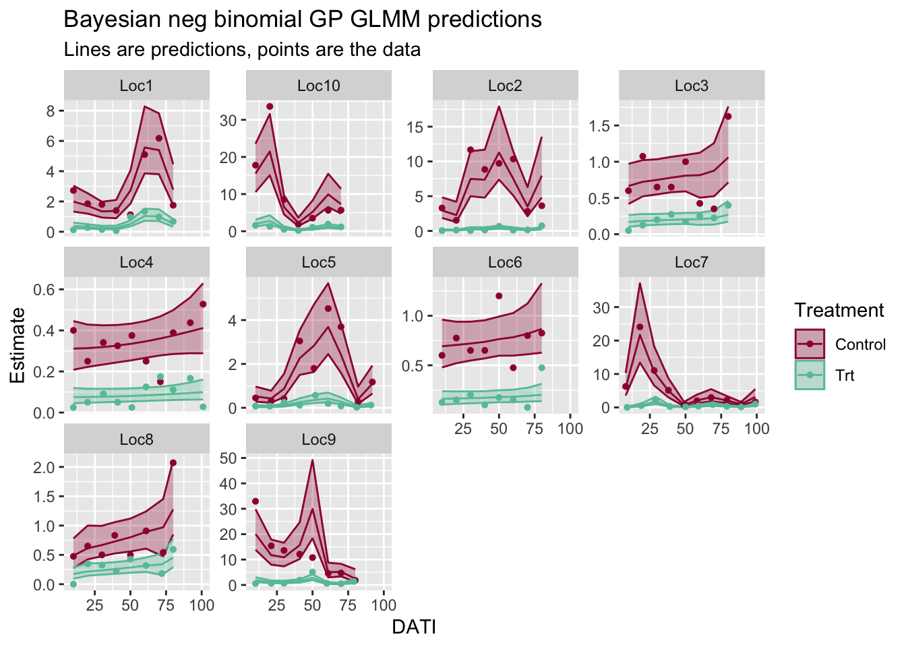

## Summary of estimates

### Compare TR estimates {#compareTR}

Here, the trapping reduction estimates from all of the models are compared. As expected, the median TR estimates are very close from model to model, but the uncertainty in that estimate increase (i.e., the confidence/credible intervals get wider) when we properly account for the correlations in our data.


``` r
# Framework = Frequentist, Bayes
# Distribtuion = Poisson, NB
# Model name: GLM, GLMM (Location), GLMM (Location, nested dates), GLMM (Location, GP for correlated dates)
# Model description?
# TR
# lower CI (2.5%)
# upper CI (97.5%)
tableTR = bind_rows(
data.frame(Framework = "Frequentist", Distribution = "Poisson", Model_name = "GLM",
      round(TR_1p)),
data.frame(Framework = "Frequentist", Distribution = "Neg Binomial", Model_name = "GLM",
      round(TR_1nb)),
data.frame(Framework = "Bayesian", Distribution = "Neg Binomial", Model_name = "GLM",
      round(bayesTR_1nb)),

data.frame(Framework = "Frequentist", Distribution = "Poisson", Model_name = "GLMM (Location)",
      round(TR_2p)),
data.frame(Framework = "Frequentist", Distribution = "Neg Binomial", Model_name = "GLMM (Location)",
      round(TR_2nb)),
data.frame(Framework = "Bayesian", Distribution = "Neg Binomial", Model_name = "GLMM (Location)",
      round(bayesTR_2nb)),

data.frame(Framework = "Frequentist", Distribution = "Poisson", Model_name = "GLMM (Location, nested Date)",
      round(TR_3p)),
data.frame(Framework = "Frequentist", Distribution = "Neg Binomial", Model_name = "GLMM (Location, nested Date)",
      round(TR_3nb)),
data.frame(Framework = "Bayesian", Distribution = "Neg Binomial", Model_name = "GLMM (Location, nested Date)",
      round(bayesTR_3nb)),

data.frame(Framework = "Bayesian", Distribution = "Neg Binomial", Model_name = "GLMM (Location, Gaussian Process Date)",
      round(bayesTR_4nb))
)
rownames(tableTR) <- NULL
kable(tableTR, booktabs = TRUE,
             caption = "Comparison of derived TR estimates from each model fit.") %>%
  kable_styling(bootstrap_options = c("striped", "hover", "condensed"))  %>%
  # column_spec(4, 
  #             background = "lightblue")  %>%
  pack_rows("GLM", 1, 3) %>%
  pack_rows("GLMM (Location)", 4, 6) %>%
  pack_rows("GLMM (Location, Date)", 7, 9) %>%
  pack_rows("GLMM (Location, GP)", 10, 10)
```

<table class="table table-striped table-hover table-condensed" style="margin-left: auto; margin-right: auto;">
<caption>(\#tab:compareTR)(\#tab:compareTR)Comparison of derived TR estimates from each model fit.</caption>
 <thead>
  <tr>
   <th style="text-align:left;"> Framework </th>
   <th style="text-align:left;"> Distribution </th>
   <th style="text-align:left;"> Model_name </th>
   <th style="text-align:right;"> TR </th>
   <th style="text-align:right;"> lowerCI </th>
   <th style="text-align:right;"> upperCI </th>
  </tr>
 </thead>
<tbody>
  <tr grouplength="3"><td colspan="6" style="border-bottom: 1px solid;"><strong>GLM</strong></td></tr>
<tr>
   <td style="text-align:left;padding-left: 2em;" indentlevel="1"> Frequentist </td>
   <td style="text-align:left;"> Poisson </td>
   <td style="text-align:left;"> GLM </td>
   <td style="text-align:right;"> 88 </td>
   <td style="text-align:right;"> 88 </td>
   <td style="text-align:right;"> 89 </td>
  </tr>
  <tr>
   <td style="text-align:left;padding-left: 2em;" indentlevel="1"> Frequentist </td>
   <td style="text-align:left;"> Neg Binomial </td>
   <td style="text-align:left;"> GLM </td>
   <td style="text-align:right;"> 88 </td>
   <td style="text-align:right;"> 86 </td>
   <td style="text-align:right;"> 90 </td>
  </tr>
  <tr>
   <td style="text-align:left;padding-left: 2em;" indentlevel="1"> Bayesian </td>
   <td style="text-align:left;"> Neg Binomial </td>
   <td style="text-align:left;"> GLM </td>
   <td style="text-align:right;"> 88 </td>
   <td style="text-align:right;"> 86 </td>
   <td style="text-align:right;"> 90 </td>
  </tr>
  <tr grouplength="3"><td colspan="6" style="border-bottom: 1px solid;"><strong>GLMM (Location)</strong></td></tr>
<tr>
   <td style="text-align:left;padding-left: 2em;" indentlevel="1"> Frequentist </td>
   <td style="text-align:left;"> Poisson </td>
   <td style="text-align:left;"> GLMM (Location) </td>
   <td style="text-align:right;"> 85 </td>
   <td style="text-align:right;"> 77 </td>
   <td style="text-align:right;"> 90 </td>
  </tr>
  <tr>
   <td style="text-align:left;padding-left: 2em;" indentlevel="1"> Frequentist </td>
   <td style="text-align:left;"> Neg Binomial </td>
   <td style="text-align:left;"> GLMM (Location) </td>
   <td style="text-align:right;"> 85 </td>
   <td style="text-align:right;"> 78 </td>
   <td style="text-align:right;"> 90 </td>
  </tr>
  <tr>
   <td style="text-align:left;padding-left: 2em;" indentlevel="1"> Bayesian </td>
   <td style="text-align:left;"> Neg Binomial </td>
   <td style="text-align:left;"> GLMM (Location) </td>
   <td style="text-align:right;"> 85 </td>
   <td style="text-align:right;"> 76 </td>
   <td style="text-align:right;"> 90 </td>
  </tr>
  <tr grouplength="3"><td colspan="6" style="border-bottom: 1px solid;"><strong>GLMM (Location, Date)</strong></td></tr>
<tr>
   <td style="text-align:left;padding-left: 2em;" indentlevel="1"> Frequentist </td>
   <td style="text-align:left;"> Poisson </td>
   <td style="text-align:left;"> GLMM (Location, nested Date) </td>
   <td style="text-align:right;"> 81 </td>
   <td style="text-align:right;"> 73 </td>
   <td style="text-align:right;"> 87 </td>
  </tr>
  <tr>
   <td style="text-align:left;padding-left: 2em;" indentlevel="1"> Frequentist </td>
   <td style="text-align:left;"> Neg Binomial </td>
   <td style="text-align:left;"> GLMM (Location, nested Date) </td>
   <td style="text-align:right;"> 83 </td>
   <td style="text-align:right;"> 75 </td>
   <td style="text-align:right;"> 88 </td>
  </tr>
  <tr>
   <td style="text-align:left;padding-left: 2em;" indentlevel="1"> Bayesian </td>
   <td style="text-align:left;"> Neg Binomial </td>
   <td style="text-align:left;"> GLMM (Location, nested Date) </td>
   <td style="text-align:right;"> 83 </td>
   <td style="text-align:right;"> 72 </td>
   <td style="text-align:right;"> 89 </td>
  </tr>
  <tr grouplength="1"><td colspan="6" style="border-bottom: 1px solid;"><strong>GLMM (Location, GP)</strong></td></tr>
<tr>
   <td style="text-align:left;padding-left: 2em;" indentlevel="1"> Bayesian </td>
   <td style="text-align:left;"> Neg Binomial </td>
   <td style="text-align:left;"> GLMM (Location, Gaussian Process Date) </td>
   <td style="text-align:right;"> 84 </td>
   <td style="text-align:right;"> 74 </td>
   <td style="text-align:right;"> 90 </td>
  </tr>
</tbody>
</table>

### Compare coefficients

Because TR is a non-linear function of $\beta_1$, the differences int he model output get slightly distorted from the transformation. Thereofre, the $\beta_1$ coefficients are displayed as well:


``` r
# Framework = Frequentist, Bayes
# Distribtuion = Poisson, NB
# Model name: GLM, GLMM (Location), GLMM (Location, nested dates), GLMM (Location, GP for correlated dates)
# Model description?
# TR
# lower CI (2.5%)
# upper CI (97.5%)
tableBeta = bind_rows(
data.frame(Framework = "Frequentist", Distribution = "Poisson", 
      Model_name = "GLM",
      Estimate = round(summary(mod1p)$coefficients["TreatmentTrt", "Estimate"], 2),
      SE = round(summary(mod1p)$coefficients["TreatmentTrt", "Std. Error"], 3)),

data.frame(Framework = "Frequentist", Distribution = "Neg Binomial",
           Model_name = "GLM",
      Estimate = round(summary(mod1nb)$coefficients["TreatmentTrt", "Estimate"], 2),
      SE = round(summary(mod1nb)$coefficients["TreatmentTrt", "Std. Error"], 3)),

data.frame(Framework = "Bayesian", Distribution = "Neg Binomial", 
           Model_name = "GLM",
           Estimate = round(summary(brm1nb)$fixed["TreatmentTrt", "Estimate"], 2),
      SE = round(summary(brm1nb)$fixed["TreatmentTrt", "Est.Error"], 3)),


data.frame(Framework = "Frequentist", Distribution = "Poisson", 
           Model_name = "GLMM (Location)",
      Estimate = round(summary(mod2p)$coefficients["TreatmentTrt", "Estimate"], 2),
      SE = round(summary(mod2p)$coefficients["TreatmentTrt", "Std. Error"], 3)),

data.frame(Framework = "Frequentist", Distribution = "Neg Binomial",
           Model_name = "GLMM (Location)",
      Estimate = round(summary(mod2nb)$coefficients["TreatmentTrt", "Estimate"], 2),
      SE = round(summary(mod2nb)$coefficients["TreatmentTrt", "Std. Error"], 3)),

data.frame(Framework = "Bayesian", Distribution = "Neg Binomial", 
           Model_name = "GLMM (Location)",
           Estimate = round(summary(brm2nb)$fixed["TreatmentTrt", "Estimate"], 2),
      SE = round(summary(brm2nb)$fixed["TreatmentTrt", "Est.Error"], 3)),


data.frame(Framework = "Frequentist", Distribution = "Poisson", 
           Model_name = "GLMM (Location, nested Date)",
      Estimate = round(summary(mod3p)$coefficients["TreatmentTrt", "Estimate"], 2),
      SE = round(summary(mod3p)$coefficients["TreatmentTrt", "Std. Error"], 3)),

data.frame(Framework = "Frequentist", Distribution = "Neg Binomial",
           Model_name = "GLMM (Location, nested Date)",
      Estimate = round(summary(mod3nb)$coefficients["TreatmentTrt", "Estimate"], 2),
      SE = round(summary(mod3nb)$coefficients["TreatmentTrt", "Std. Error"], 3)),

data.frame(Framework = "Bayesian", Distribution = "Neg Binomial", Model_name = "GLMM (Location, nested Date)",
           Estimate = round(summary(brm3nb)$fixed["TreatmentTrt", "Estimate"], 2),
      SE = round(summary(brm3nb)$fixed["TreatmentTrt", "Est.Error"], 3)),

data.frame(Framework = "Bayesian", Distribution = "Neg Binomial", Model_name = "GLMM (Location, Gaussian Process Date)",
           Estimate = round(summary(brm4nb)$fixed["TreatmentTrt", "Estimate"], 2),
      SE = round(summary(brm4nb)$fixed["TreatmentTrt", "Est.Error"], 3))
)

rownames(tableBeta) <- NULL
knitr::kable(tableBeta, booktabs = TRUE,
             caption = "Comparison of regression coefficient estimates from each model fit.")  %>%
  kable_styling(bootstrap_options = c("striped", "hover", "condensed"))  %>%
  pack_rows("GLM", 1, 3) %>%
  pack_rows("GLMM (Location)", 4, 6) %>%
  pack_rows("GLMM (Location, Date)", 7, 9) %>%
  pack_rows("GLMM (Location, GP)", 10, 10)
```

<table class="table table-striped table-hover table-condensed" style="margin-left: auto; margin-right: auto;">
<caption>(\#tab:compareBetas)(\#tab:compareBetas)Comparison of regression coefficient estimates from each model fit.</caption>
 <thead>
  <tr>
   <th style="text-align:left;"> Framework </th>
   <th style="text-align:left;"> Distribution </th>
   <th style="text-align:left;"> Model_name </th>
   <th style="text-align:right;"> Estimate </th>
   <th style="text-align:right;"> SE </th>
  </tr>
 </thead>
<tbody>
  <tr grouplength="3"><td colspan="5" style="border-bottom: 1px solid;"><strong>GLM</strong></td></tr>
<tr>
   <td style="text-align:left;padding-left: 2em;" indentlevel="1"> Frequentist </td>
   <td style="text-align:left;"> Poisson </td>
   <td style="text-align:left;"> GLM </td>
   <td style="text-align:right;"> -2.17 </td>
   <td style="text-align:right;"> 0.027 </td>
  </tr>
  <tr>
   <td style="text-align:left;padding-left: 2em;" indentlevel="1"> Frequentist </td>
   <td style="text-align:left;"> Neg Binomial </td>
   <td style="text-align:left;"> GLM </td>
   <td style="text-align:right;"> -2.16 </td>
   <td style="text-align:right;"> 0.099 </td>
  </tr>
  <tr>
   <td style="text-align:left;padding-left: 2em;" indentlevel="1"> Bayesian </td>
   <td style="text-align:left;"> Neg Binomial </td>
   <td style="text-align:left;"> GLM </td>
   <td style="text-align:right;"> -2.16 </td>
   <td style="text-align:right;"> 0.100 </td>
  </tr>
  <tr grouplength="3"><td colspan="5" style="border-bottom: 1px solid;"><strong>GLMM (Location)</strong></td></tr>
<tr>
   <td style="text-align:left;padding-left: 2em;" indentlevel="1"> Frequentist </td>
   <td style="text-align:left;"> Poisson </td>
   <td style="text-align:left;"> GLMM (Location) </td>
   <td style="text-align:right;"> -1.89 </td>
   <td style="text-align:right;"> 0.205 </td>
  </tr>
  <tr>
   <td style="text-align:left;padding-left: 2em;" indentlevel="1"> Frequentist </td>
   <td style="text-align:left;"> Neg Binomial </td>
   <td style="text-align:left;"> GLMM (Location) </td>
   <td style="text-align:right;"> -1.90 </td>
   <td style="text-align:right;"> 0.203 </td>
  </tr>
  <tr>
   <td style="text-align:left;padding-left: 2em;" indentlevel="1"> Bayesian </td>
   <td style="text-align:left;"> Neg Binomial </td>
   <td style="text-align:left;"> GLMM (Location) </td>
   <td style="text-align:right;"> -1.88 </td>
   <td style="text-align:right;"> 0.229 </td>
  </tr>
  <tr grouplength="3"><td colspan="5" style="border-bottom: 1px solid;"><strong>GLMM (Location, Date)</strong></td></tr>
<tr>
   <td style="text-align:left;padding-left: 2em;" indentlevel="1"> Frequentist </td>
   <td style="text-align:left;"> Poisson </td>
   <td style="text-align:left;"> GLMM (Location, nested Date) </td>
   <td style="text-align:right;"> -1.68 </td>
   <td style="text-align:right;"> 0.193 </td>
  </tr>
  <tr>
   <td style="text-align:left;padding-left: 2em;" indentlevel="1"> Frequentist </td>
   <td style="text-align:left;"> Neg Binomial </td>
   <td style="text-align:left;"> GLMM (Location, nested Date) </td>
   <td style="text-align:right;"> -1.77 </td>
   <td style="text-align:right;"> 0.195 </td>
  </tr>
  <tr>
   <td style="text-align:left;padding-left: 2em;" indentlevel="1"> Bayesian </td>
   <td style="text-align:left;"> Neg Binomial </td>
   <td style="text-align:left;"> GLMM (Location, nested Date) </td>
   <td style="text-align:right;"> -1.75 </td>
   <td style="text-align:right;"> 0.229 </td>
  </tr>
  <tr grouplength="1"><td colspan="5" style="border-bottom: 1px solid;"><strong>GLMM (Location, GP)</strong></td></tr>
<tr>
   <td style="text-align:left;padding-left: 2em;" indentlevel="1"> Bayesian </td>
   <td style="text-align:left;"> Neg Binomial </td>
   <td style="text-align:left;"> GLMM (Location, Gaussian Process Date) </td>
   <td style="text-align:right;"> -1.81 </td>
   <td style="text-align:right;"> 0.234 </td>
  </tr>
</tbody>
</table>


### Plot comparisons

#### GLM's

In the side-by-side comparison, you can see the wider confidence intervals for the negative binomial distribution, compared to the Poisson.


``` r
cowplot::plot_grid(p1p_glm + theme(legend.position="none"), 
                   p1nb_glm + theme(legend.position="none"))
```


Side-by-side comparison of the frequentist vs Bayes negative binomial GLM predictions.


``` r
cowplot::plot_grid(p1nb_glm + theme(legend.position="none"),
                   bayes_p1nb + theme(legend.position="none"))
```


#### GLMM's (Location RE)

Side-by-side comparison of the frequentist Poisson vs negative  binomial GLMM (Location RE) predictions.


``` r
cowplot::plot_grid(p2p_glmm + theme(legend.position="none"), 
                   p2nb_glmm + theme(legend.position="none"))
```

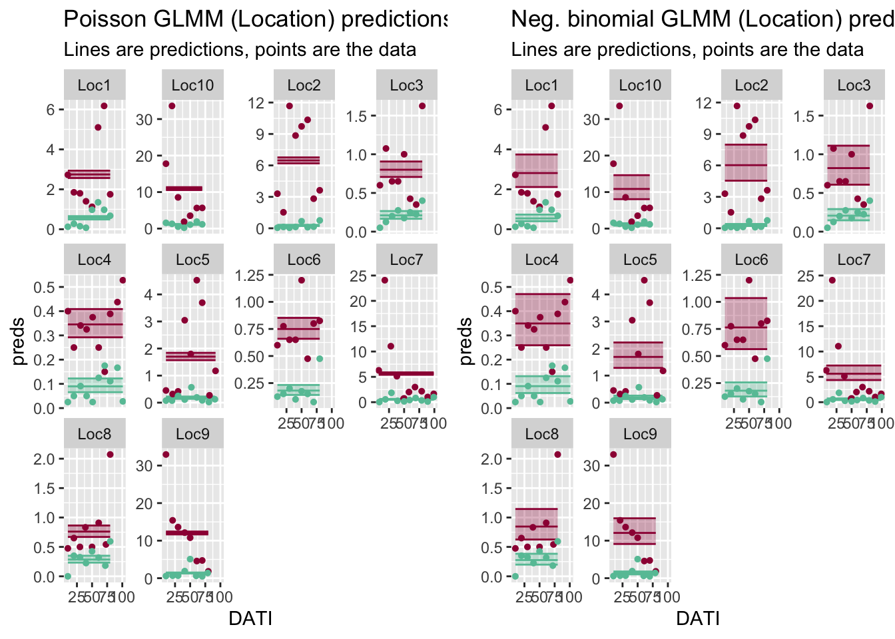

Side-by-side comparison of the frequentist vs Bayes negative binomial GLMM (Location RE) predictions.


``` r
cowplot::plot_grid(p2nb_glmm + theme(legend.position="none"),
                   bayes_p2nb + theme(legend.position="none"))
```


#### GLMM's (Location RE, nested Date)

Note: These models are a great fit to the data that we have! But, they are overly confident and will not be good at predicting at new locations and new sampling dates.

Side-by-side comparison of the frequentist Poisson vs negative  binomial GLMM (Location RE) predictions.


``` r
cowplot::plot_grid(p3p_glmm + theme(legend.position="none"), 
                   p3nb_glmm + theme(legend.position="none"))
```

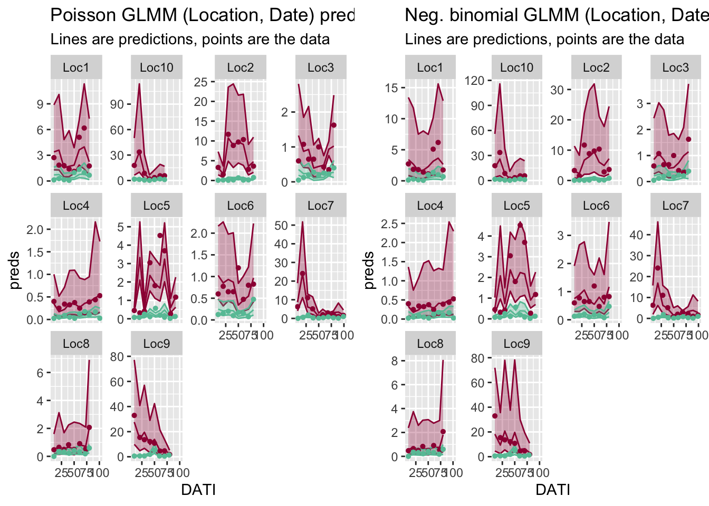

Side-by-side comparison of the frequentist vs Bayes negative binomial GLMM (Location RE) predictions.


``` r
cowplot::plot_grid(p3nb_glmm + theme(legend.position="none"),
                   bayes_p3nb + theme(legend.position="none"))
```


#### GLMM's: nested Date vs Gaussian Process Date

Once we properly account for the correlations in our sampling dates, we have much more uncertainty in our overall TR predictions (see table above) , and the predicted counts are "smoothed" over time for some of the locations.


``` r
cowplot::plot_grid(bayes_p3nb + theme(legend.position="none"),
                   bayes_p4nb + theme(legend.position="none"))
```


