# GLMM's in R {#GLMMsR}

When completing an analysis, I may skip around in my script quite a bit. Therefore, I like all packages loaded, and all data uploaded and manipulated at the start of my script (i.e., Section \@ref(Setup)).

## Setup {#Setup}


``` r
## R libraries:
# uncomment and change package name to download any required packages
# install.packages("kableExtra") 
library(MASS)
library(lme4)
library(magrittr)
library(tidyverse)
library(kableExtra)
library(ggmap)
# usethis::edit_r_environ() ## to save passwords in the hidden .Renviron file
register_google(Sys.getenv("ggmapKey")) # (key saved on hidden file for security)

# to run Bayesian models. Set appropriate nCores for your machine
library(brms)
nCores = 6 # nCores -2 so your machine doesn't overheat
library(ggmcmc) # ggs()


## Package and example code to find colors
# library(RColorBrewer)
# display.brewer.pal(11, "Spectral")
# brewer.pal(11, "Spectral")
mycolors = c("#9E0142", "#66C2A5")
```

``` r
# define some functions to use in this script.

## calculate trapping reduction for frequentist model fits.
getTR <- function (mod, coefs = -1) {
  b1 = summary(mod)$coef[coefs,1]
  seb1 = summary(mod)$coef[coefs,2]
  (TR = round(100 * (1- exp(b1)),1))
  (higher = round(100 * (1 - exp(b1 - 2*seb1)),1))
  (lower = round(100 * (1 - exp(b1 + 2*seb1)),1)) 
  data.frame(#Treatment = names(TR),
             TR = as.numeric(TR), 
             lowerCI = as.numeric(lower),
             upperCI = as.numeric(higher))   
}

## NA = 0 in sum
`%+%` <- function(x, y)  mapply(sum, x, y, MoreArgs = list(na.rm = TRUE))
#

## plot of predictions for frequentist models:
predplot <- function(preddata, plottitle = "") {
  p = ggplot(preddata,
       aes(DATI, preds, color = Treatment)) +
  geom_line() +
  geom_ribbon(aes(ymin = lowerCI, ymax = upperCI, fill = Treatment),
              alpha = 0.3) + 
  geom_point(data = mean_cts,
             aes(DATI, mean_mothsperday, color = Treatment), size = 1.1) +
  facet_wrap(~Location, scales = "free_y") + 
  scale_color_manual(values = mycolors) +
  scale_fill_manual(values = mycolors) +
  labs(title = plottitle, 
       subtitle = "Lines are predictions, points are the data", 
       y = "Moth count per day",
       x = "Days after installation (DAI)")

  return(p)
}

## plot of predictions for Bayesian models:
brmspredplot = function(preddata, plottitle = "") {
  p <- ggplot(preddata, 
       aes(x = DATI, y = Estimate, color = Treatment)) +  
  geom_line() + 
  geom_ribbon(aes(ymin = `Q2.5`, ymax = `Q97.5`, 
                  fill = Treatment),  # regression line and CI
                    alpha = 0.3) +
  geom_point(data = mean_cts, 
             aes(DATI, mean_mothsperday, color = Treatment), 
             size = 1.1) +
  facet_wrap(~Location, scales = "free_y") + 
  scale_color_manual(values = mycolors) +
  scale_fill_manual(values = mycolors) +
  labs(title = plottitle,
       subtitle = "Lines are predictions, points are the data", 
       y = "Moth count per day",
       x = "Days after installation (DAI)")

  return(p)
}
```

``` r
# read in the data:
datRinit = read.csv("data/moths.csv")
# check data values: 
# (Results not shown for succinctness)
str(datRinit)
summary(datRinit)
lapply(datRinit, function(x) {
  if (is.character(x))
    unique(x)
})
```

``` r
# manipulate data as needed:
datR <- datRinit %>%
  # convert dates to dates (instead of character string):
  mutate(TransplantDate = ymd(TransplantDate),
         DispInstallDate = ymd(DispInstallDate),
         TrapInstallDate = ymd(TrapInstallDate),
         SamplingDate = ymd(SamplingDate)
         )  %>%
  mutate(mothsperday = nYSB / DaysOfCatch, # standardize the counts
         # TreatmentF = factor(Treatment), # if we need to fix levels in non-alpha order. Excluded/commented out here for simplicity
         SamplingDateC = as.character(SamplingDate))

## average counts for each location, date
mean_cts <- datR %>%
  group_by(Location, Treatment,
           AssessmentNumber,
           SamplingDate, DATI) %>%
  summarize(mean_cts = mean(nYSB, na.rm = T),
            mean_mothsperday = mean(mothsperday)) %>%
  ungroup()
```


## Data exploration

### The data

Here is what the data look like after the above manipulation. 


``` r
kable(head(datR, 5)) %>%
  kable_styling() %>%
  scroll_box(width = "100%", box_css = "border: 0px;")
```

<div style="border: 0px;overflow-x: scroll; width:100%; "><table class="table" style="margin-left: auto; margin-right: auto;">
<caption>(\#tab:viewdata)(\#tab:viewdata)Case study data.</caption>
 <thead>
  <tr>
   <th style="text-align:left;"> Location </th>
   <th style="text-align:left;"> Treatment </th>
   <th style="text-align:right;"> TrapID </th>
   <th style="text-align:right;"> Longitude </th>
   <th style="text-align:right;"> Latitude </th>
   <th style="text-align:left;"> TransplantDate </th>
   <th style="text-align:left;"> TrapInstallDate </th>
   <th style="text-align:left;"> DispInstallDate </th>
   <th style="text-align:right;"> AssessmentNumber </th>
   <th style="text-align:left;"> SamplingDate </th>
   <th style="text-align:right;"> nYSB </th>
   <th style="text-align:right;"> DaysOfCatch </th>
   <th style="text-align:right;"> DATI </th>
   <th style="text-align:right;"> DADI </th>
   <th style="text-align:right;"> DAT </th>
   <th style="text-align:right;"> mothsperday </th>
   <th style="text-align:left;"> SamplingDateC </th>
  </tr>
 </thead>
<tbody>
  <tr>
   <td style="text-align:left;"> Loc9 </td>
   <td style="text-align:left;"> Trt </td>
   <td style="text-align:right;"> 201 </td>
   <td style="text-align:right;"> 111.6028 </td>
   <td style="text-align:right;"> -7.233634 </td>
   <td style="text-align:left;"> 2023-08-06 </td>
   <td style="text-align:left;"> 2023-08-13 </td>
   <td style="text-align:left;"> 2023-08-13 </td>
   <td style="text-align:right;"> 1 </td>
   <td style="text-align:left;"> 2023-08-23 </td>
   <td style="text-align:right;"> 4 </td>
   <td style="text-align:right;"> 10 </td>
   <td style="text-align:right;"> 10 </td>
   <td style="text-align:right;"> 10 </td>
   <td style="text-align:right;"> 17 </td>
   <td style="text-align:right;"> 0.4000000 </td>
   <td style="text-align:left;"> 2023-08-23 </td>
  </tr>
  <tr>
   <td style="text-align:left;"> Loc9 </td>
   <td style="text-align:left;"> Trt </td>
   <td style="text-align:right;"> 201 </td>
   <td style="text-align:right;"> 111.6028 </td>
   <td style="text-align:right;"> -7.233634 </td>
   <td style="text-align:left;"> 2023-08-06 </td>
   <td style="text-align:left;"> 2023-08-13 </td>
   <td style="text-align:left;"> 2023-08-13 </td>
   <td style="text-align:right;"> 2 </td>
   <td style="text-align:left;"> 2023-09-03 </td>
   <td style="text-align:right;"> 6 </td>
   <td style="text-align:right;"> 11 </td>
   <td style="text-align:right;"> 21 </td>
   <td style="text-align:right;"> 21 </td>
   <td style="text-align:right;"> 28 </td>
   <td style="text-align:right;"> 0.5454545 </td>
   <td style="text-align:left;"> 2023-09-03 </td>
  </tr>
  <tr>
   <td style="text-align:left;"> Loc9 </td>
   <td style="text-align:left;"> Trt </td>
   <td style="text-align:right;"> 201 </td>
   <td style="text-align:right;"> 111.6028 </td>
   <td style="text-align:right;"> -7.233634 </td>
   <td style="text-align:left;"> 2023-08-06 </td>
   <td style="text-align:left;"> 2023-08-13 </td>
   <td style="text-align:left;"> 2023-08-13 </td>
   <td style="text-align:right;"> 3 </td>
   <td style="text-align:left;"> 2023-09-12 </td>
   <td style="text-align:right;"> 6 </td>
   <td style="text-align:right;"> 9 </td>
   <td style="text-align:right;"> 30 </td>
   <td style="text-align:right;"> 30 </td>
   <td style="text-align:right;"> 37 </td>
   <td style="text-align:right;"> 0.6666667 </td>
   <td style="text-align:left;"> 2023-09-12 </td>
  </tr>
  <tr>
   <td style="text-align:left;"> Loc9 </td>
   <td style="text-align:left;"> Trt </td>
   <td style="text-align:right;"> 201 </td>
   <td style="text-align:right;"> 111.6028 </td>
   <td style="text-align:right;"> -7.233634 </td>
   <td style="text-align:left;"> 2023-08-06 </td>
   <td style="text-align:left;"> 2023-08-13 </td>
   <td style="text-align:left;"> 2023-08-13 </td>
   <td style="text-align:right;"> 4 </td>
   <td style="text-align:left;"> 2023-09-23 </td>
   <td style="text-align:right;"> 24 </td>
   <td style="text-align:right;"> 11 </td>
   <td style="text-align:right;"> 41 </td>
   <td style="text-align:right;"> 41 </td>
   <td style="text-align:right;"> 48 </td>
   <td style="text-align:right;"> 2.1818182 </td>
   <td style="text-align:left;"> 2023-09-23 </td>
  </tr>
  <tr>
   <td style="text-align:left;"> Loc9 </td>
   <td style="text-align:left;"> Trt </td>
   <td style="text-align:right;"> 201 </td>
   <td style="text-align:right;"> 111.6028 </td>
   <td style="text-align:right;"> -7.233634 </td>
   <td style="text-align:left;"> 2023-08-06 </td>
   <td style="text-align:left;"> 2023-08-13 </td>
   <td style="text-align:left;"> 2023-08-13 </td>
   <td style="text-align:right;"> 5 </td>
   <td style="text-align:left;"> 2023-10-02 </td>
   <td style="text-align:right;"> 43 </td>
   <td style="text-align:right;"> 9 </td>
   <td style="text-align:right;"> 50 </td>
   <td style="text-align:right;"> 50 </td>
   <td style="text-align:right;"> 57 </td>
   <td style="text-align:right;"> 4.7777778 </td>
   <td style="text-align:left;"> 2023-10-02 </td>
  </tr>
</tbody>
</table></div>

Column descriptions: 

* **Location**-- data were collected from 10 trial locations, 

* **Treatment**-- Control or Treatment (Trt), 

* **TrapID**-- each trap within a trial location has a unique ID, 

* **Longitude**, **Latitude**-- the coordinates of each unique trap,

* **TransplantDate**-- the date that the rice seedlings were transplanted into the field,

* **TrapInstallDate**-- the trap installation date, which is usually the same as the dispenser installation date, 

* **DispInstallDate**-- the treatment (pheromone dispenser) installation date; 

* **AssessmentNumber**-- traps are sampled 10 times each. Using assessment number is a way to standardize the sampling dates across locations, 

* **SamplingDate**-- the date on which the trap was checked and moths were counted,

* **nYSB**-- the moth counts (number of YSB moths) associated with each trap, location, and date, 

* **DaysOfCatch**-- the number of days since the trap was previously sampled or the number of days since trap installation if it is assessment number 1,

* **DATI** is days after trap installation; 

* **DADI**-- days after dispenser installation; and 

* **DAT**-- days after transplant. 

* **mothsperday**-- moths caught per day, nYSB / DaysOfCatch, and

* **SamplingDateC**-- Sampling Date as a character/string (for model in Section \\@ref(glmm_datesC)),

### Moth counts plotted

The data are the moth counts collected at each trap (average per day), within each location and throughout the season. Note how the y-axis changes for each plot in the figure.


``` r
ggplot(datR,
       aes(DATI, mothsperday, color = Treatment)) +
  geom_jitter(height = 0, width = 0.75, alpha = 0.5) +
  geom_smooth(se=F) +
  facet_wrap(~Location, scales = "free_y") + 
  scale_color_manual(values = mycolors) +
  labs(title = "Male YSB moth counts for each location and trap",
       subtitle = "with smoothing lines",
       y = "Moth counts per trap per day",
       x = "Days after trap installation (DATI)",
       color = "Treatment")
```

<div class="figure">
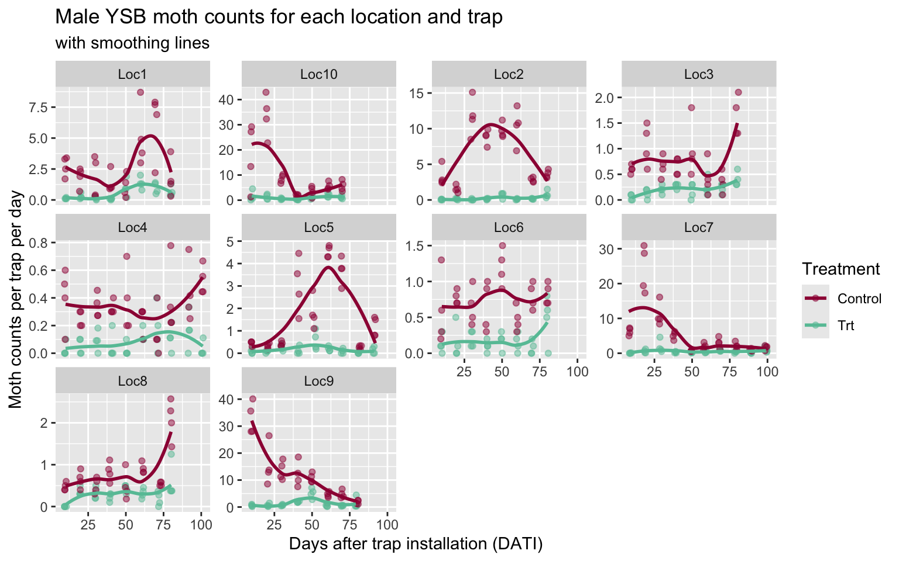
<p class="caption">(\#fig:plotMoths)Moth counts by location.</p>
</div>

### Trial locations

Trial locations in relation to each other. Some trial locations are closer to each other than others.


``` r
basemap <- get_googlemap(c(lon = mean(datR$Longitude, na.rm = T),
                           lat = mean(datR$Latitude, na.rm = T)),
                         color = "bw",
                         zoom = 7)
ggmap(basemap) +
  geom_point(data = datR,
             aes(Longitude, Latitude, color = Location), size = 2) +
  labs(title = "Trial locations") +
  scale_color_brewer(palette = "PuOr") 
```

<div class="figure">
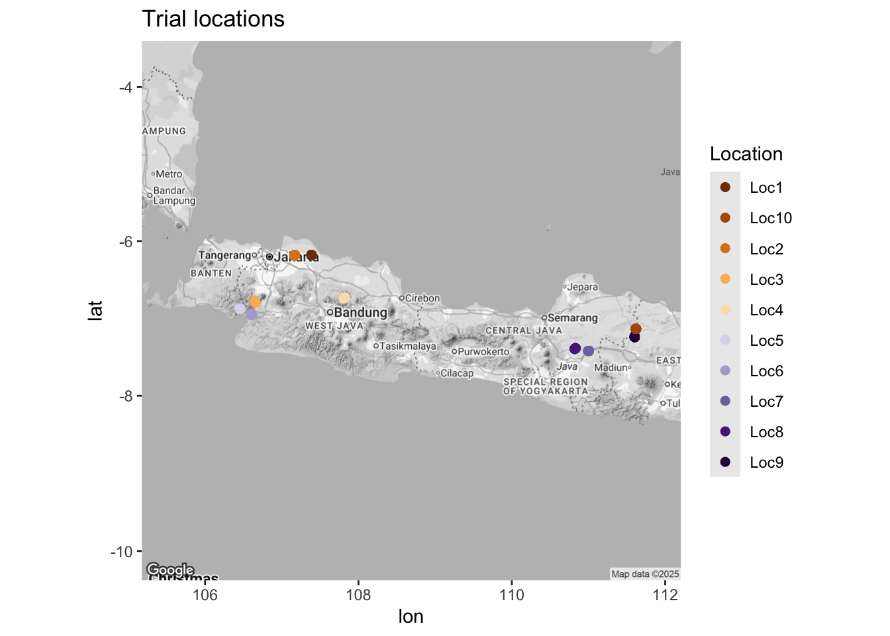
<p class="caption">(\#fig:LocsFig)Trial locations.</p>
</div>

There are 4 traps per treatment at each location.

<!-- Within each location, the treatment traps have a slightly different alignment: -->


## Fitted GLM models {#fit-glmR}

To start, we ignore all the spatial and temporal relationships in the data and assume each data point is independent and identically distributed (_iid_). **This is not a good model for the data!** It is just our starting off point.

When building hierarchical Bayesian models, it is always a good idea to start simple, make sure everything works as expected, and then build up.

See Section \@ref(glm) for the associated mathematical models.

### Frequentist Poisson model

These models show a very tight confidence intervals for our coefficient estimates and our predictions. But also, the residual deviance is MUCH greater than the degree of freedom, indicating a lack of fit. The plot of the predictions (Figure \@ref(fig:p1p-glmFig)) overlaid on the data also demonstrate the lack of fit.


``` r
mod1p <- glm(nYSB ~ Treatment, 
             offset = log(DaysOfCatch),
             family = poisson,
             data = datR)
summary(mod1p)
```

```
## 
## Call:
## glm(formula = nYSB ~ Treatment, family = poisson, data = datR, 
##     offset = log(DaysOfCatch))
## 
## Coefficients:
##               Estimate Std. Error z value Pr(>|z|)    
## (Intercept)   1.396045   0.008574  162.83   <2e-16 ***
## TreatmentTrt -2.166510   0.026769  -80.93   <2e-16 ***
## ---
## Signif. codes:  0 '***' 0.001 '**' 0.01 '*' 0.05 '.' 0.1 ' ' 1
## 
## (Dispersion parameter for poisson family taken to be 1)
## 
##     Null deviance: 36638  on 671  degrees of freedom
## Residual deviance: 25678  on 670  degrees of freedom
## AIC: 28072
## 
## Number of Fisher Scoring iterations: 6
```

#### Predictions 

See Section \@ref(defineTR) for definition of trapping reduction (TR).


``` r
## obtain TR estimate for comparison later (custom function from Setup code)
TR_1p <- getTR(mod1p) 
kable(TR_1p)  %>%
  kable_styling(full_width = F)
```

<table class="table" style="width: auto !important; margin-left: auto; margin-right: auto;">
<caption>(\#tab:TR1p)(\#tab:TR1p)Trapping reduction estimate for the Poisson GLM model.</caption>
 <thead>
  <tr>
   <th style="text-align:right;"> TR </th>
   <th style="text-align:right;"> lowerCI </th>
   <th style="text-align:right;"> upperCI </th>
  </tr>
 </thead>
<tbody>
  <tr>
   <td style="text-align:right;"> 88.5 </td>
   <td style="text-align:right;"> 87.9 </td>
   <td style="text-align:right;"> 89.1 </td>
  </tr>
</tbody>
</table>

For a check of model fit, I compare predicted moths per day to the observed moths per day.

Note: when I predict for new data, I set $DaysOfCatch = 1$, and then I compare to the moths per day variable ($mothsperday = nYSB / DaysOfCatch$). I want to exclude any patterns related to the varying time intervals.


``` r
## code to predict moth counts from model:
tmp = predict(mod1p, se = T, type = "link",
              newdata = datR  %>% mutate(DaysOfCatch = 1))
# str(tmp)
preds1p <- data.frame(datR, 
                      preds = tmp$fit,
                      lowerCI = tmp$fit + 2*tmp$se.fit,
                      upperCI = tmp$fit - 2*tmp$se.fit)
preds1p %<>%
  mutate(preds = exp(preds),
         lowerCI = exp(lowerCI),
         upperCI = exp(upperCI))

p1p_glm = predplot(preds1p, "Poisson GLM predictions") # custom function from Setup
print(p1p_glm)
```

<div class="figure">
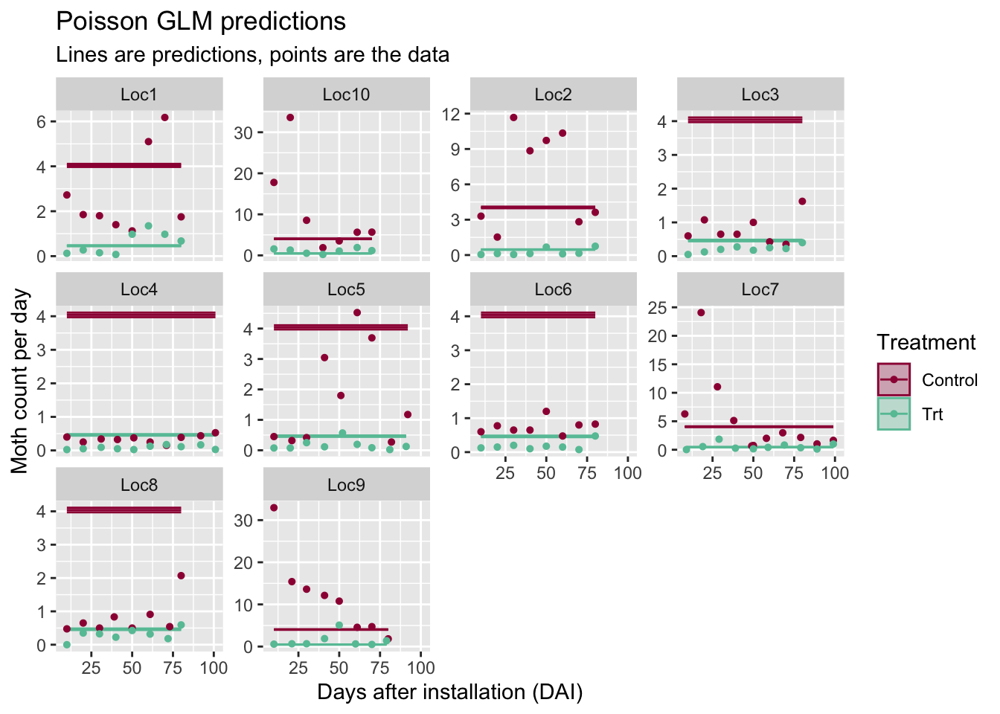
<p class="caption">(\#fig:p1p-glmFig)Poisson GLM predictions.</p>
</div>

The model is such a bad fit to the data, it is hard to even tell what is going on in the figure above.

### Frequentist NB model {#nb1}

For the negative binomial (NB) model, our confidence intervals are a little wider, but we are still ignoring all the correlations in our data. And the plot of the predictions again indicates the lack of fit (Figure \@ref(fig:p1nb-glmFig)).


``` r
mod1nb <- glm.nb(nYSB ~ Treatment + 
             offset(log(DaysOfCatch)),
             data = datR)
# summary(mod1nb)
```

#### Predictions

<table class="table" style="width: auto !important; margin-left: auto; margin-right: auto;">
<caption>(\#tab:TR1nb)(\#tab:TR1nb)Trapping reduction estimate for the negative binomial GLM model.</caption>
 <thead>
  <tr>
   <th style="text-align:right;"> TR </th>
   <th style="text-align:right;"> lowerCI </th>
   <th style="text-align:right;"> upperCI </th>
  </tr>
 </thead>
<tbody>
  <tr>
   <td style="text-align:right;"> 88.5 </td>
   <td style="text-align:right;"> 86 </td>
   <td style="text-align:right;"> 90.6 </td>
  </tr>
</tbody>
</table>

<div class="figure">
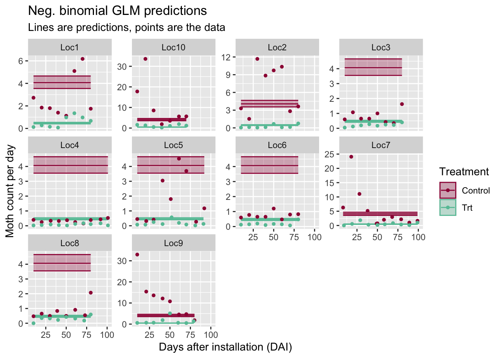
<p class="caption">(\#fig:p1nb-glmFig)Negative bimomial GLM predictions.</p>
</div>

### Bayesian model

In R, I fit the Bayesian models using the `brms` package. I find this package very intuitive and it has fast, efficient algorithms using Stan on the back-end. 

Because the models take a few minutes to fit, I usually fit them when I am initially running through my code, save them, and then only load the model fit when rendering the Rmarkdown file and creating the resulting figures.


``` r
## not run:
brm1nb <- brm(formula = nYSB ~ Treatment + offset(log(DaysOfCatch)),
              data = datR, 
              family = negbinomial, #log-link is default
              prior = c(set_prior("normal(0,2)", class = "b"),
                        set_prior("normal(0,2)", class = "Intercept"),
                        set_prior("cauchy(0,1)", class = "shape")), # is half-cauchy
              warmup = 500, iter = 2000,  # use more iter for final model
              seed = 5000, # so that you get the same results
              chains = nCores, cores = nCores) 
saveRDS(brm1nb, "output/brm1nb.RDS")
```

The prior_summary command is helpful if you do not know what a parameter is called in `brms`-- it is shows the prior distributions. Here, I used the command to find out what they called their $\theta$ parameter. (They call it the shape parameter.)


``` r
brm1nb <- readRDS("output/brm1nb.RDS")
prior_summary(brm1nb)
```

```
##        prior     class         coef group resp dpar nlpar lb ub       source
##  normal(0,2)         b                                                  user
##  normal(0,2)         b TreatmentTrt                             (vectorized)
##  normal(0,2) Intercept                                                  user
##  cauchy(0,1)     shape                                     0            user
```

The Bayesian parameter estimates match very closely to the frequentist estimates (copied here from Section \@ref(nb1)):


Table: (\#tab:compareCoef1nb)Coefficient estimates from the Bayesian framework, fit using the brms package.

|             | Estimate| Est.Error| l-95% CI| u-95% CI|
|:------------|--------:|---------:|--------:|--------:|
|Intercept    |    1.402|     0.069|    1.267|    1.540|
|TreatmentTrt |   -2.159|     0.100|   -2.354|   -1.964|


Table: (\#tab:compareCoef1nb)Coefficient estimates from the frequentist framework, fit using glm.nb().

|             | Estimate| Std. Error| z value| Pr(>&#124;z&#124;)|
|:------------|--------:|----------:|-------:|------------------:|
|(Intercept)  |    1.402|      0.068|  20.652|                  0|
|TreatmentTrt |   -2.164|      0.099| -21.871|                  0|

Table: (\#tab:compareShape1nb)Shape parameter estimate from the Bayesian framework.

|      | Estimate| Est.Error| l-95% CI| u-95% CI|
|:-----|--------:|---------:|--------:|--------:|
|shape |    0.655|     0.035|    0.588|    0.726|


Table: (\#tab:compareShape1nb)Shape parameter estimate from the frequentist framework.

|     x|
|-----:|
| 0.656|

The matching parameter estimates are expected, but reassuring that we have built the correct foundation for the more complicated models to come. 

One difference however is that the frequentist model gives only a point estimate for the shape parameter while the Bayesian model gives us a distribution and therefore 95% credible intervals for the parameter.

The next code chink calculates trapping reduction (TR) for this model and the model predictions of the moth counts for each location and date.


``` r
## Calc TR for later comparison
mod1t <- ggs(brm1nb) # transform MCMC output into a table
# unique(mod1t$Parameter)
beta1 <- mod1t %>% 
  filter(Parameter == "b_TreatmentTrt", # our beta1
         Iteration > 500) # remove burn-in
TR = 100 * (1 - exp(beta1$value))
bayesTR_1nb <- data.frame(TR = round(median(TR), 1), 
           lowerCI = round(quantile(TR, 0.025), 1),
          upperCI = round(quantile(TR, 0.975), 1))   
row.names(bayesTR_1nb) = NULL
kable(bayesTR_1nb)  %>%
  kable_styling(full_width = F)
```

<table class="table" style="width: auto !important; margin-left: auto; margin-right: auto;">
<caption>(\#tab:TRBayes1nb)(\#tab:TRBayes1nb)Trapping reduction estimate for the negative binomial GLM model.</caption>
 <thead>
  <tr>
   <th style="text-align:right;"> TR </th>
   <th style="text-align:right;"> lowerCI </th>
   <th style="text-align:right;"> upperCI </th>
  </tr>
 </thead>
<tbody>
  <tr>
   <td style="text-align:right;"> 88.5 </td>
   <td style="text-align:right;"> 86 </td>
   <td style="text-align:right;"> 90.5 </td>
  </tr>
</tbody>
</table>


``` r
## plot predictions:
predsbrm1nb <- fitted(brm1nb,
                       scale = "linear",
                        newdata = datR  %>% mutate(DaysOfCatch = 1))   

bayes_p1nb = brmspredplot(cbind(datR, exp(predsbrm1nb)), 
                          plottitle = "Bayes NB GLM predictions")
print(bayes_p1nb)
```

<div class="figure">
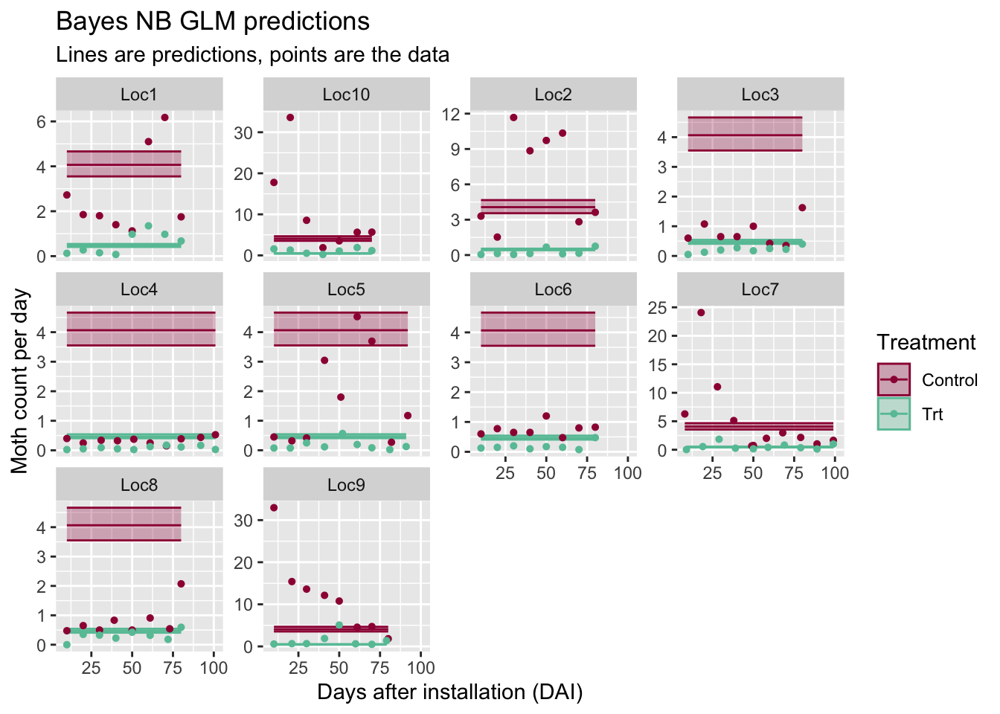
<p class="caption">(\#fig:pBayes1nb-Fig)Bayesian negative binomial GLM predictions.</p>
</div>

The figure looks almost identical to the the frequent predictions (Figure \@ref(fig:p1nb-glmFig)). Comparisons of all TR estimates, coefficient estimates, and predicted moth counts  can be found at the end of the page (Section \@ref(compareTR)).

## GLMM: Random effects (RE) for locations {#fit-glmmR}

The first fix we make to the model is acknowledging that overall average  moth pressure varies from location to location (see Fig \@ref(fig:mothctsFig) of moth counts). To make this fix, we add a location random effect (RE) and our model becomes a generalized linear mixed-effects model (GLMM or GLMER).

We also want to acknowledge that the treatment effect may vary from location to location-- sometimes we see a big difference in moth counts between control and treatment fields, and sometimes the difference is smaller. For inference though, we are only interested in the larger picture, which is the overall trapping reduction. (We are not interested in what happens at these exact locations per se, we are more interested in the average treatment effect.) Therefore, we also add a treatment random effect (i.e., random slopes).

See Section \@ref(glmm) for the associated mathematical models.

<!-- ### GLMM Poisson fit -->


### GLMM neg binom fit

A couple of notes here. R always gets mad when you ask for SE's for predictions from a GLMM. Technically, you need to run simulations to get them and then they still come with an asterisk related to their reliability. (This is a reason to use the Bayesian model-- credible intervals are never based on approximations!)

Only the negative binomial (and not the Poisson) model are fit going forward.


``` r
mod2nb <- glmer.nb(nYSB ~ Treatment + (1 + Treatment|Location), 
             offset = log(DaysOfCatch),
             data = datR)
# summary(mod2nb)
TR_2nb <- getTR(mod2nb)
kable(TR_2nb, caption = "Trapping reduction estimate for the Poisson GLMM model.")  %>%
  kable_styling(full_width = F)
```

<table class="table" style="width: auto !important; margin-left: auto; margin-right: auto;">
<caption>(\#tab:nb2)(\#tab:nb2)Trapping reduction estimate for the Poisson GLMM model.</caption>
 <thead>
  <tr>
   <th style="text-align:right;"> TR </th>
   <th style="text-align:right;"> lowerCI </th>
   <th style="text-align:right;"> upperCI </th>
  </tr>
 </thead>
<tbody>
  <tr>
   <td style="text-align:right;"> 85 </td>
   <td style="text-align:right;"> 77.5 </td>
   <td style="text-align:right;"> 90 </td>
  </tr>
</tbody>
</table>

When we plot our predictions, we see that we now have better estimates for the overall mean at each location, and we see how much they vary from location to location, but there is a strong temporal pattern at each location that we are missing in the model.


``` r
tmp = predict(mod2nb, se = T, type = "link",
              newdata=datR %>% mutate(DaysOfCatch = 1))
# str(tmp)
preds2nb <- data.frame(datR, 
                      preds = tmp$fit,
                      lowerCI = tmp$fit + 2*tmp$se.fit,
                      upperCI = tmp$fit - 2*tmp$se.fit)
preds2nb %<>%
  mutate(preds = exp(preds),
         lowerCI = exp(lowerCI),
         upperCI = exp(upperCI))
# str(predsnb2)

p2nb_glmm = predplot(preds2nb, "NB GLMM predictions")
print(p2nb_glmm)
```

<div class="figure">

<p class="caption">(\#fig:p2nb-glmmFig, echo-F)NB GLMM moth count predictions.</p>
</div>


### GLMM Bayesian fit

By default, the prior distributions of random slopes and intercepts are correlated in `brm`, which matches the `GLMM` frequentist fit. If the correlation is non-significant, you may want to remove that correlation to simplify your model. To remove the correlation, change the random effects term from `(1 + TreatmentF|Location)` to `(1 + TreatmentF||Location)` (has an extra vertical line), which makes them independent. 


``` r
##not run
brm2nb <- brm(formula = nYSB ~ Treatment + offset(log(DaysOfCatch)) + 
                    (1 + Treatment|Location),
              data = datR, 
              family = negbinomial,
              prior = c(set_prior("normal(0,2)", class = "b"),
                        set_prior("cauchy(0,1)", class = "shape"), 
                        set_prior("normal(0,2)", class = "Intercept"),
                        set_prior("cauchy(0,1)", class = "sd")),
              control = list(adapt_delta = 0.9), # b/c of divergent warning
              warmup = 500, iter = 2000, 
              seed = 5000,
              chains = nCores, cores = nCores) 
saveRDS(brm2nb, "output/brm2nb.RDS")
```

``` r
brm2nb <- readRDS("output/brm2nb.RDS")
# summary(brm2nb)
```

You'll notice that the parameter estimates are slightly different from the frequentist NB model fit here-- the more complicated your model is, the more likely you will find this is true with slightly different versions of your model (here, adding priors and fitting with a different algorithm). 


Table: (\#tab:compareCoef2nb)Coefficient estimates from the Bayesian GLMM.

|             | Estimate| Est.Error| l-95% CI| u-95% CI|
|:------------|--------:|---------:|--------:|--------:|
|Intercept    |    0.824|     0.423|   -0.026|    1.666|
|TreatmentTrt |   -1.885|     0.229|   -2.341|   -1.415|


Table: (\#tab:compareCoef2nb)Coefficient estimates from the frequentist GLMM.

|             | Estimate| Std. Error| z value| Pr(>&#124;z&#124;)|
|:------------|--------:|----------:|-------:|------------------:|
|(Intercept)  |    0.826|      0.378|   2.184|              0.029|
|TreatmentTrt |   -1.899|      0.203|  -9.340|              0.000|

Table: (\#tab:compareShape2nb)Shape parameter estimate from the Bayesian GLMM

|      | Estimate| Est.Error| l-95% CI| u-95% CI|
|:-----|--------:|---------:|--------:|--------:|
|shape |    1.533|     0.098|    1.349|     1.73|

<table class="table" style="margin-left: auto; margin-right: auto;">
<caption>(\#tab:compareShape2nb)(\#tab:compareShape2nb)Shape parameter estimate from the frequentist GLMM</caption>
 <thead>
  <tr>
   <th style="text-align:left;"> x </th>
  </tr>
 </thead>
<tbody>
  <tr>
   <td style="text-align:left;"> 1.5338 </td>
  </tr>
</tbody>
</table>


``` r
## Calc TR for later comparison
modtransformed <- ggs(brm2nb) # transform MCMC output into a table
beta1 <- modtransformed %>% 
  filter(Parameter == "b_TreatmentTrt", # our beta1
         Iteration > 500) # remove burn-in
TR = 100 * (1 - exp(beta1$value))
bayesTR_2nb <- data.frame(TR = round(median(TR), 1), 
           lowerCI = round(quantile(TR, 0.025), 1),
          upperCI = round(quantile(TR, 0.975), 1))   
row.names(bayesTR_2nb) = NULL
kable(bayesTR_2nb, caption = "Trapping reduction estimate for the negative binomial GLMM model.")  %>%
  kable_styling(full_width = F)
```

<table class="table" style="width: auto !important; margin-left: auto; margin-right: auto;">
<caption>(\#tab:TRBayes2nb)(\#tab:TRBayes2nb)Trapping reduction estimate for the negative binomial GLMM model.</caption>
 <thead>
  <tr>
   <th style="text-align:right;"> TR </th>
   <th style="text-align:right;"> lowerCI </th>
   <th style="text-align:right;"> upperCI </th>
  </tr>
 </thead>
<tbody>
  <tr>
   <td style="text-align:right;"> 84.8 </td>
   <td style="text-align:right;"> 75.7 </td>
   <td style="text-align:right;"> 90.4 </td>
  </tr>
</tbody>
</table>

<div class="figure">
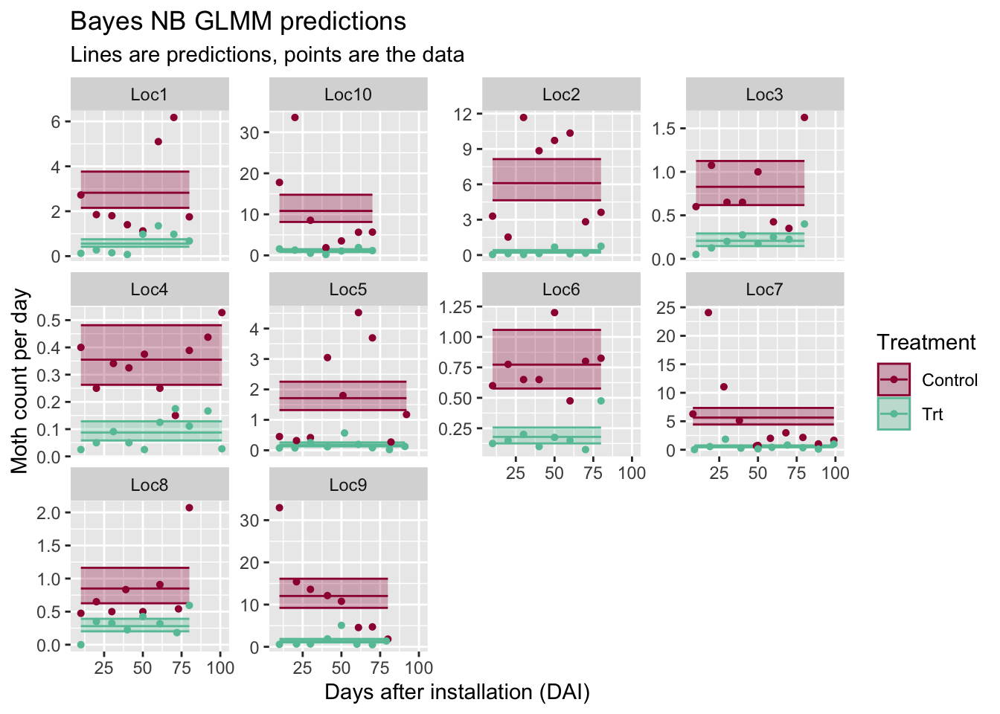
<p class="caption">(\#fig:pBayes2nb-Fig)Bayesian negative binomial GLM predictions.</p>
</div>

Again, the figure looks almost identical to the the frequent predictions (Figure \@ref(fig:p2nb-glmmFig)). 


## GLMM: RE for location, sampling date {#fit-glmm-datesR}

In this version of the model, we acknowledge that sampling on different days of the season adds to the variability of the moth counts, and that counts from the same sampling date are more similar than for a different date. In this model, however,  the correlation between sampling dates is ignored.

This model is included here because it is important to think about whether you have nested or crossed random effects (if applicable) because the options may lead to _very_ different estimates of your uncertainty. Here, we are assuming crossed random effects because Java island is fairly homogeneous in terms of weather and ecosystem so it may make sense for all samples from one date to be grouped together. However, one could also argue for nested RE's for this case study. 

This model allows us to include sampling date in our model as a random effect and still fit the model quickly in a frequentist framework. 

Include dates because samples within a date will be more similar than samples across all dates at a location. But only include random intercepts.

The predictions now mimic the spatial patterns we see over time.

See Section \@ref(glmm-dates) for the associated mathematical models.

<!-- ### Crossed Poisson GLMM fit -->

<!-- Summary output not shown for increased readability. -->


### Crossed NB GLMM fit

Summary output not shown for increased readability.


``` r
mod3nb <- glmer.nb(nYSB ~ Treatment  +
                      (1 + Treatment|Location) + 
                 (1|SamplingDateC), 
             offset = log(DaysOfCatch),
             data = datR)
# summary(mod3nb)
TR_3nb <- getTR(mod3nb)
kable(TR_3nb)  %>%
  kable_styling(full_width = F)
```

<table class="table" style="width: auto !important; margin-left: auto; margin-right: auto;">
<caption>(\#tab:nb3)(\#tab:nb3)Trapping reduction estimate for the Crossed Poisson GLMM model.</caption>
 <thead>
  <tr>
   <th style="text-align:right;"> TR </th>
   <th style="text-align:right;"> lowerCI </th>
   <th style="text-align:right;"> upperCI </th>
  </tr>
 </thead>
<tbody>
  <tr>
   <td style="text-align:right;"> 82.9 </td>
   <td style="text-align:right;"> 74.9 </td>
   <td style="text-align:right;"> 88.4 </td>
  </tr>
</tbody>
</table>
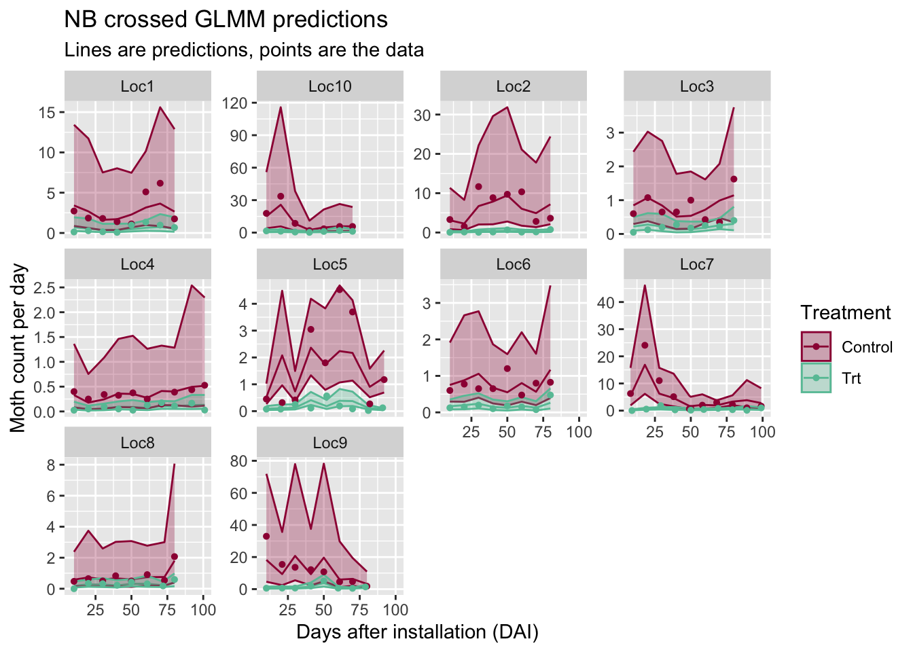

### Crossed Bayes GLMM fit


``` r
##not run
brm3nb <- brm(formula = nYSB ~ Treatment + offset(log(DaysOfCatch)) + 
                    (1 + Treatment|Location) + 
                    (1|SamplingDateC),
              data = datR, 
              family = negbinomial,
              prior = c(set_prior("normal(0,2)", class = "b"),
                        set_prior("cauchy(0,1)", class = "shape"), # == half-cauchy
                        set_prior("normal(0,2)", class = "Intercept"),
                        set_prior("cauchy(0,1)", class = "sd")),
              warmup = 500, iter = 2000, 
              seed = 5000,
              chains = nCores, cores = nCores) 
saveRDS(brm3nb, "output/brm3nb.RDS")
```


Again, the parameter estimates from the Bayesian and frequentist frameworks vary slightly.


Table: (\#tab:compareCoef3nb)Coefficient estimates from the Bayesian framework for the crossed GLMM.

|             | Estimate| Est.Error| l-95% CI| u-95% CI|
|:------------|--------:|---------:|--------:|--------:|
|Intercept    |    0.642|     0.375|   -0.102|    1.378|
|TreatmentTrt |   -1.748|     0.229|   -2.203|   -1.278|


Table: (\#tab:compareCoef3nb)Coefficient estimates from the frequentist framework for the crossed GLMM.

|             | Estimate| Std. Error| z value| Pr(>&#124;z&#124;)|
|:------------|--------:|----------:|-------:|------------------:|
|(Intercept)  |    0.632|      0.342|   1.846|              0.065|
|TreatmentTrt |   -1.767|      0.195|  -9.040|              0.000|

Table: (\#tab:compareShape3nb)Shape parameter estimate from the Bayesian framework.

|      | Estimate| Est.Error| l-95% CI| u-95% CI|
|:-----|--------:|---------:|--------:|--------:|
|shape |    2.577|     0.218|    2.174|    3.033|

<table class="table" style="margin-left: auto; margin-right: auto;">
<caption>(\#tab:compareShape3nb)(\#tab:compareShape3nb)Shape parameter estimate from the frequentist framework.</caption>
 <thead>
  <tr>
   <th style="text-align:left;"> x </th>
  </tr>
 </thead>
<tbody>
  <tr>
   <td style="text-align:left;"> 2.5826 </td>
  </tr>
</tbody>
</table>


<table class="table" style="width: auto !important; margin-left: auto; margin-right: auto;">
<caption>(\#tab:TRBayes3nb)(\#tab:TRBayes3nb)Trapping reduction estimate for the negative binomial GLMM model.</caption>
 <thead>
  <tr>
   <th style="text-align:left;">  </th>
   <th style="text-align:right;"> TR </th>
   <th style="text-align:right;"> lowerCI </th>
   <th style="text-align:right;"> upperCI </th>
  </tr>
 </thead>
<tbody>
  <tr>
   <td style="text-align:left;"> 2.5% </td>
   <td style="text-align:right;"> 82.6 </td>
   <td style="text-align:right;"> 72.1 </td>
   <td style="text-align:right;"> 89 </td>
  </tr>
</tbody>
</table>

<div class="figure">
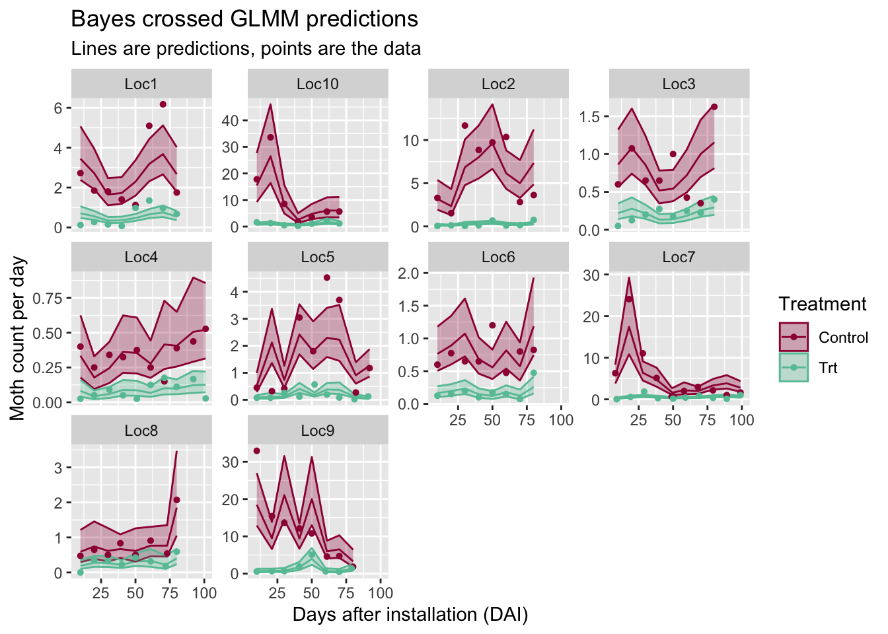
<p class="caption">(\#fig:pBayes3nb-Fig)Bayesian crossed NB GLMM predictions.</p>
</div>


## GLMM with Gaussian Processes: RE for Trial, GP for Date {#fit-glmm-gpR}

Now we are in the territory where we have to fit the models in a Bayesian framework. If our response variable was continuous (i.e., the regression model was based on a Normal distribution), then we could still use maximum likelihood estimation.

See Section \@ref(glmm-gp) for the associated mathematical models.

### Gaussian Process Bayes GLMM fit

* Use numeric version of sampling date for better algorithm stability. To obtain a numeric date, we use DATI-- days after trap installation-- to quantify time.

* We have a warning about a divergent transition. Ideally, we would tweak the model and look at the data carefully so fix this warning, but because we are working with made up data, we will not worry about the warning for now.

* Using squared-exponential covariance function (quite typical choice).

* Here, we have a different GP for each location (each location has its own parameters for the function). This is done to further account for expected differences between locations. Ideally, we would do some model selection to decide between this model and one that shares the GP parameters across all locations.


``` r
## not run:
brm4nb <- brm(formula = nYSB ~ Treatment + offset(log(DaysOfCatch)) + 
                    (1 + Treatment|Location) + 
              gp(DATI, by =Location), 
                  control = list(adapt_delta = 0.9),
              data = datR, 
              family = negbinomial,
              prior = c(set_prior("normal(0,2)", class = "b"),
                        set_prior("cauchy(0,1)", class = "shape"), # == half-cauchy
                        set_prior("normal(0,2)", class = "Intercept"),
                        set_prior("cauchy(0,1)", class = "sd"),
                        set_prior("cauchy(0,1)", class = "lscale", 
                                  coef = "gpDATILocationLoc1"),
                        set_prior("cauchy(0,1)", class = "lscale", 
                                  coef = "gpDATILocationLoc2"),
                        set_prior("cauchy(0,1)", class = "lscale", coef = "gpDATILocationLoc3"),
                        set_prior("cauchy(0,1)", class = "lscale", coef = "gpDATILocationLoc4"),
                        set_prior("cauchy(0,1)", class = "lscale", coef = "gpDATILocationLoc5"),
                        set_prior("cauchy(0,1)", class = "lscale", coef = "gpDATILocationLoc6"),
                        set_prior("cauchy(0,1)", class = "lscale", coef = "gpDATILocationLoc7"),
                        set_prior("cauchy(0,1)", class = "lscale", coef = "gpDATILocationLoc8"),
                        set_prior("cauchy(0,1)", class = "lscale", coef = "gpDATILocationLoc9"),
                        set_prior("cauchy(0,1)", class = "lscale", coef = "gpDATILocationLoc10"),
                        set_prior("normal(0,2)", class = "sdgp")),
                        # set_prior("lkj(2)", class = "cor")),
              warmup = 1000, iter = 5000, 
              seed = 5000,
              chains = nCores, cores = nCores) 
saveRDS(brm4nb, "output/brm4nb.RDS")
```


|   TR| lowerCI| upperCI|
|----:|-------:|-------:|
| 83.7|    73.8|    89.7|

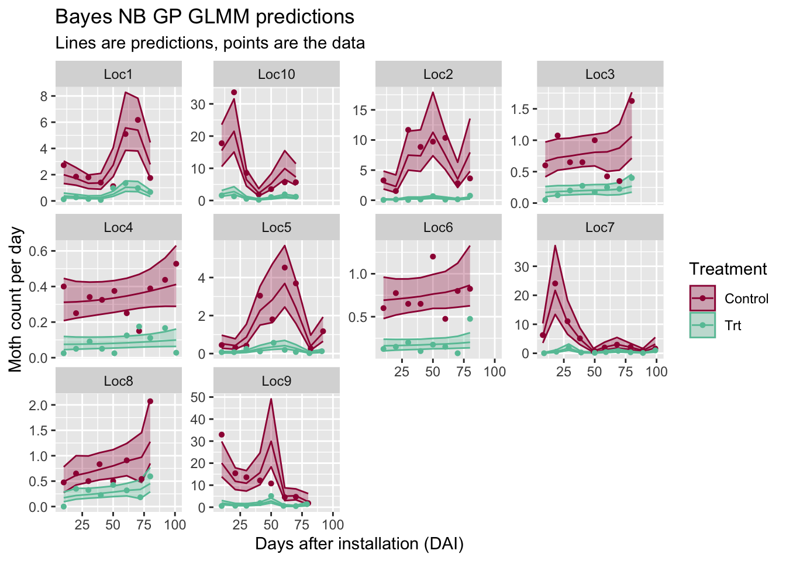

## Comparing model results

### Compare TR estimates {#compareTR}

Here, the trapping reduction estimates from all of the models are compared. As expected, the median TR estimates are very close from model to model, but the uncertainty in that estimate increases (i.e., the confidence/credible intervals get wider) when we properly account for the correlations in our data.

<table class="table table-striped table-hover table-condensed" style="margin-left: auto; margin-right: auto;">
<caption>(\#tab:compareTR)(\#tab:compareTR)Comparison of derived TR estimates from each model fit.</caption>
 <thead>
  <tr>
   <th style="text-align:left;"> Framework </th>
   <th style="text-align:left;"> Distribution </th>
   <th style="text-align:left;"> Model_name </th>
   <th style="text-align:right;"> TR </th>
   <th style="text-align:right;"> lowerCI </th>
   <th style="text-align:right;"> upperCI </th>
  </tr>
 </thead>
<tbody>
  <tr grouplength="3"><td colspan="6" style="border-bottom: 1px solid;"><strong>GLM</strong></td></tr>
<tr>
   <td style="text-align:left;padding-left: 2em;" indentlevel="1"> Frequentist </td>
   <td style="text-align:left;"> Poisson </td>
   <td style="text-align:left;"> GLM </td>
   <td style="text-align:right;"> 88 </td>
   <td style="text-align:right;"> 88 </td>
   <td style="text-align:right;"> 89 </td>
  </tr>
  <tr>
   <td style="text-align:left;padding-left: 2em;" indentlevel="1"> Frequentist </td>
   <td style="text-align:left;"> Neg Binomial </td>
   <td style="text-align:left;"> GLM </td>
   <td style="text-align:right;"> 88 </td>
   <td style="text-align:right;"> 86 </td>
   <td style="text-align:right;"> 90 </td>
  </tr>
  <tr>
   <td style="text-align:left;padding-left: 2em;" indentlevel="1"> Bayesian </td>
   <td style="text-align:left;"> Neg Binomial </td>
   <td style="text-align:left;"> GLM </td>
   <td style="text-align:right;"> 88 </td>
   <td style="text-align:right;"> 86 </td>
   <td style="text-align:right;"> 90 </td>
  </tr>
  <tr grouplength="3"><td colspan="6" style="border-bottom: 1px solid;"><strong>GLMM (Location)</strong></td></tr>
<tr>
   <td style="text-align:left;padding-left: 2em;" indentlevel="1"> Frequentist </td>
   <td style="text-align:left;"> Poisson </td>
   <td style="text-align:left;"> GLMM (Location) </td>
   <td style="text-align:right;"> 85 </td>
   <td style="text-align:right;"> 77 </td>
   <td style="text-align:right;"> 90 </td>
  </tr>
  <tr>
   <td style="text-align:left;padding-left: 2em;" indentlevel="1"> Frequentist </td>
   <td style="text-align:left;"> Neg Binomial </td>
   <td style="text-align:left;"> GLMM (Location) </td>
   <td style="text-align:right;"> 85 </td>
   <td style="text-align:right;"> 78 </td>
   <td style="text-align:right;"> 90 </td>
  </tr>
  <tr>
   <td style="text-align:left;padding-left: 2em;" indentlevel="1"> Bayesian </td>
   <td style="text-align:left;"> Neg Binomial </td>
   <td style="text-align:left;"> GLMM (Location) </td>
   <td style="text-align:right;"> 85 </td>
   <td style="text-align:right;"> 76 </td>
   <td style="text-align:right;"> 90 </td>
  </tr>
  <tr grouplength="3"><td colspan="6" style="border-bottom: 1px solid;"><strong>GLMM (Location, Date)</strong></td></tr>
<tr>
   <td style="text-align:left;padding-left: 2em;" indentlevel="1"> Frequentist </td>
   <td style="text-align:left;"> Poisson </td>
   <td style="text-align:left;"> GLMM (Location, nested Date) </td>
   <td style="text-align:right;"> 81 </td>
   <td style="text-align:right;"> 73 </td>
   <td style="text-align:right;"> 87 </td>
  </tr>
  <tr>
   <td style="text-align:left;padding-left: 2em;" indentlevel="1"> Frequentist </td>
   <td style="text-align:left;"> Neg Binomial </td>
   <td style="text-align:left;"> GLMM (Location, nested Date) </td>
   <td style="text-align:right;"> 83 </td>
   <td style="text-align:right;"> 75 </td>
   <td style="text-align:right;"> 88 </td>
  </tr>
  <tr>
   <td style="text-align:left;padding-left: 2em;" indentlevel="1"> Bayesian </td>
   <td style="text-align:left;"> Neg Binomial </td>
   <td style="text-align:left;"> GLMM (Location, nested Date) </td>
   <td style="text-align:right;"> 83 </td>
   <td style="text-align:right;"> 72 </td>
   <td style="text-align:right;"> 89 </td>
  </tr>
  <tr grouplength="1"><td colspan="6" style="border-bottom: 1px solid;"><strong>GLMM (Location, GP)</strong></td></tr>
<tr>
   <td style="text-align:left;padding-left: 2em;" indentlevel="1"> Bayesian </td>
   <td style="text-align:left;"> Neg Binomial </td>
   <td style="text-align:left;"> GLMM (Location, Gaussian Process Date) </td>
   <td style="text-align:right;"> 84 </td>
   <td style="text-align:right;"> 74 </td>
   <td style="text-align:right;"> 90 </td>
  </tr>
</tbody>
</table>

<!-- ### Compare coefficients -->

<!-- Because TR is a non-linear function of $\beta_1$, the differences in the model output get slightly distorted from the transformation. Thereofre, the $\beta_1$ coefficients are displayed as well: -->


### Plot comparisons

#### GLM's

In the side-by-side comparison, you can see the wider confidence intervals for the negative binomial distribution, compared to the Poisson.


``` r
cowplot::plot_grid(p1p_glm + theme(legend.position="none"), 
                   p1nb_glm + theme(legend.position="none"))
```

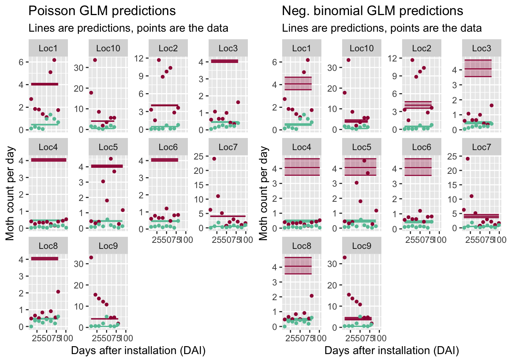

Side-by-side comparison of the frequentist vs Bayes negative binomial GLM predictions. They are almost identical, as expected.


``` r
cowplot::plot_grid(p1nb_glm + theme(legend.position="none"),
                   bayes_p1nb + theme(legend.position="none"))
```

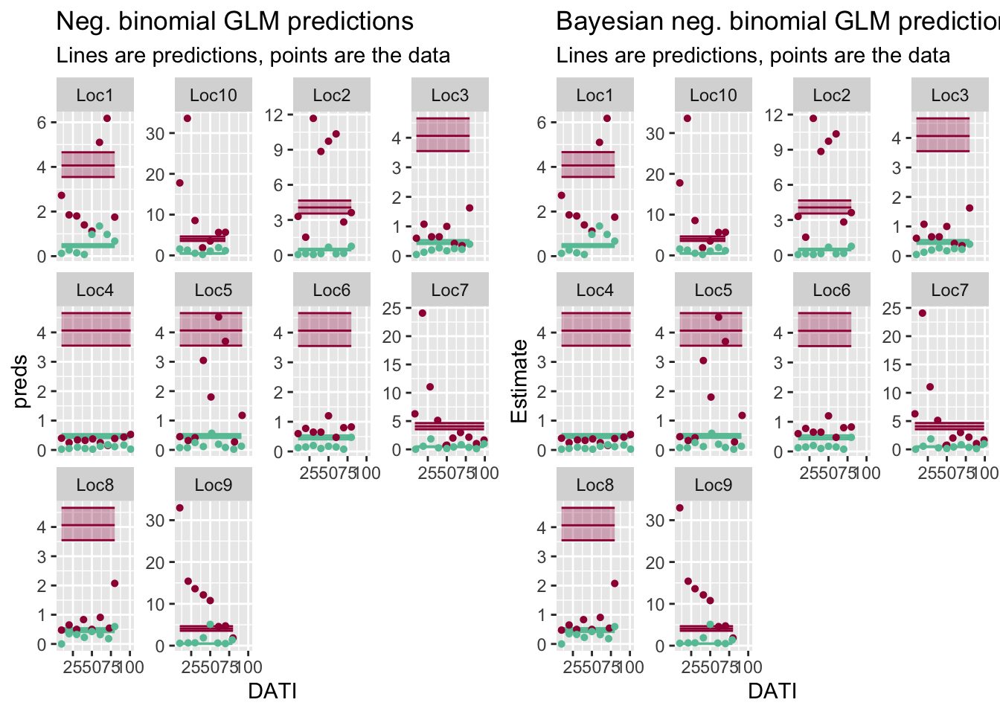

#### GLMM's (Location RE)

<!-- Side-by-side comparison of the frequentist Poisson vs negative  binomial GLMM (Location RE) predictions. -->


Side-by-side comparison of the frequentist vs Bayes negative binomial GLMM (Location RE) predictions. Again, they are almost identical, as expected.

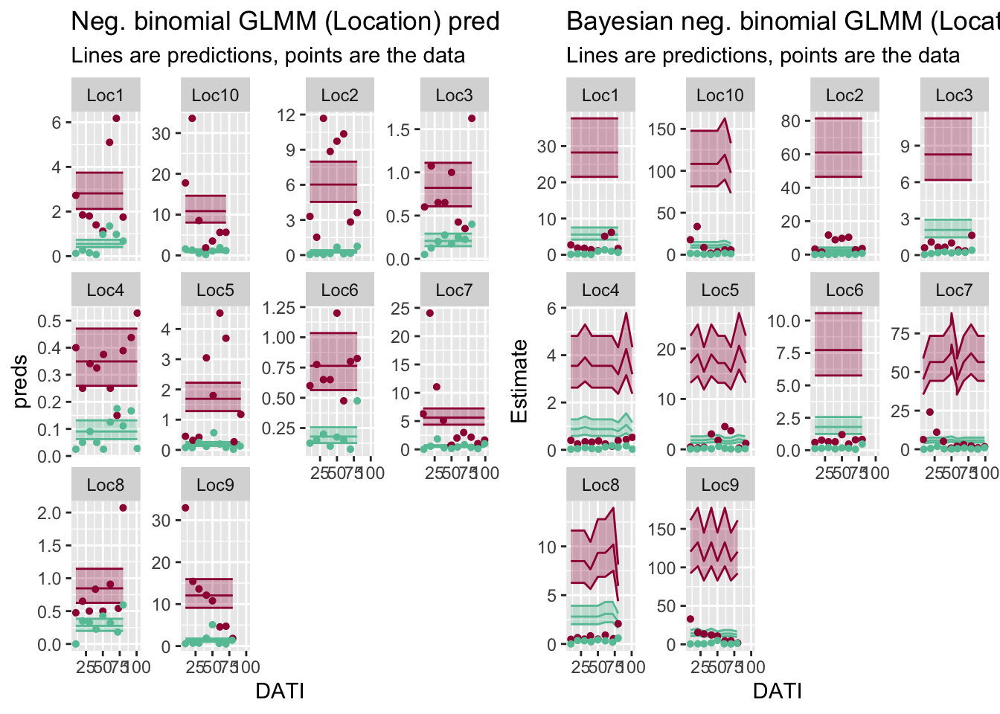


#### GLMM's (RE for location, date)

<!-- Side-by-side comparison of the frequentist Poisson vs negative  binomial GLMM (Location RE) predictions. Same patterns but notice how the y-axis varies between plots. -->


Side-by-side comparison of the frequentist vs Bayes negative binomial GLMM (Location RE) predictions.


#### GLMM's: nested Date vs Gaussian Process Date

Once we properly account for the correlations in our sampling dates, we have a reasonable uncertainty in our overall TR predictions and the predicted counts are "smoothed" over time for some of the locations.

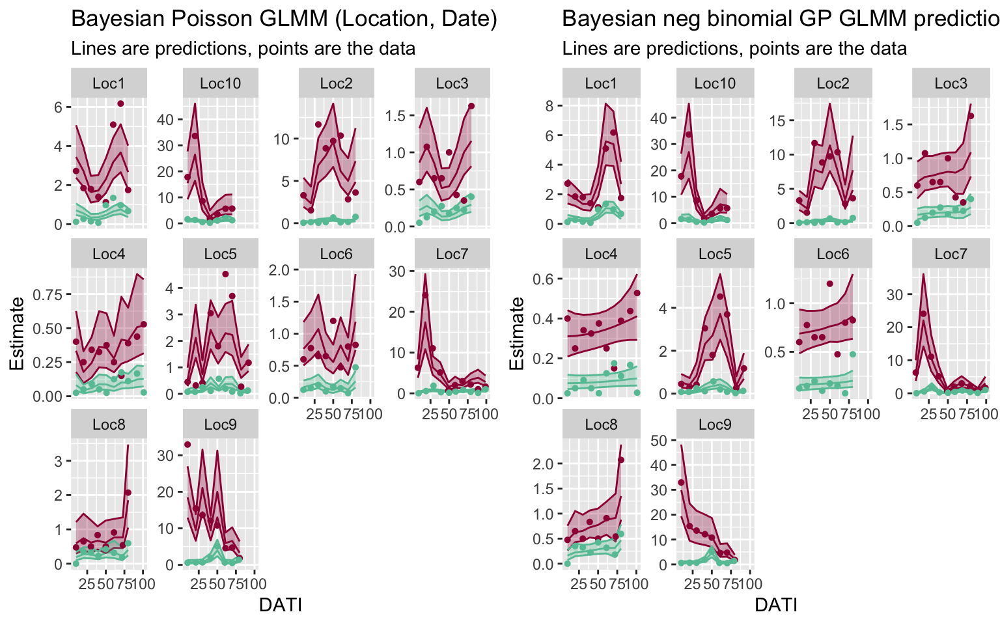

