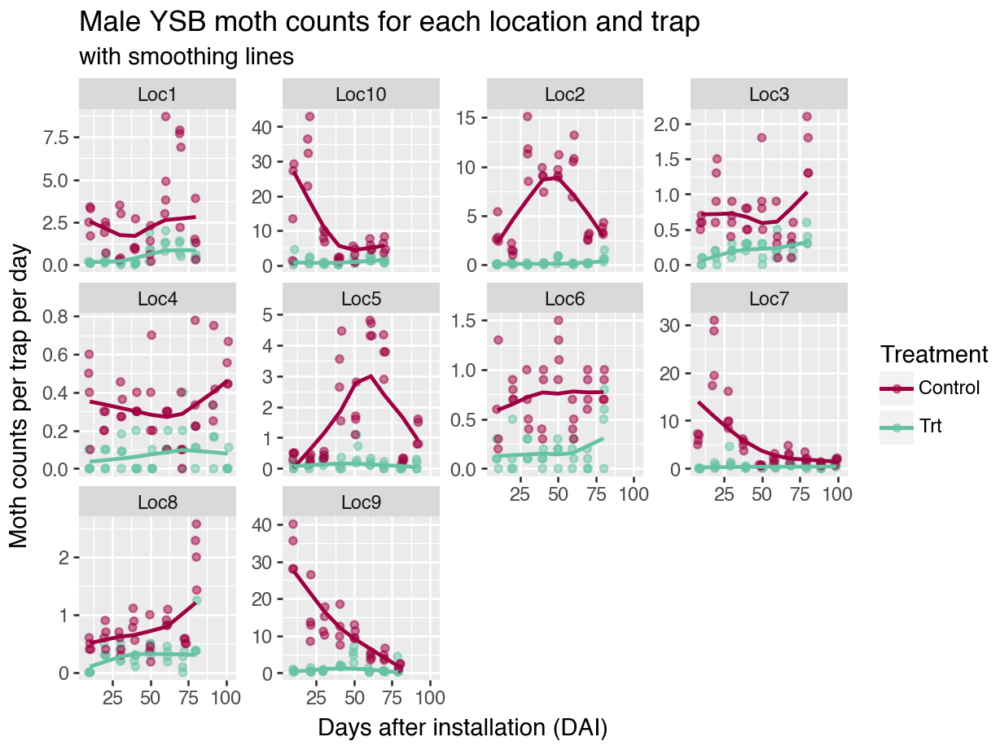
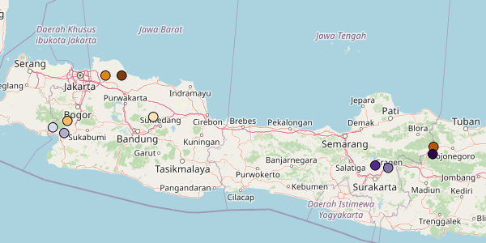
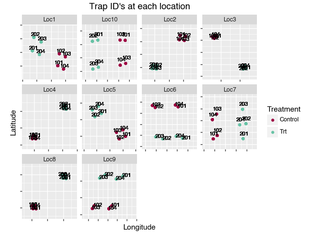
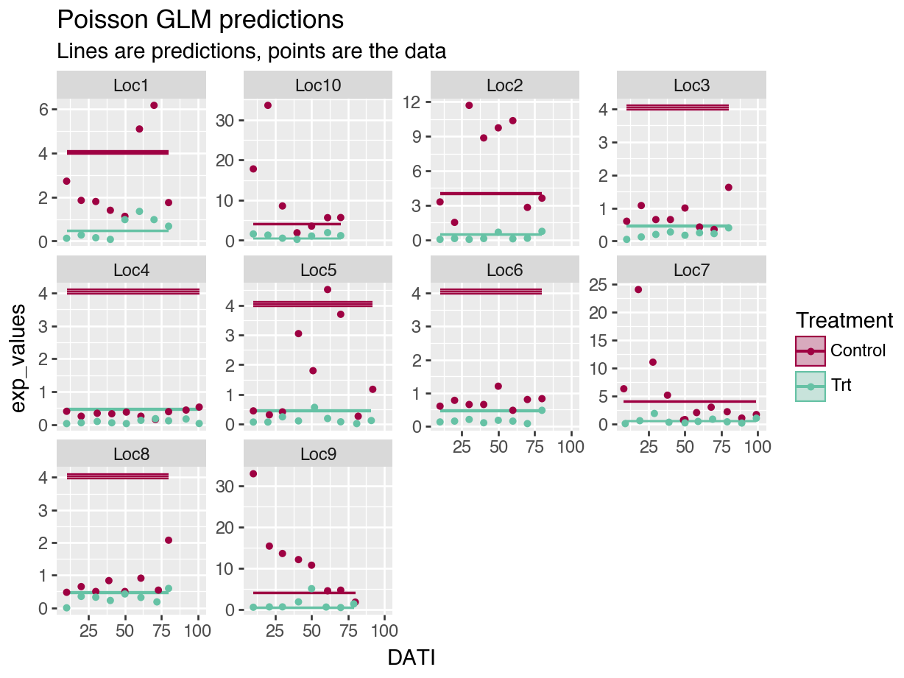
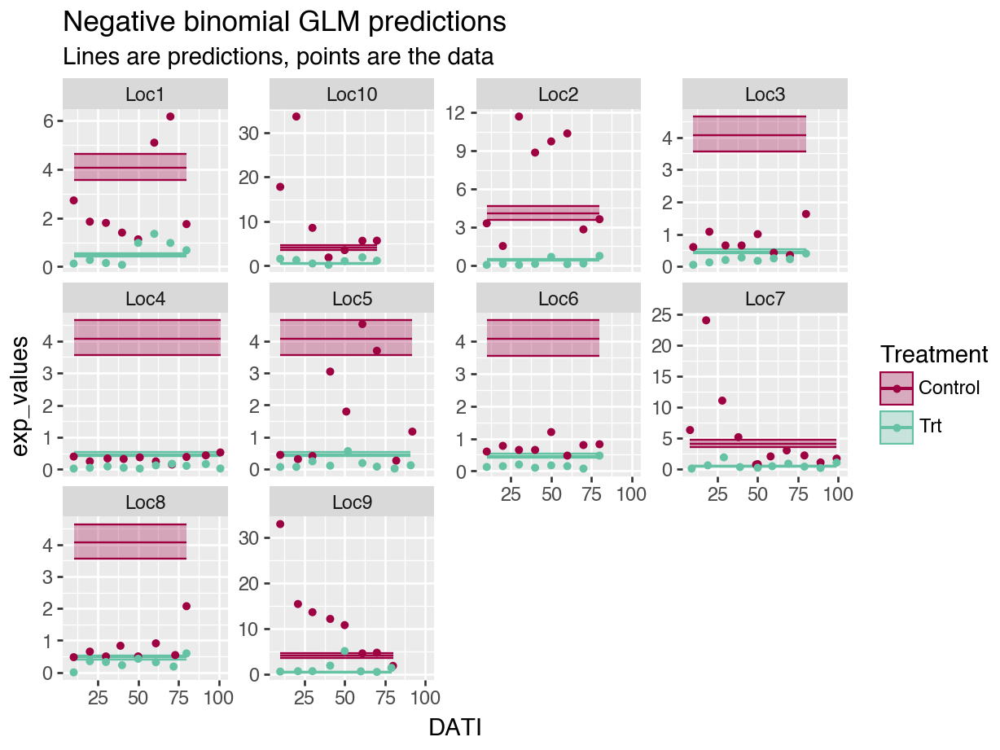
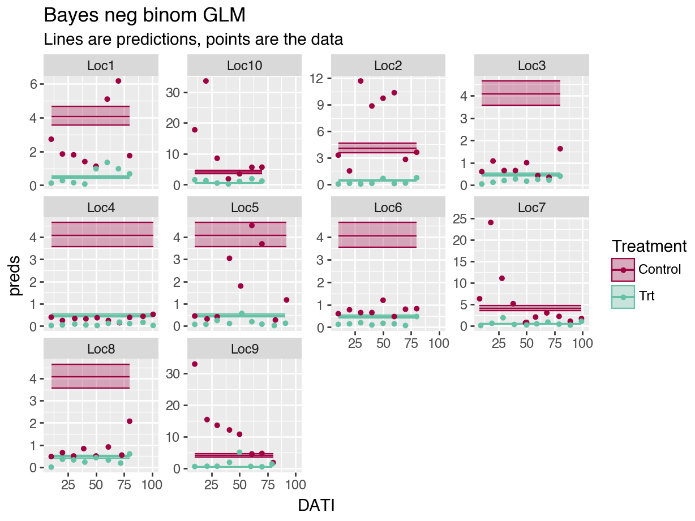

# GLMM's in Python {#GLMMsPython}

## Getting started with Python

Python is a lot more complicated than R!

1. Download Python.

2. Decide how you want to interact with Python. Yes, you can technically use the terminal and use Python directly, but a GUI is preferable so that it is easier to run the code, add comments, view the output, etc. This is even more true for Python than it is for R. 

Originally, I downloaded Jupyter Notebook directly, but I didn't like the way things loaded. So, I downloaded "Anaconda" and then accessed Jupyter from there. However, I still don't love Jupyter-- the notebooks don't optimize the screen's size like RStudio does. In RStudio, I love having my code on one side of the screen, and my outputs on the other. Screens are wide, not long. 

Soon, I came across the "reticulate" package, which allows for Python coding in an Rmarkdown script! So far, awesome and it is how I run the all the analyses. Here, I switch between R and Python code chunks, but the package also allows objects written in one language to be used within both languages. Pretty cool. It's not for production-level code, but seems perfect for R users switching to Python.

To interact with Python via RMarkdowns in RStudio, check out the `reticulate` package [website](https://rstudio.github.io/reticulate/articles/r_markdown.html).

Here is another helpful link: [Primer on Python for R users](https://rstudio.github.io/reticulate/articles/python_primer.html)


3. Set up a Python environment for your work. (Second code chunk in the setup.) Here is why that is important:

Python environments:
"When installing Python packages it’s best practice to isolate them within a Python environment (a named Python installation that exists for a specific project or purpose). This provides a measure of isolation, so that updating a Python package for one project doesn’t impact other projects. The risk for package incompatibilities is significantly higher with Python packages than it is with R packages, because unlike CRAN, PyPI does not enforce, or even check, if the current versions of packages currently available are compatible."
https://rstudio.github.io/reticulate/articles/python_packages.html

Anaconda and reticulate both help the user keep specific environments for each Python "project" that one may be working on.

A Python virtual environment is a basic tool to isolate project dependencies within a Python installation, while a Conda environment is a more comprehensive package manager that not only creates isolated environments but also allows for managing complex dependencies across different programming languages. To keep things simpler, I use a Python virtual environment.


4. Install Python modules as needed.

Python libraries or packages are called __modules__. To use them with `reticulate`, you first have to import them (third code chunk). The lines in the third code chunk below must be called exactly once each for each new python module used; it does not need to re-run.


## Setup

As in the R chapters, all modules (i.e., packages) are loaded and the data are uploaded and mainpulated at the start of the script. The "Getting started with Python" section above goes into details on the rhyme and reason for some of these code chunks.

Because I am newer to Python, the required modules are often included in the code chunks as well as a reminder of what modules are used for what functions. They are included in the setup to ensure that there are no issues upon loading.


``` r
knitr::opts_chunk$set(cache = F, message = F, warning = F, 
  out.width = '100%')
library(kableExtra) # to make a pretty table
library(tidyverse) # %>% function, and others
library(reticulate) # library to use Python within R
use_virtualenv("r-reticulate-BayesInPython")

# make sure these packages are installed before installing pymer4:
# install.packages(c("lme4", "lmerTest", "emmeans"))
# Ensure pymer4 is installed in the desired Python environment
# py_require("pymer4")
```

``` r
## Uncomment the code below and run once, the first time you work through the tutorial:

# create a new environment
# virtualenv_create("r-reticulate-BayesInPython")
# 
# # install a module
# virtualenv_install("r-reticulate-BayesInPython", "pandas")
# 
# indicate that we want to use a specific virtualenv
# use_virtualenv("r-reticulate-BayesInPython")
# 

## (Uncomment this code instead if you prefer a Conda environment) 
# # create a new environment 
# conda_create("r-reticulate-BayesInPython")
# 
# # install a module, e.g., SciPy
# conda_install("r-reticulate-BayesInPython", "scipy")
# 
# # indicate that we want to use a specific condaenv
# use_condaenv("r-reticulate-BayesInPython")
```

``` python
## Install modules if you have not used them before
# You may have to install the packages if you have not used them before:
# code chunk is here for easy retrieval
# replace module name as needed.
!pip install staticmap

# installing googlemaps needs a modification:
# !pip install  --use-pep517 googlemaps

# to install pymer4, you need to type the following commands from Terminal:
# I think you need Anaconda installed
## https://eshinjolly.com/pymer4/installation.html
# conda create --name pymer4 -c ejolly -c conda-forge -c defaults pymer4
# conda activate pymer4
```


``` python
import pandas as pd
import numpy as np

import pprint
from staticmap import StaticMap, CircleMarker # plot trap locations on a map
import arviz as az
import matplotlib.pyplot as plt 
from formulae import design_matrices

import patsy # for dmatrix function

from plotnine import * # using ggplot in Python
import seaborn as sns 

import os # save API key in .env file
import gmplot ## ggmap 

from patsy import dmatrices # for dmatrices function
import statsmodels.api as sm # for regressions
import math

from scipy.stats import nbinom

import bambi as bmb
import pymc as pm

import pickle # to write, read python objects to file


mycolors = ["#9E0142", "#66C2A5"]
```

``` python
## Define some functions to use in this script.

# calculate trapping reduction for frequentist model fits.
def getTR(mod):
    """Calculate TR with confidence interval for stats model"""
    # Function body
    import pandas as pd

    b1 = mod.params.iloc[1]
    seb1 = mod.bse.iloc[1]
    
    outTR = {'TR': [round(100 * 1 - math.exp(b1))], 
    'lowerCI': [round(100 * 1 - math.exp(b1 + 1.96*seb1))],
    'upperCI': [round(100 * 1 - math.exp(b1 - 1.96*seb1))]}
    df = pd.DataFrame(outTR)
    return df
```

``` python
## Read in the moth data:

import pandas as pd

datP = pd.read_csv("data/moths.csv", delimiter = ",")

# check data values: 
# (Results not shown for succinctness)
datP.info()
```

``` python
pd.set_option('display.max_columns', None) # Display all columns
datP.describe(percentiles=[0.5], include = 'all')

for col in datP:
  if (datP[col].dtype == 'object'):
    print(col)
    print(datP[col].unique())
```

``` python
## manipulate data as needed:

# convert dates to dates in case further manipulation on them is needed:
# but first keep object version of samplingdate:
datP['SamplingDateC'] = datP['SamplingDate']
cols = ['TransplantDate', 'DispInstallDate', 'TrapInstallDate', 'SamplingDate']
for col in cols:
    datP[col] = pd.to_datetime(datP[col])
datP['SamplingDate'].describe()
```

``` python
# standardize the counts
datP['mothsperday'] = datP['nYSB'] / datP['DaysOfCatch']

# un-comment if we need to fix levels in non-alpha order
# datR <- datP %>%
#   mutate(TreatmentF = factor(Treatment), 
         # LocationF = as.factor(Location),


## average counts for each location, date
mean_cts = datP.groupby(['Location', 'Treatment', 'AssessmentNumber', 'SamplingDate', 'SamplingDateC', 'DATI'], as_index=False).agg({'nYSB': 'mean', 'mothsperday': 'mean'})
mean_cts.describe(include='all')
```

## Data exploration

### The data

Here is what the data look like after the above manipulation. 


``` python
# kable(head(datR, 5)) %>%
#   kable_styling() %>%
#   scroll_box(width = "100%", box_css = "border: 0px;")
# convert to DF to make a pretty table:
py_df = pd.DataFrame(datP)
# print(datP.head(5))
```

``` r
kable(head(py$datP, 5)) %>%
  kable_styling() %>%
  scroll_box(width = "100%", box_css = "border: 0px;")
```

<div style="border: 0px;overflow-x: scroll; width:100%; "><table class="table" style="margin-left: auto; margin-right: auto;">
 <thead>
  <tr>
   <th style="text-align:left;"> Location </th>
   <th style="text-align:left;"> Treatment </th>
   <th style="text-align:right;"> TrapID </th>
   <th style="text-align:right;"> Longitude </th>
   <th style="text-align:right;"> Latitude </th>
   <th style="text-align:left;"> TransplantDate </th>
   <th style="text-align:left;"> TrapInstallDate </th>
   <th style="text-align:left;"> DispInstallDate </th>
   <th style="text-align:right;"> AssessmentNumber </th>
   <th style="text-align:left;"> SamplingDate </th>
   <th style="text-align:right;"> nYSB </th>
   <th style="text-align:right;"> DaysOfCatch </th>
   <th style="text-align:right;"> DATI </th>
   <th style="text-align:right;"> DADI </th>
   <th style="text-align:right;"> DAT </th>
   <th style="text-align:left;"> SamplingDateC </th>
   <th style="text-align:right;"> mothsperday </th>
  </tr>
 </thead>
<tbody>
  <tr>
   <td style="text-align:left;"> Loc9 </td>
   <td style="text-align:left;"> Trt </td>
   <td style="text-align:right;"> 201 </td>
   <td style="text-align:right;"> 111.6028 </td>
   <td style="text-align:right;"> -7.233634 </td>
   <td style="text-align:left;"> 2023-08-05 18:00:00 </td>
   <td style="text-align:left;"> 2023-08-12 18:00:00 </td>
   <td style="text-align:left;"> 2023-08-12 18:00:00 </td>
   <td style="text-align:right;"> 1 </td>
   <td style="text-align:left;"> 2023-08-22 18:00:00 </td>
   <td style="text-align:right;"> 4 </td>
   <td style="text-align:right;"> 10 </td>
   <td style="text-align:right;"> 10 </td>
   <td style="text-align:right;"> 10 </td>
   <td style="text-align:right;"> 17 </td>
   <td style="text-align:left;"> 2023-08-23 </td>
   <td style="text-align:right;"> 0.4000000 </td>
  </tr>
  <tr>
   <td style="text-align:left;"> Loc9 </td>
   <td style="text-align:left;"> Trt </td>
   <td style="text-align:right;"> 201 </td>
   <td style="text-align:right;"> 111.6028 </td>
   <td style="text-align:right;"> -7.233634 </td>
   <td style="text-align:left;"> 2023-08-05 18:00:00 </td>
   <td style="text-align:left;"> 2023-08-12 18:00:00 </td>
   <td style="text-align:left;"> 2023-08-12 18:00:00 </td>
   <td style="text-align:right;"> 2 </td>
   <td style="text-align:left;"> 2023-09-02 18:00:00 </td>
   <td style="text-align:right;"> 6 </td>
   <td style="text-align:right;"> 11 </td>
   <td style="text-align:right;"> 21 </td>
   <td style="text-align:right;"> 21 </td>
   <td style="text-align:right;"> 28 </td>
   <td style="text-align:left;"> 2023-09-03 </td>
   <td style="text-align:right;"> 0.5454545 </td>
  </tr>
  <tr>
   <td style="text-align:left;"> Loc9 </td>
   <td style="text-align:left;"> Trt </td>
   <td style="text-align:right;"> 201 </td>
   <td style="text-align:right;"> 111.6028 </td>
   <td style="text-align:right;"> -7.233634 </td>
   <td style="text-align:left;"> 2023-08-05 18:00:00 </td>
   <td style="text-align:left;"> 2023-08-12 18:00:00 </td>
   <td style="text-align:left;"> 2023-08-12 18:00:00 </td>
   <td style="text-align:right;"> 3 </td>
   <td style="text-align:left;"> 2023-09-11 18:00:00 </td>
   <td style="text-align:right;"> 6 </td>
   <td style="text-align:right;"> 9 </td>
   <td style="text-align:right;"> 30 </td>
   <td style="text-align:right;"> 30 </td>
   <td style="text-align:right;"> 37 </td>
   <td style="text-align:left;"> 2023-09-12 </td>
   <td style="text-align:right;"> 0.6666667 </td>
  </tr>
  <tr>
   <td style="text-align:left;"> Loc9 </td>
   <td style="text-align:left;"> Trt </td>
   <td style="text-align:right;"> 201 </td>
   <td style="text-align:right;"> 111.6028 </td>
   <td style="text-align:right;"> -7.233634 </td>
   <td style="text-align:left;"> 2023-08-05 18:00:00 </td>
   <td style="text-align:left;"> 2023-08-12 18:00:00 </td>
   <td style="text-align:left;"> 2023-08-12 18:00:00 </td>
   <td style="text-align:right;"> 4 </td>
   <td style="text-align:left;"> 2023-09-22 18:00:00 </td>
   <td style="text-align:right;"> 24 </td>
   <td style="text-align:right;"> 11 </td>
   <td style="text-align:right;"> 41 </td>
   <td style="text-align:right;"> 41 </td>
   <td style="text-align:right;"> 48 </td>
   <td style="text-align:left;"> 2023-09-23 </td>
   <td style="text-align:right;"> 2.1818182 </td>
  </tr>
  <tr>
   <td style="text-align:left;"> Loc9 </td>
   <td style="text-align:left;"> Trt </td>
   <td style="text-align:right;"> 201 </td>
   <td style="text-align:right;"> 111.6028 </td>
   <td style="text-align:right;"> -7.233634 </td>
   <td style="text-align:left;"> 2023-08-05 18:00:00 </td>
   <td style="text-align:left;"> 2023-08-12 18:00:00 </td>
   <td style="text-align:left;"> 2023-08-12 18:00:00 </td>
   <td style="text-align:right;"> 5 </td>
   <td style="text-align:left;"> 2023-10-01 18:00:00 </td>
   <td style="text-align:right;"> 43 </td>
   <td style="text-align:right;"> 9 </td>
   <td style="text-align:right;"> 50 </td>
   <td style="text-align:right;"> 50 </td>
   <td style="text-align:right;"> 57 </td>
   <td style="text-align:left;"> 2023-10-02 </td>
   <td style="text-align:right;"> 4.7777778 </td>
  </tr>
</tbody>
</table></div>

Column descriptions: 

* **Location**-- data were collected from 10 trial locations, 

* **Treatment**-- Control or Treatment (Trt), 

* **TrapID**-- each trap within a trial location has a unique ID, 

* **Longitude**, **Latitude**-- the coordinates of each unique trap,

* **TransplantDate**-- the date that the rice seedlings were transplanted into the field,

* **TrapInstallDate**-- the trap installation date, which is usually the same as the dispenser installation date, 

* **DispInstallDate**-- the treatment (pheromone dispenser) installation date; 

* **AssessmentNumber**-- traps are sampled 10 times each. Using assessment number is a way to standardize the sampling dates across locations, 

* **SamplingDate**-- the date on which the trap was checked and moths were counted,

* **nYSB**-- the moth counts (number of YSB moths) associated with each trap, location, and date, 

* **DaysOfCatch**-- the number of days since the trap was previously sampled or the number of days since trap installation if it is assessment number 1,

* **DATI** is days after trap installation; 

* **DADI**-- days after dispenser installation; and 

* **DAT**-- days after transplant. 

* **mothsperday**-- moths caught per day, nYSB / DaysOfCatch, and

* **SamplingDateC**-- Sampling Date as a character/string (for model in Section \\@ref(glmm_datesC)),


### Moth counts plotted

The data are the moth counts collected at each trap (average per day), within each location and throughout the season. Note how the y-axis changes for each plot in the figure.

The `plotnine` module allows us to use `ggplot2` package in Python. It is fantastic to quickly make a beautiful plot using previously acquired R skills, and it does so with a fraction of the code required to make a similar figure using Python's `seaborn` and/or `matplotlib` modules.


``` python
from plotnine import * # using ggplot in Python
import matplotlib.pyplot as plt 

pmoths = (ggplot(datP, aes(x = 'DATI', y='mothsperday', color = 'Treatment')) +
        geom_jitter(height = 0, width = 0.75, alpha = 0.5) +
        geom_smooth(se=False) +
        facet_wrap(['Location'], scales = "free_y") +
        scale_color_manual(values = mycolors) +
        labs(title = "Male YSB moth counts for each location and trap",
             subtitle = "with smoothing lines",
             y = "Moth counts per trap per day",
             x = "Days after installation (DAI)",
             color = "Treatment"))
pmoths.draw(True)
```



``` python
# plt.show(pmoths)
# plt.savefig("output/moth_counts.png")
```


### Trap locations

Trial locations in relation to each other. Some trial locations are closer to each other than others.


``` python
## average coords for each location
loc_coords = datP.groupby(['Location'], as_index=False).agg({'Latitude': 'mean', 'Longitude': 'mean'})
colors = ["#7F3B08", "#B35806", "#E08214", "#FDB863", "#FEE0B6", "#D8DAEB", "#B2ABD2", "#8073AC", "#542788", "#2D004B"]

m = StaticMap(600, 300)
for i in range(0, len(loc_coords["Longitude"])):
  # add outline first to make points easier to see:
  m.add_marker(CircleMarker((loc_coords["Longitude"][i], loc_coords["Latitude"][i]), "black", 12))
  m.add_marker(CircleMarker((loc_coords["Longitude"][i], loc_coords["Latitude"][i]), colors[i], 10))

image = m.render(zoom=7)
image.save('output/trial_locs.png')
```


``` r

```

<div class="figure">

<p class="caption">(\#fig:unnamed-chunk-2)Example trial locations.</p>
</div>

<!--  -->

Within each location, the treatment traps have a slightly different alignment:


``` python
coords = datP[['Location', 'Treatment', 'TrapID', 'Latitude', 'Longitude']].drop_duplicates()
# coords.describe(include = 'all')

pcoords = (ggplot(datP, aes(x = 'Longitude', y='Latitude', color = 'Treatment')) +
  geom_point() + 
  facet_wrap(['Location'], scales = "free") +
  scale_color_manual(values = mycolors) +
  theme(aspect_ratio=1,
        axis_text_x=element_blank(),
        axis_text_y=element_blank())  +
  geom_text(aes(label = 'TrapID'), nudge_x = 0.0002, nudge_y = 0.0002, color = "black", size = 8) +
  scale_x_continuous(expand = (0.3, 0)) +
  scale_y_continuous(expand = (0.3, 0)) +
  labs(title = "Trap ID's at each location"))
pcoords.save("output/traplocs.png")
```


``` r

```

<div class="figure">

<p class="caption">(\#fig:unnamed-chunk-3)Example trial locations.</p>
</div>

<!--  -->

## Fitted GLM models {#fit-glmPy}

To start, we ignore all the spatial and temporal relationships in the data and assume each data point is independent and identically distributed (iid). **This is not a good model for the data!** It is just our starting off point.

When building hierarchical Bayesian models, it is always a good idea to start simple, make sure everything works as expected, and then build up.

See Section \@ref(glm) for the associated mathematical models.

### Frequentist Poisson model

These models show a very tight confidence intervals for our coefficient estimates and our predictions. But also, the residual deviance is MUCH greater than the degree of freedom, indicating a lack of fit. The plot of the predictions (Figure \@ref(fig:p1p-glmFig)) overlaid on the data also demonstrate the lack of fit.


``` python
import numpy as np
from patsy import dmatrices # for dmatrices function
import statsmodels.api as sm # for regressions
import math

# POISSON regression
form = """ nYSB ~ Treatment"""
y, X = dmatrices(form, datP, return_type = 'dataframe')
mod1p = sm.GLM(y, X, 
              offset=np.log(datP["DaysOfCatch"]),
              family = sm.families.Poisson())
results1p = mod1p.fit()
print(results1p.summary())
```

```
##                  Generalized Linear Model Regression Results                  
## ==============================================================================
## Dep. Variable:                   nYSB   No. Observations:                  672
## Model:                            GLM   Df Residuals:                      670
## Model Family:                 Poisson   Df Model:                            1
## Link Function:                    Log   Scale:                          1.0000
## Method:                          IRLS   Log-Likelihood:                -14034.
## Date:                Thu, 03 Jul 2025   Deviance:                       25678.
## Time:                        21:35:32   Pearson chi2:                 4.24e+04
## No. Iterations:                     6   Pseudo R-squ. (CS):              1.000
## Covariance Type:            nonrobust                                         
## ====================================================================================
##                        coef    std err          z      P>|z|      [0.025      0.975]
## ------------------------------------------------------------------------------------
## Intercept            1.3960      0.009    162.829      0.000       1.379       1.413
## Treatment[T.Trt]    -2.1665      0.027    -80.933      0.000      -2.219      -2.114
## ====================================================================================
```

``` python
## obtain TR estimate for comparison later (custom function in Setup code)
TR_1p = getTR(results1p)
print(TR_1p)
```

```
##     TR  lowerCI  upperCI
## 0  100      100      100
```

Note: when I predict for new data, I set $DaysOfCatch = 1$, and then I compare to the moths per day variable ($mothsperday = nYSB / DaysOfCatch$). I want to exclude any patterns related to the varying time intervals.


``` python
# predict from poisson regression:
preds1p = results1p.get_prediction(X, which = 'linear')
preds1pDFtmp = preds1p.summary_frame() #summary_frame() returns a pandas DF
preds1pDFtmp.describe()
```

```
##         predicted          se    ci_lower    ci_upper
## count  672.000000  672.000000  672.000000  672.000000
## mean     0.312790    0.016966    0.279536    0.346043
## std      1.084062    0.008399    1.100524    1.067600
## min     -0.770465    0.008574   -0.820168   -0.720762
## 25%     -0.770465    0.008574   -0.820168   -0.720762
## 50%      0.312790    0.016966    0.279536    0.346043
## 75%      1.396045    0.025359    1.379241    1.412849
## max      1.396045    0.025359    1.379241    1.412849
```

``` python
preds1pDF = datP
preds1pDF['exp_values'] = preds1pDFtmp['predicted'].apply(math.exp)
preds1pDF['lowerCI'] = preds1pDFtmp['ci_lower'].apply(math.exp)
preds1pDF['upperCI'] = preds1pDFtmp['ci_upper'].apply(math.exp)

## plot predicted and actual:
freqplot1p = (ggplot(preds1pDF, 
                aes(x = 'DATI', y='exp_values', color = 'Treatment')) +
        geom_line() +
        geom_ribbon(aes(ymin = 'lowerCI', ymax = 'upperCI', fill = 'Treatment'),
              alpha = 0.3) +
        geom_point(aes(x='DATI', y='mothsperday', color = 'Treatment'), 
            data = mean_cts, size = 1.1) +
        facet_wrap(['Location'], scales = "free_y") +
        scale_color_manual(values = mycolors) +
        scale_fill_manual(values = mycolors) +
        labs(title = "Poisson GLM predictions",
             subtitle = "Lines are predictions, points are the data"))
freqplot1p.draw(True)
```

<div class="figure">

<p class="caption">(\#fig:p1p-glmFigPy)Poisson GLM predictions (Python).</p>
</div>

``` python
# freqplot1p.save(filename='freqplot1p.png', path='output/')
```

The model is such a bad fit to the data, it is hard to even tell what is going on in the figure above.

### Frequentist NB model {#nb1Py}

For the negative binomial (NB) model, our confidence intervals are a little wider, but we are still ignoring all the correlations in our data. And the plot of the predictions again indicates the lack of fit (Figure \@ref(fig:p1nb-glmFigPy)).


``` python
from scipy.stats import nbinom

form = """ nYSB ~ Treatment"""
y, X = dmatrices(form, datP, return_type = 'dataframe')
mod1nb = sm.NegativeBinomial(y,X, offset=np.log(datP["DaysOfCatch"]))
results1nb = mod1nb.fit()
```

```
## Optimization terminated successfully.
##          Current function value: 3.629123
##          Iterations: 10
##          Function evaluations: 11
##          Gradient evaluations: 11
```

``` python
print(results1nb.summary())
```

```
##                      NegativeBinomial Regression Results                      
## ==============================================================================
## Dep. Variable:                   nYSB   No. Observations:                  672
## Model:               NegativeBinomial   Df Residuals:                      670
## Method:                           MLE   Df Model:                            1
## Date:                Thu, 03 Jul 2025   Pseudo R-squ.:                 0.06445
## Time:                        21:35:34   Log-Likelihood:                -2438.8
## converged:                       True   LL-Null:                       -2606.8
## Covariance Type:            nonrobust   LLR p-value:                 4.739e-75
## ====================================================================================
##                        coef    std err          z      P>|z|      [0.025      0.975]
## ------------------------------------------------------------------------------------
## Intercept            1.4023      0.068     20.651      0.000       1.269       1.535
## Treatment[T.Trt]    -2.1636      0.099    -21.863      0.000      -2.358      -1.970
## alpha                1.5244      0.082     18.628      0.000       1.364       1.685
## ====================================================================================
```

``` python
## obtain TR estimate for comparison later (custom function in Setup code)
TR_1nb = getTR(results1nb)
print(TR_1nb)
```

```
##     TR  lowerCI  upperCI
## 0  100      100      100
```


``` python
## code to predict moth counts from model:
preds1nb = results1nb.get_prediction(X, which = 'linear')
preds1nbDFtmp = preds1nb.summary_frame()
preds1nbDFtmp.describe()
```

```
##         predicted          se    ci_lower    ci_upper
## count  672.000000  672.000000  672.000000  672.000000
## mean     0.320438    0.069947    0.183344    0.457531
## std      1.082628    0.002045    1.086637    1.078620
## min     -0.761384    0.067903   -0.902484   -0.620285
## 25%     -0.761384    0.067903   -0.902484   -0.620285
## 50%      0.320438    0.069947    0.183344    0.457531
## 75%      1.402260    0.071991    1.269172    1.535348
## max      1.402260    0.071991    1.269172    1.535348
```

``` python
preds1nbDF = datP
preds1nbDF['exp_values'] = preds1nbDFtmp['predicted'].apply(math.exp)
preds1nbDF['lowerCI'] = preds1nbDFtmp['ci_lower'].apply(math.exp)
preds1nbDF['upperCI'] = preds1nbDFtmp['ci_upper'].apply(math.exp)


## plot predicted and actual:
freqplot1nb = (ggplot(preds1nbDF, aes(x = 'DATI', y='exp_values', color = 'Treatment')) +
        geom_line() +
        geom_ribbon(aes(ymin = 'lowerCI', ymax = 'upperCI', fill = 'Treatment'),
              alpha = 0.3) +
        geom_point(aes(x='DATI', y='mothsperday', color = 'Treatment'), 
            data = mean_cts, size = 1.1) +
        facet_wrap(['Location'], scales = "free_y") +
        scale_color_manual(values = mycolors) +
        scale_fill_manual(values = mycolors) +
        labs(title = "Negative binomial GLM predictions",
             subtitle = "Lines are predictions, points are the data"))

freqplot1nb.draw(True)
```

<div class="figure">

<p class="caption">(\#fig:p1nb-glmFigPy)Negative binomial GLM predictions (Python).</p>
</div>

``` python
freqplot1nb.save(filename="freqplot1nb.png", path = "./output/")
```

### Bayesian (bambi) model

`Bambi` is the Python module that is *very* similar to `brms` package in R. I am pretty sure the defaults use different algorithms though (which may affect your results), so be sure to read up on the details of both! However, both run `stan` on the back-end for the MCMC algorithms.

Because the models take a few minutes to fit, I usually fit them when I am initially running through my code, save them, and then only load the model fit when rendering the Rmarkdown file and creating the resulting figures.

`Bambi` creates InferenceData objects. Read the [reference guide](https://python.arviz.org/en/latest/getting_started/WorkingWithInferenceData.html#)-- it is very helpful!


``` python
# https://bambinos.github.io/bambi/notebooks/negative_binomial.html
import bambi as bmb
## build the model:
model_bmb1nb = bmb.Model("nYSB ~ Treatment + offset(log(DaysOfCatch))", 
                    datP, family="negativebinomial",
                    priors = {
                        "Intercept": bmb.Prior("Normal", mu = 0, sigma = 2),
                        "Treatment": bmb.Prior("Normal", mu = 0, sigma = 2),
                        "alpha": bmb.Prior("HalfCauchy", beta = 1)
                    })
filename = 'output/idata_bmb1nb.pkl'
```

``` python
## not run
import bambi as bmb
## fit the model:
idata_bmb1nb = model_bmb1nb.fit(tune = 500, draws=2000, chains=6, random_seed = 5000)
# tune = warmup; draws = iter
print(az.summary(idata_bmb1nb))

# save bambi object to file.
import pickle 
with open(filename, 'wb') as file:
    pickle.dump(idata_bmb1nb, file)
```


``` python
import arviz as az
import matplotlib.pyplot as plt 
import pickle

# Load the object from the file
with open(filename, 'rb') as file:
    idata_bmb1nb = pickle.load(file)

# to see the priors:
# model_bmb1nb

# summary stats
print(az.summary(idata_bmb1nb))
```

```
##                  mean     sd  hdi_3%  hdi_97%  mcse_mean  mcse_sd  ess_bulk  \
## alpha           0.656  0.035   0.588    0.721      0.000    0.000   17917.0   
## Intercept       1.402  0.067   1.276    1.530      0.000    0.001   18638.0   
## Treatment[Trt] -2.159  0.099  -2.343   -1.974      0.001    0.001   17245.0   
## 
##                 ess_tail  r_hat  
## alpha             8766.0    1.0  
## Intercept         9286.0    1.0  
## Treatment[Trt]   10039.0    1.0
```

``` python
# CALC TR:
b1 = idata_bmb1nb.posterior["Treatment"].stack(sample=("chain", "draw")).to_dataframe(name = "Trt")

TR1nb = 100 * (1 - np.exp(b1['Trt']))
print(round(TR1nb.quantile(q=[0.025, 0.5, 0.975])))
```

```
## 0.025    86.0
## 0.500    88.0
## 0.975    90.0
## Name: Trt, dtype: float64
```

``` python
# Plot the predictions
# Make predictions of the mean without offset effect:
bmbPreds1nb = datP.copy() ## IMPORTANT DIFF FROM R!!!
## if newdf = olddf, changes to newdf affect olddf!!!
bmbPreds1nb["DaysOfCatch"] = 1
predictions1nb = model_bmb1nb.predict(idata_bmb1nb, data=bmbPreds1nb, kind = "response_params", inplace = False)
post1nb = predictions1nb.posterior
post1nb
```

```{=html}
<div><svg style="position: absolute; width: 0; height: 0; overflow: hidden">
<defs>
<symbol id="icon-database" viewBox="0 0 32 32">
<path d="M16 0c-8.837 0-16 2.239-16 5v4c0 2.761 7.163 5 16 5s16-2.239 16-5v-4c0-2.761-7.163-5-16-5z"></path>
<path d="M16 17c-8.837 0-16-2.239-16-5v6c0 2.761 7.163 5 16 5s16-2.239 16-5v-6c0 2.761-7.163 5-16 5z"></path>
<path d="M16 26c-8.837 0-16-2.239-16-5v6c0 2.761 7.163 5 16 5s16-2.239 16-5v-6c0 2.761-7.163 5-16 5z"></path>
</symbol>
<symbol id="icon-file-text2" viewBox="0 0 32 32">
<path d="M28.681 7.159c-0.694-0.947-1.662-2.053-2.724-3.116s-2.169-2.030-3.116-2.724c-1.612-1.182-2.393-1.319-2.841-1.319h-15.5c-1.378 0-2.5 1.121-2.5 2.5v27c0 1.378 1.122 2.5 2.5 2.5h23c1.378 0 2.5-1.122 2.5-2.5v-19.5c0-0.448-0.137-1.23-1.319-2.841zM24.543 5.457c0.959 0.959 1.712 1.825 2.268 2.543h-4.811v-4.811c0.718 0.556 1.584 1.309 2.543 2.268zM28 29.5c0 0.271-0.229 0.5-0.5 0.5h-23c-0.271 0-0.5-0.229-0.5-0.5v-27c0-0.271 0.229-0.5 0.5-0.5 0 0 15.499-0 15.5 0v7c0 0.552 0.448 1 1 1h7v19.5z"></path>
<path d="M23 26h-14c-0.552 0-1-0.448-1-1s0.448-1 1-1h14c0.552 0 1 0.448 1 1s-0.448 1-1 1z"></path>
<path d="M23 22h-14c-0.552 0-1-0.448-1-1s0.448-1 1-1h14c0.552 0 1 0.448 1 1s-0.448 1-1 1z"></path>
<path d="M23 18h-14c-0.552 0-1-0.448-1-1s0.448-1 1-1h14c0.552 0 1 0.448 1 1s-0.448 1-1 1z"></path>
</symbol>
</defs>
</svg>
<style>/* CSS stylesheet for displaying xarray objects in jupyterlab.
 *
 */

:root {
  --xr-font-color0: var(--jp-content-font-color0, rgba(0, 0, 0, 1));
  --xr-font-color2: var(--jp-content-font-color2, rgba(0, 0, 0, 0.54));
  --xr-font-color3: var(--jp-content-font-color3, rgba(0, 0, 0, 0.38));
  --xr-border-color: var(--jp-border-color2, #e0e0e0);
  --xr-disabled-color: var(--jp-layout-color3, #bdbdbd);
  --xr-background-color: var(--jp-layout-color0, white);
  --xr-background-color-row-even: var(--jp-layout-color1, white);
  --xr-background-color-row-odd: var(--jp-layout-color2, #eeeeee);
}

html[theme="dark"],
html[data-theme="dark"],
body[data-theme="dark"],
body.vscode-dark {
  --xr-font-color0: rgba(255, 255, 255, 1);
  --xr-font-color2: rgba(255, 255, 255, 0.54);
  --xr-font-color3: rgba(255, 255, 255, 0.38);
  --xr-border-color: #1f1f1f;
  --xr-disabled-color: #515151;
  --xr-background-color: #111111;
  --xr-background-color-row-even: #111111;
  --xr-background-color-row-odd: #313131;
}

.xr-wrap {
  display: block !important;
  min-width: 300px;
  max-width: 700px;
}

.xr-text-repr-fallback {
  /* fallback to plain text repr when CSS is not injected (untrusted notebook) */
  display: none;
}

.xr-header {
  padding-top: 6px;
  padding-bottom: 6px;
  margin-bottom: 4px;
  border-bottom: solid 1px var(--xr-border-color);
}

.xr-header > div,
.xr-header > ul {
  display: inline;
  margin-top: 0;
  margin-bottom: 0;
}

.xr-obj-type,
.xr-array-name {
  margin-left: 2px;
  margin-right: 10px;
}

.xr-obj-type {
  color: var(--xr-font-color2);
}

.xr-sections {
  padding-left: 0 !important;
  display: grid;
  grid-template-columns: 150px auto auto 1fr 0 20px 0 20px;
}

.xr-section-item {
  display: contents;
}

.xr-section-item input {
  display: inline-block;
  opacity: 0;
  height: 0;
}

.xr-section-item input + label {
  color: var(--xr-disabled-color);
}

.xr-section-item input:enabled + label {
  cursor: pointer;
  color: var(--xr-font-color2);
}

.xr-section-item input:focus + label {
  border: 2px solid var(--xr-font-color0);
}

.xr-section-item input:enabled + label:hover {
  color: var(--xr-font-color0);
}

.xr-section-summary {
  grid-column: 1;
  color: var(--xr-font-color2);
  font-weight: 500;
}

.xr-section-summary > span {
  display: inline-block;
  padding-left: 0.5em;
}

.xr-section-summary-in:disabled + label {
  color: var(--xr-font-color2);
}

.xr-section-summary-in + label:before {
  display: inline-block;
  content: "►";
  font-size: 11px;
  width: 15px;
  text-align: center;
}

.xr-section-summary-in:disabled + label:before {
  color: var(--xr-disabled-color);
}

.xr-section-summary-in:checked + label:before {
  content: "▼";
}

.xr-section-summary-in:checked + label > span {
  display: none;
}

.xr-section-summary,
.xr-section-inline-details {
  padding-top: 4px;
  padding-bottom: 4px;
}

.xr-section-inline-details {
  grid-column: 2 / -1;
}

.xr-section-details {
  display: none;
  grid-column: 1 / -1;
  margin-bottom: 5px;
}

.xr-section-summary-in:checked ~ .xr-section-details {
  display: contents;
}

.xr-array-wrap {
  grid-column: 1 / -1;
  display: grid;
  grid-template-columns: 20px auto;
}

.xr-array-wrap > label {
  grid-column: 1;
  vertical-align: top;
}

.xr-preview {
  color: var(--xr-font-color3);
}

.xr-array-preview,
.xr-array-data {
  padding: 0 5px !important;
  grid-column: 2;
}

.xr-array-data,
.xr-array-in:checked ~ .xr-array-preview {
  display: none;
}

.xr-array-in:checked ~ .xr-array-data,
.xr-array-preview {
  display: inline-block;
}

.xr-dim-list {
  display: inline-block !important;
  list-style: none;
  padding: 0 !important;
  margin: 0;
}

.xr-dim-list li {
  display: inline-block;
  padding: 0;
  margin: 0;
}

.xr-dim-list:before {
  content: "(";
}

.xr-dim-list:after {
  content: ")";
}

.xr-dim-list li:not(:last-child):after {
  content: ",";
  padding-right: 5px;
}

.xr-has-index {
  font-weight: bold;
}

.xr-var-list,
.xr-var-item {
  display: contents;
}

.xr-var-item > div,
.xr-var-item label,
.xr-var-item > .xr-var-name span {
  background-color: var(--xr-background-color-row-even);
  margin-bottom: 0;
}

.xr-var-item > .xr-var-name:hover span {
  padding-right: 5px;
}

.xr-var-list > li:nth-child(odd) > div,
.xr-var-list > li:nth-child(odd) > label,
.xr-var-list > li:nth-child(odd) > .xr-var-name span {
  background-color: var(--xr-background-color-row-odd);
}

.xr-var-name {
  grid-column: 1;
}

.xr-var-dims {
  grid-column: 2;
}

.xr-var-dtype {
  grid-column: 3;
  text-align: right;
  color: var(--xr-font-color2);
}

.xr-var-preview {
  grid-column: 4;
}

.xr-index-preview {
  grid-column: 2 / 5;
  color: var(--xr-font-color2);
}

.xr-var-name,
.xr-var-dims,
.xr-var-dtype,
.xr-preview,
.xr-attrs dt {
  white-space: nowrap;
  overflow: hidden;
  text-overflow: ellipsis;
  padding-right: 10px;
}

.xr-var-name:hover,
.xr-var-dims:hover,
.xr-var-dtype:hover,
.xr-attrs dt:hover {
  overflow: visible;
  width: auto;
  z-index: 1;
}

.xr-var-attrs,
.xr-var-data,
.xr-index-data {
  display: none;
  background-color: var(--xr-background-color) !important;
  padding-bottom: 5px !important;
}

.xr-var-attrs-in:checked ~ .xr-var-attrs,
.xr-var-data-in:checked ~ .xr-var-data,
.xr-index-data-in:checked ~ .xr-index-data {
  display: block;
}

.xr-var-data > table {
  float: right;
}

.xr-var-name span,
.xr-var-data,
.xr-index-name div,
.xr-index-data,
.xr-attrs {
  padding-left: 25px !important;
}

.xr-attrs,
.xr-var-attrs,
.xr-var-data,
.xr-index-data {
  grid-column: 1 / -1;
}

dl.xr-attrs {
  padding: 0;
  margin: 0;
  display: grid;
  grid-template-columns: 125px auto;
}

.xr-attrs dt,
.xr-attrs dd {
  padding: 0;
  margin: 0;
  float: left;
  padding-right: 10px;
  width: auto;
}

.xr-attrs dt {
  font-weight: normal;
  grid-column: 1;
}

.xr-attrs dt:hover span {
  display: inline-block;
  background: var(--xr-background-color);
  padding-right: 10px;
}

.xr-attrs dd {
  grid-column: 2;
  white-space: pre-wrap;
  word-break: break-all;
}

.xr-icon-database,
.xr-icon-file-text2,
.xr-no-icon {
  display: inline-block;
  vertical-align: middle;
  width: 1em;
  height: 1.5em !important;
  stroke-width: 0;
  stroke: currentColor;
  fill: currentColor;
}
</style><pre class='xr-text-repr-fallback'>&lt;xarray.Dataset&gt; Size: 65MB
Dimensions:        (chain: 6, draw: 2000, Treatment_dim: 1, __obs__: 672)
Coordinates:
  * chain          (chain) int64 48B 0 1 2 3 4 5
  * draw           (draw) int64 16kB 0 1 2 3 4 5 ... 1995 1996 1997 1998 1999
  * Treatment_dim  (Treatment_dim) &lt;U3 12B &#x27;Trt&#x27;
  * __obs__        (__obs__) int64 5kB 0 1 2 3 4 5 6 ... 666 667 668 669 670 671
Data variables:
    alpha          (chain, draw) float64 96kB 0.6959 0.6361 ... 0.6491 0.691
    Intercept      (chain, draw) float64 96kB 1.245 1.477 1.368 ... 1.411 1.401
    Treatment      (chain, draw, Treatment_dim) float64 96kB -2.08 ... -2.131
    mu             (chain, draw, __obs__) float64 65MB 0.4342 0.4342 ... 4.058
Attributes:
    created_at:                  2025-07-01T16:14:29.892205+00:00
    arviz_version:               0.21.0
    inference_library:           pymc
    inference_library_version:   5.22.0
    sampling_time:               18.31052279472351
    tuning_steps:                500
    modeling_interface:          bambi
    modeling_interface_version:  0.15.0</pre><div class='xr-wrap' style='display:none'><div class='xr-header'><div class='xr-obj-type'>xarray.Dataset</div></div><ul class='xr-sections'><li class='xr-section-item'><input id='section-74dccb94-9e8d-44f9-be82-2b7718751ae8' class='xr-section-summary-in' type='checkbox' disabled ><label for='section-74dccb94-9e8d-44f9-be82-2b7718751ae8' class='xr-section-summary'  title='Expand/collapse section'>Dimensions:</label><div class='xr-section-inline-details'><ul class='xr-dim-list'><li><span class='xr-has-index'>chain</span>: 6</li><li><span class='xr-has-index'>draw</span>: 2000</li><li><span class='xr-has-index'>Treatment_dim</span>: 1</li><li><span class='xr-has-index'>__obs__</span>: 672</li></ul></div><div class='xr-section-details'></div></li><li class='xr-section-item'><input id='section-99756cb3-5828-4240-8a84-e2ba3dc37ca4' class='xr-section-summary-in' type='checkbox'  checked><label for='section-99756cb3-5828-4240-8a84-e2ba3dc37ca4' class='xr-section-summary' >Coordinates: <span>(4)</span></label><div class='xr-section-inline-details'></div><div class='xr-section-details'><ul class='xr-var-list'><li class='xr-var-item'><div class='xr-var-name'><span class='xr-has-index'>chain</span></div><div class='xr-var-dims'>(chain)</div><div class='xr-var-dtype'>int64</div><div class='xr-var-preview xr-preview'>0 1 2 3 4 5</div><input id='attrs-040cd9b7-4193-484c-baca-6bca570665b9' class='xr-var-attrs-in' type='checkbox' disabled><label for='attrs-040cd9b7-4193-484c-baca-6bca570665b9' title='Show/Hide attributes'><svg class='icon xr-icon-file-text2'><use xlink:href='#icon-file-text2'></use></svg></label><input id='data-8e5600bb-eb2b-472f-864f-e5ca18ac854d' class='xr-var-data-in' type='checkbox'><label for='data-8e5600bb-eb2b-472f-864f-e5ca18ac854d' title='Show/Hide data repr'><svg class='icon xr-icon-database'><use xlink:href='#icon-database'></use></svg></label><div class='xr-var-attrs'><dl class='xr-attrs'></dl></div><div class='xr-var-data'><pre>array([0, 1, 2, 3, 4, 5])</pre></div></li><li class='xr-var-item'><div class='xr-var-name'><span class='xr-has-index'>draw</span></div><div class='xr-var-dims'>(draw)</div><div class='xr-var-dtype'>int64</div><div class='xr-var-preview xr-preview'>0 1 2 3 4 ... 1996 1997 1998 1999</div><input id='attrs-cf41b7f1-74ba-466a-bb14-6452645af1bc' class='xr-var-attrs-in' type='checkbox' disabled><label for='attrs-cf41b7f1-74ba-466a-bb14-6452645af1bc' title='Show/Hide attributes'><svg class='icon xr-icon-file-text2'><use xlink:href='#icon-file-text2'></use></svg></label><input id='data-d77f2f0b-1cdf-43b1-8bb9-d03a21ccb003' class='xr-var-data-in' type='checkbox'><label for='data-d77f2f0b-1cdf-43b1-8bb9-d03a21ccb003' title='Show/Hide data repr'><svg class='icon xr-icon-database'><use xlink:href='#icon-database'></use></svg></label><div class='xr-var-attrs'><dl class='xr-attrs'></dl></div><div class='xr-var-data'><pre>array([   0,    1,    2, ..., 1997, 1998, 1999])</pre></div></li><li class='xr-var-item'><div class='xr-var-name'><span class='xr-has-index'>Treatment_dim</span></div><div class='xr-var-dims'>(Treatment_dim)</div><div class='xr-var-dtype'>&lt;U3</div><div class='xr-var-preview xr-preview'>&#x27;Trt&#x27;</div><input id='attrs-7e445e33-6397-45f0-818c-4aa5bccfbdfe' class='xr-var-attrs-in' type='checkbox' disabled><label for='attrs-7e445e33-6397-45f0-818c-4aa5bccfbdfe' title='Show/Hide attributes'><svg class='icon xr-icon-file-text2'><use xlink:href='#icon-file-text2'></use></svg></label><input id='data-a4d8565d-07b3-4f19-bdb6-9c5cc8ed7860' class='xr-var-data-in' type='checkbox'><label for='data-a4d8565d-07b3-4f19-bdb6-9c5cc8ed7860' title='Show/Hide data repr'><svg class='icon xr-icon-database'><use xlink:href='#icon-database'></use></svg></label><div class='xr-var-attrs'><dl class='xr-attrs'></dl></div><div class='xr-var-data'><pre>array([&#x27;Trt&#x27;], dtype=&#x27;&lt;U3&#x27;)</pre></div></li><li class='xr-var-item'><div class='xr-var-name'><span class='xr-has-index'>__obs__</span></div><div class='xr-var-dims'>(__obs__)</div><div class='xr-var-dtype'>int64</div><div class='xr-var-preview xr-preview'>0 1 2 3 4 5 ... 667 668 669 670 671</div><input id='attrs-eff7db62-9fae-4063-b675-b72a37c77b52' class='xr-var-attrs-in' type='checkbox' disabled><label for='attrs-eff7db62-9fae-4063-b675-b72a37c77b52' title='Show/Hide attributes'><svg class='icon xr-icon-file-text2'><use xlink:href='#icon-file-text2'></use></svg></label><input id='data-00274e71-6e0b-4954-aa19-bdaf1c9dad26' class='xr-var-data-in' type='checkbox'><label for='data-00274e71-6e0b-4954-aa19-bdaf1c9dad26' title='Show/Hide data repr'><svg class='icon xr-icon-database'><use xlink:href='#icon-database'></use></svg></label><div class='xr-var-attrs'><dl class='xr-attrs'></dl></div><div class='xr-var-data'><pre>array([  0,   1,   2, ..., 669, 670, 671])</pre></div></li></ul></div></li><li class='xr-section-item'><input id='section-c0ec1f7e-25b2-4cfc-b7ac-5b1521153345' class='xr-section-summary-in' type='checkbox'  checked><label for='section-c0ec1f7e-25b2-4cfc-b7ac-5b1521153345' class='xr-section-summary' >Data variables: <span>(4)</span></label><div class='xr-section-inline-details'></div><div class='xr-section-details'><ul class='xr-var-list'><li class='xr-var-item'><div class='xr-var-name'><span>alpha</span></div><div class='xr-var-dims'>(chain, draw)</div><div class='xr-var-dtype'>float64</div><div class='xr-var-preview xr-preview'>0.6959 0.6361 ... 0.6491 0.691</div><input id='attrs-fe7d0d29-17ee-48fe-b1ac-fbe088b5676c' class='xr-var-attrs-in' type='checkbox' disabled><label for='attrs-fe7d0d29-17ee-48fe-b1ac-fbe088b5676c' title='Show/Hide attributes'><svg class='icon xr-icon-file-text2'><use xlink:href='#icon-file-text2'></use></svg></label><input id='data-7847deb4-80a4-48db-bea1-39601710a8ff' class='xr-var-data-in' type='checkbox'><label for='data-7847deb4-80a4-48db-bea1-39601710a8ff' title='Show/Hide data repr'><svg class='icon xr-icon-database'><use xlink:href='#icon-database'></use></svg></label><div class='xr-var-attrs'><dl class='xr-attrs'></dl></div><div class='xr-var-data'><pre>array([[0.69592703, 0.63605533, 0.68620635, ..., 0.67095042, 0.62715063,
        0.63786114],
       [0.65986889, 0.61794149, 0.65993102, ..., 0.62901943, 0.62618106,
        0.65830356],
       [0.62161161, 0.70600395, 0.63201368, ..., 0.6519154 , 0.66680872,
        0.66680872],
       [0.62065139, 0.71446181, 0.65351111, ..., 0.62456883, 0.61325715,
        0.67524612],
       [0.607845  , 0.60197837, 0.62735625, ..., 0.62053682, 0.69257234,
        0.70191768],
       [0.56194368, 0.73219812, 0.63673422, ..., 0.64910599, 0.64910599,
        0.69098746]])</pre></div></li><li class='xr-var-item'><div class='xr-var-name'><span>Intercept</span></div><div class='xr-var-dims'>(chain, draw)</div><div class='xr-var-dtype'>float64</div><div class='xr-var-preview xr-preview'>1.245 1.477 1.368 ... 1.411 1.401</div><input id='attrs-27c30e34-653f-49b0-8e3d-4b5d477c33c7' class='xr-var-attrs-in' type='checkbox' disabled><label for='attrs-27c30e34-653f-49b0-8e3d-4b5d477c33c7' title='Show/Hide attributes'><svg class='icon xr-icon-file-text2'><use xlink:href='#icon-file-text2'></use></svg></label><input id='data-82a4e2d3-77d3-43aa-af71-bd8287fe1ae6' class='xr-var-data-in' type='checkbox'><label for='data-82a4e2d3-77d3-43aa-af71-bd8287fe1ae6' title='Show/Hide data repr'><svg class='icon xr-icon-database'><use xlink:href='#icon-database'></use></svg></label><div class='xr-var-attrs'><dl class='xr-attrs'></dl></div><div class='xr-var-data'><pre>array([[1.24536263, 1.47708429, 1.36814688, ..., 1.50729605, 1.29322517,
        1.47270335],
       [1.39617005, 1.37951911, 1.38522232, ..., 1.32313883, 1.41031622,
        1.37780825],
       [1.40453443, 1.37190486, 1.29319003, ..., 1.49329711, 1.39906769,
        1.39906769],
       [1.38311203, 1.35626315, 1.50519536, ..., 1.45597232, 1.47502733,
        1.34754421],
       [1.36842139, 1.3211883 , 1.53664426, ..., 1.43642213, 1.3891655 ,
        1.34097588],
       [1.41683807, 1.46274752, 1.34210863, ..., 1.41098516, 1.41098516,
        1.40057405]])</pre></div></li><li class='xr-var-item'><div class='xr-var-name'><span>Treatment</span></div><div class='xr-var-dims'>(chain, draw, Treatment_dim)</div><div class='xr-var-dtype'>float64</div><div class='xr-var-preview xr-preview'>-2.08 -2.272 ... -2.194 -2.131</div><input id='attrs-13035d67-b3dd-4b43-8614-335194057b68' class='xr-var-attrs-in' type='checkbox' disabled><label for='attrs-13035d67-b3dd-4b43-8614-335194057b68' title='Show/Hide attributes'><svg class='icon xr-icon-file-text2'><use xlink:href='#icon-file-text2'></use></svg></label><input id='data-baa4a12c-1645-48fd-9805-bc5cdaddd7e5' class='xr-var-data-in' type='checkbox'><label for='data-baa4a12c-1645-48fd-9805-bc5cdaddd7e5' title='Show/Hide data repr'><svg class='icon xr-icon-database'><use xlink:href='#icon-database'></use></svg></label><div class='xr-var-attrs'><dl class='xr-attrs'></dl></div><div class='xr-var-data'><pre>array([[[-2.07969894],
        [-2.27219906],
        [-2.1526889 ],
        ...,
        [-2.32295151],
        [-1.99334357],
        [-2.16817928]],

       [[-2.1346668 ],
        [-2.18258336],
        [-2.13445219],
        ...,
        [-2.12441016],
        [-2.14952773],
        [-2.18457415]],

       [[-2.17202482],
        [-2.15490867],
        [-2.02312125],
        ...,
...
        ...,
        [-2.14453903],
        [-2.17399693],
        [-2.0719257 ]],

       [[-2.00791929],
        [-2.16919599],
        [-2.36357041],
        ...,
        [-2.16563422],
        [-2.14923385],
        [-2.13845282]],

       [[-2.0974468 ],
        [-2.19203851],
        [-2.25314854],
        ...,
        [-2.1944862 ],
        [-2.1944862 ],
        [-2.13071552]]])</pre></div></li><li class='xr-var-item'><div class='xr-var-name'><span>mu</span></div><div class='xr-var-dims'>(chain, draw, __obs__)</div><div class='xr-var-dtype'>float64</div><div class='xr-var-preview xr-preview'>0.4342 0.4342 ... 4.058 4.058</div><input id='attrs-2cba05a7-fe6f-4440-935f-abcb4170bd50' class='xr-var-attrs-in' type='checkbox' disabled><label for='attrs-2cba05a7-fe6f-4440-935f-abcb4170bd50' title='Show/Hide attributes'><svg class='icon xr-icon-file-text2'><use xlink:href='#icon-file-text2'></use></svg></label><input id='data-6184f456-7431-4e6e-896b-b70e04c4deb4' class='xr-var-data-in' type='checkbox'><label for='data-6184f456-7431-4e6e-896b-b70e04c4deb4' title='Show/Hide data repr'><svg class='icon xr-icon-database'><use xlink:href='#icon-database'></use></svg></label><div class='xr-var-attrs'><dl class='xr-attrs'></dl></div><div class='xr-var-data'><pre>array([[[0.43416253, 0.43416253, 0.43416253, ..., 3.47419441,
         3.47419441, 3.47419441],
        [0.45152941, 0.45152941, 0.45152941, ..., 4.38015576,
         4.38015576, 4.38015576],
        [0.45632865, 0.45632865, 0.45632865, ..., 3.92806479,
         3.92806479, 3.92806479],
        ...,
        [0.44234929, 0.44234929, 0.44234929, ..., 4.51450727,
         4.51450727, 4.51450727],
        [0.49652651, 0.49652651, 0.49652651, ..., 3.64452181,
         3.64452181, 3.64452181],
        [0.49883698, 0.49883698, 0.49883698, ..., 4.36100857,
         4.36100857, 4.36100857]],

       [[0.47783168, 0.47783168, 0.47783168, ..., 4.03969846,
         4.03969846, 4.03969846],
        [0.44795421, 0.44795421, 0.44795421, ..., 3.97299058,
         3.97299058, 3.97299058],
        [0.47273048, 0.47273048, 0.47273048, ..., 3.99571412,
         3.99571412, 3.99571412],
...
        [0.48228885, 0.48228885, 0.48228885, ..., 4.20562172,
         4.20562172, 4.20562172],
        [0.46763447, 0.46763447, 0.46763447, ..., 4.01150106,
         4.01150106, 4.01150106],
        [0.45046408, 0.45046408, 0.45046408, ..., 3.82277224,
         3.82277224, 3.82277224]],

       [[0.50630869, 0.50630869, 0.50630869, ..., 4.12405982,
         4.12405982, 4.12405982],
        [0.48225079, 0.48225079, 0.48225079, ..., 4.3178065 ,
         4.3178065 , 4.3178065 ],
        [0.40210585, 0.40210585, 0.40210585, ..., 3.82710494,
         3.82710494, 3.82710494],
        ...,
        [0.45680392, 0.45680392, 0.45680392, ..., 4.09999256,
         4.09999256, 4.09999256],
        [0.45680392, 0.45680392, 0.45680392, ..., 4.09999256,
         4.09999256, 4.09999256],
        [0.48184082, 0.48184082, 0.48184082, ..., 4.0575285 ,
         4.0575285 , 4.0575285 ]]])</pre></div></li></ul></div></li><li class='xr-section-item'><input id='section-00ba8beb-fa69-4a60-adbd-35b04f7377d7' class='xr-section-summary-in' type='checkbox'  ><label for='section-00ba8beb-fa69-4a60-adbd-35b04f7377d7' class='xr-section-summary' >Indexes: <span>(4)</span></label><div class='xr-section-inline-details'></div><div class='xr-section-details'><ul class='xr-var-list'><li class='xr-var-item'><div class='xr-index-name'><div>chain</div></div><div class='xr-index-preview'>PandasIndex</div><input type='checkbox' disabled/><label></label><input id='index-55f334bd-b030-4eec-ba36-ec2a70ddf143' class='xr-index-data-in' type='checkbox'/><label for='index-55f334bd-b030-4eec-ba36-ec2a70ddf143' title='Show/Hide index repr'><svg class='icon xr-icon-database'><use xlink:href='#icon-database'></use></svg></label><div class='xr-index-data'><pre>PandasIndex(Index([0, 1, 2, 3, 4, 5], dtype=&#x27;int64&#x27;, name=&#x27;chain&#x27;))</pre></div></li><li class='xr-var-item'><div class='xr-index-name'><div>draw</div></div><div class='xr-index-preview'>PandasIndex</div><input type='checkbox' disabled/><label></label><input id='index-e5ab3a2c-b239-4bbe-b05e-1a4955a404e8' class='xr-index-data-in' type='checkbox'/><label for='index-e5ab3a2c-b239-4bbe-b05e-1a4955a404e8' title='Show/Hide index repr'><svg class='icon xr-icon-database'><use xlink:href='#icon-database'></use></svg></label><div class='xr-index-data'><pre>PandasIndex(Index([   0,    1,    2,    3,    4,    5,    6,    7,    8,    9,
       ...
       1990, 1991, 1992, 1993, 1994, 1995, 1996, 1997, 1998, 1999],
      dtype=&#x27;int64&#x27;, name=&#x27;draw&#x27;, length=2000))</pre></div></li><li class='xr-var-item'><div class='xr-index-name'><div>Treatment_dim</div></div><div class='xr-index-preview'>PandasIndex</div><input type='checkbox' disabled/><label></label><input id='index-566b37b0-63cd-4758-987c-8d5876cb417b' class='xr-index-data-in' type='checkbox'/><label for='index-566b37b0-63cd-4758-987c-8d5876cb417b' title='Show/Hide index repr'><svg class='icon xr-icon-database'><use xlink:href='#icon-database'></use></svg></label><div class='xr-index-data'><pre>PandasIndex(Index([&#x27;Trt&#x27;], dtype=&#x27;object&#x27;, name=&#x27;Treatment_dim&#x27;))</pre></div></li><li class='xr-var-item'><div class='xr-index-name'><div>__obs__</div></div><div class='xr-index-preview'>PandasIndex</div><input type='checkbox' disabled/><label></label><input id='index-bab955db-a383-44c3-8ab1-b47d56020904' class='xr-index-data-in' type='checkbox'/><label for='index-bab955db-a383-44c3-8ab1-b47d56020904' title='Show/Hide index repr'><svg class='icon xr-icon-database'><use xlink:href='#icon-database'></use></svg></label><div class='xr-index-data'><pre>PandasIndex(Index([  0,   1,   2,   3,   4,   5,   6,   7,   8,   9,
       ...
       662, 663, 664, 665, 666, 667, 668, 669, 670, 671],
      dtype=&#x27;int64&#x27;, name=&#x27;__obs__&#x27;, length=672))</pre></div></li></ul></div></li><li class='xr-section-item'><input id='section-b53eb709-d45b-4cf5-9d59-99b30a81b53a' class='xr-section-summary-in' type='checkbox'  checked><label for='section-b53eb709-d45b-4cf5-9d59-99b30a81b53a' class='xr-section-summary' >Attributes: <span>(8)</span></label><div class='xr-section-inline-details'></div><div class='xr-section-details'><dl class='xr-attrs'><dt><span>created_at :</span></dt><dd>2025-07-01T16:14:29.892205+00:00</dd><dt><span>arviz_version :</span></dt><dd>0.21.0</dd><dt><span>inference_library :</span></dt><dd>pymc</dd><dt><span>inference_library_version :</span></dt><dd>5.22.0</dd><dt><span>sampling_time :</span></dt><dd>18.31052279472351</dd><dt><span>tuning_steps :</span></dt><dd>500</dd><dt><span>modeling_interface :</span></dt><dd>bambi</dd><dt><span>modeling_interface_version :</span></dt><dd>0.15.0</dd></dl></div></li></ul></div></div>
```

``` python
bmbPreds1nb["preds"] = post1nb.mean(dim=["chain", "draw"])["mu"].values
bmbPreds1nb["lowerCI"] = post1nb.quantile(dim=["chain", "draw"], q = 0.025)["mu"].values
bmbPreds1nb["upperCI"] = post1nb.quantile(dim=["chain", "draw"], q = 0.975)["mu"].values
bmbPreds1nb.describe()
```

```
##            TrapID   Longitude    Latitude                 TransplantDate  \
## count  672.000000  672.000000  672.000000                            672   
## mean   152.500000  108.684570   -6.895572  2023-08-16 01:25:42.857142784   
## min    101.000000  106.451339   -7.421778            2023-07-24 00:00:00   
## 25%    102.750000  106.653911   -7.242430            2023-08-06 00:00:00   
## 50%    152.500000  107.809442   -6.876379            2023-08-12 00:00:00   
## 75%    202.250000  110.998138   -6.740433            2023-08-26 00:00:00   
## max    204.000000  111.621353   -6.178671            2023-09-09 00:00:00   
## std     50.049752    2.101653    0.417043                            NaN   
## 
##                      TrapInstallDate                DispInstallDate  \
## count                            672                            440   
## mean   2023-08-20 08:34:17.142857216  2023-08-20 04:34:54.545454592   
## min              2023-08-04 00:00:00            2023-08-04 00:00:00   
## 25%              2023-08-11 00:00:00            2023-08-11 00:00:00   
## 50%              2023-08-17 00:00:00            2023-08-16 00:00:00   
## 75%              2023-08-31 00:00:00            2023-08-31 00:00:00   
## max              2023-09-10 00:00:00            2023-09-10 00:00:00   
## std                              NaN                            NaN   
## 
##        AssessmentNumber                   SamplingDate        nYSB  \
## count        672.000000                            672  672.000000   
## mean           4.750000  2023-10-06 23:02:08.571428608   22.558036   
## min            1.000000            2023-08-14 00:00:00    0.000000   
## 25%            3.000000            2023-09-15 18:00:00    2.000000   
## 50%            5.000000            2023-10-06 00:00:00    5.000000   
## 75%            7.000000            2023-10-28 00:00:00   17.000000   
## max           10.000000            2023-11-24 00:00:00  429.000000   
## std            2.498882                            NaN   51.304964   
## 
##        DaysOfCatch        DATI        DADI         DAT  mothsperday  \
## count        672.0  672.000000  440.000000  672.000000   672.000000   
## mean           1.0   47.602679   48.038636   51.900298     2.266169   
## min            1.0    8.000000   10.000000   11.000000     0.000000   
## 25%            1.0   29.750000   30.000000   31.000000     0.200000   
## 50%            1.0   50.000000   50.000000   52.000000     0.500000   
## 75%            1.0   70.000000   70.000000   73.000000     1.706818   
## max            1.0  101.000000  101.000000  114.000000    42.900000   
## std            0.0   25.120304   25.332340   25.695521     5.118438   
## 
##        exp_values     lowerCI     upperCI       preds  
## count  672.000000  672.000000  672.000000  672.000000  
## mean     2.265697    1.984167    2.597330    2.270442  
## min      0.467019    0.407712    0.540182    0.470203  
## 25%      0.467019    0.407712    0.540182    0.470203  
## 50%      2.265697    1.984167    2.597330    2.270442  
## 75%      4.064375    3.560621    4.654479    4.070682  
## max      4.064375    3.560621    4.654479    4.070682  
## std      1.800018    1.577629    2.058681    1.801580
```

``` python
plot1nb = (ggplot(bmbPreds1nb, 
                aes(x = 'DATI', y='preds', color = 'Treatment')) +
        geom_line() +
        geom_ribbon(aes(ymin = 'lowerCI', ymax = 'upperCI', fill = 'Treatment'),
              alpha = 0.3) +
        geom_point(aes(x='DATI', y='mothsperday', color = 'Treatment'), 
            data = mean_cts, size = 1.1) +
        facet_wrap(['Location'], scales = "free_y") +
        scale_color_manual(values = mycolors) +
        scale_fill_manual(values = mycolors) +
        labs(title = "Bayes neg binom GLM",
             subtitle = "Lines are predictions, points are the data"))
# plot1nb.draw(True)
plot1nb.show()
```



``` python
# plot1nb.save(filename='plot1nb.png', path='output/')
```

The Bayesian parameter estimates match very closely to the frequentist estimates. This is expected, but reassuring that we have built the correct foundation for the more complicated models to come. The first summary output is from the Bayesian model; the second is from the frequentist fit. (Note that in the fequentitst fit, they summarize the inverse shape parameter compared to the bambi fit.)

Comparisons of TR predictions and predicted moth count values can be found at the end of the page.


### Bayesian (PyMC) models-- Python

For most needs, the `bambi` module should suffice. However, when I want to build my complicated non-linear function with multi-dimensional Gaussian Processes, I am going to need a more foundational module-- PyMC. Therefore, I  also build the models using this module. Learning PyMC will also help with extracting derived parameters and predictions, etc. from bambi.


``` python
# NB Bayes:
#https://discourse.pymc.io/t/biased-results-from-poisson-regression-model/4349/5
import numpy as np
import pandas as pd

from formulae import design_matrices
import pymc as pm
# Create the design matrix using formulae
# Wrapping the variable in 'C()' enforces categorical values, with the first entry as the reference
dm = design_matrices('nYSB ~ C(Treatment)', data=datP, na_action='error')
# print(dm.common.as_dataframe().head())

# Expand out into X and y
X = dm.common.as_dataframe()
y = dm.response.as_dataframe().squeeze() # This ensures y is 1-dimensional. 

DaysOfCatch = datP['DaysOfCatch']

# Create labelled coords which help the model keep track of everything(i.e., use factor names)
c = {'predictors': X.columns, # Model now aware of number of and labels of predictors
     'N': range(len(y))} # and number of observations

with pm.Model(coords = c) as model_pymc1nb:
    # Set the data, and convert to NumPy arrays (to use matrix multiplication
    Xdata = pm.Data('Xdata', X.to_numpy())
    Ydata = pm.Data('Ydata', y.to_numpy())
    
    # priors
    # factor_coefs = pm.Normal('factor_coefs', mu=0, sigma=2, shape=len(X.columns))    
    beta = pm.Normal('beta', mu=0, sigma=2, dims = 'predictors')
    alpha = pm.HalfCauchy('alpha', beta = 1)

    # TR derived parameter:
    TR = pm.Deterministic('TR', 100 - 100 * np.exp(beta[1]))
    
    # likelihood:
    mu = pm.math.exp(Xdata @ beta + # pm.math.dot(X, factor_coefs) + #@ operator is for matrix multiplication 
                     np.log(DaysOfCatch)) 
    pm.NegativeBinomial('y', mu=mu, alpha = alpha, observed=Ydata)
    
    # Sample according to your specifications, but tune for longer and take fewer draws
    pymc1nb = pm.sample(draws=1000, tune=3000, cores=4, random_seed=45, step=pm.NUTS())#Metropolis())
    # pymc1nb is called 'trace' in lots of the help files


import pickle # to save PyMC object to file.
filename = 'output/respymc1nb.pkl'
# save bambi object to file.
with open(filename, 'wb') as file:
    pickle.dump(pymc1nb, file)
```


``` python
# Load the object from the file
import pickle
filename = 'output/respymc1nb.pkl'
with open(filename, 'rb') as file:
    pymc1nb = pickle.load(file)

# summary stats
print(az.summary(pymc1nb))
```

```
##                            mean     sd  hdi_3%  hdi_97%  mcse_mean  mcse_sd  \
## beta[Intercept]           1.402  0.067   1.279    1.532      0.001    0.001   
## beta[C(Treatment)[Trt]]  -2.160  0.099  -2.348   -1.981      0.002    0.001   
## alpha                     0.655  0.035   0.591    0.720      0.001    0.001   
## TR                       88.406  1.141  86.308   90.527      0.024    0.017   
## 
##                          ess_bulk  ess_tail  r_hat  
## beta[Intercept]            2275.0    2726.0    1.0  
## beta[C(Treatment)[Trt]]    2184.0    2559.0    1.0  
## alpha                      3165.0    2350.0    1.0  
## TR                         2184.0    2559.0    1.0
```

``` python
# CALC TR!
print(az.summary(pymc1nb, var_names=['TR']))
```

```
##       mean     sd  hdi_3%  hdi_97%  mcse_mean  mcse_sd  ess_bulk  ess_tail  \
## TR  88.406  1.141  86.308   90.527      0.024    0.017    2184.0    2559.0   
## 
##     r_hat  
## TR    1.0
```

``` python
# outTR1nb = round(TR1nb.quantile(q=[0.025, 0.5, 0.975]).to_pandas())
```


## Summary of estimates

### Compare TR estimates

Here, the trapping reduction estimates from all of the models are compared. As expected, the median TR estimates are very close from model to model, but the uncertainty in that estimate increase (i.e., the confidence/credible intervals get wider) when we properly account for the correlations in our data.


``` python
data = np.array([round(TR_1nb.quantile(q=[0.025, 0.5, 0.975]))) 
                 # round(TR2nb.quantile(q=[0.025, 0.5, 0.975])), 
                 # round(TR3nb.quantile(q=[0.025, 0.5, 0.975])),
                 # round(TR4nb.quantile(q=[0.025, 0.5, 0.975]))])

df = pd.DataFrame(data, columns = ["TR", "lowerCI", "upperCI"])
df["Model_name"] = ["GLM", "GLMM (location)", "GLMM (location, date)", "GLMM (location) with GP"]
df["Distribution"] = ["Neg Binomial", "Neg Binomial", "Neg Binomial", "Neg Binomial"]
df["Framework"] = ["Bayesian", "Bayesian", "Bayesian", "Bayesian"]
print(df[["Framework", "Distribution", "Model_name", "TR", "lowerCI", "upperCI"]])
```

### Compare coefficients

Because TR is a non-linear function of $\beta_1$, the differences in the model output get slightly distorted from the transformation. Thereofre, the $\beta_1$ coefficients are displayed as well:


``` python
dfB = pd.concat([az.summary(idata_bmb1nb, var_names=["Treatment"])[["mean", "sd"]],
az.summary(idata_bmb2nb, var_names=["Treatment"])[["mean", "sd"]]], ignore_index=True)

dfB = pd.concat([dfB,
az.summary(idata_bmb3nb, var_names=["Treatment"])[["mean", "sd"]]], ignore_index=True)
dfB = pd.concat([dfB,
az.summary(idata_bmb4nb, var_names=["Treatment"])[["mean", "sd"]]], ignore_index=True)
dfB

dfB["Model_name"] = ["GLM", "GLMM (location)", "GLMM (location, date)", "GLMM (location) with GP"]
dfB["Distribution"] = ["Neg Binomial", "Neg Binomial", "Neg Binomial", "Neg Binomial"]
dfB["Framework"] = ["Bayesian", "Bayesian", "Bayesian", "Bayesian"]
print(dfB[["Framework", "Distribution", "Model_name", "mean", "sd"]])
```


### Plot comparisons

Unfortunately, a drawback of using plotnine module is that you cannot readily draw figures sid-by-side.
