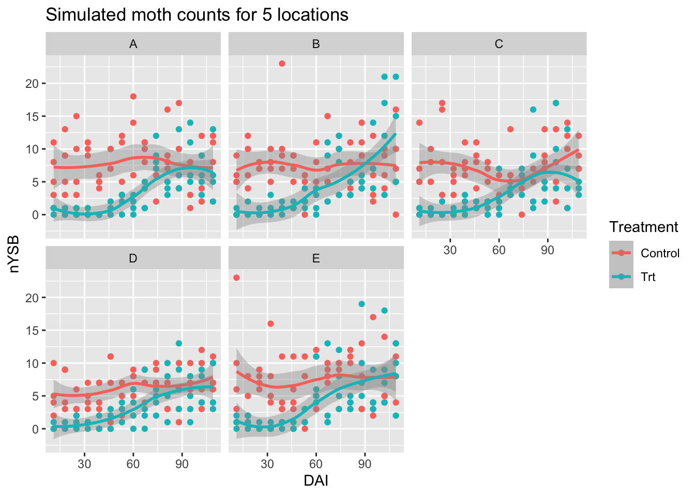
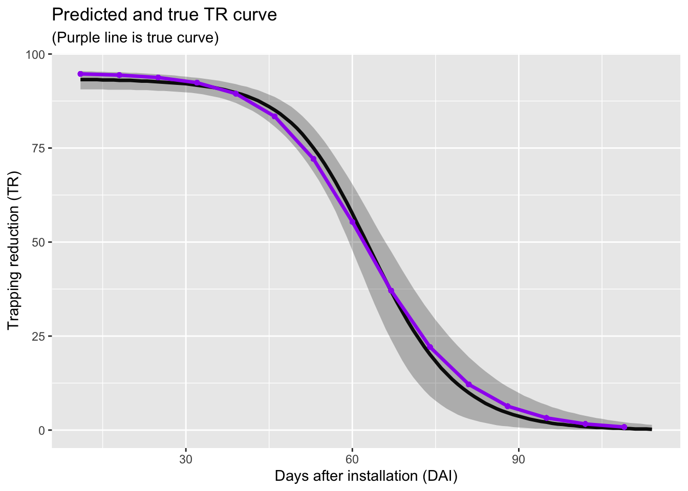
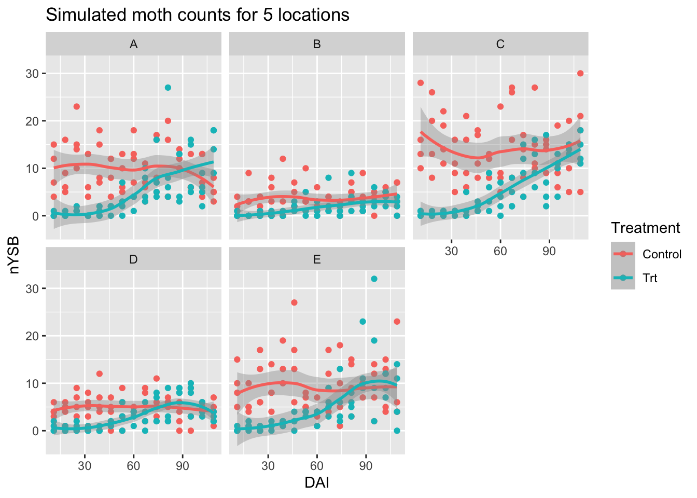
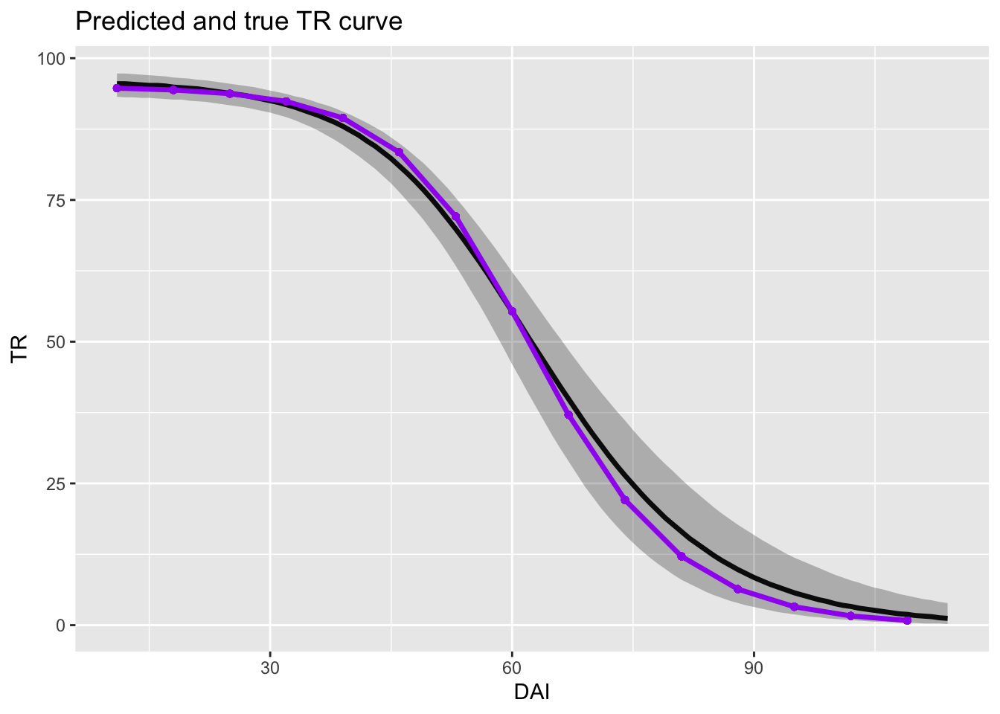

# Nonlinear Bayesian Models in R {#NonlinearR}

As mentioned in Section \@ref(CaseStudy), the treatment group for these data is a pheromone dispenser. Eventually, given enough time, the dispenser has to run out of pheromone and the moth counts in the treatment and control groups are expected to have the same expected counts for a given location. Mathematically, $\beta_1 \to 0$ as $t \to \infty$. The timeline for this to happen may or may not happen during the field season, but we want to be sure to include this potential dynamic in the model to statistically test whether the loss of performance is observed or not.

To include this potential change over time, a nonlinear relationship between moth counts and treatment effect is needed in our model. In particular, $\beta_1$ should have an asymmetric sigmoidal curve. Here, I use a generalized logistic curve to get an appropriate shape.

## Setup 

This chapter begins with almost the same setup code as Chapter \@ref(GLMMsR), copied here for easier reference. A few of the functions used in Chapter \@ref(GLMMsR) are excluded from this script because they are not needed and an extra data manipulation is completed-- a numeric version of the "Treatment" cateogrical variable is created for these models.


``` r
knitr::opts_chunk$set(cache = T, message =F, warning = F,  out.width = '100%')

## R libraries:
# uncomment and change package name to download any required packages
# install.packages("kableExtra") 
library(MASS)
library(lme4)
library(magrittr)
library(truncnorm)
library(tidyverse)
library(kableExtra)
library(ggmap)
# usethis::edit_r_environ()
register_google(Sys.getenv("ggmapKey")) # (key saved on hidden file for security)

# to run Bayesian models. Set appropriate nCores for your machine
library(brms)
nCores = 6 # nCores -2 so your machine doesn't overheat
library(ggmcmc) # ggs()


## Package and example code to find colors
# library(RColorBrewer)
# display.brewer.pal(11, "Spectral")
# brewer.pal(11, "Spectral")
mycolors = c("#9E0142", "#66C2A5")
```


``` r
# read in the data:
datRinit = read.csv("data/moths.csv")

# check data values: 
str(datRinit)
summary(datRinit)
lapply(datRinit, function(x) {
  if (is.character(x))
    unique(x)
})
```

``` r
# manipulate data:
datR <- datRinit %>%
  # convert dates to dates (instead of character string):
  mutate(TransplantDate = ymd(TransplantDate),
         DispInstallDate = ymd(DispInstallDate),
         TrapInstallDate = ymd(TrapInstallDate),
         SamplingDate = ymd(SamplingDate)
         )  %>%
  mutate(mothsperday = nYSB / DaysOfCatch, # standardize the counts
         SamplingDateC = as.character(SamplingDate))

## data manipulation that was not included in previous R chapter:
datR %<>%
  mutate(numTrt = ifelse(Treatment == "Control", 0, 1),
         DAI = DATI)

## average counts for each location, date
mean_cts <- datR %>%
  group_by(Location, Treatment,
           AssessmentNumber,
           SamplingDate, DAI) %>%
  summarize(mean_cts = mean(nYSB, na.rm = T),
            mean_mothsperday = mean(mothsperday)) %>%
  ungroup()
```


## Generalized Logistic Curve

The regression coefficient, $\beta_1$ is now a function of time, $\beta_1 = \beta_1(t)$:

(Adapted from [Wikipedia](https://en.wikipedia.org/wiki/Generalised_logistic_function).)

$$
\beta_1(t) = A + \frac{(K - A)}{(1 + e^{-B(t-M)})^{1/v}}
$$
where,

$A$ is the left horizontal asymptote,

$K$ is the right horizontal asymptote ($K = 0$ in our models),

$B$ is the growth rate ($B>0$; $B<0$ is a decay rate),

$v$ affects where the inflection point occurs, and

$M$ relates to the starting time of when the curve begins.


``` r
A = -3 # left asymptote
K = 0 # right asymptote
B = 0.06 # (decay rate if b < 0; growth if b > 0)
v = 0.2 # affects where inflection point is
# Q = 9 # related to y at time 0 (how long until y starts to go to 0)
m = 50 # expected DAI when TR failure is midway
Q = exp(B*m)
C = 1

t = 0:150
beta = A + ( (K - A)  / ( (C + Q * exp(-1 * t * B)) ^ (1 / v) ) )
TR = 100 * (1 - exp(beta))
plot(t, beta, type = "l", xlab = "Days after installation (DAI)",
     ylab =  expression(paste("Regression coefficient, ", beta[1])),
     main = expression(paste("How ", beta[1], " may change through a field season")))
```


``` r
plot(t, TR, type = "l", xlab = "Days after installation (DAI)",
     ylab = "Trapping Reduction",
     main = "How trapping reduction may change through a season")
```


This [shiny app](https://bromsk.shinyapps.io/GeneralizedLogisticCurves/) allows you to play around with how the parameter values affect the curve. It is helpful in understanding the model and setting priors for the model.


## Bayesian model

Our previous model (\@ref(glmm-gp)) now has an extra hierarchical layer to account for the varying $\beta_1(t)$. Our previous model had a random effect to account for the fact that the Treatment effect may vary across locations. Here,  to allow for a similar Treatment effect variability across locations, the $A$ parameter of the generalized logistic curve is a random effect, allowing for different maximum levels of trapping reduction at each site.

Model: 

$$
y_{ijt} \sim NegBinom(\lambda_{ijt}, \theta) \\
log(\lambda_{ikt} ) = \beta_0 + \beta_{1,k}(t) x_{Trt,i} + \gamma_{0k} x_{ik}  + GP_{k,t}  + \mbox{ln} \left(DaysOfCatch_i\right) \\
\beta_{1,k}(t) = A_k \left(1 - \frac{1}{(1 + e^{-B(t-M)})}\right) \\
\gamma_{0k} \sim Normal(0, \sigma_{\gamma_0}^2) \\ 
\mathbf{GP_k} \sim MVN(0, \boldsymbol\Sigma_k) \\
$$
where each element $lm$ of $\Sigma_k$ is: $\sigma_{k, lm} = \tau_k \cdot e^{-\frac{|d_l - d_m|^2}{l_k^2}}$.


Priors: 

$$
\beta_0 \sim Normal(0, 2) \\
A_k \sim HalfNormal(0, 2) \\
B \sim HalfNormal(0.5) \\
M \sim Uniform(0, 150) \\
v \sim HalfNormal(0.5) \\
\sigma_{\gamma_0} \sim HalfCauchy(0, 1) \\
\tau_k \sim HalfCauchy(0, 1) \\
l_k \sim HalfCauchy(0, 1) \\
\theta \sim HalfCauchy(0,1) \\
$$

where, 

$i = 1, ..., I$ are the unique moth counts in our data set,

$k = 1,..., K=10$ represents the locations, 

$t = 1, ..., T$ are the time points (days) after installation,

$y_{ikt}$ is moth count $i$ from location $k$ on day $t$,

$\lambda_{ikt}$ is the expected moth count for sample $i$  from location $k$ on day $t$,

$\theta$ is the extra variability associated with the negative binomial distribution,

$\beta_0$ is the expected moth count for our control treatment for a new location,

$\beta_{1,t}$ is the expected difference in moth counts between the control group and the Treatment group for a new location at $t$ days from the installation, 

$x_{Trt, i}$ is an indicator variable that equals 1 if sample $i$ is from a treatment field and equals 0 otherwise, and

$\gamma_{0k}$ is the random intercept associated with location $k$, which leads to different background (control group) moth pressures at each location,

$x_{ik}$ is an indicator variable that equals 1 if moth count $i$ is associated with location $k$ and 0 otherwise.

$GP_k,t$ is the Gaussian Process associated with location $k$ at time $t$,

$DaysOfCatch_i$ is the offset to account for the varying time interval between samples,

$A_k$ is the maximum trapping reduction (represented by the max coefficient value) associated with location $k$,

$B$ is the growth rate of the logistic curve,

$M$ relates to the starting time of when the logistic curve begins,

$\sigma_{\gamma_0}$ is the variability associated with the background moth populations,

$\tau_k$ is the variability associated with the Gaussian Process for location $k$, and

$l_k$ is the length-scale associated with location $k$, which helps determine the length of time for which data points are correlated.


For now, we assume that each location shares all of the same nonlinear, logistic parameters except for $A$, the maximum trapping reduction level. We also set $v=1$ in the logistic curve.

## Fitting models with the brms package

Before fitting the above model to our data, we continue to slowly build up our model and test it by fitting the model to simulated data. The simulated data has an obvious drop in product performance while the "real" data has a much more subtle drop.

Setting priors in a nonlinear model is non-trivial! Make sure the ranges of your priors make sense.


``` r
# shared sim data components:
DAI = 11:114
DAIsampled = seq(11, 114, by = 7)
Treatment = c("Control", "Trt")
Location = c("A", "B", "C", "D", "E")
nLocs = length(Location)
Trap = 1:4

shape_param = 5

simdataBase <- expand_grid(Location, Treatment, Trap, DAI = DAIsampled) %>%
  mutate(DaysOfCatch = 1,
         numTrt = ifelse(Treatment == "Control", 0, 1))
```

### No RE, no GP

The first nonlinear model that I fit has no random effects and no Gaussian Process:

$$
y_{ijt} \sim NegBinom(\lambda_{ijt}, \theta) \\
log(\lambda_{ikt} ) = \beta_0 + \beta_{1}(t) x_{Trt,i} + \mbox{ln} \left(DaysOfCatch_i\right) \\
\beta_{1,t} = A \left(1 - \frac{1}{(1 + e^{-B(t-M)})}\right) \\
$$


``` r
set.seed(0528)
b0 = 2
A = -3
B = 0.1
M = 50
b1 = A * (1 - 1 / (1 + exp(-1 * B * (DAI - M) )))

simdata1 <- simdataBase %>%
  mutate(b1 = A * (1 - 1 / (1 + exp(-1 * B * (DAI - M) ))),
         TR = 100 * (1 - exp(b1)),
         muTmp = exp(b0 + b1*numTrt),
         nYSB = rnbinom(n=nrow(simdataBase), mu = muTmp, size = shape_param))

ggplot(simdata1, aes(DAI, nYSB, color = Treatment)) +
  geom_point() +
  geom_smooth() + 
  facet_wrap(~Location) +
  labs(title = "Simulated moth counts for 5 locations",
       xlab = "Days after installation (DAI)",
       ylab = "Number of moths per trap per day")
```



``` r
prior1 <- prior(normal(0,2), nlpar = "b0") +
  prior(normal(0, 2), lb = 0, nlpar = "A") + 
  prior(normal(0, 0.5), lb = 0, nlpar = "B") +
  prior(uniform(0, 120), lb = 0, ub = 120, nlpar = "M") +
  prior(cauchy(0,1), lb = 0, class = "shape")

fit1 <- brm(bf(nYSB ~ b0 - (A * (1 - 1 / (1 + exp(-1 * B * (DAI - M) )))) * numTrt +
                log(DaysOfCatch), # offset() is implicit in nonlinear formula
              b0 + A + B + M ~ 1,
              nl = TRUE), 
              control = list(adapt_delta = 0.9),
              data = simdata1, 
              family = negbinomial,
              prior = prior1,
              warmup = 1000, iter = 2000, 
              seed = 5000,
              chains = nCores, cores = nCores) 
saveRDS(fit1, "output/fit1.RDS")
```

The model estimates are very close to the true parameter values. We do not expect the parameters to match exactly due to the simulated noise in the data, but with many different simulated data sets, we expected the average of the estimated values to converge to the true values.


``` r
fit1 <- readRDS("output/fit1.RDS")
# plot(fit1)
# prior_summary(fit1)

kable(round(summary(fit1)$fixed, 2))
```


Table: (\#tab:summary1)Model estimates of the fixed effects parameters.

|             | Estimate| Est.Error| l-95% CI| u-95% CI| Rhat| Bulk_ESS| Tail_ESS|
|:------------|--------:|---------:|--------:|--------:|----:|--------:|--------:|
|b0_Intercept |     1.98|      0.03|     1.92|     2.04|    1|  4151.18|  3618.37|
|A_Intercept  |     2.73|      0.20|     2.37|     3.17|    1|  2746.68|  2771.02|
|B_Intercept  |     0.12|      0.02|     0.08|     0.17|    1|  2741.00|  3352.33|
|M_Intercept  |    53.18|      2.22|    48.41|    57.13|    1|  2631.54|  2855.89|

``` r
kable(round(summary(fit1)$spec_pars, 2))
```


Table: (\#tab:summary1)Model estimates of the fixed effects parameters.

|      | Estimate| Est.Error| l-95% CI| u-95% CI| Rhat| Bulk_ESS| Tail_ESS|
|:-----|--------:|---------:|--------:|--------:|----:|--------:|--------:|
|shape |     5.48|      0.65|     4.35|     6.89|    1|  4519.58|  4149.31|

``` r
kable(data.frame(Parameter = c("b0", "A", "B", "M", "shape"),
           Values = c(b0, -1*A, B, M, shape_param)), caption = "True parameter values.")
```


Table: (\#tab:summary1)True parameter values.

|Parameter | Values|
|:---------|------:|
|b0        |    2.0|
|A         |    3.0|
|B         |    0.1|
|M         |   50.0|
|shape     |    5.0|


### Intercept RE, no GP

This simulation study now includes the intercept RE, allowing for different background moth pressures at each location:

$$
y_{ijt} \sim NegBinom(\lambda_{ijt}, \theta) \\
log(\lambda_{ikt} ) = \beta_0 + \beta_{1}(t) x_{Trt,i} + \gamma_{0k} x_{ik} + \mbox{ln} \left(DaysOfCatch_i\right) \\
\beta_{1,t} = A \left(1 - \frac{1}{(1 + e^{-B(t-M)})}\right) \\
$$


``` r
set.seed(0528)
b0mean = 2
b0sd = 0.8
b0 = rnorm(n = nLocs, b0mean, sd = b0sd) # now have 5 intercepts for 5 loc's
A = -3
B = 0.1
M = 50
b1 = A * (1 - 1 / (1 + exp(-1 * B * (DAI - M) )))

simdata2 = simdataBase %>%
  left_join(data.frame(b0, Location))
simdata2 %<>%
  mutate(b1 = A * (1 - 1 / (1 + exp(-1 * B * (DAI - M) ))),
         TR = 100 * (1 - exp(b1)),
         muTmp = exp(b0 + b1*numTrt),
         nYSB = rnbinom(n=nrow(simdataBase), mu = muTmp, size = 5))
ggplot(simdata2, aes(DAI, nYSB, color = Treatment)) +
  geom_point() +
  geom_smooth() + 
  facet_wrap(~Location)  +
  labs(title = "Simulated moth counts for 5 locations",
       xlab = "Days after installation (DAI)",
       ylab = "Number of moths per trap per day")
```



``` r
prior2 <- prior(normal(0,2), nlpar = "b0") +
  prior(normal(0, 2), lb = 0, nlpar = "A") + 
  prior(normal(0, 0.5), lb = 0, nlpar = "B") +
  prior(uniform(0, 120), lb = 0, ub = 120, nlpar = "M")

fit2 <- brm(bf(nYSB ~ b0 - (A * (1 - 1 / (1 + exp(-1 * B * (DAI - M) )))) * numTrt +                 log(DaysOfCatch), # offset() is implicit in nonlinear formula
              b0 ~ 1 + (1|Location),
              A + B + M ~ 1,
              nl = TRUE), 
              control = list(adapt_delta = 0.9),
              data = simdata2, 
              family = negbinomial,
              prior = prior2,
              warmup = 1000, iter = 2000, 
              seed = 5000,
              chains = nCores, cores = nCores) 
saveRDS(fit2, "output/fit2.RDS")
```

Again, the model estimates are close to the true parameter values.


``` r
fit2 <- readRDS("output/fit2.RDS")
# some plots to help assess model fit:
# plot(fit2)
# conditional_effects(fit2, "DAI:numTrt")
# # # 
# conditions <- data.frame(Location = unique(simdata2$Location))
# rownames(conditions) <- unique(simdata2$Location)
# me_loss <- conditional_effects(
#   fit2, conditions = conditions,
#   re_formula = NULL, method = "predict"
# )
# plot(me_loss, ncol = 5, points = TRUE)

kable(round(summary(fit2)$fixed, 2))
```


|             | Estimate| Est.Error| l-95% CI| u-95% CI| Rhat| Bulk_ESS| Tail_ESS|
|:------------|--------:|---------:|--------:|--------:|----:|--------:|--------:|
|b0_Intercept |     1.95|      0.37|     1.12|     2.62|    1|  1208.28|   936.02|
|A_Intercept  |     3.33|      0.36|     2.74|     4.13|    1|  2537.64|  2437.49|
|B_Intercept  |     0.08|      0.01|     0.06|     0.11|    1|  2387.35|  2859.84|
|M_Intercept  |    45.97|      3.56|    38.07|    52.12|    1|  2354.74|  2246.43|

``` r
kable(round(summary(fit2)$random$Location, 2))
```


|                 | Estimate| Est.Error| l-95% CI| u-95% CI| Rhat| Bulk_ESS| Tail_ESS|
|:----------------|--------:|---------:|--------:|--------:|----:|--------:|--------:|
|sd(b0_Intercept) |     0.77|      0.43|     0.34|     2.02|    1|   987.54|   751.96|

``` r
kable(round(summary(fit2)$spec_pars, 2))
```


|      | Estimate| Est.Error| l-95% CI| u-95% CI| Rhat| Bulk_ESS| Tail_ESS|
|:-----|--------:|---------:|--------:|--------:|----:|--------:|--------:|
|shape |     5.25|      0.61|     4.18|     6.52|    1|  3583.03|  2191.34|

``` r
kable(data.frame(Parameter = c("b0 mean", "A", "B", "M", "b0 SD", "shape"),
           Values = c(b0mean,-1*A, B, M,  b0sd, shape_param)), caption = "True parameter values.")
```


Table: (\#tab:summary2)True parameter values.

|Parameter | Values|
|:---------|------:|
|b0 mean   |    2.0|
|A         |    3.0|
|B         |    0.1|
|M         |   50.0|
|b0 SD     |    0.8|
|shape     |    5.0|



### Intercept RE, A RE, no GP

This simulation study now adds the random effects to the left asymptote of the logistic curve, the $A$ parameter, allowing for different max trapping reduction (min $\beta_1$ values) at each location:

$$
y_{ijt} \sim NegBinom(\lambda_{ijt}, \theta) \\
log(\lambda_{ikt} ) = \beta_0 + \beta_{1,k}(t) x_{Trt,i} + \gamma_{0k} x_{ik} + \mbox{ln} \left(DaysOfCatch_i\right) \\
\beta_{1,k}(t) = A_k \left(1 - \frac{1}{(1 + e^{-B(t-M)})}\right) \\
$$


``` r
set.seed(0528)
b0mean = 2
b0sd = 0.8
b0 = rnorm(n = nLocs, b0mean, sd = b0sd) 
Amean = -3
Asd = 0.5
A = rnorm(n = nLocs, Amean, sd = Asd)
B = 0.1
M = 50

simdata3 <- simdataBase %>%
  left_join(data.frame(b0, Location))  %>%
  left_join(data.frame(A, Location))

simdata3 %<>%
  mutate(b1 = A * (1 - 1 / (1 + exp(-1 * B * (DAI - M) ))),
         TR = 100 * (1 - exp(b1)),
         muTmp = exp(b0 + b1*numTrt),
         nYSB = rnbinom(n=nrow(simdata3), mu = muTmp, size = 5))

ggplot(simdata3, aes(DAI, nYSB, color = Treatment)) +
  geom_point() +
  geom_smooth() + 
  facet_wrap(~Location) +
  labs(title = "Simulated moth counts for 5 locations",
       xlab = "Days after installation (DAI)",
       ylab = "Number of moths per trap per day")
```


``` r
prior3 <- prior(normal(0,2), nlpar = "b0") +
  prior(normal(0, 2), lb = 0, nlpar = "A") + 
  prior(normal(0, 0.5), lb = 0, nlpar = "B") +
  prior(uniform(0, 120), lb = 0, ub = 120, nlpar = "M") +
  prior(cauchy(0,1), lb = 0, class = "shape")

fit3 <- brm(bf(nYSB ~ b0 - (A * (1 - 1 / (1 + exp(-1 * B * (DAI - M) )))) * numTrt +
                log(DaysOfCatch), # offset() is implicit in nonlinear formula
              b0 ~ 1 + (1|Location),
              A  ~ 1 + (1|Location),
              B + M ~ 1,
              nl = TRUE), 
              control = list(adapt_delta = 0.9),
              data = simdata3, 
              family = negbinomial,
              prior = prior3,
              warmup = 1000, iter = 2000, 
              seed = 5000,
              chains = nCores, cores = nCores) 
saveRDS(fit3, "output/fit3.RDS")
```

|             | Estimate| Est.Error| l-95% CI| u-95% CI| Rhat| Bulk_ESS| Tail_ESS|
|:------------|--------:|---------:|--------:|--------:|----:|--------:|--------:|
|b0_Intercept |     1.97|      0.38|     1.19|     2.69|    1|  1272.87|  1712.52|
|A_Intercept  |     3.32|      0.47|     2.54|     4.33|    1|  2596.16|  2481.24|
|B_Intercept  |     0.08|      0.01|     0.06|     0.10|    1|  3208.98|  2929.41|
|M_Intercept  |    46.20|      4.45|    36.25|    53.58|    1|  2930.38|  2218.12|


|                 | Estimate| Est.Error| l-95% CI| u-95% CI| Rhat| Bulk_ESS| Tail_ESS|
|:----------------|--------:|---------:|--------:|--------:|----:|--------:|--------:|
|sd(b0_Intercept) |     0.75|      0.37|     0.33|     1.74|    1|  1560.44|  1659.58|
|sd(A_Intercept)  |     0.41|      0.39|     0.01|     1.40|    1|  1625.72|  1934.23|


|      | Estimate| Est.Error| l-95% CI| u-95% CI| Rhat| Bulk_ESS| Tail_ESS|
|:-----|--------:|---------:|--------:|--------:|----:|--------:|--------:|
|shape |      5.1|      0.59|     4.08|     6.39|    1|  7515.83|  4013.53|


Table: (\#tab:summary3)True parameter values.

|Parameter | Values|
|:---------|------:|
|b0 mean   |    2.0|
|A mean    |    3.0|
|B         |    0.1|
|M         |   50.0|
|b0 SD     |    0.8|
|A SD      |    0.5|
|shape     |    5.0|


### Intercept RE, A RE, WITH GP (same for all loc)

Now we add the Gaussian Process to the model, explicitly allowing for the correlated change in background moth pressure over time. However, we start with using the same GP for all locations:

$$
y_{ijt} \sim NegBinom(\lambda_{ijt}, \theta) \\
log(\lambda_{ikt} ) = \beta_0 + \beta_{1,k}(t) x_{Trt,i} + \gamma_{0k} x_{ik} + GP_{k,t} + \mbox{ln} \left(DaysOfCatch_i\right) \\
\beta_{1,k}(t) = A_k \left(1 - \frac{1}{(1 + e^{-B(t-M)})}\right) \\
\mathbf{GP} \sim MVN(0, \boldsymbol\Sigma) \\
\sigma_{lm} = \tau \cdot e^{-\frac{|d_l - d_m|^2}{l^2}}
$$


``` r
# simulate the GP:
x = DAIsampled # runif(100)
d = abs(outer(x, x, "-")) # compute distance matrix, d_{ij} = |x_i - x_j|
l = 30 # length scale- smaller l is more wiggle
tau = 3
Sigma_SE = tau * exp(-d^2/(2*l^2)) # squared exponential kernel
set.seed(100)
for (i in 1:length(Location)) {
  GP = as.vector(mvtnorm::rmvnorm(1,sigma=Sigma_SE))
  # plot(DAIsampled, GP, type = "l")
  if (i == 1) {
   out = data.frame(DAI = DAIsampled,
             GP = as.vector(GP),
             Location = Location[i])
  } else {
    out %<>%
      bind_rows(data.frame(DAI = DAIsampled,
             GP = as.vector(GP),
             Location = Location[i]))
  }
}

# str(dat)
set.seed(0530)
b0mean = 1
b0sd = 1.5
Amean = -3
Asd = 0.5
b0 = rnorm(n = nLocs, b0mean, sd = b0sd) 
A = rnorm(n = nLocs, Amean, sd = Asd)
B = 0.1
M = 50

simdata4 <- simdataBase %>%
  left_join(data.frame(b0, Location))  %>%
  left_join(data.frame(A, Location)) %>%
  left_join(out)
# head(simdata4)
simdata4 %<>%
  mutate(b1 = A * (1 - 1 / (1 + exp(-1 * B * (DAI - M) ))),
         TR = 100 * (1 - exp(b1)),
         muTmp = exp(b0 + b1*numTrt + GP),
         nYSB = rnbinom(n=nrow(simdata4), mu = muTmp, size = 30))
# print(sum(is.na(simdata4$nYSB)))
simdata4 %<>%
  mutate(nYSB = ifelse(is.na(nYSB), 0, nYSB))
# hist(simdata4$nYSB)
ggplot(simdata4, aes(DAI, nYSB, color = Treatment)) +
  geom_point() +
  geom_smooth() + 
  facet_wrap(~Location, scales = "free") +
  labs(title = "Simulated moth counts for 5 locations",
       xlab = "Days after installation (DAI)",
       ylab = "Number of moths per trap per day")
```


``` r
# https://bookdown.org/content/4857/adventures-in-covariance.html#continuous-categories-and-the-gaussian-process
prior4 <- prior(normal(0,2), nlpar = "b0") +
  prior(normal(0, 2), lb = 0, nlpar = "A") + 
  prior(normal(0, 0.5), lb = 0, nlpar = "B") +
  prior(uniform(0, 120), lb = 0, ub = 120, nlpar = "M") +
  prior(cauchy(0,1), lb = 0, class = "shape") +
  prior(cauchy(0,50), lb = 0, class = "lscale", nlpar = "gpP") +
  prior(cauchy(0,1), lb = 0, class = "sdgp", nlpar = "gpP")

fit4 <- brm(bf(nYSB ~  b0 - (A * (1 - 1 / (1 + exp(-1 * B * (DAI - M) )))) * numTrt + 
              gpP + 
              log(DaysOfCatch), 
              b0 ~ (1|Location),
              gpP ~ 1 + gp(DAI), # GP absorbs the intercept
              A  ~ 1 + (1|Location),
              B + M ~ 1,
              nl = TRUE), 
              control = list(adapt_delta = 0.9),
              data = simdata4, 
              family = negbinomial,
              prior = prior4,
              warmup = 1000, iter = 2000, 
              seed = 5000,
              chains = nCores, cores = nCores) 
saveRDS(fit4, "output/fit4.RDS")
```

|              | Estimate| Est.Error| l-95% CI| u-95% CI| Rhat| Bulk_ESS| Tail_ESS|
|:-------------|--------:|---------:|--------:|--------:|----:|--------:|--------:|
|b0_Intercept  |     0.03|      1.98|    -3.83|     3.87|    1|  6293.96|  3941.04|
|gpP_Intercept |     2.69|      2.16|    -1.54|     6.84|    1|  4905.29|  4209.02|
|A_Intercept   |     2.73|      0.64|     1.19|     3.85|    1|  2492.44|  1617.24|
|B_Intercept   |     0.16|      0.04|     0.10|     0.24|    1|  4417.63|  4250.12|
|M_Intercept   |    54.59|      2.08|    50.13|    58.39|    1|  6223.34|  3734.31|


|                 | Estimate| Est.Error| l-95% CI| u-95% CI| Rhat| Bulk_ESS| Tail_ESS|
|:----------------|--------:|---------:|--------:|--------:|----:|--------:|--------:|
|sd(b0_Intercept) |     1.68|      0.72|     0.81|     3.59|    1|  3169.49|  3885.51|
|sd(A_Intercept)  |     1.29|      0.63|     0.55|     2.92|    1|  2315.48|  3296.98|


|                  | Estimate| Est.Error| l-95% CI| u-95% CI| Rhat| Bulk_ESS| Tail_ESS|
|:-----------------|--------:|---------:|--------:|--------:|----:|--------:|--------:|
|sdgp(gpP_gpDAI)   |     0.51|      0.34|     0.18|     1.35|    1|  3283.72|  3522.94|
|lscale(gpP_gpDAI) |     0.25|      0.12|     0.12|     0.49|    1|  1728.95|  2061.37|


|      | Estimate| Est.Error| l-95% CI| u-95% CI| Rhat| Bulk_ESS| Tail_ESS|
|:-----|--------:|---------:|--------:|--------:|----:|--------:|--------:|
|shape |      1.8|      0.13|     1.55|     2.06|    1| 10598.95|  4617.74|


Table: (\#tab:summary4)True parameter values.

|Parameter | Values|
|:---------|------:|
|b0 mean   |    1.0|
|A mean    |    3.0|
|B         |    0.1|
|M         |   50.0|
|b0 SD     |    1.5|
|A SD      |    0.5|
|tau       |    3.0|
|l         |   30.0|
|shape     |    5.0|


### Intercept, A RE, with GP (DIFF for each loc)

Starting here, I include 9 locations for each simulation as I found more locations were required for the model to estimate the parameters.

This model has different GP's or each location (as in Sections \@ref(glmm-gp) and \@ref(fit-glmm-gpR)):

$$
y_{ijt} \sim NegBinom(\lambda_{ijt}, \theta) \\
log(\lambda_{ikt} ) = \beta_0 + \beta_{1,k}(t) x_{Trt,i} + \gamma_{0k} x_{ik} + GP_{k,t} + \mbox{ln} \left(DaysOfCatch_i\right) \\
\beta_{1,k}(t) = A_k \left(1 - \frac{1}{(1 + e^{-B(t-M)})}\right) \\
\mathbf{GP_k} \sim MVN(0, \boldsymbol\Sigma_k) \\
\sigma_{k,lm} = \tau_k \cdot e^{-\frac{|d_l - d_m|^2}{l_k^2}}
$$

``` r
Location = c("A", "B", "C", "D", "E", "F", "G", "H", "I")
Trap = 1:4
nLocs = length(Location)

# simulate the GP:
set.seed(100)
x = DAIsampled # runif(100)
d = abs(outer(x, x, "-")) # compute distance matrix, d_{ij} = |x_i - x_j|
l_mean = 30
l_sd = 10
tau_mean = 3
tau_sd = 1
l = rnorm(n = nLocs, mean = l_mean, sd = l_sd) # smaller l is more wiggle
tau = rnorm(n = nLocs, mean = tau_mean, sd = tau_sd)
for (i in 1:nLocs) {
  Sigma_SE = tau[i] * exp(-d^2/(2*l[i]^2)) # squared exponential kernel
  GP = as.vector(mvtnorm::rmvnorm(1,sigma=Sigma_SE))
  if (all(GP<0)) GP = abs(GP)
  # GP = abs(GP)
  # plot(DAIsampled, GP, type = "l")
  if (i == 1) {
   out = data.frame(DAI = DAIsampled,
             GP = as.vector(GP),
             Location = Location[i])
  } else {
    out %<>%
      bind_rows(data.frame(DAI = DAIsampled,
             GP = as.vector(GP),
             Location = Location[i]))
  }
}
#

set.seed(0530)
b0mean = 1
b0sd = 1.5
Amean = -3
Asd = 0.5
b0 = rnorm(n = nLocs, b0mean, sd = b0sd) # now have 5 intercepts for 5 loc's
A = rnorm(n = nLocs, Amean, sd = Asd)
B = 0.1
M = 50

simdata5 <- expand_grid(Location, Treatment, Trap, DAI= DAIsampled) %>%
  mutate(DaysOfCatch = 1,
         numTrt = ifelse(Treatment == "Control", 0, 1)) %>%
  left_join(data.frame(b0, Location))  %>%
  left_join(data.frame(A, Location)) %>%
  left_join(out)
# head(simdata5)
shape_param = 30 # DIFFERENT!
simdata5 %<>%
  mutate(b1 = A * (1 - 1 / (1 + exp(-1 * B * (DAI - M) ))),
         TR = 100 * (1 - exp(b1)),
         muTmp = exp(b0 + b1*numTrt + GP),
         nYSB = rnbinom(n=nrow(simdata5), mu = muTmp, size = shape_param))
# print(sum(is.na(simdata5$nYSB)))
simdata5 %<>%
  mutate(nYSB = ifelse(is.na(nYSB), 0, nYSB))
# hist(simdata4$nYSB)
ggplot(simdata5, aes(DAI, nYSB, color = Treatment)) +
  geom_point() +
  geom_smooth() + 
  facet_wrap(~Location, scales = "free") +
  labs(title = "Simulated moth counts for 9 locations",
       xlab = "Days after installation (DAI)",
       ylab = "Number of moths per trap per day")
```


``` r
# https://bookdown.org/content/4857/adventures-in-covariance.html#continuous-categories-and-the-gaussian-process
prior5 <- prior(normal(0,2), nlpar = "b0") +
  prior(normal(0, 2), lb = 0, nlpar = "A") + 
  prior(normal(0, 0.5), lb = 0, nlpar = "B") +
  prior(uniform(0, 120), lb = 0, ub = 120, nlpar = "M") +
  prior(cauchy(0,1), lb = 0, class = "shape") +
  prior(cauchy(0,50), lb = 0, class = "lscale", nlpar = "gpP") +
  prior(cauchy(0,10), lb = 0, class = "sdgp", nlpar = "gpP")

fit5 <- brm(bf(nYSB ~  b0 - (A * (1 - 1 / (1 + exp(-1 * B * (DAI - M) )))) * numTrt +
              gpP + 
              log(DaysOfCatch), 
              b0 ~ (1|Location),
              gpP ~ 1 + gp(DAI, by = Location), # GP absorbs the intercept
              A  ~ 1 + (1|Location),
              B + M ~ 1,
              nl = TRUE), 
              control = list(adapt_delta = 0.9),
              data = simdata5, 
              prior = prior5,
              family = negbinomial,
              warmup = 1000, iter = 2000, 
              seed = 5000,
              chains = nCores, cores = nCores) 
saveRDS(fit5, "output/fit5.RDS")
```


### Intercept, A, B, M RE, with GP (DIFF for each loc)

In this most complex model, I make $B$ and $M$ random effects in the logistic curve, in addition to the $A$ parameter:

$$
y_{ijt} \sim NegBinom(\lambda_{ijt}, \theta) \\
log(\lambda_{ikt} ) = \beta_0 + \beta_{1,k}(t) x_{Trt,i} + \gamma_{0k} x_{ik} + GP_{k,t} + \mbox{ln} \left(DaysOfCatch_i\right) \\
\beta_{1,k}(t) = A_k \left(1 - \frac{1}{(1 + e^{-B_k(t-M_k)})}\right) \\
\mathbf{GP_k} \sim MVN(0, \boldsymbol\Sigma_k) \\
\sigma_{k,lm} = \tau_k \cdot e^{-\frac{|d_l - d_m|^2}{l_k^2}}
$$


``` r
set.seed(600)
Location = c("A", "B", "C", "D", "E", "F", "G", "H", "I")
nLocs = length(Location)

# simulate the GP:
x = DAIsampled # runif(100)
d = abs(outer(x, x, "-")) # compute distance matrix, d_{ij} = |x_i - x_j|
l_mean = 30
l_sd = 10
tau_mean = 1
tau_sd = 0.5
l = rnorm(n = nLocs, mean = l_mean, sd = l_sd) # smaller l is more wiggle
tau = rnorm(n = nLocs, mean = tau_mean, sd = tau_sd)
# set.seed(100)
for (i in 1:nLocs) {
  Sigma_SE = tau[i]^2 * exp(-d^2/(2*l[i]^2)) # squared exponential kernel
  GP = as.vector(mvtnorm::rmvnorm(1,sigma=Sigma_SE))
  if (all(GP<0)) GP = abs(GP)
  # GP = abs(GP)
  # plot(DAIsampled, GP, type = "l")
  if (i == 1) {
   out = data.frame(DAI = DAIsampled,
             GP = as.vector(GP),
             Location = Location[i])
  } else {
    out %<>%
      bind_rows(data.frame(DAI = DAIsampled,
             GP = as.vector(GP),
             Location = Location[i]))
  }
}
#

# set.seed(0530)
b0mean = 1
b0sd = 0.5
Amean = -3
Asd = 0.5
b0 = rnorm(n = b0mean, 1, sd = b0sd) # now have 5 intercepts for 5 loc's
A = rnorm(n = nLocs, Amean, sd = Asd)

Bmean = 0.1
Bsd = 0.02
Mmean = 50
Msd = 10
B = rtruncnorm(n = nLocs,a = 0, mean = Bmean, sd =Bsd)
M = rtruncnorm(n = nLocs, a = 0, mean = Mmean, sd = Msd)

simdata6 <- expand_grid(Location, Treatment, Trap, DAI = DAIsampled) %>%
  mutate(DaysOfCatch = 1,
         numTrt = ifelse(Treatment == "Control", 0, 1)) %>%
  left_join(data.frame(b0, Location))  %>%
  left_join(data.frame(A, Location)) %>%
  left_join(data.frame(B, Location)) %>%
  left_join(data.frame(M, Location)) %>%
  left_join(out)
# head(simdata4)
shape_param = 30
simdata6 %<>%
  mutate(b1 = A * (1 - (1 / (1 + exp(-1 * B * (DAI - M) )))),
         TR = 100 * (1 - exp(b1)),
         muTmp = exp(b0 + b1*numTrt + GP),
         nYSB = rnbinom(n=nrow(simdata6), mu = muTmp, size = shape_param))
# print(sum(is.na(simdata6$nYSB)))
simdata6 %<>%
  mutate(nYSB = ifelse(is.na(nYSB), 0, nYSB))
# hist(simdata4$nYSB)
ggplot(simdata6, aes(DAI, nYSB, color = Treatment)) +
  geom_point() +
  geom_smooth() + 
  facet_wrap(~Location, scales = "free") +
  labs(title = "Simulated moth counts for 9 locations",
       xlab = "Days after installation (DAI)",
       ylab = "Number of moths per trap per day")
```


``` r
# https://bookdown.org/content/4857/adventures-in-covariance.html#continuous-categories-and-the-gaussian-process
prior6 <- prior(normal(0,2), nlpar = "b0") +
  prior(normal(0, 2), lb = 0, nlpar = "A") + 
  prior(normal(0, 0.5), lb = 0, nlpar = "B") +
  prior(uniform(0, 120), lb = 0, ub = 120, nlpar = "M") +
  prior(cauchy(0,1), lb = 0, class = "shape") +
  prior(cauchy(0,50), lb = 0, class = "lscale", nlpar = "gpP") +
  prior(cauchy(0,10), lb = 0, class = "sdgp", nlpar = "gpP")

fit6 <- brm(bf(nYSB ~  b0 - (A * (1 - (1 / (1 + exp(-1 * B * (DAI - M) ))))) * numTrt +
              gpP + 
              log(DaysOfCatch), 
              b0 ~ 1 + (1|Location),
              gpP ~ 1 + gp(DAI, by = Location), # GP absorbs the intercept
              A  ~ 1 + (1|Location),
              B  ~ 1 + (1|Location),
              M  ~ 1 + (1|Location),
              nl = TRUE), 
              control = list(adapt_delta = 0.9),
              data = simdata6, 
              family = negbinomial,
              prior = prior6,
              warmup = 1000, iter = 2000, 
              seed = 5000,
              chains = nCores, cores = nCores) 
saveRDS(fit6, "output/fit6.RDS")
```


## Case study

Too many divergent warnings with model with intercept, A, B, M RE, with GP (DIFF for each loc). (M was multimodal)

Use constant B, M instead.


``` r
# https://bookdown.org/content/4857/adventures-in-covariance.html#continuous-categories-and-the-gaussian-process
prior6 <- prior(normal(0,2), nlpar = "b0") +
  prior(normal(0, 2), lb = 0, nlpar = "A") + 
  prior(normal(0, 0.5), lb = 0, nlpar = "B") +
  prior(uniform(0, 120), lb = 0, ub = 120, nlpar = "M") +
  prior(cauchy(0,1), lb = 0, class = "shape") +
  prior(cauchy(0,50), lb = 0, class = "lscale", nlpar = "gpP") +
  prior(cauchy(0,10), lb = 0, class = "sdgp", nlpar = "gpP")


fitR <- brm(bf(nYSB ~  b0 - 
                 (A * (1 - 1 / (1 + exp(-1 * B * (DAI - M) )))) * numTrt +
              gpP + 
              log(DaysOfCatch), 
              b0 ~ (1|Location),
              gpP ~ 1 + gp(DAI, by = Location), # GP absorbs the intercept
              A  ~ 1 + (1|Location),
              B + M ~ 1,
              nl = TRUE), 
              control = list(adapt_delta = 0.9),
              data = datR, 
              family = negbinomial,
              prior = prior6,
              warmup = 1000, iter = 2000, 
              seed = 5000,
              chains = nCores, cores = nCores) 
saveRDS(fitR, "output/fitR.RDS")
```


