# Nonlinear Bayesian models in R {#NonlinearR}

As mentioned in Section \@ref(CaseStudy), the treatment group for these data is a pheromone dispenser. Eventually, given enough time, the dispenser has to run out of pheromone and the moth counts in the treatment and control groups are expected to have the same expected counts for a given location. In other words, Trapping reduction goes from a max value to 0 over time. Mathematically, $\beta_1 \to 0$ as $t \to \infty$. The timeline for this to happen may or may not happen during the field season, but we want to be sure to include this potential dynamic in the model to statistically test whether the loss of performance is observed or not.

To include this potential change over time, a nonlinear relationship between moth counts and treatment effect is needed in our model. In particular, $\beta_1$ should have an asymmetric sigmoidal curve. Here, I use a generalized logistic curve to get an appropriate shape.

**Code is not included here for easier readability. Please follow along using [this](https://github.com/bromsk/BayesInPython/blob/main/docs/04-NonlinearInR.md) R script to run the code yourself.**

## Setup 

This chapter has similar setup code to Chapter \@ref(GLMMsR). Check the [script](https://github.com/bromsk/BayesInPython/blob/main/docs/04-NonlinearInR.md) to see the code.  


## Generalized logistic curve

The regression coefficient, $\beta_1$ is now a function of time, $\beta_1 = \beta_1(t)$:

(Adapted from [Wikipedia](https://en.wikipedia.org/wiki/Generalised_logistic_function).)

$$
\beta_1(t) = A + \frac{(K - A)}{(1 + e^{-B(t-M)})^{1/v}}
$$
where,

$A$ is the left horizontal asymptote,

$K$ is the right horizontal asymptote ($K = 0$ in our models),

$B$ is the growth rate ($B>0$; $B<0$ is a decay rate),

$v$ affects where the inflection point occurs, and

$M$ relates to the starting time of when the curve begins.

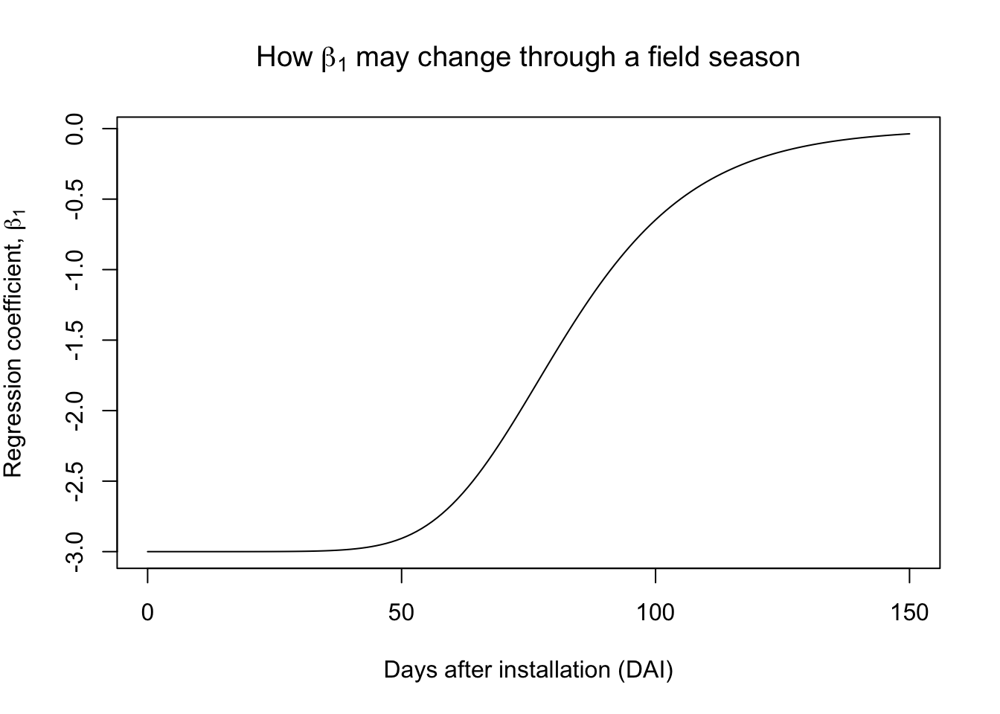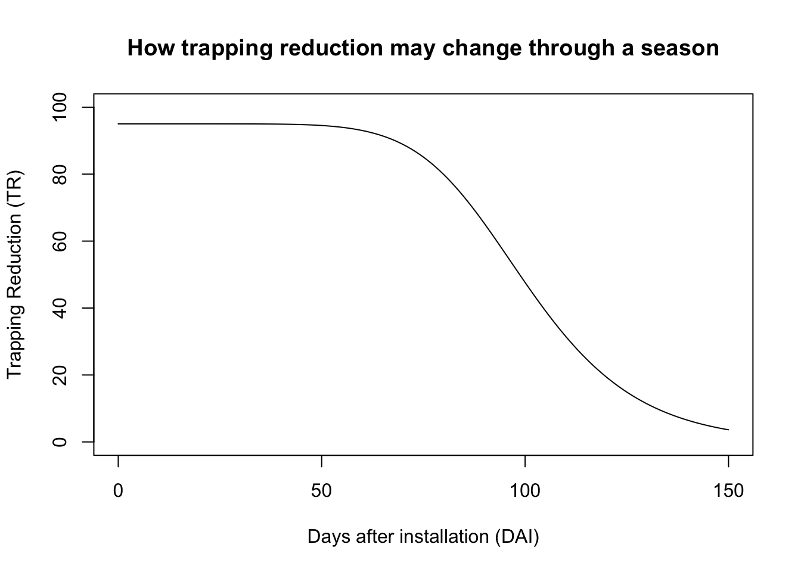

As a reminder, $TR = 100 - 100 e^{(-\beta_1)}$.

This [shiny app](https://bromsk.shinyapps.io/GeneralizedLogisticCurves/) allows you to play around with how the parameter values affect the curve. It is helpful in understanding the model and setting priors for the model.


## Bayesian model

Our previous model (\@ref(glmm-gp)) now has an extra hierarchical layer to account for the varying $\beta_1(t)$. Our previous model had a random effect to account for the fact that the Treatment effect may vary across locations. Here,  to allow for a similar Treatment effect variability across locations, the $A$ parameter of the generalized logistic curve is a random effect, allowing for different maximum levels of trapping reduction at each site.

Model: 

$$
y_{ijt} \sim NegBinom(\lambda_{ijt}, \theta) \\
log(\lambda_{ikt} ) = \beta_0 + \beta_{1,k}(t) x_{Trt,i} + \gamma_{0k} x_{ik}  + GP_{k,t}  + \mbox{ln} \left(DaysOfCatch_i\right) \\
\beta_{1,k}(t) = A_k \left(1 - \frac{1}{(1 + e^{-B(t-M)})}\right) \\
\gamma_{0k} \sim Normal(0, \sigma_{\gamma_0}^2) \\ 
\mathbf{GP_k} \sim MVN(0, \boldsymbol\Sigma_k) \\
$$
where each element $lm$ of $\Sigma_k$ is: $\sigma_{k, lm} = \tau_k \cdot e^{-\frac{|d_l - d_m|^2}{l_k^2}}$.


Priors: 

$$
\beta_0 \sim Normal(0, 2) \\
A_k \sim HalfNormal(0, 2) \\
B \sim HalfNormal(0.5) \\
M \sim Uniform(0, 150) \\
v \sim HalfNormal(0.5) \\
\sigma_{\gamma_0} \sim HalfCauchy(0, 1) \\
\tau_k \sim HalfCauchy(0, 1) \\
l_k \sim HalfCauchy(0, 1) \\
\theta \sim HalfCauchy(0,1) \\
$$

where, 

$i = 1, ..., I$ are the unique moth counts in our data set,

$k = 1,..., K=10$ represents the locations, 

$t = 1, ..., T$ are the time points (days) after installation,

$y_{ikt}$ is moth count $i$ from location $k$ on day $t$,

$\lambda_{ikt}$ is the expected moth count for sample $i$  from location $k$ on day $t$,

$\theta$ is the extra variability associated with the negative binomial distribution,

$\beta_0$ is the expected moth count for our control treatment for a new location,

$\beta_{1,t}$ is the expected difference in moth counts between the control group and the Treatment group for a new location at $t$ days from the installation, 

$x_{Trt, i}$ is an indicator variable that equals 1 if sample $i$ is from a treatment field and equals 0 otherwise, and

$\gamma_{0k}$ is the random intercept associated with location $k$, which leads to different background (control group) moth pressures at each location,

$x_{ik}$ is an indicator variable that equals 1 if moth count $i$ is associated with location $k$ and 0 otherwise.

$GP_k,t$ is the Gaussian Process associated with location $k$ at time $t$,

$DaysOfCatch_i$ is the offset to account for the varying time interval between samples,

$A_k$ is the maximum trapping reduction (represented by the max coefficient value) associated with location $k$,

$B$ is the growth rate of the logistic curve,

$M$ relates to the starting time of when the logistic curve begins,

$\sigma_{\gamma_0}$ is the variability associated with the background moth populations,

$\tau_k$ is the variability associated with the Gaussian Process for location $k$, and

$l_k$ is the length-scale associated with location $k$, which helps determine the length of time for which data points are correlated.


For now, we assume that each location shares all of the same nonlinear, logistic parameters except for $A$, the maximum trapping reduction level. We also set $v=1$ in the logistic curve.

## Simulation studies

Before fitting the above model to our data, we continue to slowly build up our model and test it by fitting the model to simulated data.

Setting priors in a nonlinear model is non-trivial! Make sure the ranges of your priors make sense.


<!-- ### No RE, no GP -->

<!-- The first nonlinear model that I fit has no random effects and no Gaussian Process: -->

<!-- $$ -->
<!-- y_{ijt} \sim NegBinom(\lambda_{ijt}, \theta) \\ -->
<!-- log(\lambda_{ikt} ) = \beta_0 + \beta_{1}(t) x_{Trt,i} + \mbox{ln} \left(DaysOfCatch_i\right) \\ -->
<!-- \beta_{1,t} = A \left(1 - \frac{1}{(1 + e^{-B(t-M)})}\right) \\ -->
<!-- $$ -->

<!-- In this model, each location has the same maximum trapping reduction (TR), and experiences the same loss in TR over the season, i.e., all locations share a common $\beta(t)$. Each location has similar moth counts as well. -->

<!-- ```{r simdata1, echo=F} -->
<!-- set.seed(0528) -->
<!-- b0 = 2 -->
<!-- A = -3 -->
<!-- B = 0.1 -->
<!-- M = 50 -->
<!-- b1 = A * (1 - 1 / (1 + exp(-1 * B * (DAI - M) ))) -->

<!-- simdata1 <- simdataBase %>% -->
<!--   mutate(b1 = A * (1 - 1 / (1 + exp(-1 * B * (DAI - M) ))), -->
<!--          TR = 100 * (1 - exp(b1)), -->
<!--          muTmp = exp(b0 + b1*numTrt), -->
<!--          nYSB = rnbinom(n=nrow(simdataBase), mu = muTmp, size = shape_param)) -->

<!-- ggplot(simdata1, aes(DAI, nYSB, color = Treatment)) + -->
<!--   geom_point() + -->
<!--   geom_smooth() +  -->
<!--   facet_wrap(~Location) + -->
<!--   labs(title = "Simulated moth counts for 5 locations", -->
<!--        x = "Days after installation (DAI)", -->
<!--        y = "Number of moths per trap") -->

<!-- ``` -->
<!-- ```{r fit1, eval =F, echo=F} -->
<!-- prior1 <- prior(normal(0,2), nlpar = "b0") + -->
<!--   prior(normal(0, 2), lb = 0, nlpar = "A") +  -->
<!--   prior(normal(0, 0.5), lb = 0, nlpar = "B") + -->
<!--   prior(uniform(0, 120), lb = 0, ub = 120, nlpar = "M") + -->
<!--   prior(cauchy(0,1), lb = 0, class = "shape") -->

<!-- fit1 <- brm(bf(nYSB ~ b0 - (A * (1 - 1 / (1 + exp(-1 * B * (DAI - M) )))) * numTrt + -->
<!--                 log(DaysOfCatch), # offset() is implicit in nonlinear formula -->
<!--               b0 + A + B + M ~ 1, -->
<!--               nl = TRUE),  -->
<!--               control = list(adapt_delta = 0.9), -->
<!--               data = simdata1,  -->
<!--               family = negbinomial, -->
<!--               prior = prior1, -->
<!--               warmup = 1000, iter = 2000,  -->
<!--               seed = 5000, -->
<!--               chains = nCores, cores = nCores)  -->
<!-- saveRDS(fit1, "output/fit1.RDS") -->
<!-- ``` -->

<!-- The model estimates are very close to the true parameter values. We do not expect the parameters to match exactly due to the simulated noise in the data, but with many different simulated data sets, we expected the average of the estimated values to converge to the true values. -->

<!-- ```{r summary1, tab.cap = "Model estimates of the fixed effects parameters.", echo = F} -->
<!-- fit1 <- readRDS("output/fit1.RDS") -->
<!-- # plot(fit1) -->
<!-- # prior_summary(fit1) -->

<!-- kable(round(summary(fit1)$fixed, 2)) -->
<!-- kable(round(summary(fit1)$spec_pars, 2)) -->
<!-- kable(data.frame(Parameter = c("b0", "A", "B", "M", "shape"), -->
<!--            Values = c(b0, -1*A, B, M, shape_param)), caption = "True parameter values.") -->

<!-- ``` -->
<!-- ```{r output1, echo = F} -->
<!-- # Calc TR -->
<!-- modtranformed <- ggs(fit1)  -->
<!-- # str(modtranformed) -->
<!-- A1 <- modtranformed %>%  -->
<!--   filter(Parameter == c("b_A_Intercept"),  -->
<!--          Iteration > 500) # remove burn-in -->
<!-- B1 <- modtranformed %>%  -->
<!--   filter(Parameter == c("b_B_Intercept"), -->
<!--          Iteration > 500) # remove burn-in -->
<!-- M1 <- modtranformed %>%  -->
<!--   filter(Parameter == c("b_M_Intercept"), -->
<!--          Iteration > 500) # remove burn-in -->
<!-- DAImatrix = matrix(DAI, nrow = nrow(A1), ncol = length(DAI), byrow = T) -->
<!-- tmp = apply(DAImatrix, 2, function(x) x - M1$value) # nIter x nDAI -->
<!-- beta1 = apply(tmp, 2, function(x) -1 * A1$value * (1 - 1 / (1 + exp(-1 * B1$value * x )))) -->
<!-- TR = 100 * (1 - exp(beta1)) -->

<!-- TR1 <- data.frame(TR = round(apply(TR, 2, median), 1),  -->
<!--            lowerCI = round(apply(TR, 2, quantile, 0.025), 1),  -->
<!--           upperCI = round(apply(TR, 2, quantile, 0.975), 1), -->
<!--           DAI = DAI) -->
<!-- ggplot(TR1) + -->
<!--   geom_line(aes(DAI, TR), linewidth = 1.2) + -->
<!--   geom_ribbon(aes(DAI, ymin = lowerCI, ymax = upperCI), alpha = 0.3) + -->
<!--   geom_line(data = simdata1, aes(DAI, TR), color = "purple", linewidth = 1.2) + -->
<!--   geom_point(data = simdata1, aes(DAI, TR), color = "purple", size = 1.2) + -->
<!--   labs(title = "Predicted and true TR curve",  -->
<!--        subtitle = "(Purple line is true curve)", -->
<!--        x = "Days after installation (DAI)", -->
<!--        y = "Trapping reduction (TR)") -->

<!-- ``` -->

<!-- ### Intercept RE, no GP -->

<!-- This simulation study now includes the intercept RE, allowing for different background moth pressures at each location, but all location still share a common $\beta(t)$. -->

<!-- $$ -->
<!-- y_{ijt} \sim NegBinom(\lambda_{ijt}, \theta) \\ -->
<!-- log(\lambda_{ikt} ) = \beta_0 + \beta_{1}(t) x_{Trt,i} + \gamma_{0k} x_{ik} + \mbox{ln} \left(DaysOfCatch_i\right) \\ -->
<!-- \beta_{1,t} = A \left(1 - \frac{1}{(1 + e^{-B(t-M)})}\right) \\ -->
<!-- $$ -->

<!-- ```{r simdata2, echo=F} -->
<!-- set.seed(0528) -->
<!-- b0mean = 2 -->
<!-- b0sd = 0.8 -->
<!-- b0 = rnorm(n = nLocs, b0mean, sd = b0sd) # now have 5 intercepts for 5 loc's -->
<!-- A = -3 -->
<!-- B = 0.1 -->
<!-- M = 50 -->
<!-- b1 = A * (1 - 1 / (1 + exp(-1 * B * (DAI - M) ))) -->

<!-- simdata2 = simdataBase %>% -->
<!--   left_join(data.frame(b0, Location)) -->
<!-- simdata2 %<>% -->
<!--   mutate(b1 = A * (1 - 1 / (1 + exp(-1 * B * (DAI - M) ))), -->
<!--          TR = 100 * (1 - exp(b1)), -->
<!--          muTmp = exp(b0 + b1*numTrt), -->
<!--          nYSB = rnbinom(n=nrow(simdataBase), mu = muTmp, size = 5)) -->
<!-- ggplot(simdata2, aes(DAI, nYSB, color = Treatment)) + -->
<!--   geom_point() + -->
<!--   geom_smooth() +  -->
<!--   facet_wrap(~Location)  + -->
<!--   labs(title = "Simulated moth counts for 5 locations", -->
<!--        x = "Days after installation (DAI)", -->
<!--        y = "Number of moths per trap") -->

<!-- ``` -->
<!-- ```{r fit2, eval =F, echo=F} -->
<!-- prior2 <- prior(normal(0,2), nlpar = "b0") + -->
<!--   prior(normal(0, 2), lb = 0, nlpar = "A") +  -->
<!--   prior(normal(0, 0.5), lb = 0, nlpar = "B") + -->
<!--   prior(uniform(0, 120), lb = 0, ub = 120, nlpar = "M") -->

<!-- fit2 <- brm(bf(nYSB ~ b0 - (A * (1 - 1 / (1 + exp(-1 * B * (DAI - M) )))) * numTrt +                 log(DaysOfCatch), # offset() is implicit in nonlinear formula -->
<!--               b0 ~ 1 + (1|Location), -->
<!--               A + B + M ~ 1, -->
<!--               nl = TRUE),  -->
<!--               control = list(adapt_delta = 0.9), -->
<!--               data = simdata2,  -->
<!--               family = negbinomial, -->
<!--               prior = prior2, -->
<!--               warmup = 1000, iter = 2000,  -->
<!--               seed = 5000, -->
<!--               chains = nCores, cores = nCores)  -->
<!-- saveRDS(fit2, "output/fit2.RDS") -->
<!-- ``` -->

<!-- Again, the model estimates are close to the true parameter values. -->

<!-- ```{r summary2, echo = F} -->
<!-- fit2 <- readRDS("output/fit2.RDS") -->
<!-- # some plots to help assess model fit: -->
<!-- # plot(fit2) -->
<!-- # conditional_effects(fit2, "DAI:numTrt") -->
<!-- # # #  -->
<!-- # conditions <- data.frame(Location = unique(simdata2$Location)) -->
<!-- # rownames(conditions) <- unique(simdata2$Location) -->
<!-- # me_loss <- conditional_effects( -->
<!-- #   fit2, conditions = conditions, -->
<!-- #   re_formula = NULL, method = "predict" -->
<!-- # ) -->
<!-- # plot(me_loss, ncol = 5, points = TRUE) -->

<!-- kable(round(summary(fit2)$fixed, 2)) -->
<!-- kable(round(summary(fit2)$random$Location, 2)) -->
<!-- kable(round(summary(fit2)$spec_pars, 2)) -->
<!-- kable(data.frame(Parameter = c("b0 mean", "A", "B", "M", "b0 SD", "shape"), -->
<!--            Values = c(b0mean,-1*A, B, M,  b0sd, shape_param)), caption = "True parameter values.") -->

<!-- ``` -->

<!-- ```{r output2, echo= F} -->
<!-- # Calc TR -->
<!-- modtranformed <- ggs(fit2)  -->
<!-- # get b0 estimates for each location: -->
<!-- meanb0est <- modtranformed %>% -->
<!--   filter(Parameter == "b_b0_Intercept") %>% -->
<!--   summarize(med = median(value)) -->
<!-- # modtranformed %>% -->
<!-- #   filter(grepl("r_", Parameter)) %>% -->
<!-- #   group_by(Parameter) %>% -->
<!-- #   summarize(med = median(value) + meanb0est$med) -->
<!-- # round(b0, 2) -->
<!-- # str(modtranformed) -->
<!-- estA <- modtranformed %>%  -->
<!--   filter(Parameter == c("b_A_Intercept"),  -->
<!--          Iteration > 500) # remove burn-in -->
<!-- estB <- modtranformed %>%  -->
<!--   filter(Parameter == c("b_B_Intercept"), -->
<!--          Iteration > 500) # remove burn-in -->
<!-- estM <- modtranformed %>%  -->
<!--   filter(Parameter == c("b_M_Intercept"), -->
<!--          Iteration > 500) # remove burn-in -->
<!-- DAImatrix = matrix(DAI, nrow = nrow(estA), ncol = length(DAI), byrow = T) -->
<!-- tmp = apply(DAImatrix, 2, function(x) x - estM$value) # nIter x nDAI -->
<!-- beta1 = apply(tmp, 2, function(x) -1 * estA$value * (1 - 1 / (1 + exp(-1 * estB$value * x )))) -->
<!-- TR = 100 * (1 - exp(beta1)) -->

<!-- TRdf <- data.frame(TR = round(apply(TR, 2, median), 1),  -->
<!--            lowerCI = round(apply(TR, 2, quantile, 0.025), 1),  -->
<!--           upperCI = round(apply(TR, 2, quantile, 0.975), 1), -->
<!--           DAI = DAI) -->
<!-- ggplot(TRdf) + -->
<!--   geom_line(aes(DAI, TR), linewidth = 1.2) + -->
<!--   geom_ribbon(aes(DAI, ymin = lowerCI, ymax = upperCI), alpha = 0.3) + -->
<!--   geom_line(data = simdata2, aes(DAI, TR), color = "purple", linewidth = 1.2) + -->
<!--   geom_point(data = simdata2, aes(DAI, TR), color = "purple", size = 1.2) + -->
<!--   labs(title = "Predicted and true TR curve",  -->
<!--        subtitle = "(Purple line is true curve)", -->
<!--        x = "Days after installation (DAI)", -->
<!--        y = "Trapping reduction (TR)") -->

<!-- ``` -->

### Intercept RE, A RE, no GP

This model includes a random effect on the intercept, which allows for different background moth pressures at each location. (Notice how much the y-axis varies from location to location.)

The Random effect on the $A$ parameter allows for different max trapping reduction (i.e., different maximum product performance) at each location. *Therefore, we have slightly different trapping reduction (TR) curves for each location.*

$$
y_{ijt} \sim NegBinom(\lambda_{ijt}, \theta) \\
log(\lambda_{ikt} ) = \beta_0 + \beta_{1,k}(t) x_{Trt,i} + \gamma_{0k} x_{ik} + \mbox{ln} \left(DaysOfCatch_i\right) \\
\beta_{1,k}(t) = A_k \left(1 - \frac{1}{(1 + e^{-B(t-M)})}\right) \\
$$

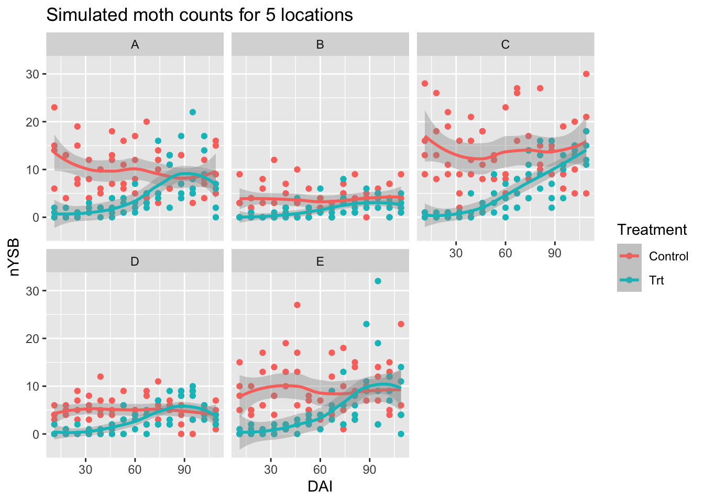


|             | Estimate| Est.Error| l-95% CI| u-95% CI| Rhat| Bulk_ESS| Tail_ESS|
|:------------|--------:|---------:|--------:|--------:|----:|--------:|--------:|
|b0_Intercept |     1.97|      0.38|     1.19|     2.69|    1|  1272.87|  1712.52|
|A_Intercept  |     3.32|      0.47|     2.54|     4.33|    1|  2596.16|  2481.24|
|B_Intercept  |     0.08|      0.01|     0.06|     0.10|    1|  3208.98|  2929.41|
|M_Intercept  |    46.20|      4.45|    36.25|    53.58|    1|  2930.38|  2218.12|


|                 | Estimate| Est.Error| l-95% CI| u-95% CI| Rhat| Bulk_ESS| Tail_ESS|
|:----------------|--------:|---------:|--------:|--------:|----:|--------:|--------:|
|sd(b0_Intercept) |     0.75|      0.37|     0.33|     1.74|    1|  1560.44|  1659.58|
|sd(A_Intercept)  |     0.41|      0.39|     0.01|     1.40|    1|  1625.72|  1934.23|


|      | Estimate| Est.Error| l-95% CI| u-95% CI| Rhat| Bulk_ESS| Tail_ESS|
|:-----|--------:|---------:|--------:|--------:|----:|--------:|--------:|
|shape |      5.1|      0.59|     4.08|     6.39|    1|  7515.83|  4013.53|


Table: (\#tab:summary3)True parameter values.

|Parameter | Values|
|:---------|------:|
|b0 mean   |    2.0|
|A mean    |    3.0|
|B         |    0.1|
|M         |   50.0|
|b0 SD     |    0.8|
|A SD      |    0.5|
|shape     |    5.0|
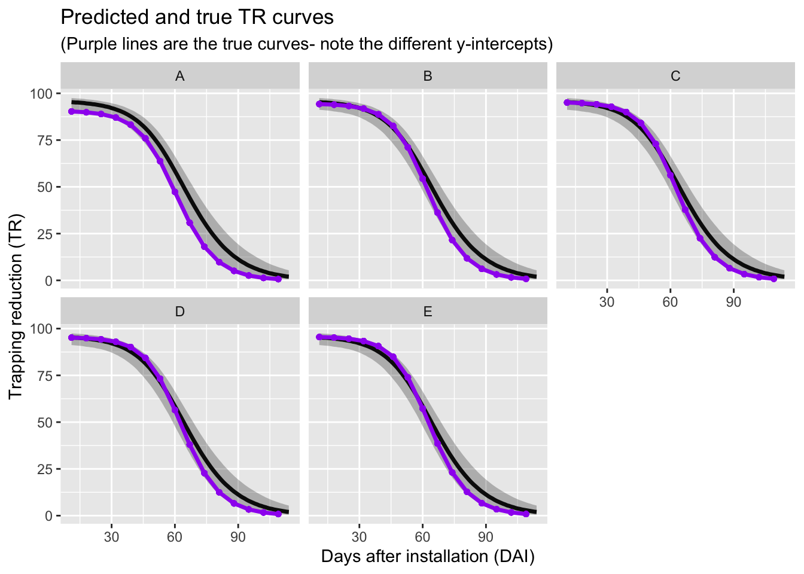


### Intercept RE, A RE, WITH GP (same for all loc)

This model includes a random effect on the intercept, which allows for different background moth pressures at each location. (Notice how much the y-axis varies from location to location.)

The Random effect on the $A$ parameter allows for different max trapping reduction (i.e., different maximum product performance) at each location.

The Gaussian Process allows for correlated change in background moth pressure over time. This allows for peaks and dramatic changes in a moth population over time, which mimics what is observed. We start with using the same GP for all locations.

$$
y_{ijt} \sim NegBinom(\lambda_{ijt}, \theta) \\
log(\lambda_{ikt} ) = \beta_0 + \beta_{1,k}(t) x_{Trt,i} + \gamma_{0k} x_{ik} + GP_{k,t} + \mbox{ln} \left(DaysOfCatch_i\right) \\
\beta_{1,k}(t) = A_k \left(1 - \frac{1}{(1 + e^{-B(t-M)})}\right) \\
\mathbf{GP} \sim MVN(0, \boldsymbol\Sigma) \\
\sigma_{lm} = \tau \cdot e^{-\frac{|d_l - d_m|^2}{l^2}}
$$

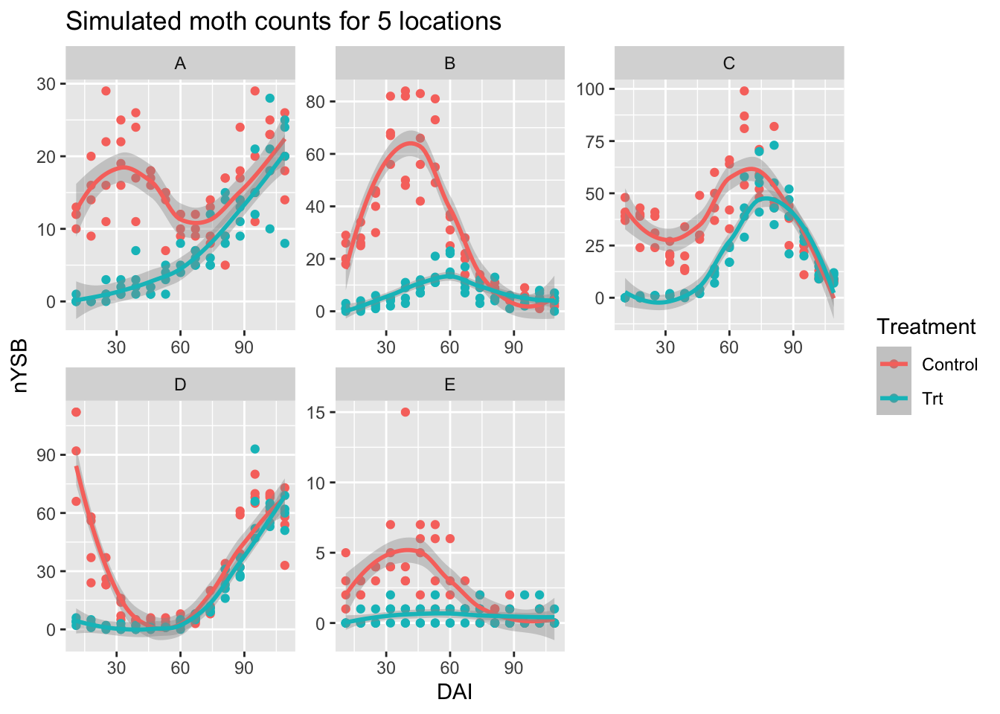


The model still does a good job estimating the parameters.


|              | Estimate| Est.Error| l-95% CI| u-95% CI| Rhat| Bulk_ESS| Tail_ESS|
|:-------------|--------:|---------:|--------:|--------:|----:|--------:|--------:|
|b0_Intercept  |     0.03|      1.98|    -3.83|     3.87|    1|  6293.96|  3941.04|
|gpP_Intercept |     2.69|      2.16|    -1.54|     6.84|    1|  4905.29|  4209.02|
|A_Intercept   |     2.73|      0.64|     1.19|     3.85|    1|  2492.44|  1617.24|
|B_Intercept   |     0.16|      0.04|     0.10|     0.24|    1|  4417.63|  4250.12|
|M_Intercept   |    54.59|      2.08|    50.13|    58.39|    1|  6223.34|  3734.31|


|                 | Estimate| Est.Error| l-95% CI| u-95% CI| Rhat| Bulk_ESS| Tail_ESS|
|:----------------|--------:|---------:|--------:|--------:|----:|--------:|--------:|
|sd(b0_Intercept) |     1.68|      0.72|     0.81|     3.59|    1|  3169.49|  3885.51|
|sd(A_Intercept)  |     1.29|      0.63|     0.55|     2.92|    1|  2315.48|  3296.98|


|                  | Estimate| Est.Error| l-95% CI| u-95% CI| Rhat| Bulk_ESS| Tail_ESS|
|:-----------------|--------:|---------:|--------:|--------:|----:|--------:|--------:|
|sdgp(gpP_gpDAI)   |     0.51|      0.34|     0.18|     1.35|    1|  3283.72|  3522.94|
|lscale(gpP_gpDAI) |     0.25|      0.12|     0.12|     0.49|    1|  1728.95|  2061.37|


|      | Estimate| Est.Error| l-95% CI| u-95% CI| Rhat| Bulk_ESS| Tail_ESS|
|:-----|--------:|---------:|--------:|--------:|----:|--------:|--------:|
|shape |      1.8|      0.13|     1.55|     2.06|    1| 10598.95|  4617.74|


Table: (\#tab:summary4)True parameter values.

|Parameter | Values|
|:---------|------:|
|b0 mean   |    1.0|
|A mean    |    3.0|
|B         |    0.1|
|M         |   50.0|
|b0 SD     |    1.5|
|A SD      |    0.5|
|tau       |    3.0|
|l         |   30.0|
|shape     |    5.0|

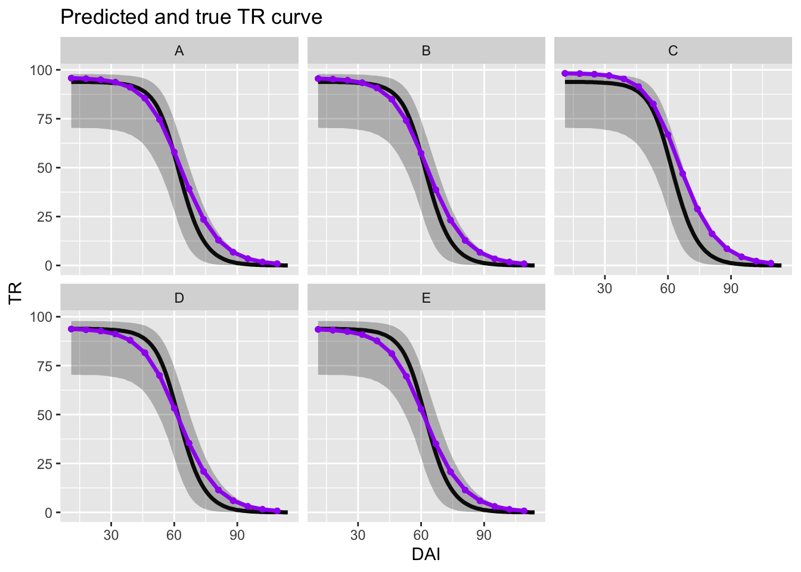


### Intercept, A RE, with GP (DIFF for each loc)

Starting here, I include 9 locations for each simulation as I found more locations were required for the model to estimate the parameters.

This model has *different* GP's or each location (as in Sections \@ref(glmm-gp) and \@ref(fit-glmm-gpR)). Allowing for a different GP for each location leads to more variety in the moth populations across the locations and may more closely mimic what is observed in the field.

$$
y_{ijt} \sim NegBinom(\lambda_{ijt}, \theta) \\
log(\lambda_{ikt} ) = \beta_0 + \beta_{1,k}(t) x_{Trt,i} + \gamma_{0k} x_{ik} + GP_{k,t} + \mbox{ln} \left(DaysOfCatch_i\right) \\
\beta_{1,k}(t) = A_k \left(1 - \frac{1}{(1 + e^{-B(t-M)})}\right) \\
\mathbf{GP_k} \sim MVN(0, \boldsymbol\Sigma_k) \\
\sigma_{k,lm} = \tau_k \cdot e^{-\frac{|d_l - d_m|^2}{l_k^2}}
$$

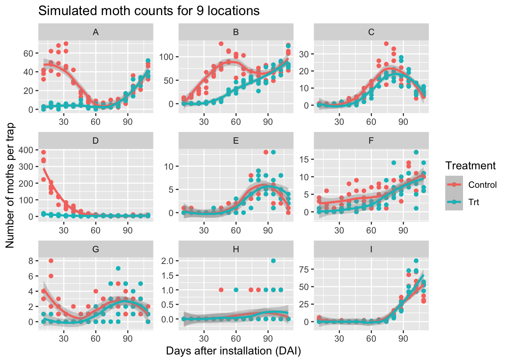


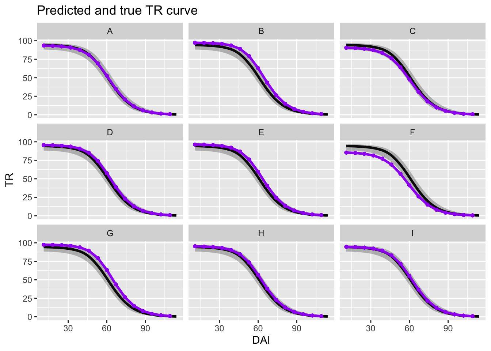


### Intercept, A, B, M RE, with GP (DIFF for each loc)

In this most complex model, I make $B$ and $M$ random effects in the logistic curve, in addition to the $A$ parameter. This allows for the TR curve to vary in multiple ways among the locations.

$$
y_{ijt} \sim NegBinom(\lambda_{ijt}, \theta) \\
log(\lambda_{ikt} ) = \beta_0 + \beta_{1,k}(t) x_{Trt,i} + \gamma_{0k} x_{ik} + GP_{k,t} + \mbox{ln} \left(DaysOfCatch_i\right) \\
\beta_{1,k}(t) = A_k \left(1 - \frac{1}{(1 + e^{-B_k(t-M_k)})}\right) \\
\mathbf{GP_k} \sim MVN(0, \boldsymbol\Sigma_k) \\
\sigma_{k,lm} = \tau_k \cdot e^{-\frac{|d_l - d_m|^2}{l_k^2}}
$$

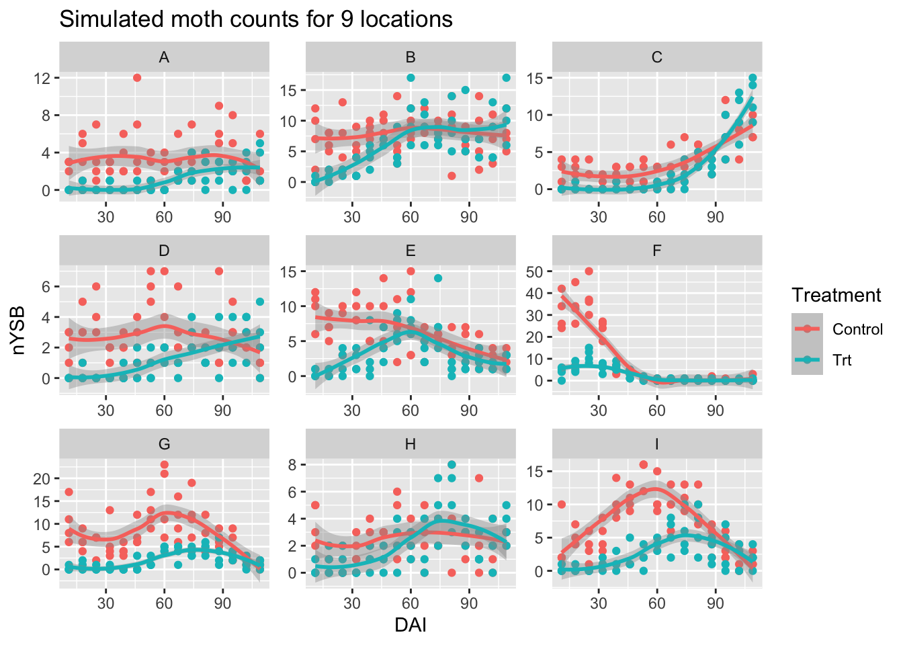


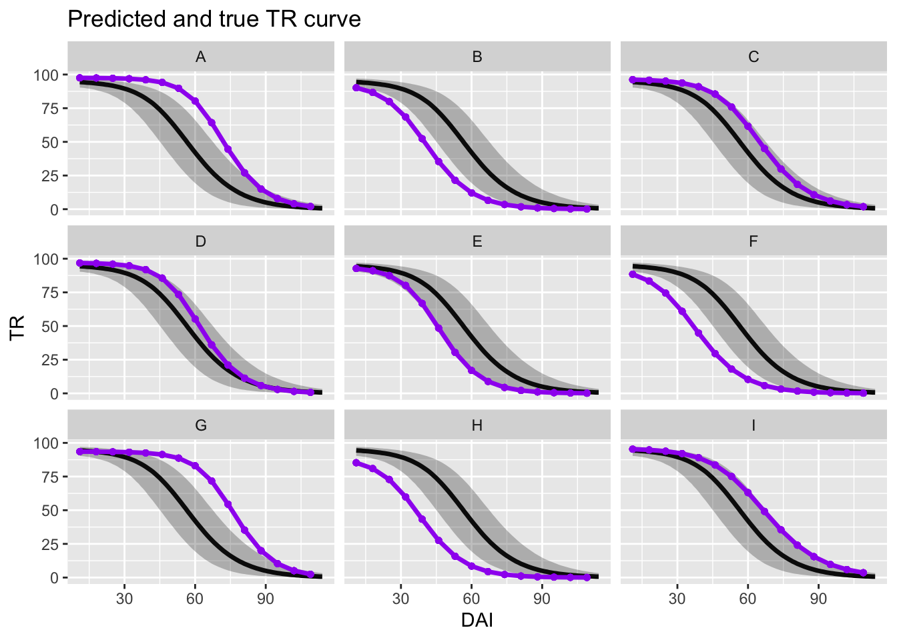


This model did not fit the data well. Priors may need to be tweaked, or more locations may be required to estimate all of the parameters well. 

## Case study

Too many divergent warnings with the most complex model, i.e., the model with intercept, A, B, M RE, with GP (DIFF for each loc). (M was multi-modal in that model fit.)

Use constant B, M model instead.

The model fits the data well, is interpretable, and converges well.


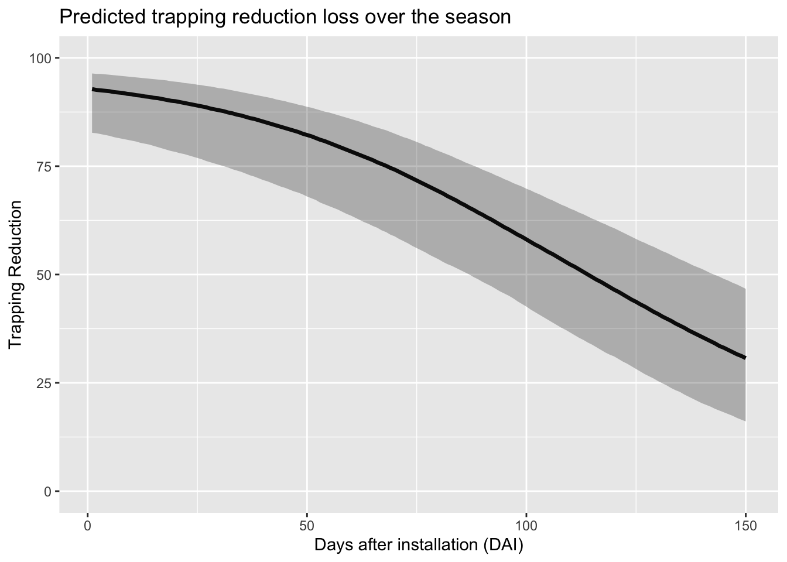
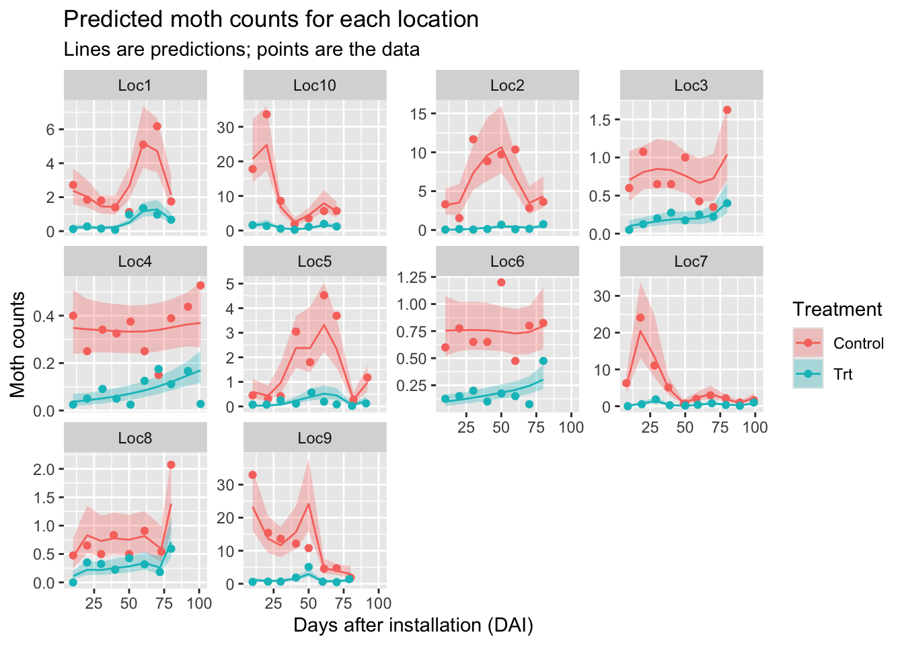
