# Nonlinear Bayesian Models in R {#NonlinearR}

(Same set up code as Chapter 3):


Asymptotic sigmoidal curve expected for product performance over time. Eventually, given enough time, the product has to stop working, and $\beta_1$ goes to 0 as t goes to 0.

## Generalized Logistic Curve

Adapted from: https://en.wikipedia.org/wiki/Generalised_logistic_function

$$
\beta(t) = A + \frac{(K - A)}{(1 + e^{-B(t-M)})^{1/v}}
$$
where,

$A$ is the left horizontal asymptote,

$K$ is the right horizontal asymptote ($K = 0$ in our models),

$B$ is the growth rate ($B>0$; $B<0$ is a decay rate),

$v$ affects where the inflection point occurs, and

$M$ relates to the starting time of when the curve begins.


```
## [1] 148.4132
```

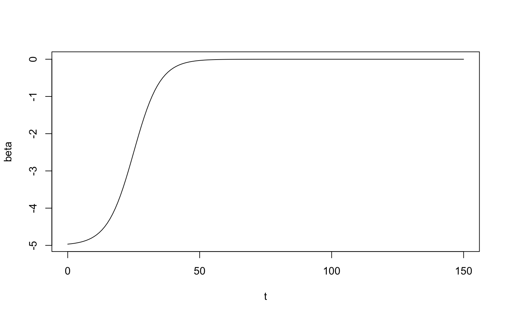

See the shiny app to play around with how the parameter values affect the curve. This will be helpful in understanding the model and setting priors for the model.

https://bromsk.shinyapps.io/GeneralizedLogisticCurves/


## Bayesian model

$$
y_{ijk} \sim NegBinom(\lambda_{ijk}, r) \\
log(\lambda_{ikt} ) = \beta_0 + \beta_{1,t} x_{A,i} + \gamma_{k} x_{ik}  + GP_{ijk}  + \mbox{ln} \left(DaysOfCatch_i\right) \\
\beta_{1,t} = A_k \left(1 - \frac{1}{(1 + e^{-B(t-M)})^{1/v}}\right) \\
\gamma_k \sim Normal(0, \sigma_{\gamma}) \\ 
\mathbf{GP_k} \sim MVN(0, \boldsymbol\Sigma_k) \\
\beta_0 \sim Normal(0, 2) \\
A_k \sim HalfNormal(0, 2) \\
\sigma_{\gamma} \sim HalfCauchy(0, 1) \\
r \sim HalfCauchy(0,1) \\
B \sim HalfNormal(0.5) \\
M \sim Uniform(0, 150) \\
\sigma_{k, lm} = \tau_k \cdot e^{-\frac{|d_l - d_m|^2}{l_k^2}} \\
\tau_k \sim HalfCauchy(0, 1) \\
l_k \sim HalfCauchy(0, 1) \\
$$

where, in addition to the variables and parameters defined for the GLM, we have

$k = 1,..., K=10$ represents the locations, 

$j = 1, ..., J = 117$ represents the 117 unique date-location combinations,

$y_{ikj}$ is moth count $i$ from location $k$ on date $j$,

$\lambda_{ikj}$ is the expected moth count for sample $i$  from location $k$ on date $j$,

$\beta_0$ is the expected moth count for our control treatment for a new location,

$\beta_{1,t}$ is the expected difference in moth counts between the control group and the treatment A group for a new location at $t$ days from the installation, 

$A_k$ is the maximum trapping reduction (represented by the max coefficient value) associated with locaiton $k$,

$\gamma_{0k}$ is the random intercept associated with location $k$, which leads to different background moth pressures at each location. All $\gamma_{0k}$ come from an iid Normal distribution,

$\gamma_{1k}$ is the random slope associated with location $k$, which leads to different treatment effects at each location. All $\gamma_{1k}$ come from an iid Normal distribution, 

$x_{ik}$ is an indicator variable that equals 1 if moth count $i$ is associated with location $k$ and 0 otherwise,

$\gamma_{00j}$ is the random intercept associated with date-location $j$, which leads to different background moth pressures for each date, and 

$x_{ij}$ is an indicator variable that equals 1 if moth count $i$ is associated with date-location $j$ and 0 otherwise.

$l$ = lscale (differnt for each location)

$\phi$ = sdgp

For now, we assume that each location shares all of the same non-linear parameters except for $A$, the maximum trapping reduction level. For now, we also set $v=1$.

## Fitting models with the brms package

Setting priors in a nonlinear model is non-trivial!!

### no RE, no GP

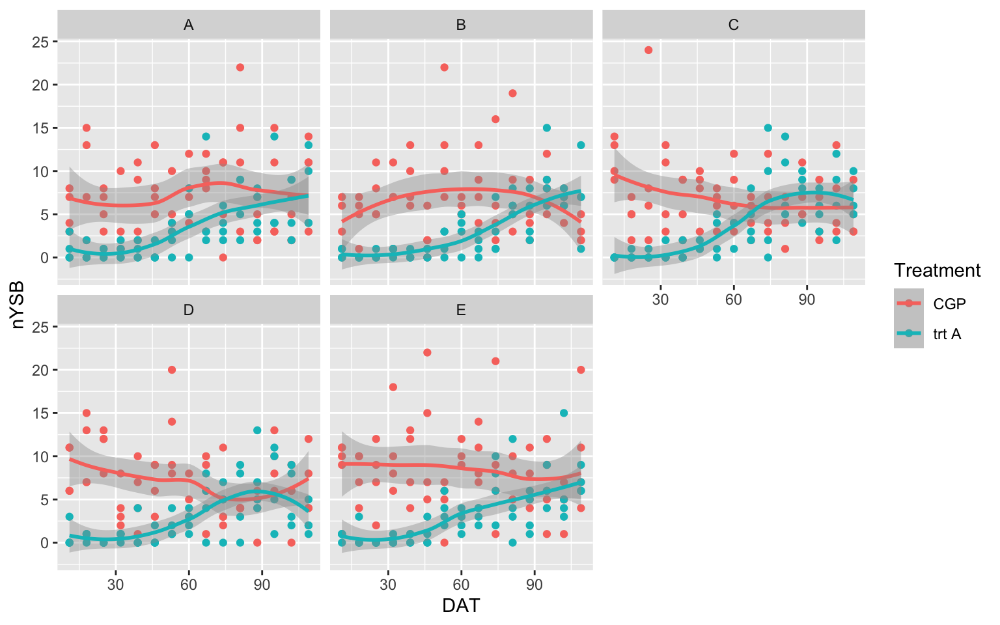


```
##  Family: negbinomial 
##   Links: mu = log; shape = identity 
## Formula: nYSB ~ b0 - (A * (1 - 1/(1 + exp(-1 * B * (DAT - M))))) * numTrt + log(DaysOfCatch) 
##          b0 ~ 1
##          A ~ 1
##          B ~ 1
##          M ~ 1
##    Data: simdata1 (Number of observations: 600) 
##   Draws: 6 chains, each with iter = 2000; warmup = 1000; thin = 1;
##          total post-warmup draws = 6000
## 
## Regression Coefficients:
##              Estimate Est.Error l-95% CI u-95% CI Rhat Bulk_ESS Tail_ESS
## b0_Intercept     1.96      0.03     1.90     2.02 1.00     4118     3583
## A_Intercept      2.90      0.26     2.46     3.49 1.00     2584     2722
## B_Intercept      0.11      0.02     0.08     0.16 1.00     2473     2869
## M_Intercept     49.60      2.78    43.55    54.19 1.00     2643     2604
## 
## Further Distributional Parameters:
##       Estimate Est.Error l-95% CI u-95% CI Rhat Bulk_ESS Tail_ESS
## shape     4.94      0.58     3.90     6.17 1.00     3977     3655
## 
## Draws were sampled using sampling(NUTS). For each parameter, Bulk_ESS
## and Tail_ESS are effective sample size measures, and Rhat is the potential
## scale reduction factor on split chains (at convergence, Rhat = 1).
```

```
##            prior class      coef group resp dpar nlpar lb  ub       source
##     normal(0, 2)     b                               A  0             user
##     normal(0, 2)     b Intercept                     A  0     (vectorized)
##   normal(0, 0.5)     b                               B  0             user
##   normal(0, 0.5)     b Intercept                     B  0     (vectorized)
##     normal(0, 2)     b                              b0                user
##     normal(0, 2)     b Intercept                    b0        (vectorized)
##  uniform(0, 120)     b                               M  0 120         user
##  uniform(0, 120)     b Intercept                     M  0 120 (vectorized)
##     cauchy(0, 1) shape                                  0             user
```

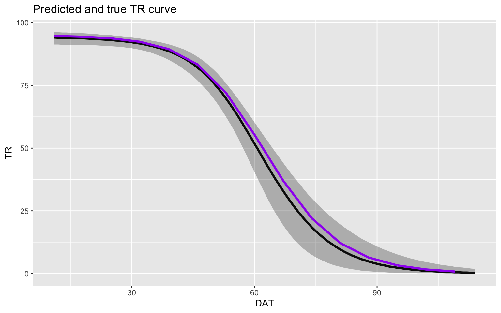


### intercept RE, no GP

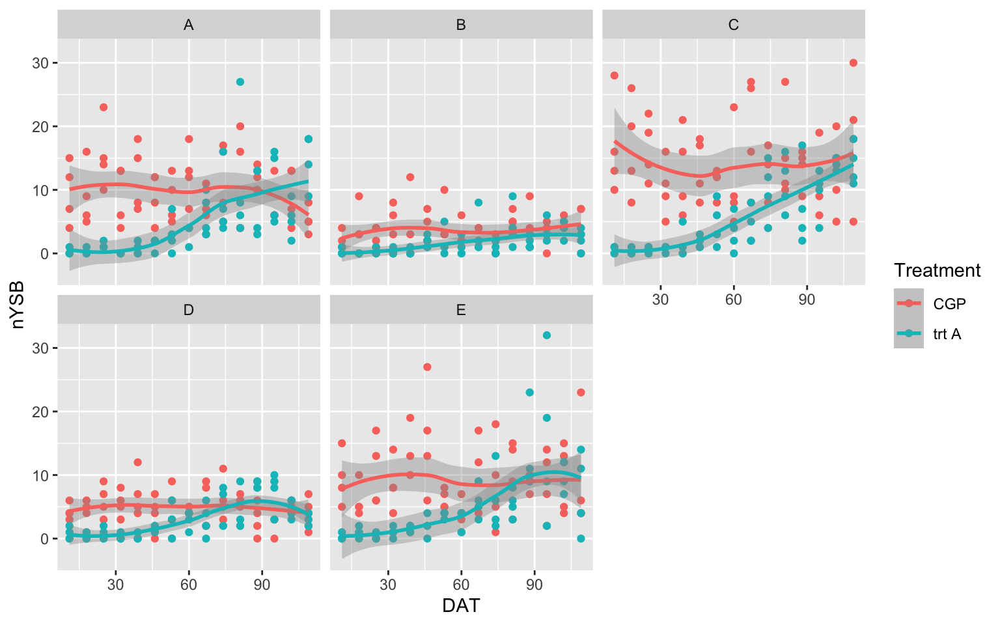


```
##  Family: poisson 
##   Links: mu = log 
## Formula: nYSB ~ b0 - (A * (1 - 1/(1 + exp(-1 * B * (DAT - M))))) * numTrt + log(DaysOfCatch) 
##          b0 ~ 1 + (1 | Location)
##          A ~ 1
##          B ~ 1
##          M ~ 1
##    Data: simdata (Number of observations: 600) 
##   Draws: 6 chains, each with iter = 2000; warmup = 1000; thin = 1;
##          total post-warmup draws = 6000
## 
## Multilevel Hyperparameters:
## ~Location (Number of levels: 5) 
##                  Estimate Est.Error l-95% CI u-95% CI Rhat Bulk_ESS Tail_ESS
## sd(b0_Intercept)     0.74      0.34     0.34     1.67 1.00     1430     1807
## 
## Regression Coefficients:
##              Estimate Est.Error l-95% CI u-95% CI Rhat Bulk_ESS Tail_ESS
## b0_Intercept     1.95      0.34     1.22     2.64 1.00     1411     1704
## A_Intercept      3.30      0.31     2.79     4.00 1.00     2574     2714
## B_Intercept      0.08      0.01     0.07     0.10 1.00     2687     2964
## M_Intercept     46.91      3.06    40.23    52.27 1.00     2604     2493
## 
## Draws were sampled using sampling(NUTS). For each parameter, Bulk_ESS
## and Tail_ESS are effective sample size measures, and Rhat is the potential
## scale reduction factor on split chains (at convergence, Rhat = 1).
```


```
## # A tibble: 5 × 2
##   Parameter                     med
##   <fct>                       <dbl>
## 1 r_Location__b0[A,Intercept]  2.30
## 2 r_Location__b0[B,Intercept]  1.29
## 3 r_Location__b0[C,Intercept]  2.58
## 4 r_Location__b0[D,Intercept]  1.68
## 5 r_Location__b0[E,Intercept]  2.26
```

```
## [1] 2.29 1.29 2.54 1.71 2.13
```

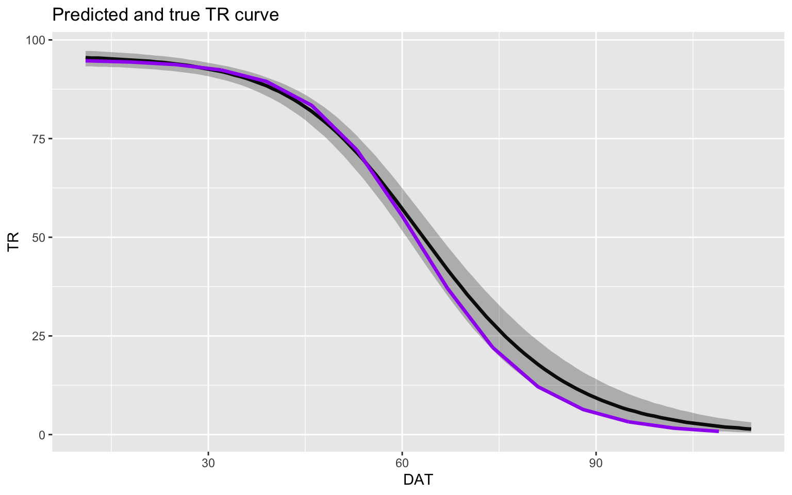

### intercept RE, A RE, no GP

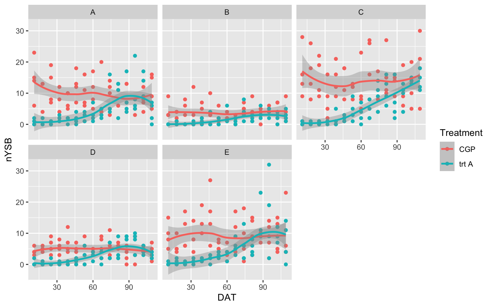


```
##  Family: negbinomial 
##   Links: mu = log; shape = identity 
## Formula: nYSB ~ b0 - (A * (1 - 1/(1 + exp(-1 * B * (DAT - M))))) * numTrt + log(DaysOfCatch) 
##          b0 ~ 1 + (1 | Location)
##          A ~ 1 + (1 | Location)
##          B ~ 1
##          M ~ 1
##    Data: simdata3 (Number of observations: 600) 
##   Draws: 6 chains, each with iter = 2000; warmup = 1000; thin = 1;
##          total post-warmup draws = 6000
## 
## Multilevel Hyperparameters:
## ~Location (Number of levels: 5) 
##                  Estimate Est.Error l-95% CI u-95% CI Rhat Bulk_ESS Tail_ESS
## sd(b0_Intercept)     0.75      0.37     0.33     1.74 1.00     1560     1660
## sd(A_Intercept)      0.41      0.39     0.01     1.40 1.00     1626     1934
## 
## Regression Coefficients:
##              Estimate Est.Error l-95% CI u-95% CI Rhat Bulk_ESS Tail_ESS
## b0_Intercept     1.97      0.38     1.19     2.69 1.00     1273     1713
## A_Intercept      3.32      0.47     2.54     4.33 1.00     2596     2481
## B_Intercept      0.08      0.01     0.06     0.10 1.00     3209     2929
## M_Intercept     46.20      4.45    36.25    53.58 1.00     2930     2218
## 
## Further Distributional Parameters:
##       Estimate Est.Error l-95% CI u-95% CI Rhat Bulk_ESS Tail_ESS
## shape     5.10      0.59     4.08     6.39 1.00     7516     4014
## 
## Draws were sampled using sampling(NUTS). For each parameter, Bulk_ESS
## and Tail_ESS are effective sample size measures, and Rhat is the potential
## scale reduction factor on split chains (at convergence, Rhat = 1).
```


```
## # A tibble: 5 × 2
##   Parameter                     med
##   <fct>                       <dbl>
## 1 r_Location__b0[A,Intercept]  2.26
## 2 r_Location__b0[B,Intercept]  1.32
## 3 r_Location__b0[C,Intercept]  2.58
## 4 r_Location__b0[D,Intercept]  1.68
## 5 r_Location__b0[E,Intercept]  2.26
```

```
## [1] 2.29 1.29 2.54 1.71 2.13
```

```
## # A tibble: 5 × 3
##   Parameter                  meddiff   med
##   <fct>                        <dbl> <dbl>
## 1 r_Location__A[A,Intercept] -0.0441  3.23
## 2 r_Location__A[B,Intercept]  0.0301  3.30
## 3 r_Location__A[C,Intercept]  0.206   3.48
## 4 r_Location__A[D,Intercept] -0.0896  3.18
## 5 r_Location__A[E,Intercept]  0.0150  3.29
```

```
## [1] 2.38 2.92 3.07 3.09 3.16
```

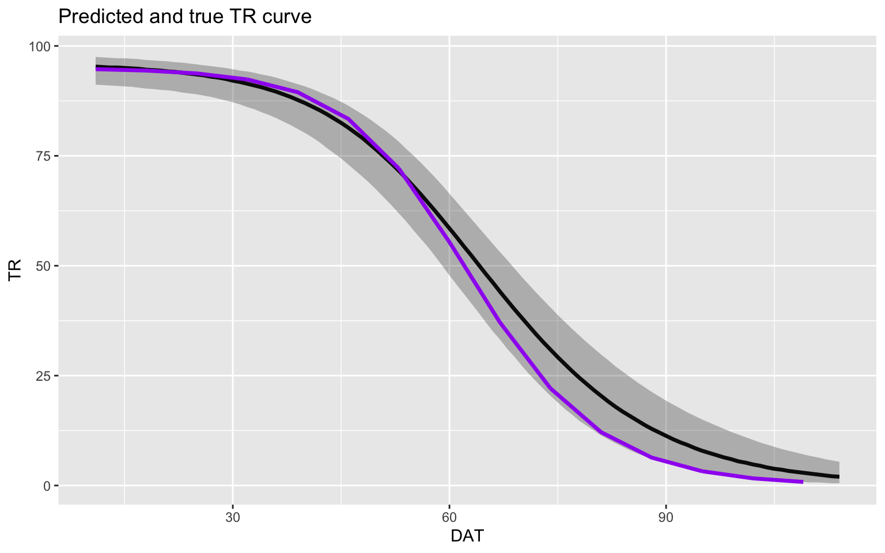

```
##  num [1:6000, 1:600] 5 24 19 5 4 24 17 12 10 9 ...
##  - attr(*, "dimnames")=List of 2
##   ..$ : NULL
##   ..$ : NULL
```

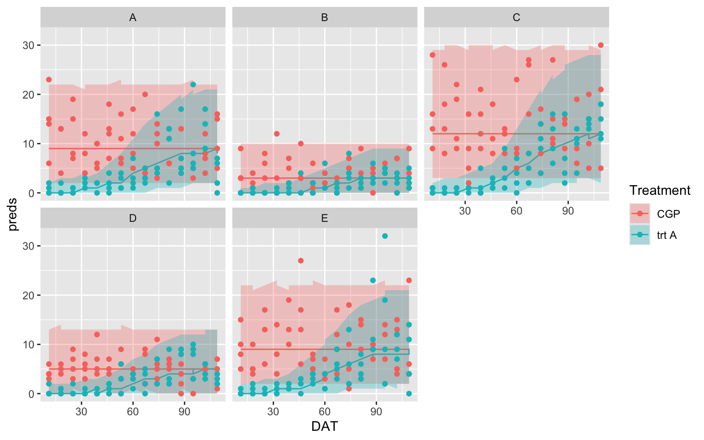

### intercept RE, A RE, WITH GP (same for all loc)

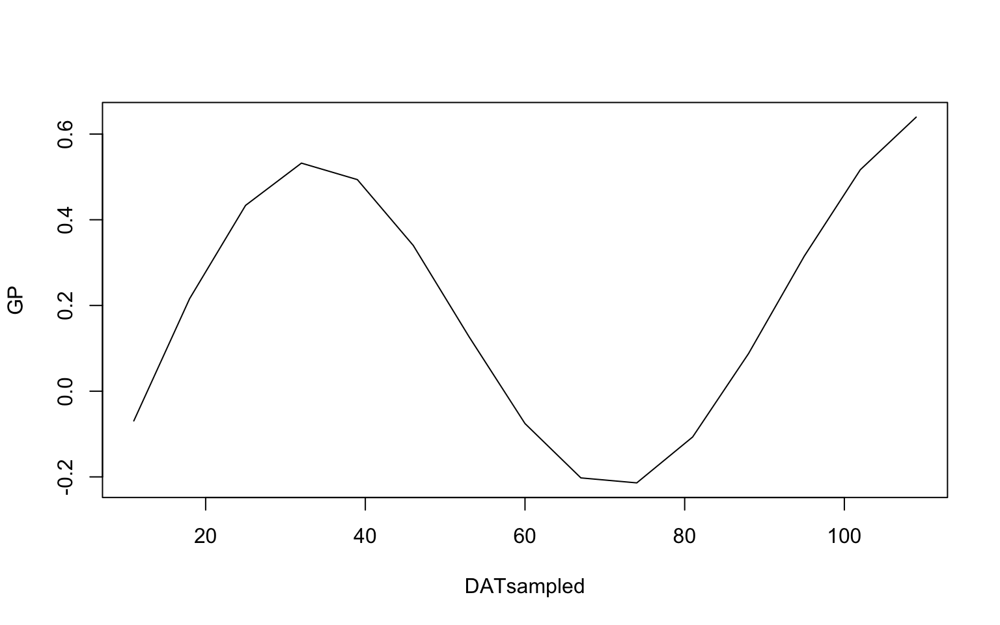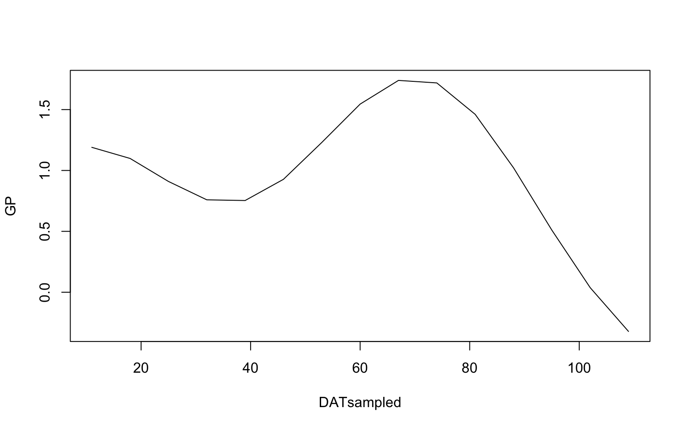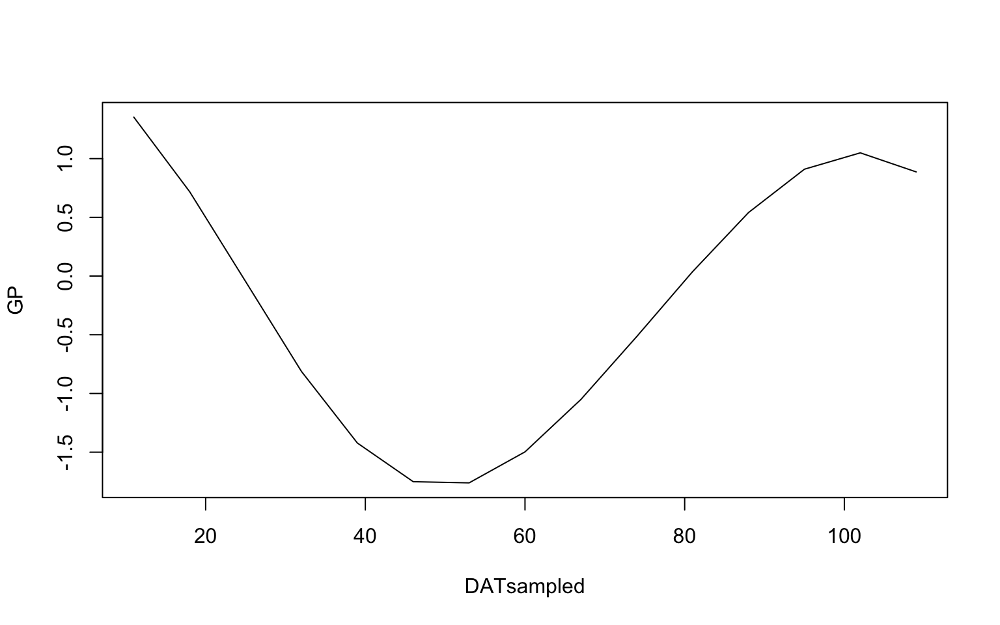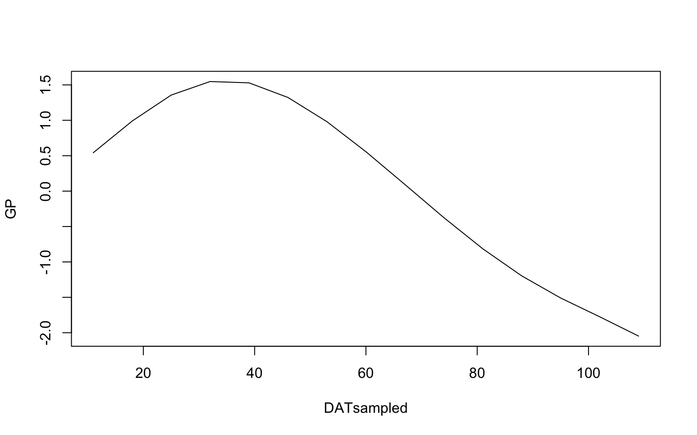

```
## [1] 0
```

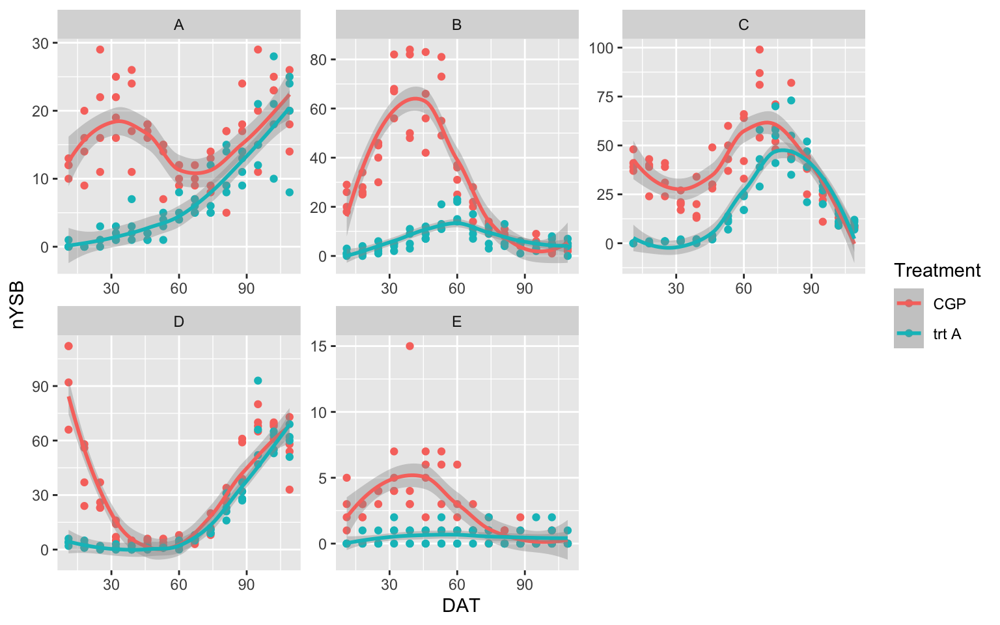


```
##  Family: negbinomial 
##   Links: mu = log; shape = identity 
## Formula: nYSB ~ b0 - (A * (1 - 1/(1 + exp(-1 * B * (DAT - M))))) * numTrt + gpP + log(DaysOfCatch) 
##          b0 ~ (1 | Location)
##          gpP ~ 1 + gp(DAT)
##          A ~ 1 + (1 | Location)
##          B ~ 1
##          M ~ 1
##    Data: simdata4 (Number of observations: 600) 
##   Draws: 6 chains, each with iter = 2000; warmup = 1000; thin = 1;
##          total post-warmup draws = 6000
## 
## Gaussian Process Hyperparameters:
##                   Estimate Est.Error l-95% CI u-95% CI Rhat Bulk_ESS Tail_ESS
## sdgp(gpP_gpDAT)       0.51      0.34     0.18     1.35 1.00     3284     3523
## lscale(gpP_gpDAT)     0.25      0.12     0.12     0.49 1.00     1729     2061
## 
## Multilevel Hyperparameters:
## ~Location (Number of levels: 5) 
##                  Estimate Est.Error l-95% CI u-95% CI Rhat Bulk_ESS Tail_ESS
## sd(b0_Intercept)     1.68      0.72     0.81     3.59 1.00     3169     3886
## sd(A_Intercept)      1.29      0.63     0.55     2.92 1.00     2315     3297
## 
## Regression Coefficients:
##               Estimate Est.Error l-95% CI u-95% CI Rhat Bulk_ESS Tail_ESS
## b0_Intercept      0.03      1.98    -3.83     3.87 1.00     6294     3941
## gpP_Intercept     2.69      2.16    -1.54     6.84 1.00     4905     4209
## A_Intercept       2.73      0.64     1.19     3.85 1.00     2492     1617
## B_Intercept       0.16      0.04     0.10     0.24 1.00     4418     4250
## M_Intercept      54.59      2.08    50.13    58.39 1.00     6223     3734
## 
## Further Distributional Parameters:
##       Estimate Est.Error l-95% CI u-95% CI Rhat Bulk_ESS Tail_ESS
## shape     1.80      0.13     1.55     2.06 1.00    10599     4618
## 
## Draws were sampled using sampling(NUTS). For each parameter, Bulk_ESS
## and Tail_ESS are effective sample size measures, and Rhat is the potential
## scale reduction factor on split chains (at convergence, Rhat = 1).
```

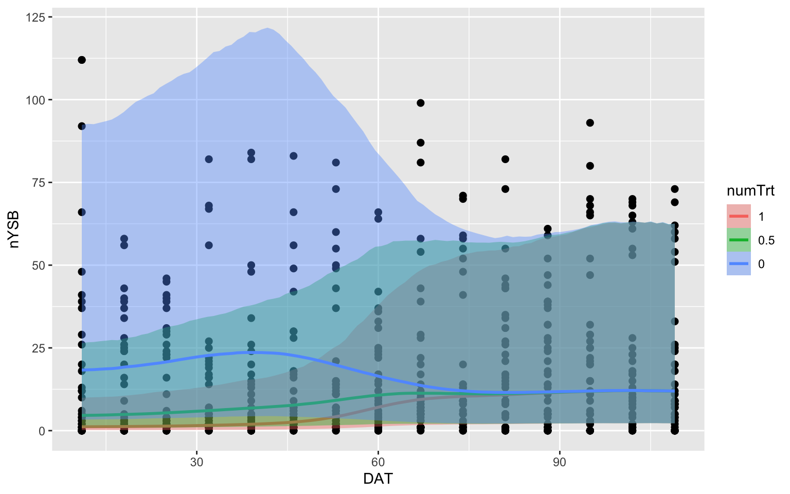


```
##  [1] b_b0_Intercept              b_gpP_Intercept            
##  [3] b_A_Intercept               b_B_Intercept              
##  [5] b_M_Intercept               sd_Location__b0_Intercept  
##  [7] sd_Location__A_Intercept    sdgp_gpP_gpDAT             
##  [9] lscale_gpP_gpDAT            shape                      
## [11] r_Location__b0[A,Intercept] r_Location__b0[B,Intercept]
## [13] r_Location__b0[C,Intercept] r_Location__b0[D,Intercept]
## [15] r_Location__b0[E,Intercept] r_Location__A[A,Intercept] 
## [17] r_Location__A[B,Intercept]  r_Location__A[C,Intercept] 
## [19] r_Location__A[D,Intercept]  r_Location__A[E,Intercept] 
## [21] zgp_gpP_gpDAT[1]            zgp_gpP_gpDAT[2]           
## [23] zgp_gpP_gpDAT[3]            zgp_gpP_gpDAT[4]           
## [25] zgp_gpP_gpDAT[5]            zgp_gpP_gpDAT[6]           
## [27] zgp_gpP_gpDAT[7]            zgp_gpP_gpDAT[8]           
## [29] zgp_gpP_gpDAT[9]            zgp_gpP_gpDAT[10]          
## [31] zgp_gpP_gpDAT[11]           zgp_gpP_gpDAT[12]          
## [33] zgp_gpP_gpDAT[13]           zgp_gpP_gpDAT[14]          
## [35] zgp_gpP_gpDAT[15]           lprior                     
## 36 Levels: b_A_Intercept b_B_Intercept b_b0_Intercept ... zgp_gpP_gpDAT[15]
```

```
## # A tibble: 5 × 2
##   Parameter                     med
##   <fct>                       <dbl>
## 1 r_Location__b0[A,Intercept] 2.77 
## 2 r_Location__b0[B,Intercept] 2.99 
## 3 r_Location__b0[C,Intercept] 3.73 
## 4 r_Location__b0[D,Intercept] 3.61 
## 5 r_Location__b0[E,Intercept] 0.549
```

```
## [1] 2.55 2.76 2.54 3.14 0.26
```

```
## # A tibble: 5 × 3
##   Parameter                  meddiff   med
##   <fct>                        <dbl> <dbl>
## 1 r_Location__A[A,Intercept]   0.342  3.14
## 2 r_Location__A[B,Intercept]  -0.763  2.03
## 3 r_Location__A[C,Intercept]   1.12   3.91
## 4 r_Location__A[D,Intercept]   0.938  3.73
## 5 r_Location__A[E,Intercept]  -0.619  2.18
```

```
## [1] 3.22 3.17 4.10 2.83 2.79
```

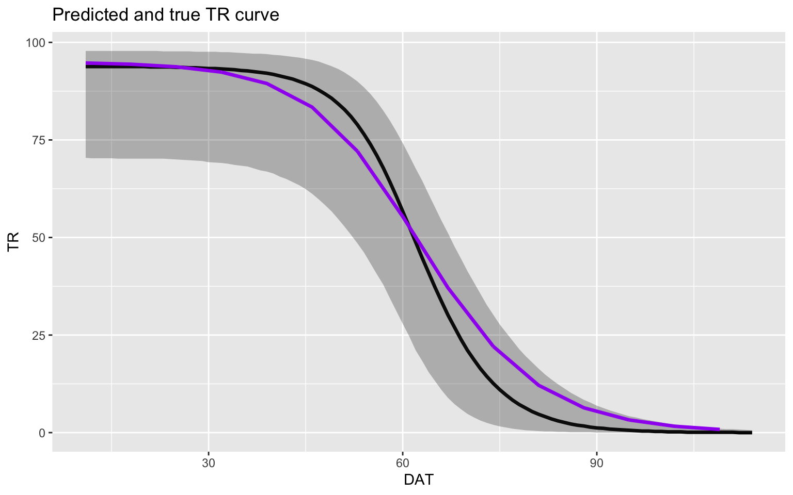

```
##  num [1:6000, 1:600] 41 10 21 9 7 10 19 9 5 36 ...
##  - attr(*, "dimnames")=List of 2
##   ..$ : NULL
##   ..$ : NULL
```

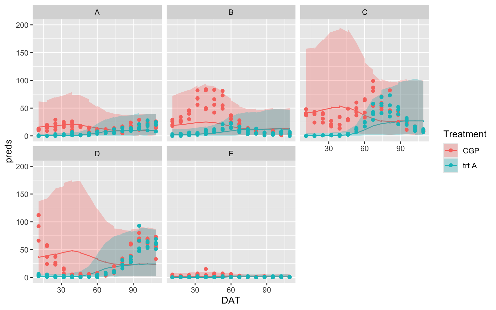


### intercept, A RE, with GP (DIFF for each loc)

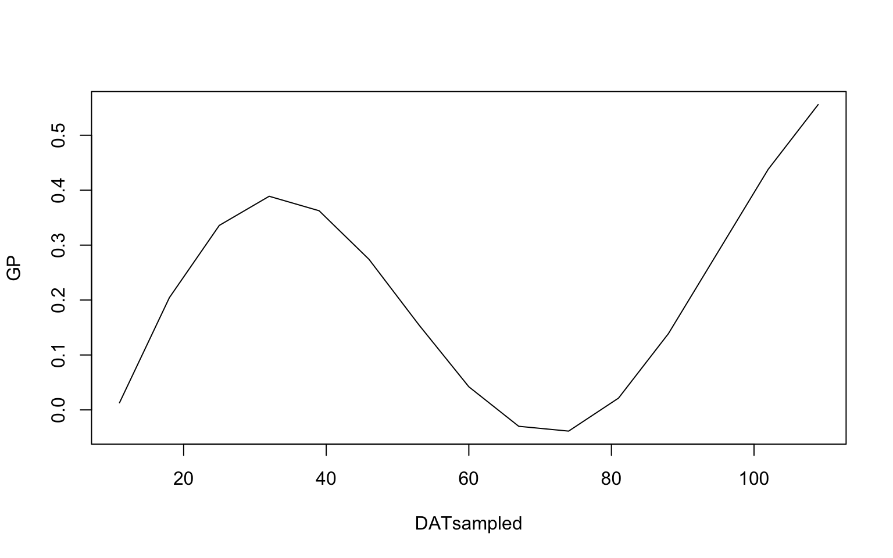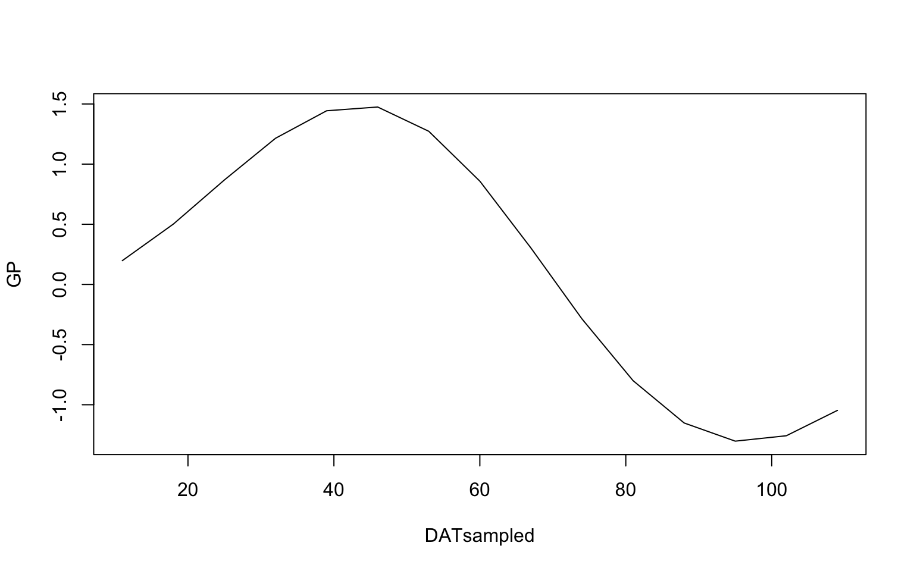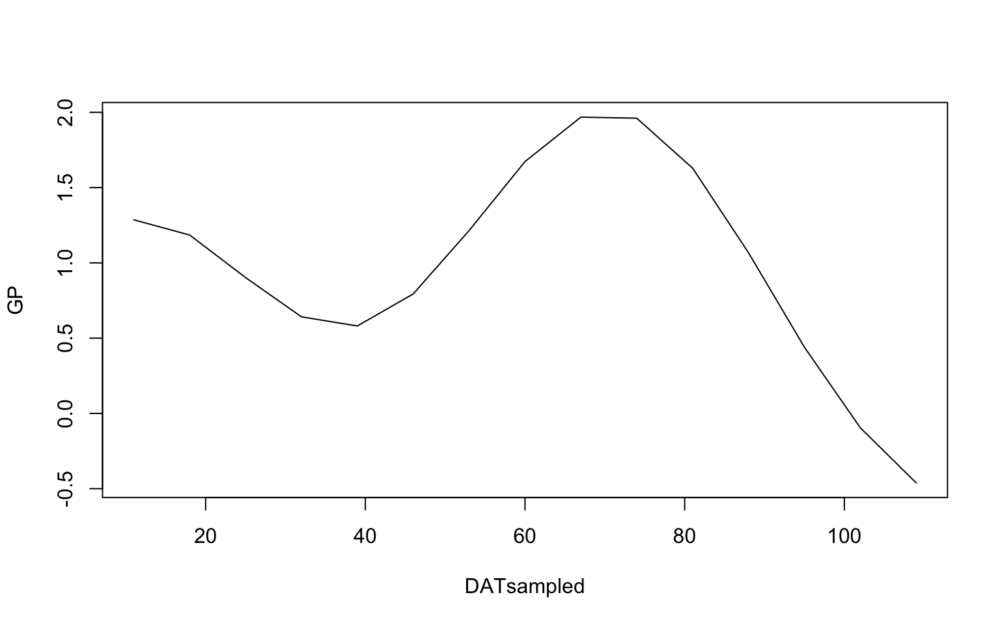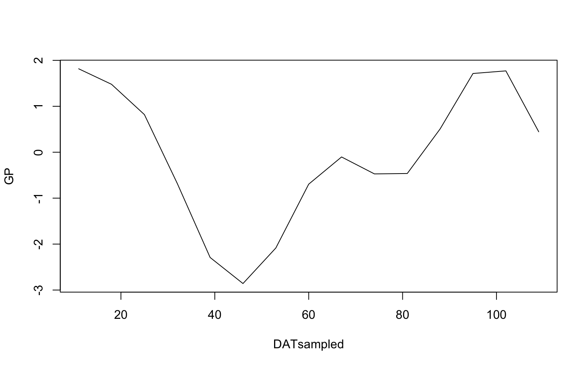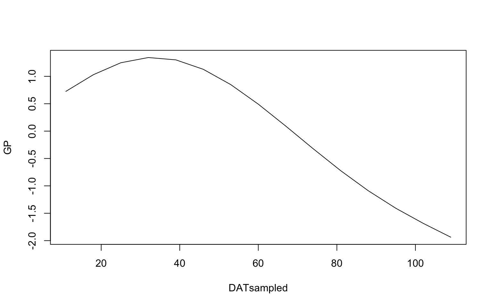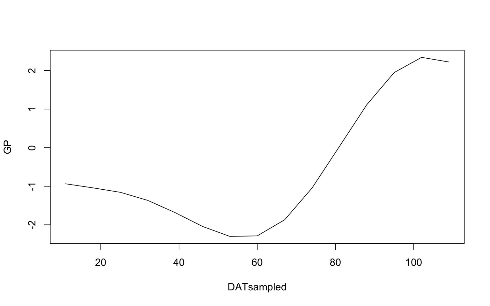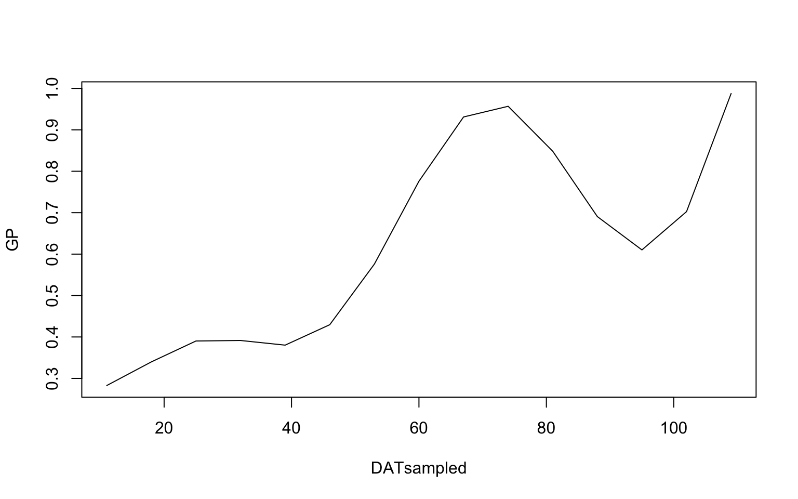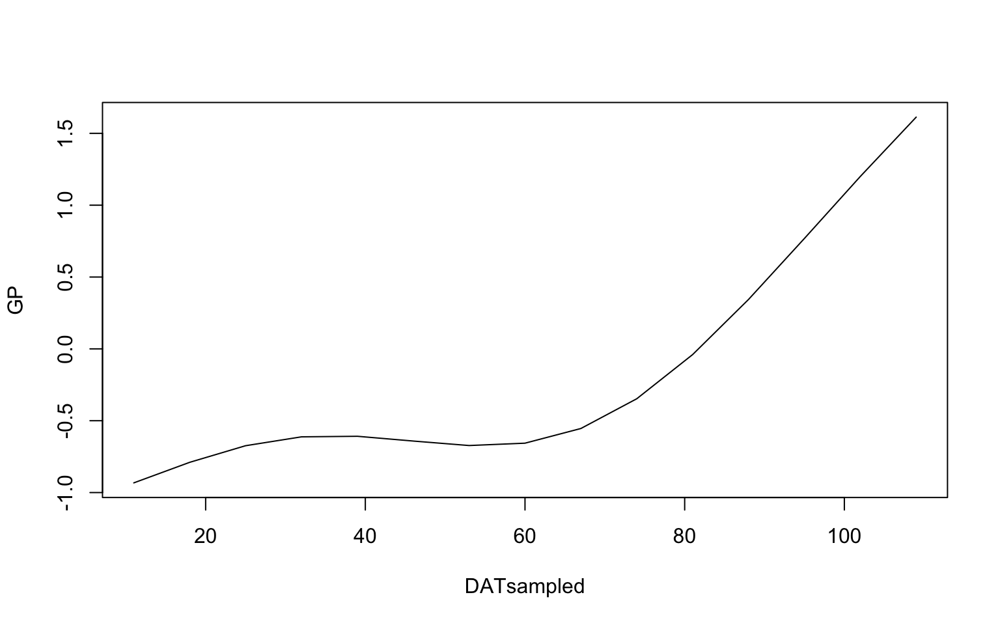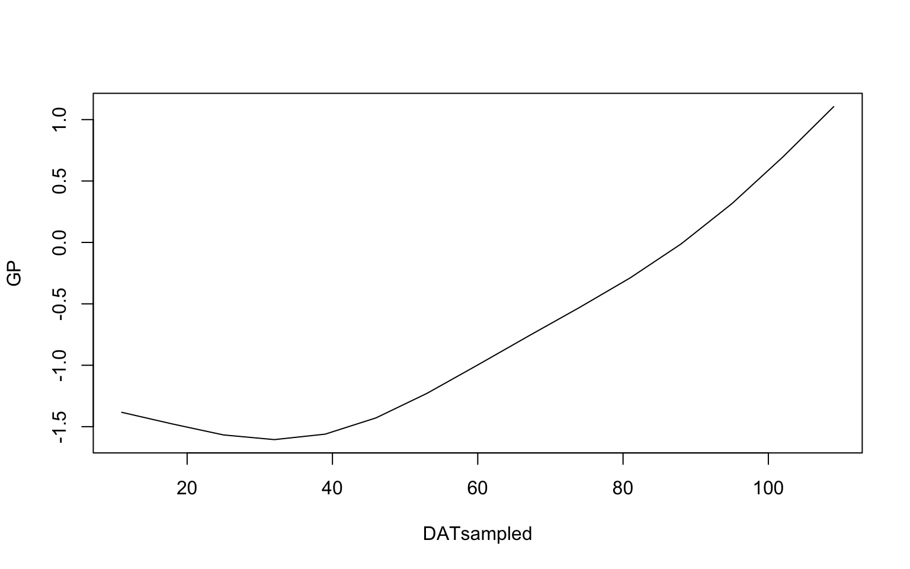

```
## [1] 0
```

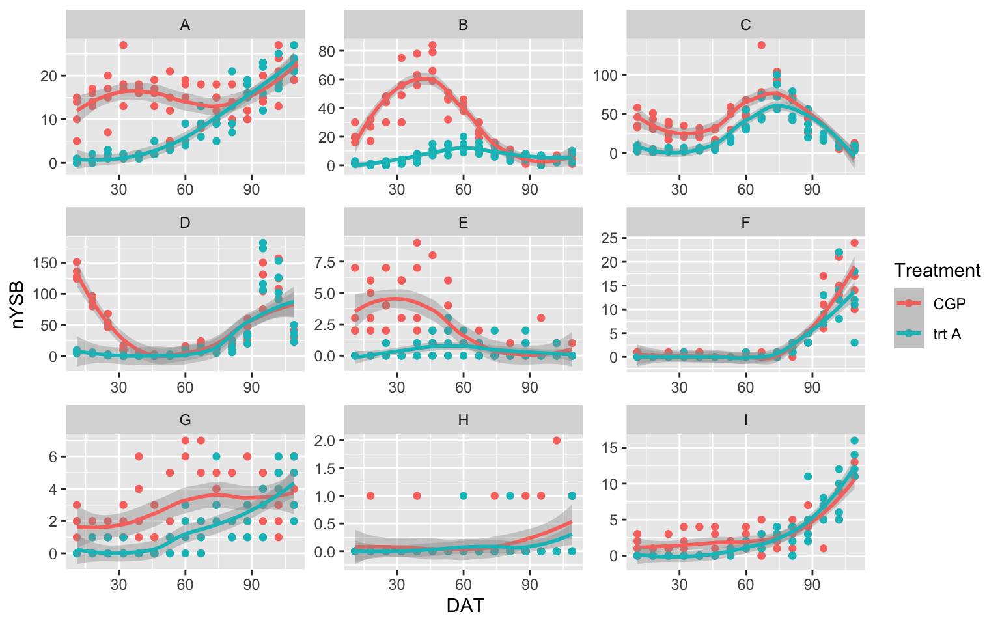


```
##  Family: negbinomial 
##   Links: mu = log; shape = identity 
## Formula: nYSB ~ b0 - (A * (1 - 1/(1 + exp(-1 * B * (DAT - M))))) * numTrt + gpP + log(DaysOfCatch) 
##          b0 ~ (1 | Location)
##          gpP ~ 1 + gp(DAT, by = Location)
##          A ~ 1 + (1 | Location)
##          B ~ 1
##          M ~ 1
##    Data: simdata4 (Number of observations: 600) 
##   Draws: 6 chains, each with iter = 2000; warmup = 1000; thin = 1;
##          total post-warmup draws = 6000
## 
## Gaussian Process Hyperparameters:
##                            Estimate Est.Error l-95% CI u-95% CI Rhat Bulk_ESS
## sdgp(gpP_gpDATLocationA)       0.55      0.32     0.21     1.40 1.00     2255
## sdgp(gpP_gpDATLocationB)       1.31      0.61     0.64     2.81 1.00     3708
## sdgp(gpP_gpDATLocationC)       1.10      0.53     0.50     2.43 1.00     2479
## sdgp(gpP_gpDATLocationD)       1.85      0.92     0.85     4.25 1.00     2473
## sdgp(gpP_gpDATLocationE)       2.06      1.23     0.73     5.08 1.00     2169
## lscale(gpP_gpDATLocationA)     0.20      0.06     0.11     0.33 1.00     2057
## lscale(gpP_gpDATLocationB)     0.29      0.06     0.18     0.42 1.00     2455
## lscale(gpP_gpDATLocationC)     0.23      0.06     0.13     0.36 1.00     1392
## lscale(gpP_gpDATLocationD)     0.29      0.06     0.18     0.42 1.00     1899
## lscale(gpP_gpDATLocationE)     0.34      0.10     0.18     0.59 1.00     2387
##                            Tail_ESS
## sdgp(gpP_gpDATLocationA)       3557
## sdgp(gpP_gpDATLocationB)       4034
## sdgp(gpP_gpDATLocationC)       3668
## sdgp(gpP_gpDATLocationD)       3392
## sdgp(gpP_gpDATLocationE)       3985
## lscale(gpP_gpDATLocationA)     3333
## lscale(gpP_gpDATLocationB)     3431
## lscale(gpP_gpDATLocationC)     2359
## lscale(gpP_gpDATLocationD)     2901
## lscale(gpP_gpDATLocationE)     3392
## 
## Multilevel Hyperparameters:
## ~Location (Number of levels: 5) 
##                  Estimate Est.Error l-95% CI u-95% CI Rhat Bulk_ESS Tail_ESS
## sd(b0_Intercept)     0.94      0.80     0.03     2.92 1.00     1693     3031
## sd(A_Intercept)      0.52      0.36     0.10     1.49 1.00     1917     2353
## 
## Regression Coefficients:
##               Estimate Est.Error l-95% CI u-95% CI Rhat Bulk_ESS Tail_ESS
## b0_Intercept      0.03      1.97    -3.82     3.96 1.00     6805     4546
## gpP_Intercept     2.54      2.12    -1.74     6.65 1.00     6020     4856
## A_Intercept       3.36      0.35     2.63     4.05 1.00     3141     2182
## B_Intercept       0.10      0.01     0.08     0.12 1.00     6275     4499
## M_Intercept      48.21      2.18    43.30    51.93 1.00     5961     4202
## 
## Further Distributional Parameters:
##       Estimate Est.Error l-95% CI u-95% CI Rhat Bulk_ESS Tail_ESS
## shape    28.51      4.64    20.77    38.82 1.00    10723     4357
## 
## Draws were sampled using sampling(NUTS). For each parameter, Bulk_ESS
## and Tail_ESS are effective sample size measures, and Rhat is the potential
## scale reduction factor on split chains (at convergence, Rhat = 1).
```

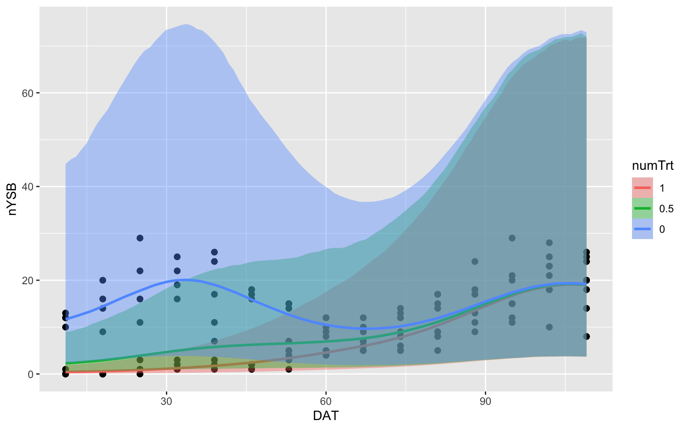


```
##   [1] b_b0_Intercept              b_gpP_Intercept            
##   [3] b_A_Intercept               b_B_Intercept              
##   [5] b_M_Intercept               sd_Location__b0_Intercept  
##   [7] sd_Location__A_Intercept    sdgp_gpP_gpDATLocationA    
##   [9] sdgp_gpP_gpDATLocationB     sdgp_gpP_gpDATLocationC    
##  [11] sdgp_gpP_gpDATLocationD     sdgp_gpP_gpDATLocationE    
##  [13] lscale_gpP_gpDATLocationA   lscale_gpP_gpDATLocationB  
##  [15] lscale_gpP_gpDATLocationC   lscale_gpP_gpDATLocationD  
##  [17] lscale_gpP_gpDATLocationE   shape                      
##  [19] r_Location__b0[A,Intercept] r_Location__b0[B,Intercept]
##  [21] r_Location__b0[C,Intercept] r_Location__b0[D,Intercept]
##  [23] r_Location__b0[E,Intercept] r_Location__A[A,Intercept] 
##  [25] r_Location__A[B,Intercept]  r_Location__A[C,Intercept] 
##  [27] r_Location__A[D,Intercept]  r_Location__A[E,Intercept] 
##  [29] zgp_gpP_gpDATLocationA[1]   zgp_gpP_gpDATLocationA[2]  
##  [31] zgp_gpP_gpDATLocationA[3]   zgp_gpP_gpDATLocationA[4]  
##  [33] zgp_gpP_gpDATLocationA[5]   zgp_gpP_gpDATLocationA[6]  
##  [35] zgp_gpP_gpDATLocationA[7]   zgp_gpP_gpDATLocationA[8]  
##  [37] zgp_gpP_gpDATLocationA[9]   zgp_gpP_gpDATLocationA[10] 
##  [39] zgp_gpP_gpDATLocationA[11]  zgp_gpP_gpDATLocationA[12] 
##  [41] zgp_gpP_gpDATLocationA[13]  zgp_gpP_gpDATLocationA[14] 
##  [43] zgp_gpP_gpDATLocationA[15]  zgp_gpP_gpDATLocationB[1]  
##  [45] zgp_gpP_gpDATLocationB[2]   zgp_gpP_gpDATLocationB[3]  
##  [47] zgp_gpP_gpDATLocationB[4]   zgp_gpP_gpDATLocationB[5]  
##  [49] zgp_gpP_gpDATLocationB[6]   zgp_gpP_gpDATLocationB[7]  
##  [51] zgp_gpP_gpDATLocationB[8]   zgp_gpP_gpDATLocationB[9]  
##  [53] zgp_gpP_gpDATLocationB[10]  zgp_gpP_gpDATLocationB[11] 
##  [55] zgp_gpP_gpDATLocationB[12]  zgp_gpP_gpDATLocationB[13] 
##  [57] zgp_gpP_gpDATLocationB[14]  zgp_gpP_gpDATLocationB[15] 
##  [59] zgp_gpP_gpDATLocationC[1]   zgp_gpP_gpDATLocationC[2]  
##  [61] zgp_gpP_gpDATLocationC[3]   zgp_gpP_gpDATLocationC[4]  
##  [63] zgp_gpP_gpDATLocationC[5]   zgp_gpP_gpDATLocationC[6]  
##  [65] zgp_gpP_gpDATLocationC[7]   zgp_gpP_gpDATLocationC[8]  
##  [67] zgp_gpP_gpDATLocationC[9]   zgp_gpP_gpDATLocationC[10] 
##  [69] zgp_gpP_gpDATLocationC[11]  zgp_gpP_gpDATLocationC[12] 
##  [71] zgp_gpP_gpDATLocationC[13]  zgp_gpP_gpDATLocationC[14] 
##  [73] zgp_gpP_gpDATLocationC[15]  zgp_gpP_gpDATLocationD[1]  
##  [75] zgp_gpP_gpDATLocationD[2]   zgp_gpP_gpDATLocationD[3]  
##  [77] zgp_gpP_gpDATLocationD[4]   zgp_gpP_gpDATLocationD[5]  
##  [79] zgp_gpP_gpDATLocationD[6]   zgp_gpP_gpDATLocationD[7]  
##  [81] zgp_gpP_gpDATLocationD[8]   zgp_gpP_gpDATLocationD[9]  
##  [83] zgp_gpP_gpDATLocationD[10]  zgp_gpP_gpDATLocationD[11] 
##  [85] zgp_gpP_gpDATLocationD[12]  zgp_gpP_gpDATLocationD[13] 
##  [87] zgp_gpP_gpDATLocationD[14]  zgp_gpP_gpDATLocationD[15] 
##  [89] zgp_gpP_gpDATLocationE[1]   zgp_gpP_gpDATLocationE[2]  
##  [91] zgp_gpP_gpDATLocationE[3]   zgp_gpP_gpDATLocationE[4]  
##  [93] zgp_gpP_gpDATLocationE[5]   zgp_gpP_gpDATLocationE[6]  
##  [95] zgp_gpP_gpDATLocationE[7]   zgp_gpP_gpDATLocationE[8]  
##  [97] zgp_gpP_gpDATLocationE[9]   zgp_gpP_gpDATLocationE[10] 
##  [99] zgp_gpP_gpDATLocationE[11]  zgp_gpP_gpDATLocationE[12] 
## [101] zgp_gpP_gpDATLocationE[13]  zgp_gpP_gpDATLocationE[14] 
## [103] zgp_gpP_gpDATLocationE[15]  lprior                     
## 104 Levels: b_A_Intercept b_B_Intercept b_b0_Intercept ... zgp_gpP_gpDATLocationE[15]
```

```
## # A tibble: 5 × 2
##   Parameter                     med
##   <fct>                       <dbl>
## 1 r_Location__b0[A,Intercept]  2.59
## 2 r_Location__b0[B,Intercept]  2.58
## 3 r_Location__b0[C,Intercept]  2.82
## 4 r_Location__b0[D,Intercept]  2.74
## 5 r_Location__b0[E,Intercept]  2.02
```

```
## [1]  2.55  2.76  2.54  3.14  0.26  0.34  0.50 -2.31  1.52
```

```
## # A tibble: 5 × 3
##   Parameter                  meddiff   med
##   <fct>                        <dbl> <dbl>
## 1 r_Location__A[A,Intercept] -0.0134  3.35
## 2 r_Location__A[B,Intercept] -0.0987  3.27
## 3 r_Location__A[C,Intercept]  0.526   3.89
## 4 r_Location__A[D,Intercept] -0.128   3.24
## 5 r_Location__A[E,Intercept] -0.0374  3.33
```

```
## [1] 2.79 3.69 2.41 3.18 3.37 1.97 3.73 3.11 2.97
```

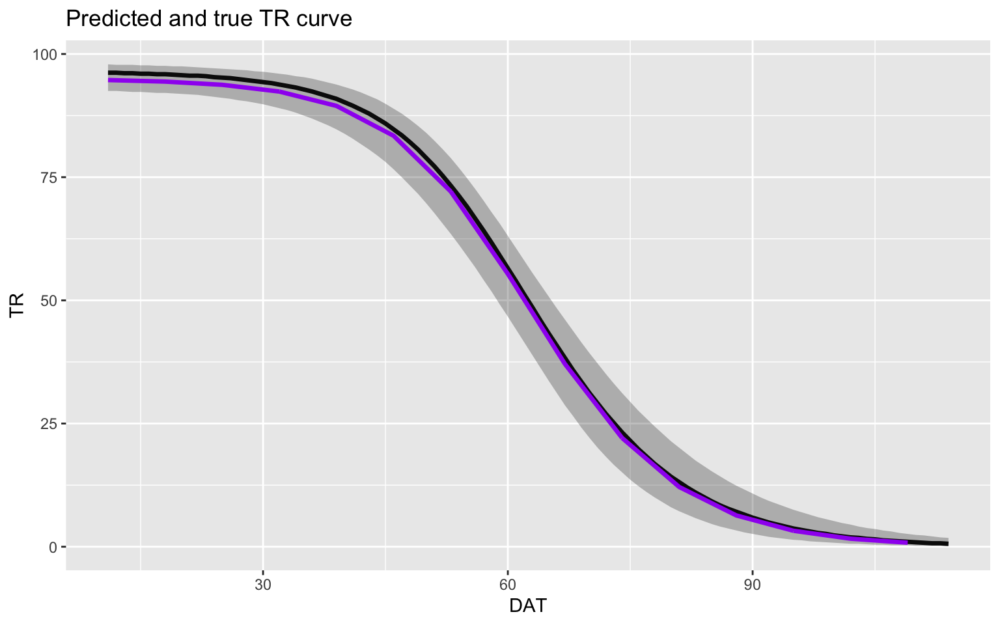

```
##  num [1:6000, 1:600] 13 11 13 10 4 14 5 6 8 23 ...
##  - attr(*, "dimnames")=List of 2
##   ..$ : NULL
##   ..$ : NULL
```

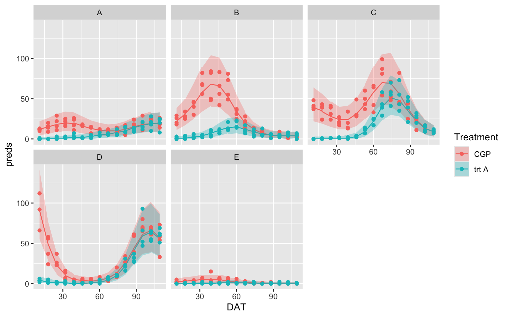


### intercept, A, B, M RE, with GP (DIFF for each loc)

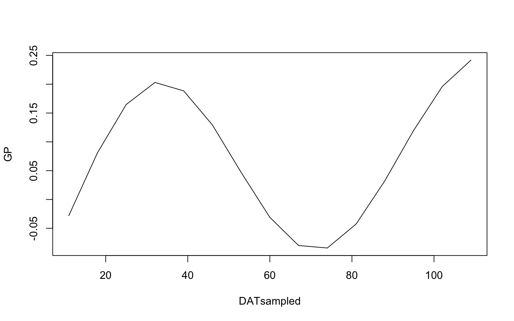


```
##  Family: negbinomial 
##   Links: mu = log; shape = identity 
## Formula: nYSB ~ b0 - (A * (1 - 1/(1 + exp(-1 * B * (DAT - M))))) * numTrt + gpP + log(DaysOfCatch) 
##          b0 ~ (1 | Location)
##          gpP ~ 1 + gp(DAT, by = Location)
##          A ~ 1 + (1 | Location)
##          B ~ 1 + (1 | Location)
##          M ~ 1 + (1 | Location)
##    Data: simdata6 (Number of observations: 1080) 
##   Draws: 6 chains, each with iter = 2000; warmup = 1000; thin = 1;
##          total post-warmup draws = 6000
## 
## Gaussian Process Hyperparameters:
##                            Estimate Est.Error l-95% CI u-95% CI Rhat Bulk_ESS
## sdgp(gpP_gpDATLocationA)       0.85      1.11     0.15     3.46 1.01     1133
## sdgp(gpP_gpDATLocationB)       1.88      1.46     0.59     5.49 1.00     2101
## sdgp(gpP_gpDATLocationC)       2.62      1.60     1.00     6.91 1.01     1503
## sdgp(gpP_gpDATLocationD)       2.28      1.61     0.67     6.45 1.00     1679
## sdgp(gpP_gpDATLocationE)       1.57      1.48     0.47     5.14 1.00     1903
## sdgp(gpP_gpDATLocationF)       3.36      2.35     1.14     9.47 1.00     1748
## sdgp(gpP_gpDATLocationG)       0.54      0.67     0.05     2.32 1.00     1713
## sdgp(gpP_gpDATLocationH)       4.28      2.29     1.44    10.12 1.01     1073
## sdgp(gpP_gpDATLocationI)       2.32      1.74     0.77     7.02 1.00     2540
## lscale(gpP_gpDATLocationA)     0.28      0.12     0.11     0.59 1.01      960
## lscale(gpP_gpDATLocationB)     0.39      0.11     0.21     0.65 1.00     1989
## lscale(gpP_gpDATLocationC)     0.22      0.04     0.15     0.30 1.00     1438
## lscale(gpP_gpDATLocationD)     0.36      0.09     0.20     0.57 1.00     1661
## lscale(gpP_gpDATLocationE)     0.31      0.19     0.12     0.78 1.00      964
## lscale(gpP_gpDATLocationF)     0.24      0.06     0.13     0.37 1.00     1352
## lscale(gpP_gpDATLocationG)     0.37      0.32     0.11     1.17 1.00     1766
## lscale(gpP_gpDATLocationH)     0.10      0.02     0.06     0.15 1.01      883
## lscale(gpP_gpDATLocationI)     0.49      0.20     0.20     0.99 1.00     1743
##                            Tail_ESS
## sdgp(gpP_gpDATLocationA)       1969
## sdgp(gpP_gpDATLocationB)       3643
## sdgp(gpP_gpDATLocationC)       2650
## sdgp(gpP_gpDATLocationD)       2739
## sdgp(gpP_gpDATLocationE)       2729
## sdgp(gpP_gpDATLocationF)       2599
## sdgp(gpP_gpDATLocationG)       2485
## sdgp(gpP_gpDATLocationH)       2603
## sdgp(gpP_gpDATLocationI)       3300
## lscale(gpP_gpDATLocationA)     2218
## lscale(gpP_gpDATLocationB)     2580
## lscale(gpP_gpDATLocationC)     2487
## lscale(gpP_gpDATLocationD)     2488
## lscale(gpP_gpDATLocationE)     2360
## lscale(gpP_gpDATLocationF)     2504
## lscale(gpP_gpDATLocationG)     2840
## lscale(gpP_gpDATLocationH)     1704
## lscale(gpP_gpDATLocationI)     1862
## 
## Multilevel Hyperparameters:
## ~Location (Number of levels: 9) 
##                  Estimate Est.Error l-95% CI u-95% CI Rhat Bulk_ESS Tail_ESS
## sd(b0_Intercept)     1.41      0.68     0.28     2.99 1.00     1195      856
## sd(A_Intercept)      1.62      0.73     0.63     3.41 1.00     1928     2638
## sd(B_Intercept)      0.02      0.02     0.00     0.06 1.00     2302     2818
## sd(M_Intercept)      3.41      2.37     0.16     9.00 1.00     2239     3196
## 
## Regression Coefficients:
##               Estimate Est.Error l-95% CI u-95% CI Rhat Bulk_ESS Tail_ESS
## b0_Intercept     -0.00      2.01    -3.98     3.87 1.00     4904     4173
## gpP_Intercept     1.45      2.12    -2.65     5.63 1.00     4049     4255
## A_Intercept       3.14      0.61     1.84     4.36 1.01     1653     1864
## B_Intercept       0.10      0.02     0.08     0.15 1.00     3472     2746
## M_Intercept      43.30      2.97    36.74    48.40 1.00     4145     3163
## 
## Further Distributional Parameters:
##       Estimate Est.Error l-95% CI u-95% CI Rhat Bulk_ESS Tail_ESS
## shape    30.88      5.40    21.93    43.23 1.00     9466     4391
## 
## Draws were sampled using sampling(NUTS). For each parameter, Bulk_ESS
## and Tail_ESS are effective sample size measures, and Rhat is the potential
## scale reduction factor on split chains (at convergence, Rhat = 1).
```

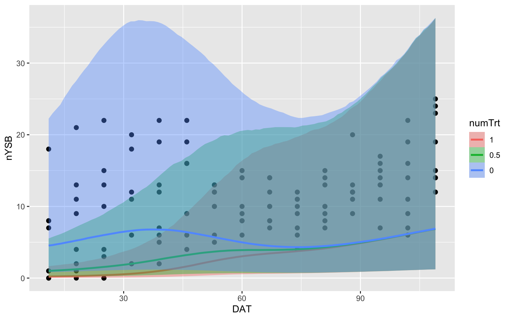


```
##   [1] b_b0_Intercept              b_gpP_Intercept            
##   [3] b_A_Intercept               b_B_Intercept              
##   [5] b_M_Intercept               sd_Location__b0_Intercept  
##   [7] sd_Location__A_Intercept    sd_Location__B_Intercept   
##   [9] sd_Location__M_Intercept    sdgp_gpP_gpDATLocationA    
##  [11] sdgp_gpP_gpDATLocationB     sdgp_gpP_gpDATLocationC    
##  [13] sdgp_gpP_gpDATLocationD     sdgp_gpP_gpDATLocationE    
##  [15] sdgp_gpP_gpDATLocationF     sdgp_gpP_gpDATLocationG    
##  [17] sdgp_gpP_gpDATLocationH     sdgp_gpP_gpDATLocationI    
##  [19] lscale_gpP_gpDATLocationA   lscale_gpP_gpDATLocationB  
##  [21] lscale_gpP_gpDATLocationC   lscale_gpP_gpDATLocationD  
##  [23] lscale_gpP_gpDATLocationE   lscale_gpP_gpDATLocationF  
##  [25] lscale_gpP_gpDATLocationG   lscale_gpP_gpDATLocationH  
##  [27] lscale_gpP_gpDATLocationI   shape                      
##  [29] r_Location__b0[A,Intercept] r_Location__b0[B,Intercept]
##  [31] r_Location__b0[C,Intercept] r_Location__b0[D,Intercept]
##  [33] r_Location__b0[E,Intercept] r_Location__b0[F,Intercept]
##  [35] r_Location__b0[G,Intercept] r_Location__b0[H,Intercept]
##  [37] r_Location__b0[I,Intercept] r_Location__A[A,Intercept] 
##  [39] r_Location__A[B,Intercept]  r_Location__A[C,Intercept] 
##  [41] r_Location__A[D,Intercept]  r_Location__A[E,Intercept] 
##  [43] r_Location__A[F,Intercept]  r_Location__A[G,Intercept] 
##  [45] r_Location__A[H,Intercept]  r_Location__A[I,Intercept] 
##  [47] r_Location__B[A,Intercept]  r_Location__B[B,Intercept] 
##  [49] r_Location__B[C,Intercept]  r_Location__B[D,Intercept] 
##  [51] r_Location__B[E,Intercept]  r_Location__B[F,Intercept] 
##  [53] r_Location__B[G,Intercept]  r_Location__B[H,Intercept] 
##  [55] r_Location__B[I,Intercept]  r_Location__M[A,Intercept] 
##  [57] r_Location__M[B,Intercept]  r_Location__M[C,Intercept] 
##  [59] r_Location__M[D,Intercept]  r_Location__M[E,Intercept] 
##  [61] r_Location__M[F,Intercept]  r_Location__M[G,Intercept] 
##  [63] r_Location__M[H,Intercept]  r_Location__M[I,Intercept] 
##  [65] zgp_gpP_gpDATLocationA[1]   zgp_gpP_gpDATLocationA[2]  
##  [67] zgp_gpP_gpDATLocationA[3]   zgp_gpP_gpDATLocationA[4]  
##  [69] zgp_gpP_gpDATLocationA[5]   zgp_gpP_gpDATLocationA[6]  
##  [71] zgp_gpP_gpDATLocationA[7]   zgp_gpP_gpDATLocationA[8]  
##  [73] zgp_gpP_gpDATLocationA[9]   zgp_gpP_gpDATLocationA[10] 
##  [75] zgp_gpP_gpDATLocationA[11]  zgp_gpP_gpDATLocationA[12] 
##  [77] zgp_gpP_gpDATLocationA[13]  zgp_gpP_gpDATLocationA[14] 
##  [79] zgp_gpP_gpDATLocationA[15]  zgp_gpP_gpDATLocationB[1]  
##  [81] zgp_gpP_gpDATLocationB[2]   zgp_gpP_gpDATLocationB[3]  
##  [83] zgp_gpP_gpDATLocationB[4]   zgp_gpP_gpDATLocationB[5]  
##  [85] zgp_gpP_gpDATLocationB[6]   zgp_gpP_gpDATLocationB[7]  
##  [87] zgp_gpP_gpDATLocationB[8]   zgp_gpP_gpDATLocationB[9]  
##  [89] zgp_gpP_gpDATLocationB[10]  zgp_gpP_gpDATLocationB[11] 
##  [91] zgp_gpP_gpDATLocationB[12]  zgp_gpP_gpDATLocationB[13] 
##  [93] zgp_gpP_gpDATLocationB[14]  zgp_gpP_gpDATLocationB[15] 
##  [95] zgp_gpP_gpDATLocationC[1]   zgp_gpP_gpDATLocationC[2]  
##  [97] zgp_gpP_gpDATLocationC[3]   zgp_gpP_gpDATLocationC[4]  
##  [99] zgp_gpP_gpDATLocationC[5]   zgp_gpP_gpDATLocationC[6]  
## [101] zgp_gpP_gpDATLocationC[7]   zgp_gpP_gpDATLocationC[8]  
## [103] zgp_gpP_gpDATLocationC[9]   zgp_gpP_gpDATLocationC[10] 
## [105] zgp_gpP_gpDATLocationC[11]  zgp_gpP_gpDATLocationC[12] 
## [107] zgp_gpP_gpDATLocationC[13]  zgp_gpP_gpDATLocationC[14] 
## [109] zgp_gpP_gpDATLocationC[15]  zgp_gpP_gpDATLocationD[1]  
## [111] zgp_gpP_gpDATLocationD[2]   zgp_gpP_gpDATLocationD[3]  
## [113] zgp_gpP_gpDATLocationD[4]   zgp_gpP_gpDATLocationD[5]  
## [115] zgp_gpP_gpDATLocationD[6]   zgp_gpP_gpDATLocationD[7]  
## [117] zgp_gpP_gpDATLocationD[8]   zgp_gpP_gpDATLocationD[9]  
## [119] zgp_gpP_gpDATLocationD[10]  zgp_gpP_gpDATLocationD[11] 
## [121] zgp_gpP_gpDATLocationD[12]  zgp_gpP_gpDATLocationD[13] 
## [123] zgp_gpP_gpDATLocationD[14]  zgp_gpP_gpDATLocationD[15] 
## [125] zgp_gpP_gpDATLocationE[1]   zgp_gpP_gpDATLocationE[2]  
## [127] zgp_gpP_gpDATLocationE[3]   zgp_gpP_gpDATLocationE[4]  
## [129] zgp_gpP_gpDATLocationE[5]   zgp_gpP_gpDATLocationE[6]  
## [131] zgp_gpP_gpDATLocationE[7]   zgp_gpP_gpDATLocationE[8]  
## [133] zgp_gpP_gpDATLocationE[9]   zgp_gpP_gpDATLocationE[10] 
## [135] zgp_gpP_gpDATLocationE[11]  zgp_gpP_gpDATLocationE[12] 
## [137] zgp_gpP_gpDATLocationE[13]  zgp_gpP_gpDATLocationE[14] 
## [139] zgp_gpP_gpDATLocationE[15]  zgp_gpP_gpDATLocationF[1]  
## [141] zgp_gpP_gpDATLocationF[2]   zgp_gpP_gpDATLocationF[3]  
## [143] zgp_gpP_gpDATLocationF[4]   zgp_gpP_gpDATLocationF[5]  
## [145] zgp_gpP_gpDATLocationF[6]   zgp_gpP_gpDATLocationF[7]  
## [147] zgp_gpP_gpDATLocationF[8]   zgp_gpP_gpDATLocationF[9]  
## [149] zgp_gpP_gpDATLocationF[10]  zgp_gpP_gpDATLocationF[11] 
## [151] zgp_gpP_gpDATLocationF[12]  zgp_gpP_gpDATLocationF[13] 
## [153] zgp_gpP_gpDATLocationF[14]  zgp_gpP_gpDATLocationF[15] 
## [155] zgp_gpP_gpDATLocationG[1]   zgp_gpP_gpDATLocationG[2]  
## [157] zgp_gpP_gpDATLocationG[3]   zgp_gpP_gpDATLocationG[4]  
## [159] zgp_gpP_gpDATLocationG[5]   zgp_gpP_gpDATLocationG[6]  
## [161] zgp_gpP_gpDATLocationG[7]   zgp_gpP_gpDATLocationG[8]  
## [163] zgp_gpP_gpDATLocationG[9]   zgp_gpP_gpDATLocationG[10] 
## [165] zgp_gpP_gpDATLocationG[11]  zgp_gpP_gpDATLocationG[12] 
## [167] zgp_gpP_gpDATLocationG[13]  zgp_gpP_gpDATLocationG[14] 
## [169] zgp_gpP_gpDATLocationG[15]  zgp_gpP_gpDATLocationH[1]  
## [171] zgp_gpP_gpDATLocationH[2]   zgp_gpP_gpDATLocationH[3]  
## [173] zgp_gpP_gpDATLocationH[4]   zgp_gpP_gpDATLocationH[5]  
## [175] zgp_gpP_gpDATLocationH[6]   zgp_gpP_gpDATLocationH[7]  
## [177] zgp_gpP_gpDATLocationH[8]   zgp_gpP_gpDATLocationH[9]  
## [179] zgp_gpP_gpDATLocationH[10]  zgp_gpP_gpDATLocationH[11] 
## [181] zgp_gpP_gpDATLocationH[12]  zgp_gpP_gpDATLocationH[13] 
## [183] zgp_gpP_gpDATLocationH[14]  zgp_gpP_gpDATLocationH[15] 
## [185] zgp_gpP_gpDATLocationI[1]   zgp_gpP_gpDATLocationI[2]  
## [187] zgp_gpP_gpDATLocationI[3]   zgp_gpP_gpDATLocationI[4]  
## [189] zgp_gpP_gpDATLocationI[5]   zgp_gpP_gpDATLocationI[6]  
## [191] zgp_gpP_gpDATLocationI[7]   zgp_gpP_gpDATLocationI[8]  
## [193] zgp_gpP_gpDATLocationI[9]   zgp_gpP_gpDATLocationI[10] 
## [195] zgp_gpP_gpDATLocationI[11]  zgp_gpP_gpDATLocationI[12] 
## [197] zgp_gpP_gpDATLocationI[13]  zgp_gpP_gpDATLocationI[14] 
## [199] zgp_gpP_gpDATLocationI[15]  lprior                     
## 200 Levels: b_A_Intercept b_B_Intercept b_b0_Intercept ... zgp_gpP_gpDATLocationI[15]
```

```
## # A tibble: 9 × 2
##   Parameter                     med
##   <fct>                       <dbl>
## 1 r_Location__b0[A,Intercept] 2.34 
## 2 r_Location__b0[B,Intercept] 2.10 
## 3 r_Location__b0[C,Intercept] 2.11 
## 4 r_Location__b0[D,Intercept] 2.38 
## 5 r_Location__b0[E,Intercept] 0.640
## 6 r_Location__b0[F,Intercept] 0.767
## 7 r_Location__b0[G,Intercept] 1.15 
## 8 r_Location__b0[H,Intercept] 0.173
## 9 r_Location__b0[I,Intercept] 1.49
```

```
## [1]  2.55  2.76  2.54  3.14  0.26  0.34  0.50 -2.31  1.52
```

```
## # A tibble: 9 × 3
##   Parameter                  meddiff   med
##   <fct>                        <dbl> <dbl>
## 1 r_Location__A[A,Intercept]  -0.699  2.43
## 2 r_Location__A[B,Intercept]   0.822  3.95
## 3 r_Location__A[C,Intercept]  -0.920  2.21
## 4 r_Location__A[D,Intercept]   0.153  3.28
## 5 r_Location__A[E,Intercept]   0.935  4.06
## 6 r_Location__A[F,Intercept]  -0.573  2.56
## 7 r_Location__A[G,Intercept]   2.25   5.38
## 8 r_Location__A[H,Intercept]   1.01   4.14
## 9 r_Location__A[I,Intercept]  -1.19   1.94
```

```
## [1] 2.79 3.69 2.41 3.18 3.37 1.97 3.73 3.11 2.97
```

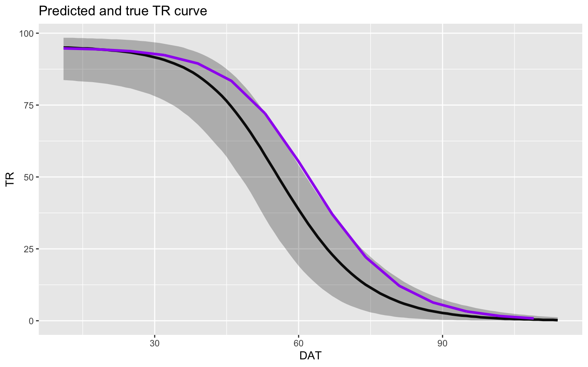

```
##  num [1:6000, 1:1080] 13 3 16 13 8 17 13 12 10 14 ...
##  - attr(*, "dimnames")=List of 2
##   ..$ : NULL
##   ..$ : NULL
```

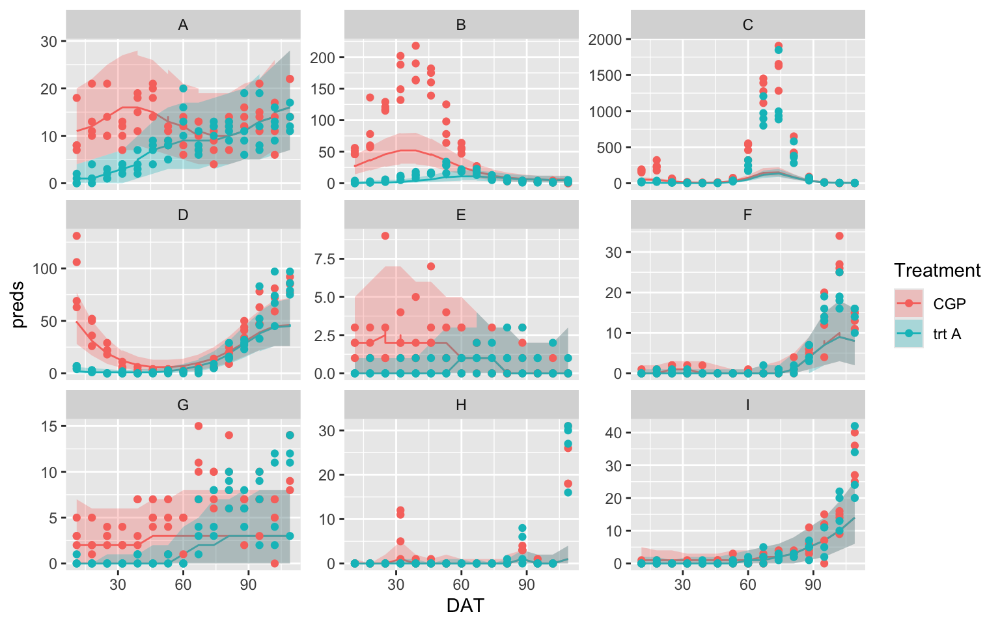

## Model our case study data

Too many divergent warnings with model with intercept, A, B, M RE, with GP (DIFF for each loc). (M was multimodal)

Use constant B, M instead.


```
##  Family: negbinomial 
##   Links: mu = log; shape = identity 
## Formula: nYSB ~ b0 - (A * (1 - 1/(1 + exp(-1 * B * (DAT - M))))) * numTrt + gpP + log(DaysOfCatch) 
##          b0 ~ (1 | Location)
##          gpP ~ 1 + gp(DAT, by = Location)
##          A ~ 1 + (1 | Location)
##          B ~ 1
##          M ~ 1
##    Data: datR (Number of observations: 672) 
##   Draws: 6 chains, each with iter = 2000; warmup = 1000; thin = 1;
##          total post-warmup draws = 6000
## 
## Gaussian Process Hyperparameters:
##                                Estimate Est.Error l-95% CI u-95% CI Rhat
## sdgp(gpP_gpDATLocationLoc1)        0.93      0.35     0.47     1.73 1.00
## sdgp(gpP_gpDATLocationLoc10)       1.07      0.44     0.59     2.13 1.00
## sdgp(gpP_gpDATLocationLoc2)        1.47      1.06     0.47     4.29 1.00
## sdgp(gpP_gpDATLocationLoc3)        0.48      0.53     0.07     1.45 1.01
## sdgp(gpP_gpDATLocationLoc4)        0.35      0.79     0.01     2.28 1.00
## sdgp(gpP_gpDATLocationLoc5)        1.47      0.47     0.85     2.68 1.00
## sdgp(gpP_gpDATLocationLoc6)        0.26      0.54     0.01     0.99 1.00
## sdgp(gpP_gpDATLocationLoc7)        1.34      0.38     0.81     2.25 1.00
## sdgp(gpP_gpDATLocationLoc8)        0.58      0.29     0.23     1.25 1.00
## sdgp(gpP_gpDATLocationLoc9)        1.23      0.44     0.66     2.30 1.00
## lscale(gpP_gpDATLocationLoc1)      0.04      0.04     0.01     0.14 1.02
## lscale(gpP_gpDATLocationLoc10)     0.08      0.04     0.04     0.21 1.01
## lscale(gpP_gpDATLocationLoc2)      0.19      0.07     0.11     0.40 1.00
## lscale(gpP_gpDATLocationLoc3)      0.13      0.40     0.03     0.44 1.00
## lscale(gpP_gpDATLocationLoc4)      0.35      0.73     0.04     1.99 1.00
## lscale(gpP_gpDATLocationLoc5)      0.02      0.01     0.01     0.03 1.00
## lscale(gpP_gpDATLocationLoc6)      0.21      0.98     0.02     1.26 1.01
## lscale(gpP_gpDATLocationLoc7)      0.03      0.02     0.01     0.11 1.01
## lscale(gpP_gpDATLocationLoc8)      0.05      0.07     0.01     0.13 1.00
## lscale(gpP_gpDATLocationLoc9)      0.02      0.01     0.01     0.05 1.00
##                                Bulk_ESS Tail_ESS
## sdgp(gpP_gpDATLocationLoc1)        1752     2221
## sdgp(gpP_gpDATLocationLoc10)       1539     1691
## sdgp(gpP_gpDATLocationLoc2)        1783     3148
## sdgp(gpP_gpDATLocationLoc3)        1441     1544
## sdgp(gpP_gpDATLocationLoc4)        1695     1474
## sdgp(gpP_gpDATLocationLoc5)        1515     2501
## sdgp(gpP_gpDATLocationLoc6)        1821     1375
## sdgp(gpP_gpDATLocationLoc7)        1763     2952
## sdgp(gpP_gpDATLocationLoc8)        1716     2509
## sdgp(gpP_gpDATLocationLoc9)        1298     2562
## lscale(gpP_gpDATLocationLoc1)       332       63
## lscale(gpP_gpDATLocationLoc10)      546      325
## lscale(gpP_gpDATLocationLoc2)       990     1211
## lscale(gpP_gpDATLocationLoc3)      1366     1063
## lscale(gpP_gpDATLocationLoc4)      1877     2003
## lscale(gpP_gpDATLocationLoc5)      2359     3069
## lscale(gpP_gpDATLocationLoc6)      1758      942
## lscale(gpP_gpDATLocationLoc7)       838      321
## lscale(gpP_gpDATLocationLoc8)      2241     1087
## lscale(gpP_gpDATLocationLoc9)      3028     3966
## 
## Multilevel Hyperparameters:
## ~Location (Number of levels: 10) 
##                  Estimate Est.Error l-95% CI u-95% CI Rhat Bulk_ESS Tail_ESS
## sd(b0_Intercept)     1.23      0.37     0.70     2.17 1.00     1762     2572
## sd(A_Intercept)      1.43      0.52     0.72     2.73 1.00     1961     3583
## 
## Regression Coefficients:
##               Estimate Est.Error l-95% CI u-95% CI Rhat Bulk_ESS Tail_ESS
## b0_Intercept      0.01      1.99    -3.87     3.86 1.00     4684     4071
## gpP_Intercept     0.57      2.03    -3.31     4.54 1.00     4083     3621
## A_Intercept       3.59      0.84     2.18     5.41 1.00     2398     3343
## B_Intercept       0.02      0.01     0.01     0.04 1.00     3045     4307
## M_Intercept      51.66     20.52     8.74    85.19 1.00     1933     2625
## 
## Further Distributional Parameters:
##       Estimate Est.Error l-95% CI u-95% CI Rhat Bulk_ESS Tail_ESS
## shape     5.21      0.61     4.10     6.52 1.00     1249     2707
## 
## Draws were sampled using sampling(NUTS). For each parameter, Bulk_ESS
## and Tail_ESS are effective sample size measures, and Rhat is the potential
## scale reduction factor on split chains (at convergence, Rhat = 1).
```


```
##   [1] b_b0_Intercept                  b_gpP_Intercept                
##   [3] b_A_Intercept                   b_B_Intercept                  
##   [5] b_M_Intercept                   sd_Location__b0_Intercept      
##   [7] sd_Location__A_Intercept        sdgp_gpP_gpDATLocationLoc1     
##   [9] sdgp_gpP_gpDATLocationLoc10     sdgp_gpP_gpDATLocationLoc2     
##  [11] sdgp_gpP_gpDATLocationLoc3      sdgp_gpP_gpDATLocationLoc4     
##  [13] sdgp_gpP_gpDATLocationLoc5      sdgp_gpP_gpDATLocationLoc6     
##  [15] sdgp_gpP_gpDATLocationLoc7      sdgp_gpP_gpDATLocationLoc8     
##  [17] sdgp_gpP_gpDATLocationLoc9      lscale_gpP_gpDATLocationLoc1   
##  [19] lscale_gpP_gpDATLocationLoc10   lscale_gpP_gpDATLocationLoc2   
##  [21] lscale_gpP_gpDATLocationLoc3    lscale_gpP_gpDATLocationLoc4   
##  [23] lscale_gpP_gpDATLocationLoc5    lscale_gpP_gpDATLocationLoc6   
##  [25] lscale_gpP_gpDATLocationLoc7    lscale_gpP_gpDATLocationLoc8   
##  [27] lscale_gpP_gpDATLocationLoc9    shape                          
##  [29] r_Location__b0[Loc1,Intercept]  r_Location__b0[Loc10,Intercept]
##  [31] r_Location__b0[Loc2,Intercept]  r_Location__b0[Loc3,Intercept] 
##  [33] r_Location__b0[Loc4,Intercept]  r_Location__b0[Loc5,Intercept] 
##  [35] r_Location__b0[Loc6,Intercept]  r_Location__b0[Loc7,Intercept] 
##  [37] r_Location__b0[Loc8,Intercept]  r_Location__b0[Loc9,Intercept] 
##  [39] r_Location__A[Loc1,Intercept]   r_Location__A[Loc10,Intercept] 
##  [41] r_Location__A[Loc2,Intercept]   r_Location__A[Loc3,Intercept]  
##  [43] r_Location__A[Loc4,Intercept]   r_Location__A[Loc5,Intercept]  
##  [45] r_Location__A[Loc6,Intercept]   r_Location__A[Loc7,Intercept]  
##  [47] r_Location__A[Loc8,Intercept]   r_Location__A[Loc9,Intercept]  
##  [49] zgp_gpP_gpDATLocationLoc1[1]    zgp_gpP_gpDATLocationLoc1[2]   
##  [51] zgp_gpP_gpDATLocationLoc1[3]    zgp_gpP_gpDATLocationLoc1[4]   
##  [53] zgp_gpP_gpDATLocationLoc1[5]    zgp_gpP_gpDATLocationLoc1[6]   
##  [55] zgp_gpP_gpDATLocationLoc1[7]    zgp_gpP_gpDATLocationLoc1[8]   
##  [57] zgp_gpP_gpDATLocationLoc1[9]    zgp_gpP_gpDATLocationLoc1[10]  
##  [59] zgp_gpP_gpDATLocationLoc1[11]   zgp_gpP_gpDATLocationLoc1[12]  
##  [61] zgp_gpP_gpDATLocationLoc1[13]   zgp_gpP_gpDATLocationLoc1[14]  
##  [63] zgp_gpP_gpDATLocationLoc1[15]   zgp_gpP_gpDATLocationLoc1[16]  
##  [65] zgp_gpP_gpDATLocationLoc1[17]   zgp_gpP_gpDATLocationLoc1[18]  
##  [67] zgp_gpP_gpDATLocationLoc1[19]   zgp_gpP_gpDATLocationLoc1[20]  
##  [69] zgp_gpP_gpDATLocationLoc1[21]   zgp_gpP_gpDATLocationLoc1[22]  
##  [71] zgp_gpP_gpDATLocationLoc1[23]   zgp_gpP_gpDATLocationLoc1[24]  
##  [73] zgp_gpP_gpDATLocationLoc10[1]   zgp_gpP_gpDATLocationLoc10[2]  
##  [75] zgp_gpP_gpDATLocationLoc10[3]   zgp_gpP_gpDATLocationLoc10[4]  
##  [77] zgp_gpP_gpDATLocationLoc10[5]   zgp_gpP_gpDATLocationLoc10[6]  
##  [79] zgp_gpP_gpDATLocationLoc10[7]   zgp_gpP_gpDATLocationLoc10[8]  
##  [81] zgp_gpP_gpDATLocationLoc10[9]   zgp_gpP_gpDATLocationLoc10[10] 
##  [83] zgp_gpP_gpDATLocationLoc10[11]  zgp_gpP_gpDATLocationLoc10[12] 
##  [85] zgp_gpP_gpDATLocationLoc10[13]  zgp_gpP_gpDATLocationLoc10[14] 
##  [87] zgp_gpP_gpDATLocationLoc2[1]    zgp_gpP_gpDATLocationLoc2[2]   
##  [89] zgp_gpP_gpDATLocationLoc2[3]    zgp_gpP_gpDATLocationLoc2[4]   
##  [91] zgp_gpP_gpDATLocationLoc2[5]    zgp_gpP_gpDATLocationLoc2[6]   
##  [93] zgp_gpP_gpDATLocationLoc2[7]    zgp_gpP_gpDATLocationLoc2[8]   
##  [95] zgp_gpP_gpDATLocationLoc3[1]    zgp_gpP_gpDATLocationLoc3[2]   
##  [97] zgp_gpP_gpDATLocationLoc3[3]    zgp_gpP_gpDATLocationLoc3[4]   
##  [99] zgp_gpP_gpDATLocationLoc3[5]    zgp_gpP_gpDATLocationLoc3[6]   
## [101] zgp_gpP_gpDATLocationLoc3[7]    zgp_gpP_gpDATLocationLoc3[8]   
## [103] zgp_gpP_gpDATLocationLoc3[9]    zgp_gpP_gpDATLocationLoc3[10]  
## [105] zgp_gpP_gpDATLocationLoc3[11]   zgp_gpP_gpDATLocationLoc3[12]  
## [107] zgp_gpP_gpDATLocationLoc3[13]   zgp_gpP_gpDATLocationLoc3[14]  
## [109] zgp_gpP_gpDATLocationLoc3[15]   zgp_gpP_gpDATLocationLoc3[16]  
## [111] zgp_gpP_gpDATLocationLoc4[1]    zgp_gpP_gpDATLocationLoc4[2]   
## [113] zgp_gpP_gpDATLocationLoc4[3]    zgp_gpP_gpDATLocationLoc4[4]   
## [115] zgp_gpP_gpDATLocationLoc4[5]    zgp_gpP_gpDATLocationLoc4[6]   
## [117] zgp_gpP_gpDATLocationLoc4[7]    zgp_gpP_gpDATLocationLoc4[8]   
## [119] zgp_gpP_gpDATLocationLoc4[9]    zgp_gpP_gpDATLocationLoc4[10]  
## [121] zgp_gpP_gpDATLocationLoc4[11]   zgp_gpP_gpDATLocationLoc4[12]  
## [123] zgp_gpP_gpDATLocationLoc4[13]   zgp_gpP_gpDATLocationLoc4[14]  
## [125] zgp_gpP_gpDATLocationLoc4[15]   zgp_gpP_gpDATLocationLoc4[16]  
## [127] zgp_gpP_gpDATLocationLoc4[17]   zgp_gpP_gpDATLocationLoc4[18]  
## [129] zgp_gpP_gpDATLocationLoc4[19]   zgp_gpP_gpDATLocationLoc4[20]  
## [131] zgp_gpP_gpDATLocationLoc5[1]    zgp_gpP_gpDATLocationLoc5[2]   
## [133] zgp_gpP_gpDATLocationLoc5[3]    zgp_gpP_gpDATLocationLoc5[4]   
## [135] zgp_gpP_gpDATLocationLoc5[5]    zgp_gpP_gpDATLocationLoc5[6]   
## [137] zgp_gpP_gpDATLocationLoc5[7]    zgp_gpP_gpDATLocationLoc5[8]   
## [139] zgp_gpP_gpDATLocationLoc5[9]    zgp_gpP_gpDATLocationLoc5[10]  
## [141] zgp_gpP_gpDATLocationLoc5[11]   zgp_gpP_gpDATLocationLoc5[12]  
## [143] zgp_gpP_gpDATLocationLoc5[13]   zgp_gpP_gpDATLocationLoc5[14]  
## [145] zgp_gpP_gpDATLocationLoc5[15]   zgp_gpP_gpDATLocationLoc6[1]   
## [147] zgp_gpP_gpDATLocationLoc6[2]    zgp_gpP_gpDATLocationLoc6[3]   
## [149] zgp_gpP_gpDATLocationLoc6[4]    zgp_gpP_gpDATLocationLoc6[5]   
## [151] zgp_gpP_gpDATLocationLoc6[6]    zgp_gpP_gpDATLocationLoc6[7]   
## [153] zgp_gpP_gpDATLocationLoc6[8]    zgp_gpP_gpDATLocationLoc6[9]   
## [155] zgp_gpP_gpDATLocationLoc6[10]   zgp_gpP_gpDATLocationLoc6[11]  
## [157] zgp_gpP_gpDATLocationLoc6[12]   zgp_gpP_gpDATLocationLoc6[13]  
## [159] zgp_gpP_gpDATLocationLoc6[14]   zgp_gpP_gpDATLocationLoc6[15]  
## [161] zgp_gpP_gpDATLocationLoc6[16]   zgp_gpP_gpDATLocationLoc7[1]   
## [163] zgp_gpP_gpDATLocationLoc7[2]    zgp_gpP_gpDATLocationLoc7[3]   
## [165] zgp_gpP_gpDATLocationLoc7[4]    zgp_gpP_gpDATLocationLoc7[5]   
## [167] zgp_gpP_gpDATLocationLoc7[6]    zgp_gpP_gpDATLocationLoc7[7]   
## [169] zgp_gpP_gpDATLocationLoc7[8]    zgp_gpP_gpDATLocationLoc7[9]   
## [171] zgp_gpP_gpDATLocationLoc7[10]   zgp_gpP_gpDATLocationLoc7[11]  
## [173] zgp_gpP_gpDATLocationLoc7[12]   zgp_gpP_gpDATLocationLoc7[13]  
## [175] zgp_gpP_gpDATLocationLoc7[14]   zgp_gpP_gpDATLocationLoc7[15]  
## [177] zgp_gpP_gpDATLocationLoc7[16]   zgp_gpP_gpDATLocationLoc7[17]  
## [179] zgp_gpP_gpDATLocationLoc8[1]    zgp_gpP_gpDATLocationLoc8[2]   
## [181] zgp_gpP_gpDATLocationLoc8[3]    zgp_gpP_gpDATLocationLoc8[4]   
## [183] zgp_gpP_gpDATLocationLoc8[5]    zgp_gpP_gpDATLocationLoc8[6]   
## [185] zgp_gpP_gpDATLocationLoc8[7]    zgp_gpP_gpDATLocationLoc8[8]   
## [187] zgp_gpP_gpDATLocationLoc8[9]    zgp_gpP_gpDATLocationLoc8[10]  
## [189] zgp_gpP_gpDATLocationLoc8[11]   zgp_gpP_gpDATLocationLoc8[12]  
## [191] zgp_gpP_gpDATLocationLoc8[13]   zgp_gpP_gpDATLocationLoc8[14]  
## [193] zgp_gpP_gpDATLocationLoc8[15]   zgp_gpP_gpDATLocationLoc9[1]   
## [195] zgp_gpP_gpDATLocationLoc9[2]    zgp_gpP_gpDATLocationLoc9[3]   
## [197] zgp_gpP_gpDATLocationLoc9[4]    zgp_gpP_gpDATLocationLoc9[5]   
## [199] zgp_gpP_gpDATLocationLoc9[6]    zgp_gpP_gpDATLocationLoc9[7]   
## [201] zgp_gpP_gpDATLocationLoc9[8]    zgp_gpP_gpDATLocationLoc9[9]   
## [203] zgp_gpP_gpDATLocationLoc9[10]   zgp_gpP_gpDATLocationLoc9[11]  
## [205] zgp_gpP_gpDATLocationLoc9[12]   zgp_gpP_gpDATLocationLoc9[13]  
## [207] zgp_gpP_gpDATLocationLoc9[14]   lprior                         
## 208 Levels: b_A_Intercept b_B_Intercept b_b0_Intercept ... zgp_gpP_gpDATLocationLoc9[14]
```

```
## # A tibble: 10 × 2
##    Parameter                          med
##    <fct>                            <dbl>
##  1 r_Location__b0[Loc1,Intercept]   0.849
##  2 r_Location__b0[Loc10,Intercept]  1.87 
##  3 r_Location__b0[Loc2,Intercept]   1.46 
##  4 r_Location__b0[Loc3,Intercept]  -0.187
##  5 r_Location__b0[Loc4,Intercept]  -0.975
##  6 r_Location__b0[Loc5,Intercept]   0.213
##  7 r_Location__b0[Loc6,Intercept]  -0.249
##  8 r_Location__b0[Loc7,Intercept]   1.14 
##  9 r_Location__b0[Loc8,Intercept]  -0.238
## 10 r_Location__b0[Loc9,Intercept]   1.96
```

```
## # A tibble: 10 × 3
##    Parameter                      meddiff   med
##    <fct>                            <dbl> <dbl>
##  1 r_Location__A[Loc1,Intercept]  -0.0635  3.42
##  2 r_Location__A[Loc10,Intercept]  0.203   3.69
##  3 r_Location__A[Loc2,Intercept]   2.73    6.22
##  4 r_Location__A[Loc3,Intercept]  -0.777   2.71
##  5 r_Location__A[Loc4,Intercept]  -0.0814  3.40
##  6 r_Location__A[Loc5,Intercept]   0.583   4.07
##  7 r_Location__A[Loc6,Intercept]  -0.609   2.88
##  8 r_Location__A[Loc7,Intercept]   0.921   4.41
##  9 r_Location__A[Loc8,Intercept]  -1.45    2.04
## 10 r_Location__A[Loc9,Intercept]   0.429   3.91
```

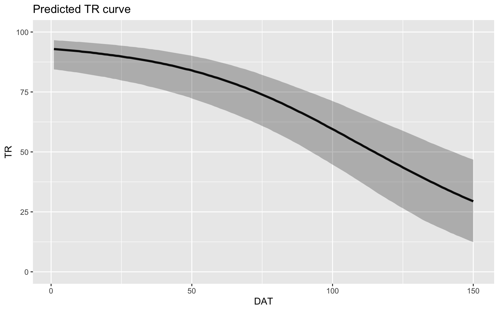
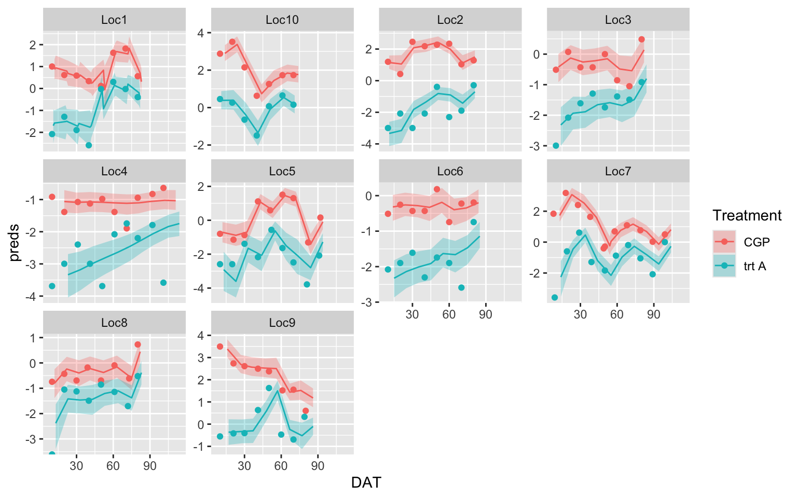
