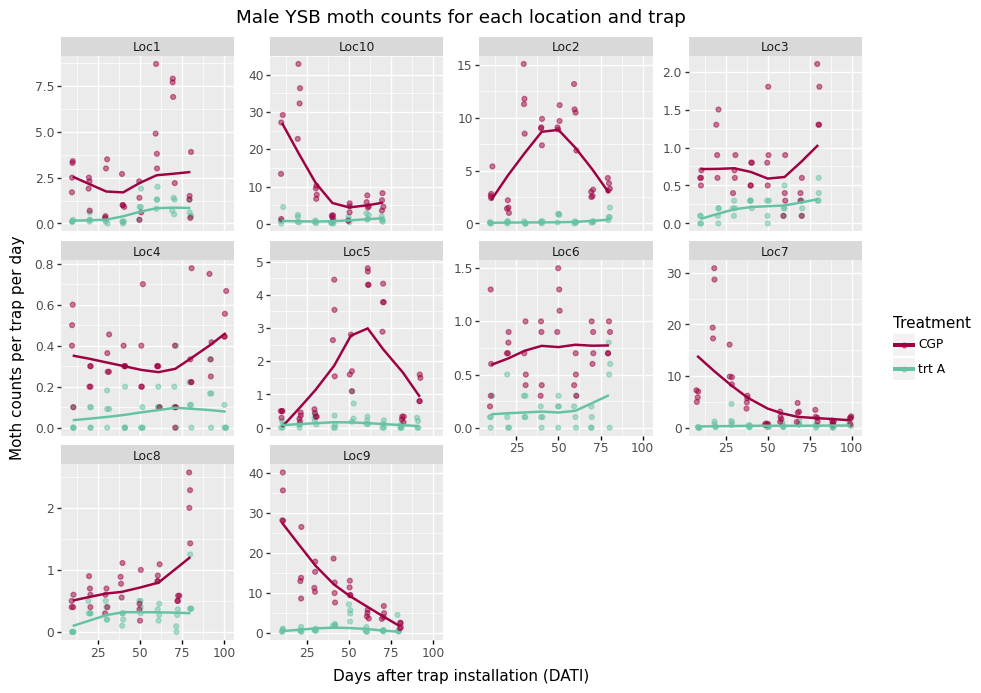

--- 
title: "Bayesian models in R and Python"
author: "Kristin Broms"
date: "`r Sys.Date()`"
site: bookdown::bookdown_site
output: 
  bookdown::gitbook:
    config:
      toc:
        collapse: section
documentclass: book
bibliography: [book.bib, packages.bib]
biblio-style: apalike
link-citations: yes
github-repo: rstudio/BayesInPython
description: "This is a tutorial for R users to convert their code into Python. In particular, fitting GLMMs, hierchical BAyesian models, and non-linear Bayesian models."
editor_options: 
  chunk_output_type: console
---

```{r, eval = F, include=FALSE, message=F, warning=FALSE, results = "hide", echo=F}
## to create the website:
bookdown::render_book("index.Rmd")
bookdown::clean_book(clean = FALSE) # to clean up after yaml error
bookdown::clean_book(clean = TRUE) # to clean up after yaml error
bookdown::preview_chapter()
```

# Introduction {#intro}

I have used R, in conjunction with Rmarkdown documents, in an RStudio GUI for over a decade. It is a beautiful setup, with great work flows and clean coding. It is perfect for non-production level analyses, visualizations, interactive documents, web apps, and reports.

However, the world seems to prefer Python. Perhaps it is because computer programmers rule the world more than statisticians and scientists. In that vein, this tutorial fits GLMM's, hierarchical Bayesian models (with Gaussian Processes and random effects), and non-linear Bayesian models in Python. 

**The intended audience here is someone who is proficient at fitting statistical models in R, but would like to fit those same models in Python instead. In particular, fitting complex Bayesian hierarchical models in R and Python.**

I have two purposes:

1. To learn if I can fit complex non-linear Bayesian models with multi-dimensional Gaussian Processes in R and Python. I currently have custom algorithms written in Matlab for similar models, and I want to fit them in R and Python.

2. To get better acquainted with Python.


All models are written mathematically and fit in both R and Python. Frequentist versions are fit, when available, in addition to the Bayesian versions. The fitted models start simple (GLM's) and are then built up.

While it is an essential part of any analysis, no model selection and assessment is conducted here because that is not the purpose of this tutorial. Additionally, model output is not explained because that can be found elsewhere (e.g., function help pages).


## Case Study {#CaseStudy}

We are analyzing moth count data collected from traps from rice fields in Indonesia. We are testing a pheromone dispenser that will prevent moths from mating, leading to fewer eggs and larvae in the crop, and therefore less damage on the plants. One way to measure product effectiveness is to see if fewer moths are caught in the traps in the treatment fields compared to the control fields. 

```{r mothctsFig, out.width = '80%', fig.align = 'center', echo = FALSE, fig.cap = "Moth counts observed for each location and treatment field in our case study."}

```

There are a total of 10 locations that are sampled throughout a field season. At each location, there is one pheromone treatment field with 4 traps and one control field with 4 traps. These traps are sampled and reset approximately every 10 days for the entire growing season, but sometimes that interval varies.

It is expected that the treatment field will catch fewer moths than the control fields. The research questions are: how many fewer moths are caught, i.e., what is the trapping reduction (TR) associated with the Treatment traps? And, is the same trapping reduction (TR) observed for the entire season?

These data have a spatial and temporal component. Spatially, the traps have a certain proximity to each other within a location, and the locations may be clumped across the landscape. Temporally, the same traps are sampled over time. 

These data are based on the data from [Iqbal et al. (2023)](https://jurnal.pei-pusat.org/index.php/jei/article/view/783),^[Iqbal, M., Marman, M., Arintya, F., Broms, K., Clark, T., & Srigiriraju, L. (2023). Mating disruption technology: An innovative tool for managing yellow stem borer (Scirpophaga incertulas Walker) of rice in Indonesia: Teknologi gangguan kawin: Inovasi untuk pengendalian penggerek batang kuning (Scirpophaga incertulas Walker) pada padi di Indonesia. Jurnal Entomologi Indonesia, 20(2), 129.] __but have been heavily manipulated in terms of location coordinates, location names, and trap counts to preserve privacy rights. The results presented in this tutorial are NOT representative of the real data nor true product performance.__


### Case study objectives

The objective is to determine how good the treatment is at reducing moth populations. This is measured as a reduction of moth counts in the traps in the treatment fields compared to the traps in the control fields.

The performance metric of interest is trapping reduction (TR), which is a derived parameter of the regression coefficient:

$$
TR = 100 - 100 e ^{(-\beta_1)}
$$

If trapping reduction were 100%, no moths would ever be caught in the treatment traps. However, some random moths will inevitably land in any trap. Instead, product performance is considered good if 90% trapping reduction is achieved, meaning that 90% fewer moths are caught in the treatment traps. When trapping reduction (TR) goes below 0%, the parameter no longer makes sense and cannot be interpreted.

It should also be noted that treatment performance may decline over time. Perhaps there is not enough pheromone in the dispenser to last for the entire season, or the ecosystem may change during the season in a way that somehow lessens product performance (e.g., the pheromones from the plants may change and interact with the product.)


